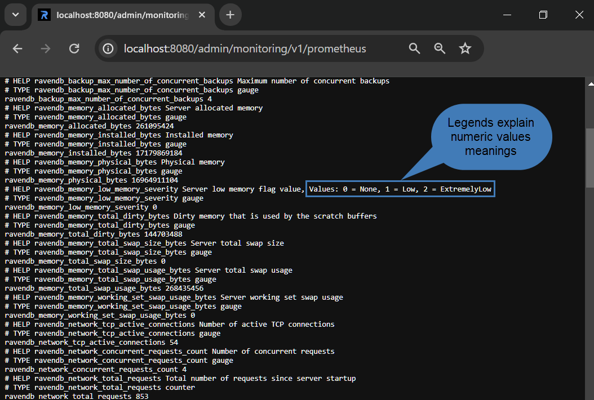
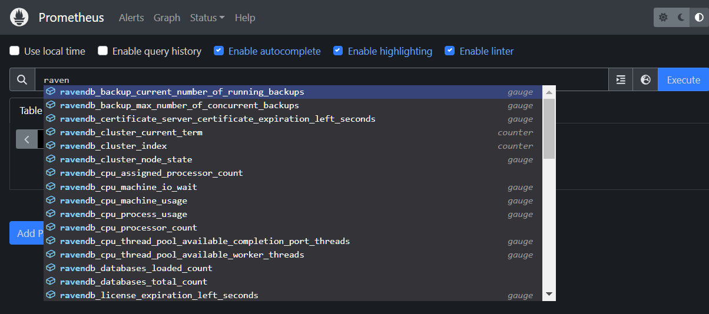
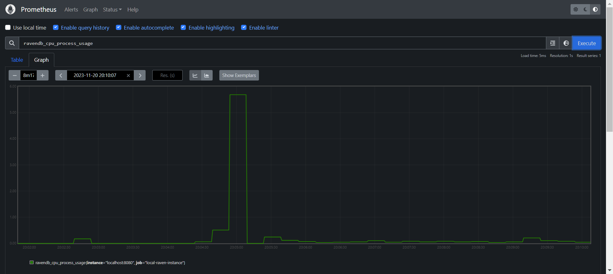
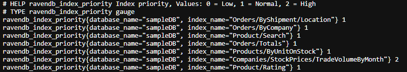
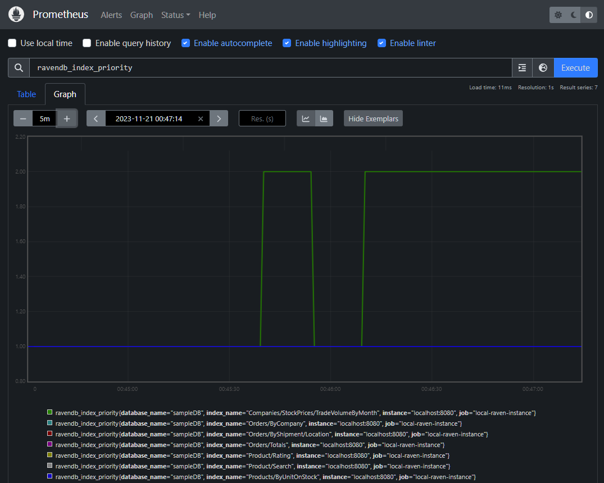
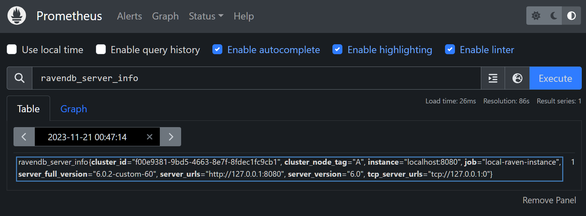

import Admonition from '@theme/Admonition';
import Panel from "@site/src/components/Panel";
import ContentFrame from "@site/src/components/ContentFrame";

# Prometheus
<Admonition type="note" title="">

* [Prometheus](https://prometheus.io) is an open-source monitoring system.  
  A Prometheus server scrapes numeric metrics from HTTP endpoints that services expose,
  stores the values over time, and can graph them and raise alerts when a value crosses
  a threshold you have set.  

* RavenDB exposes data metrics via an HTTP endpoint in a Prometheus-compatible format, 
  allowing a Prometheus server to scrape the data from the endpoint and handle it.  

* A Prometheus endpoint is provided by RavenDB instances both on-premise and on the cloud.  

* To read metrics as JSON rather than in the Prometheus format, use the
  [JSON monitoring endpoints](../json-monitoring-endpoints.mdx).  

* In this article:  
   * [RavenDB Prometheus Endpoint](../integrations/prometheus.mdx#ravendb-prometheus-endpoint)  
       * [Omit or Include Selected Metrics](../integrations/prometheus.mdx#omit-or-include-selected-metrics)  
       * [Metrics Provided by the Prometheus Endpoint](../integrations/prometheus.mdx#metrics-provided-by-the-prometheus-endpoint)  
   * [Using the RavenDB Endpoint by a Prometheus Server](../integrations/prometheus.mdx#using-the-ravendb-endpoint-by-a-prometheus-server)  
       * [Configuring and running Prometheus](../integrations/prometheus.mdx#configuring-and-running-prometheus)  
       * [Browsing the metrics in Prometheus](../integrations/prometheus.mdx#browsing-the-metrics-in-prometheus)  
       * [Reading the endpoint output directly](../integrations/prometheus.mdx#reading-the-endpoint-output-directly)  
   * [Fetching Additional RavenDB Information](../integrations/prometheus.mdx#fetching-additional-ravendb-information)  

</Admonition>
<Panel heading="RavenDB Prometheus Endpoint">

The path to the Prometheus endpoint of a RavenDB instance is: `/admin/monitoring/v1/prometheus`  
To inspect the endpoint's output using a browser, add the endpoint path to the RavenDB server's URL.  
e.g., [http://live-test.ravendb.net/admin/monitoring/v1/prometheus](http://live-test.ravendb.net/admin/monitoring/v1/prometheus)  



* As Prometheus handles only numeric values, the endpoint outputs all values as numbers, 
  providing legends that explain what the numbers mean.  
  Metrics values are also explained in the [table below](../integrations/prometheus.mdx#metrics-provided-by-the-prometheus-endpoint).  

On a secure server, a request to the endpoint must present a client certificate with
[Operator](../../server/security/authorization/security-clearance-and-permissions.mdx#operator)
clearance or higher.  
On an unsecure server, no certificate is needed.

If the server's [license](https://ravendb.net/buy) does not include the Monitoring Endpoints
feature, requests to the endpoint fail with HTTP status `402 Payment Required`.

</Panel>

<Panel heading="Omit or Include Selected Metrics">

Each `skip*` flag omits one metric group from the response when set to `true`; the
`includeGcMetrics` flag adds the GC metrics, the one group that is excluded by default.  
All flags default to `false`.

| Flag | Metric group |
| - | - |
| `skipServerMetrics` | Server metrics |
| `skipDatabasesMetrics` | Database metrics |
| `skipIndexesMetrics` | Index metrics |
| `skipCollectionsMetrics` | Collection metrics |
| `skipEtlsMetrics` | ETL task metrics |
| `skipAiTasksMetrics` | AI task metrics |
| `skipCdcSinksMetrics` | CDC Sink task metrics |
| `includeGcMetrics` | GC metrics (excluded by default) |

e.g., to omit the index metrics:  
`http://localhost:8080/admin/monitoring/v1/prometheus?skipIndexesMetrics=true`

To omit both the index and the server metrics:  
`http://localhost:8080/admin/monitoring/v1/prometheus?skipIndexesMetrics=true&skipServerMetrics=true`

</Panel>

<Panel heading="Metrics Provided by the Prometheus Endpoint">

The following table lists the metrics that the `/admin/monitoring/v1/prometheus` endpoint provides.  
In the endpoint's output, each name carries the `ravendb_` prefix.  
e.g., the `server_uptime_seconds` metric is exposed as `ravendb_server_uptime_seconds`.

The GC metrics appear only when the request sets the `includeGcMetrics`
[flag](../integrations/prometheus.mdx#omit-or-include-selected-metrics), and each carries
a `gckind` label naming the kind of the garbage collection it describes.

| Metrics | Description |
| - | - |
| ai_task_documents_processed_per_second | Documents processed per second by the AI task (one minute rate) |
| ai_task_errors_count | Number of errors recorded for the AI task |
| ai_task_health_status | AI task health status + `0`/`1`/`2` <br/> 0 =&gt; Healthy <br/> 1 =&gt; Impaired <br/> 2 =&gt; Failed |
| ai_task_last_successful_batch_time_in_seconds | Time since the AI task's last successful batch, in seconds |
| archived_data_processing_behavior | Archived data processing behavior + `0`/`1`/`2` <br/> 0 =&gt; ExcludeArchived <br/> 1 =&gt; IncludeArchived <br/> 2 =&gt; ArchivedOnly |
| available_memory_for_processing_bytes | Available memory for processing |
| backup_current_number_of_running_backups | Number of currently running backups |
| backup_max_number_of_concurrent_backups | Maximum number of concurrent backups |
| cdc_sink_errors_count | Number of errors recorded for the CDC Sink task |
| cdc_sink_health_status | CDC Sink task health status + `0`/`1`/`2` <br/> 0 =&gt; Healthy <br/> 1 =&gt; Impaired <br/> 2 =&gt; Failed |
| cdc_sink_last_successful_batch_time_in_seconds | Time since the CDC Sink task's last successful batch, in seconds |
| certificate_server_certificate_expiration_left_seconds | Server certificate expiration left in seconds |
| cluster_current_term | Cluster term |
| cluster_index | Cluster index |
| cluster_node_state | Current node state + `0`/`1`/`2` <br/> 0 =&gt; Passive <br/> 1 =&gt; Candidate <br/> 2 =&gt; Follower <br/> 3 =&gt; LeaderElect <br/> 4 =&gt; Leader |
| collection_documents_count | Number of documents in collection |
| collection_documents_size_bytes | Size of documents |
| collection_revisions_size_bytes | Size of revisions |
| collection_tombstones_size_bytes | Size of tombstones |
| collection_total_size_bytes | Total size of collection |
| cpu_assigned_processor_count | Number of assigned processors on the machine |
| cpu_machine_io_wait | IO wait in % |
| cpu_machine_usage | Machine CPU usage in % |
| cpu_process_usage | Process CPU usage in % |
| cpu_processor_count | Number of processors on the machine |
| cpu_thread_pool_available_completion_port_threads | Number of available completion port threads in the thread pool |
| cpu_thread_pool_available_worker_threads | Number of available worker threads in the thread pool |
| database_ai_tasks_count | Number of AI tasks in the database |
| database_ai_tasks_errors_count | Total number of AI task errors in the database |
| database_ai_tasks_failed_count | Number of AI tasks with `Failed` health status in the database |
| database_ai_tasks_healthy_count | Number of AI tasks with `Healthy` health status in the database |
| database_ai_tasks_impaired_count | Number of AI tasks with `Impaired` health status in the database |
| database_alerts_count | Number of alerts |
| database_attachments_count | Number of attachments |
| database_cdc_sinks_count | Number of CDC Sink tasks in the database |
| database_cdc_sinks_errors_count | Total number of CDC Sink errors in the database |
| database_cdc_sinks_failed_count | Number of CDC Sink tasks with `Failed` health status in the database |
| database_cdc_sinks_healthy_count | Number of CDC Sink tasks with `Healthy` health status in the database |
| database_cdc_sinks_impaired_count | Number of CDC Sink tasks with `Impaired` health status in the database |
| database_documents_count | Number of documents |
| database_etls_count | Number of ETL tasks in the database |
| database_etls_errors_count | Total number of ETL errors in the database |
| database_etls_failed_count | Number of ETL tasks with `Failed` health status in the database |
| database_etls_healthy_count | Number of ETL tasks with `Healthy` health status in the database |
| database_etls_impaired_count | Number of ETL tasks with `Impaired` health status in the database |
| database_indexes_auto_count | Number of auto indexes |
| database_indexes_count | Number of indexes |
| database_indexes_errored_count | Number of error indexes |
| database_indexes_disabled_count | Number of disabled indexes |
| database_indexes_errors_count | Number of indexing errors |
| database_indexes_idle_count | Number of idle indexes |
| database_indexes_stale_count | Number of stale indexes |
| database_indexes_static_count | Number of static indexes |
| database_performance_hints_count | Number of performance hints |
| database_rehabs_count | Number of rehabs |
| database_replication_factor | Database replication factor |
| database_revisions_count | Number of revision documents |
| database_statistics_doc_puts_per_second | Number of document puts per second (one minute rate) |
| database_statistics_map_index_indexes_per_second | Number of indexed documents per second for map indexes (one minute rate) |
| database_statistics_map_reduce_index_mapped_per_second | Number of maps per second for map-reduce indexes (one minute rate) |
| database_statistics_map_reduce_index_reduced_per_second | Number of reduces per second for map-reduce indexes (one minute rate) |
| database_statistics_request_average_duration_seconds | Average request time in seconds |
| database_statistics_requests_count | Number of requests from database start |
| database_statistics_requests_per_second | Number of requests per second (one minute rate) |
| database_storage_documents_allocated_data_file_bytes | Documents storage allocated size |
| database_storage_documents_used_data_file_bytes | Documents storage used size |
| database_storage_indexes_allocated_data_file_bytes | Index storage allocated size |
| database_storage_indexes_used_data_file_bytes | Index storage used size |
| database_storage_io_read_operations | Disk IO Read operations |
| database_storage_io_write_operations | Disk IO Write operations |
| database_storage_queue_length | Disk Queue length |
| database_storage_read_throughput_bytes | Disk Read Throughput |
| database_storage_total_allocated_storage_file_bytes | Total storage size |
| database_storage_total_free_space_bytes | Remaining storage disk space |
| database_storage_write_throughput_bytes | Disk Write Throughput |
| database_time_since_last_backup_seconds | Last backup |
| database_unique_attachments_count | Number of unique attachments |
| database_uptime_seconds | Database up-time |
| databases_loaded_count | Number of loaded databases |
| databases_total_count | Number of all databases |
| etl_documents_processed_per_second | Documents processed per second by the ETL task (one minute rate) |
| etl_errors_count | Number of errors recorded for the ETL task |
| etl_health_status | ETL task health status + `0`/`1`/`2` <br/> 0 =&gt; Healthy <br/> 1 =&gt; Impaired <br/> 2 =&gt; Failed |
| etl_last_successful_batch_time_in_seconds | Time since the ETL task's last successful batch, in seconds |
| gc_compacted | Indicates if the last garbage collection was compacting (`1` = yes, `0` = no) |
| gc_concurrent | Indicates if the last garbage collection was concurrent (`1` = yes, `0` = no) |
| gc_finalization_pending_count | Number of objects pending finalization observed during the last garbage collection |
| gc_fragmented_mb | Heap fragmentation in MB after the last garbage collection |
| gc_generation | Generation collected by the last garbage collection |
| gc_heap_size_mb | Total GC heap size in MB after the last garbage collection |
| gc_high_memory_load_threshold_mb | High memory load threshold in MB at the time of the last garbage collection |
| gc_index | Index of the last garbage collection |
| gc_memory_load_mb | Memory load in MB at the time of the last garbage collection |
| gc_pause_durations_1_seconds | First GC pause duration in seconds recorded during the last garbage collection |
| gc_pause_durations_2_seconds | Second GC pause duration in seconds recorded during the last garbage collection |
| gc_pause_time_percentage | Percentage of time spent paused for GC since the previous collection |
| gc_pinned_objects_count | Number of pinned objects observed during the last garbage collection |
| gc_promoted_mb | Memory promoted during the last garbage collection in MB |
| gc_total_available_memory_mb | Total available memory for the GC in MB at the time of the last garbage collection |
| gc_total_committed_mb | Total committed managed heap size in MB after the last garbage collection |
| index_entries_count | Number of entries in the index |
| index_errors | Number of index errors |
| index_is_invalid | Indicates if index is invalid |
| index_lock_mode | Index lock mode + `0`/`1`/`2` <br/> 0 =&gt; Unlock <br/> 1 =&gt; LockedIgnore <br/> 2 =&gt; LockedError |
| index_mapped_per_second | Number of maps per second (one minute rate) |
| index_priority | Index priority + `0`/`1`/`2` <br/> 0 =&gt; Low <br/> 1 =&gt; Normal <br/> 2 =&gt; High |
| index_reduced_per_second | Number of reduces per second (one minute rate) |
| index_state | Index state + `0`/`1`/`2`/`3` <br/> 0 =&gt; Normal <br/> 1 =&gt; Disabled <br/> 2 =&gt; Idle <br/> 3 =&gt; Error |
| index_status | Index status + `0`/`1`/`2`/`3` <br/> 0 =&gt; Running  <br/> 1 =&gt; Paused <br/> 2 =&gt; Disabled <br/> 3 =&gt; Pending (for rolling indexes) |
| index_time_since_last_indexing_seconds | Time since last indexing |
| index_time_since_last_query_seconds | Time since last query |
| index_type | Index type + `0`/`1`/`2`/`3`/`4`/`5`/`6`/`7` <br/> 0 =&gt; None <br/> 1 =&gt; AutoMap <br/> 2 =&gt; AutoMapReduce <br/> 3 =&gt; Map <br/> 4 =&gt; MapReduce <br/> 5 =&gt; Faulty <br/> 6 =&gt; JavaScriptMap <br/> 7 =&gt; JavaScriptMapReduce |
| license_expiration_left_seconds | Server license expiration left |
| license_max_cores | Server license max CPU cores |
| license_type | Server license type + `-1`/`0`/`1`/`2`/`3`/`4`/`5`/`6`/`7` <br/> -1 =&gt; Invalid <br/> 0 =&gt; None <br/> 1 =&gt; Community <br/> 2 =&gt; Reserved <br/> 3 =&gt; Professional <br/> 4 =&gt; Enterprise <br/> 5 =&gt; Developer <br/> 6 =&gt; Essential <br/> 7 =&gt; EnterpriseAi |
| license_utilized_cpu_cores | Server license utilized CPU cores |
| managed_memory_bytes | Server managed memory size |
| memory_allocated_bytes | Server allocated memory |
| memory_installed_bytes | Installed memory |
| memory_low_memory_severity | Server low memory flag value + `0`/`1`/`2` <br/> 0 =&gt; None <br/> 1 =&gt; Low <br/> 2 =&gt; ExtremelyLow |
| memory_physical_bytes | Physical memory |
| memory_total_dirty_bytes | Dirty memory that is used by the scratch buffers |
| memory_total_swap_size_bytes | Server total swap size |
| memory_total_swap_usage_bytes | Server total swap usage |
| memory_working_set_swap_usage_bytes | Server working set swap usage |
| network_concurrent_requests_count | Number of concurrent requests |
| network_last_authorized_non_cluster_admin_request_time_in_sec | Server last authorized non cluster admin request time |
| network_last_request_time_in_seconds | Server last request time |
| network_requests_per_second | Number of requests per second (one minute rate) |
| network_tcp_active_connections | Number of active TCP connections |
| network_total_requests | Total number of requests since server startup |
| server_ai_tasks_count | Total number of AI tasks across all databases |
| server_ai_tasks_errors_count | Total number of AI task errors across all databases |
| server_ai_tasks_failed_count | Number of AI tasks with `Failed` health status across all databases |
| server_ai_tasks_healthy_count | Number of AI tasks with `Healthy` health status across all databases |
| server_ai_tasks_impaired_count | Number of AI tasks with `Impaired` health status across all databases |
| server_cdc_sinks_count | Total number of CDC Sink tasks across all databases |
| server_cdc_sinks_errors_count | Total number of CDC Sink errors across all databases |
| server_cdc_sinks_failed_count | Number of CDC Sink tasks with `Failed` health status across all databases |
| server_cdc_sinks_healthy_count | Number of CDC Sink tasks with `Healthy` health status across all databases |
| server_cdc_sinks_impaired_count | Number of CDC Sink tasks with `Impaired` health status across all databases |
| server_disk_remaining_storage_space_percentage | Remaining server storage disk space in % |
| server_disk_system_store_total_data_file_size_bytes | Server storage total size |
| server_disk_system_store_used_data_file_size_bytes | Server storage used size |
| server_etls_count | Total number of ETL tasks across all databases |
| server_etls_errors_count | Total number of ETL errors across all databases |
| server_etls_failed_count | Number of ETL tasks with `Failed` health status across all databases |
| server_etls_healthy_count | Number of ETL tasks with `Healthy` health status across all databases |
| server_etls_impaired_count | Number of ETL tasks with `Impaired` health status across all databases |
| server_info | Server Info |
| server_process_id | Server process ID |
| server_storage_io_read_operations | Disk IO Read operations |
| server_storage_io_write_operations | Disk IO Write operations |
| server_storage_queue_length | Disk Queue length |
| server_storage_read_throughput_bytes | Disk Read Throughput |
| server_storage_total_free_space_bytes | Remaining storage disk space |
| server_storage_write_throughput_bytes | Disk Write Throughput |
| server_uptime_seconds | Server up-time |
| unmanaged_memory_bytes | Server unmanaged memory size |

</Panel>

<Panel heading="Using the RavenDB Endpoint by a Prometheus Server">

<ContentFrame>

### Configuring and running Prometheus

To direct a Prometheus server to the Prometheus endpoint of a RavenDB instance, add a
[scrape job](https://prometheus.io/docs/prometheus/latest/configuration/configuration/#scrape_config)
for the RavenDB server under the `scrape_configs` section of the `prometheus.yml` configuration file.  
The following sample defines two scrape jobs: one for a local unsecure server, and one for
three secure nodes of a cloud cluster.  

```yaml
scrape_configs:
  - job_name: "local-raven-instance"
    # Monitor a local, unsecure RavenDB server
    metrics_path: "/admin/monitoring/v1/prometheus"
    static_configs:
      - targets:
          - "localhost:8080"

  - job_name: "cloud-raven-instance"
    # Monitor 3 RavenDB nodes on the cloud
    scheme: https
    tls_config:
      cert_file: "a.client.certificate.crt"
      key_file: "a.client.certificate.key"
    metrics_path: "/admin/monitoring/v1/prometheus"
    static_configs:
      - targets:
          - "a.cloudtest.ravendb.org"
          - "b.cloudtest.ravendb.org"
          - "c.cloudtest.ravendb.org"
```
<br />

To load the scrape jobs, run the Prometheus server and point it at your `prometheus.yml` file:  
`./prometheus --config.file=prometheus.yml`

</ContentFrame>

<ContentFrame>

### Browsing the metrics in Prometheus

Once the Prometheus server is running, you can browse and graph the RavenDB metrics it collects.

Typing **raven** in the search bar lists the metrics the RavenDB endpoint provides:



Executing a query over a metric plots its values over time in the **Graph** tab.  
e.g., the RavenDB server's CPU usage:



</ContentFrame>

<ContentFrame>

### Reading the endpoint output directly

You can also read the metrics directly from RavenDB's endpoint output, without Prometheus:
open the endpoint URL in your browser, as described under
[RavenDB Prometheus Endpoint](../integrations/prometheus.mdx#ravendb-prometheus-endpoint).  
In the following endpoint output, the priority of one of the indexes was updated to `2` (high):



Querying the metric's name in Prometheus displays the change graphically:



</ContentFrame>

</Panel>

<Panel heading="Fetching Additional RavenDB Information">

To retrieve additional information about RavenDB, including its version and its
HTTP and TCP URLs, query `ravendb_server_info` in Prometheus:  



</Panel>


