import Admonition from '@theme/Admonition';
import ContentFrame from '@site/src/components/ContentFrame';
import Panel from '@site/src/components/Panel';

# Logging: Admin Logs view

<Admonition type="note" title="">

* Use Studio's **Admin Logs** view to follow the server's log as entries arrive, and to change
  the logging settings without restarting the server.

* The logging settings in this view are server-wide.  
  They take effect immediately and apply to every open Studio session.

* For configuration options related to logging, see the [Configuration options](configuration.mdx) page.  
  To learn about RavenDB's logging system, see the [Overview](overview.mdx) page.

* In this article:
   * [The Admin Logs view](admin-logs.mdx#the-admin-logs-view)
   * [Logs on this view](admin-logs.mdx#logs-on-this-view)
   * [Logs on disk](admin-logs.mdx#logs-on-disk)
      * [Downloading log files](admin-logs.mdx#downloading-log-files)
      * [Log settings](admin-logs.mdx#log-settings)
   * [Filtering log entries](admin-logs.mdx#filtering-log-entries)
      * [The fields of a filter](admin-logs.mdx#the-fields-of-a-filter)
      * [The order of evaluation](admin-logs.mdx#the-order-of-evaluation)
      * [Condition syntax](admin-logs.mdx#condition-syntax)
   * [The log stream](admin-logs.mdx#the-log-stream)
      * [The log entries](admin-logs.mdx#the-log-entries)
      * [The stream controls](admin-logs.mdx#the-stream-controls)

</Admonition>

<Panel heading="The Admin Logs view">

Studio's **Admin Logs** view shows the log entries the server generates, in real time.  
Use this view to control log entries that reach the live stream as well as entries the server
writes to log files on disk.

Any user with an Operator or Cluster Admin
[security clearance](../../server/security/authorization/security-clearance-and-permissions.mdx)
can open this view.  
**`Manage Server` > `Admin Logs`**

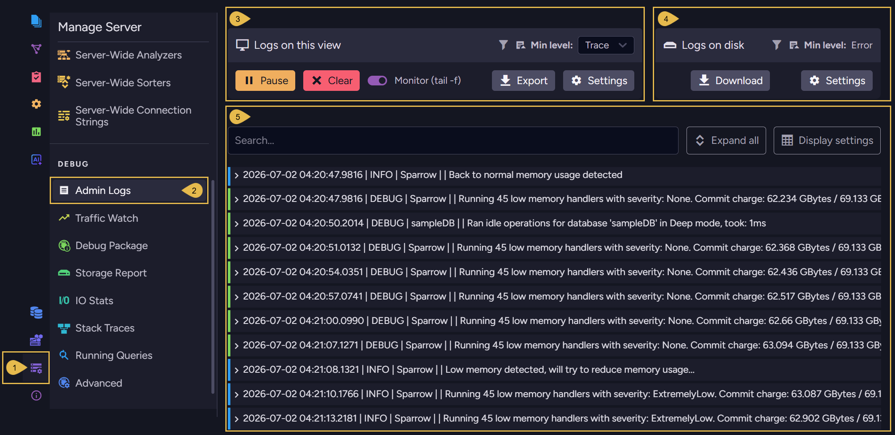

1. **Manage Server**  
   Open the Manage Server **menu**.

2. **Admin Logs**  
   Open the Admin Logs **view**.

3. **[Logs on this view](admin-logs.mdx#logs-on-this-view)**  
   Pause, clear, follow, or export the live stream, and control the entries the server streams
   to Studio.

4. **[Logs on disk](admin-logs.mdx#logs-on-disk)**  
   Control the entries the server writes to the log files, and download those files by date
   range.

5. **[The log stream](admin-logs.mdx#the-log-stream)**  
   The live stream of log entries sent since you opened the view, with the newest entry last.  
   You can search the entries, expand them for their full details, and set the number of
   entries the view keeps.

</Panel>

<Panel heading="Logs on this view">

The settings in `Logs on this view` apply to the live stream only, and do not change the log
files on disk.  
The server stores the logging level and filters you set, so every open Studio session will
show the same stream.

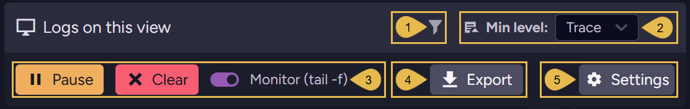

1. **Active filters**  
   Shows whether [filters](admin-logs.mdx#filtering-log-entries) are currently applied to the
   live stream.

2. **Min level**  
   Select the lowest logging level the server streams to Studio.  
   If you select `Warn`, for example, the server streams `Warn`, `Error`, and `Fatal` entries,
   leaving out `Trace`, `Debug`, and `Info`.  
   See the full scale in
   [NLog-compliant logging levels](overview.mdx#nlog-compliant-logging-levels-version-70-and-above).  
   The selected level takes effect immediately.  
   Log entries already on display whose level is lower than the selected level are removed
   from the stream.

3. **Pause**, **Clear**, and **Monitor (tail -f)**  
   * **Pause** stops the stream. The server does not send entries to Studio while the stream
     is paused, and the entries produced during the pause are lost.  
     Click `Resume` to start a fresh stream.
   * **Clear** empties the display without interrupting the stream.
   * **Monitor (tail -f)** keeps the newest entry in sight as entries arrive. Expanding an
     entry turns the option off, so the display stops scrolling.

4. **Export**  
   Write the displayed entries to a JSON file. Each entry becomes one object, with the fields
   listed in [The log stream](admin-logs.mdx#the-log-stream).  
   The file is named `admin-log-` followed by the date and time.  
   e.g., `admin-log-2026-08-03 14-27.json`  
   Only the entries currently on display are exported.

5. **Settings**  
   Open the filter settings of the live stream.

   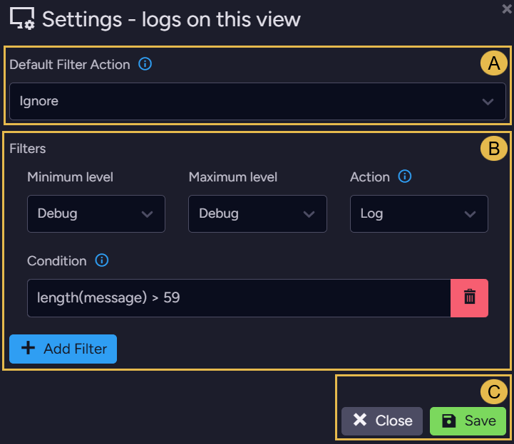

   * **A. Default Filter Action**  
     The action taken on a log entry that matches no filter, or that matches only filters set
     to `Neutral`. The dropdown list stays disabled until at least one filter is defined.
   * **B. Filters**  
     Define new filters and edit existing ones.  
     See [Filtering log entries](admin-logs.mdx#filtering-log-entries) for the fields of a
     filter and the order in which the server evaluates the filters.
   * **C. Close and Save**  
     `Close` leaves the filters as they were, `Save` applies your changes.  
     Saved filters apply only to entries the server produces after you save, and leave the
     entries already on display as they are.

</Panel>

<Panel heading="Logs on disk">

The settings in `Logs on disk` apply to the log files only, and do not change the live stream.  
A new logging level or filter takes effect immediately, but the server reverts to the values
in its configuration when it restarts, unless you save the change to `settings.json`.

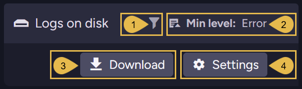

1. **Active filters**  
   Shows whether [filters](admin-logs.mdx#filtering-log-entries) are currently applied to the
   log files.

2. **Min level**  
   The minimum logging level currently applied to the log files.  
   The value is read-only. Change the level under
   [Log settings](admin-logs.mdx#log-settings).

3. **Download**  
   Open the [download dialog](admin-logs.mdx#downloading-log-files), where you can retrieve
   the server's log files by a date range you choose.

4. **Settings**  
   Open [Log settings](admin-logs.mdx#log-settings) to set the minimum logging level and the
   filters for the log files.  
   Use this dialog to modify the settings of the audit log, the Microsoft logs, Traffic Watch,
   and the event listener as well.

<ContentFrame>

### Downloading log files

`Download` collects the log files from the node that Studio is connected to and returns them
as a single zip archive, named after the time of the download and the node's tag.  
To gather the logs of a whole cluster, repeat the download on each node.

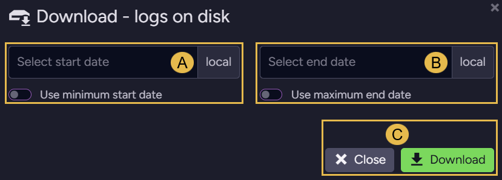

* **A. Select start date**  
  The start of the period the downloaded log files should cover, entered in the local time of
  the machine running the browser.  
  Toggle `Use minimum start date` on to start from the earliest log file the server still keeps.
* **B. Select end date**  
  The end of the period, also entered in local time, and later than the start date.  
  Toggle `Use maximum end date` on to run to the most recent log file.
* **C. Close and Download**  
  `Close` leaves the dialog without downloading, `Download` builds the archive and sends it.

---

<Admonition type="note" title="">

* The log file the server is currently writing is always included, whatever period you select.
* When no log file falls in the selected period, the archive holds a single text file naming
  the period and stating that no log file was found for it.

</Admonition>

</ContentFrame>

---

### Log settings

The `Settings` dialog holds five groups of settings, one for each kind of output the server
can write to disk.  
You can open one group at a time, and each group is saved on its own.

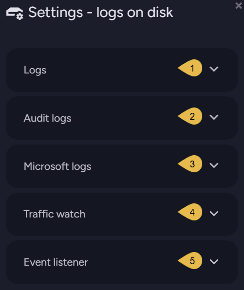

---

<ContentFrame>

#### 1. Logs

RavenDB's own log entries.  
Set the minimum logging level and the filters that select the entries written to the log
files. The settings shown below them, like the log file path and the archiving thresholds,
come from [logging configuration keys](configuration.mdx) and cannot be changed in this dialog.

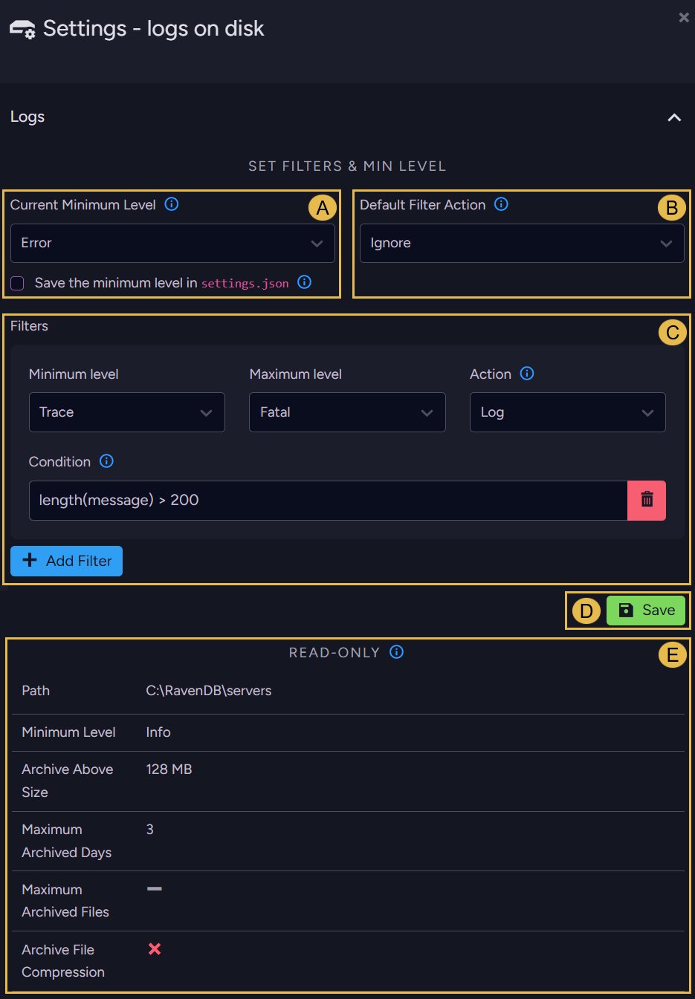

* **A. Current Minimum Level**  
  Select the lowest logging level to write to the log files.
   * The level is applied before the filters, so a log entry whose level is lower than the
     minimum is discarded even when a filter would otherwise log it.
   * A level you select takes effect immediately and holds until the server restarts.  
     Check `Save the minimum level in settings.json` before saving to write the level into the
     configuration file, so it applies after a restart as well.  
     The checkbox does not appear on RavenDB Cloud, and the server refuses to write the level
     to `settings.json` when the logging configuration comes from an
     [NLog configuration file](overview.mdx#configuring-and-using-nlog).
* **B. Default Filter Action**  
  The action taken on a log entry that matches no filter, or that matches only filters set to
  `Neutral`. The action does not apply while no filter is defined.
* **C. Filters**  
  Define new filters and edit existing ones.  
  See [Filtering log entries](admin-logs.mdx#filtering-log-entries) for the fields of a filter
  and the order in which the server evaluates the filters.
* **D. Save**  
  Apply the minimum level, the default action, and the filters to the server.
* **E. `Read-only` - the log file settings**  
  The log file settings held in the server's configuration.  
  Each row links to the configuration key that sets it, where the setting is explained:

   | Setting | Configuration key |
   | - | - |
   | **Path** | [Logs.Path](configuration.mdx#logspath) |
   | **Minimum Level** | [Logs.MinLevel](configuration.mdx#logsminlevel) |
   | **Archive Above Size** | [Logs.ArchiveAboveSizeInMb](configuration.mdx#logsarchiveabovesizeinmb) |
   | **Maximum Archived Days** | [Logs.MaxArchiveDays](configuration.mdx#logsmaxarchivedays) |
   | **Maximum Archived Files** | [Logs.MaxArchiveFiles](configuration.mdx#logsmaxarchivefiles) |
   | **Archive File Compression** | [Logs.EnableArchiveFileCompression](configuration.mdx#logsenablearchivefilecompression) |

   A grey dash in the table means the setting has no value configured, a red cross means
   `false`, and a green check means `true`.

</ContentFrame>

<ContentFrame>

#### 2. Audit logs

The server's [audit log](../../server/security/audit-log/audit-log-overview.mdx), kept in its
own set of files, separate from RavenDB's log files.  
Audit logging is off until you configure a folder for the audit log files using the
[Security.AuditLog.FolderPath](../../server/configuration/security-configuration.mdx#securityauditlogfolderpath)
configuration key.  
The `Path` row shows the configured folder.

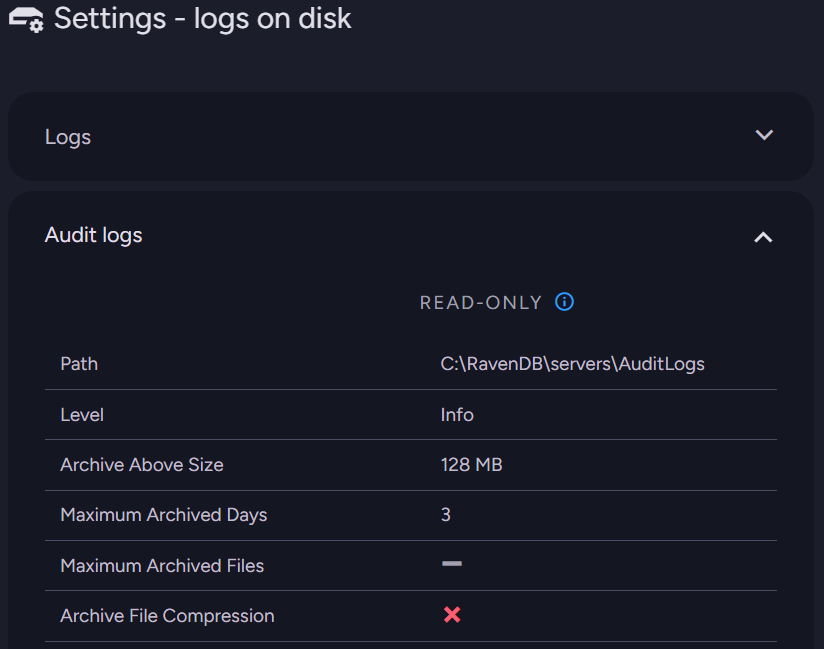

None of these settings can be modified in Studio.  
Each row links to the configuration key that sets it, where the setting is explained:

| Setting | Configuration key |
| - | - |
| **Path** | [Security.AuditLog.FolderPath](../../server/configuration/security-configuration.mdx#securityauditlogfolderpath) |
| **Level** | None. Audit entries are written at `Info`. |
| **Archive Above Size** | [Security.AuditLog.ArchiveAboveSizeInMb](../../server/configuration/security-configuration.mdx#securityauditlogarchiveabovesizeinmb) |
| **Maximum Archived Days** | [Security.AuditLog.MaxArchiveDays](../../server/configuration/security-configuration.mdx#securityauditlogmaxarchivedays) |
| **Maximum Archived Files** | [Security.AuditLog.MaxArchiveFiles](../../server/configuration/security-configuration.mdx#securityauditlogmaxarchivefiles) |
| **Archive File Compression** | [Security.AuditLog.EnableArchiveFileCompression](../../server/configuration/security-configuration.mdx#securityauditlogenablearchivefilecompression) |

<Admonition type="note" title="">

Audit entries are written to the audit log files only, and do not appear in the live stream
shown in this view or in RavenDB's own log files.

</Admonition>

</ContentFrame>

<ContentFrame>

#### 3. Microsoft logs

The [Microsoft logs](overview.mdx#microsoft-logs) are diagnostic logs written by .NET and by
Kestrel, RavenDB's web server, covering events like connections and the start and finish of
each request.  
These logs are disabled by default, and are enabled using the
[Logs.Microsoft.Enabled](configuration.mdx#logsmicrosoftenabled) configuration key.

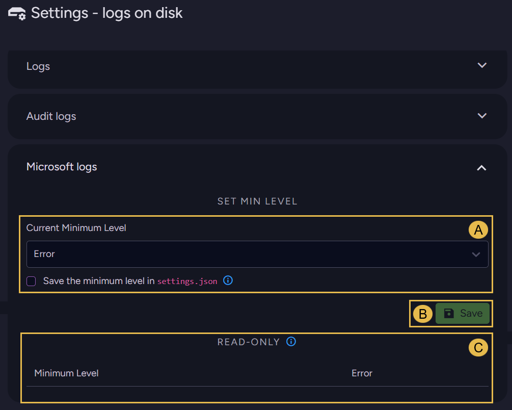

* **A. Current Minimum Level**  
  Select the lowest logging level of the Microsoft logs written to RavenDB's log files.  
  The level behaves like the one in [Logs](admin-logs.mdx#1-logs).  
  It takes effect immediately, and survives a restart only if you check
  `Save the minimum level in settings.json` before saving.
* **B. Save**  
  Apply the minimum level to the server.  
  While the Microsoft logs are disabled, the server rejects the change and names the
  configuration key that enables them.
* **C. `Read-only` - the configured level**  
  The `Minimum Level` row shows the level set by the
  [Logs.Microsoft.MinLevel](configuration.mdx#logsmicrosoftminlevel) configuration key.

</ContentFrame>

<ContentFrame>

#### 4. Traffic watch

[Traffic Watch](../traffic-watch/overview.mdx) monitors the requests a RavenDB server receives,
either as a live stream or by writing the requests to RavenDB's log files.  
This group configures the writing to the log files, and leaves the live stream untouched.

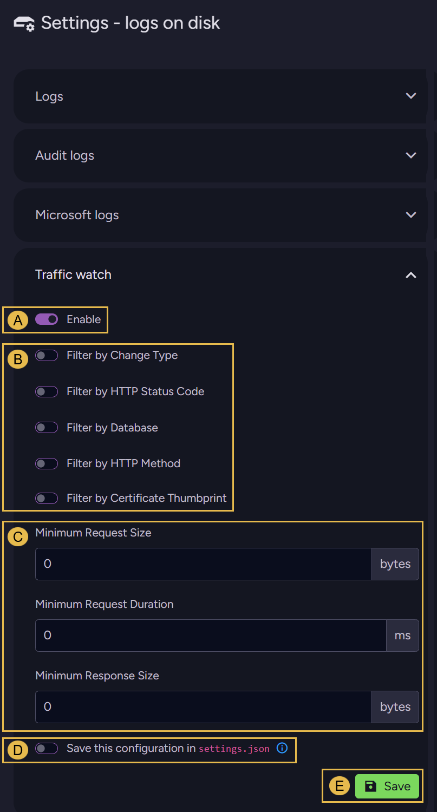

* **A. Enable**  
  Start writing the requests the server receives to the log files.  
  Toggling the option off stops the writing and keeps the filters and thresholds as they are.
* **B. The filter toggles**  
  Toggle a filter on to narrow the requests written to the log files.  
  Each filter opens a list to select from. `Select all` takes every option on the list.  
  `Filter by Certificate Thumbprint` appears only when Studio is connected over HTTPS.  
  See the [Traffic Watch configuration options](../traffic-watch/configuration.mdx) for a
  description of each filter.
* **C. Minimum Request Size**, **Minimum Request Duration**, and **Minimum Response Size**  
  Write only the requests that reach the sizes and the duration you set.
* **D. Save this configuration in `settings.json`**  
  Write these settings into `settings.json` so they apply after a restart as well.  
  The toggle does not appear on RavenDB Cloud.
* **E. Save**  
  Apply the settings to the server.

</ContentFrame>

<ContentFrame>

#### 5. Event listener

The event listener writes .NET runtime events into RavenDB's log files, covering garbage
collections, memory allocations, lock contention, and thread pool activity.  
The listener is off by default. Once enabled, it records only the event types you select.

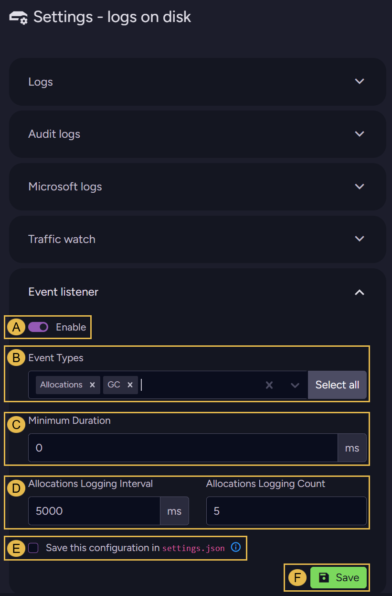

* **A. Enable**  
  Start writing runtime events to the log files.
* **B. Event Types**  
  Select the runtime events to record.  
  At least one type is required. `Select all` takes every type on the list.
* **C. Minimum Duration**  
  Record only the events that last for at least the duration you set.
* **D. Allocations Logging Interval** and **Allocations Logging Count**  
  Both apply to the `Allocations` event type.
   * **Allocations Logging Interval**  
     The period over which the listener gathers allocation events before writing them to the
     log.
   * **Allocations Logging Count**  
     The number of allocation events written for each period.  
     The listener keeps the largest allocations of the period, and the smaller ones are not
     written.
* **E. Save this configuration in `settings.json`**  
  Write these settings into `settings.json` so they apply after a restart as well.  
  The checkbox does not appear on RavenDB Cloud.
* **F. Save**  
  Apply the settings to the server.

</ContentFrame>

</Panel>

<Panel heading="Filtering log entries">

Use filters to select log entries more precisely than the minimum logging level allows, e.g.,
the entries of a single database, a single index, or a single logger.  
Filters are defined the same way under
[Logs on this view](admin-logs.mdx#logs-on-this-view) for the live stream, and under
[Logs on disk](admin-logs.mdx#logs-on-disk) for the log files.

<ContentFrame>

### The fields of a filter

A filter is made of four fields.

* **Minimum level** and **Maximum level**  
  The range of logging levels the filter applies to.  
  A log entry whose level falls outside the range passes the filter untouched.
* **Condition**  
  An expression evaluated against the log entry. The filter applies only when the expression
  holds.  
  See [Condition syntax](admin-logs.mdx#condition-syntax).
* **Action**  
  The action taken on a log entry the filter applies to:

   | Action | Effect |
   | - | - |
   | `Log` | The log entry is written. |
   | `Ignore` | The log entry is not written. |
   | `LogFinal` | The log entry is written, and no further destination receives it. |
   | `IgnoreFinal` | The log entry is not written, and no further destination receives it. |
   | `Neutral` | The filter takes no decision. Evaluation moves on to the next filter, and if no filter decides, the default filter action applies. |

</ContentFrame>

<ContentFrame>

### The order of evaluation

#### The order of the filters

The minimum logging level is applied **before** the filters.  
A log entry whose level is lower than the minimum is dropped, and the filters are never
consulted.

A log entry that passes the minimum level is checked against the filters in the order they are
listed, from the top down.

* The first filter that applies and returns an action other than `Neutral` determines the
  outcome, and the filters below it are not evaluated.
* When every filter returns `Neutral`, or no filter applies, the default filter action
  determines the outcome.
* When no filters are defined at all, the default filter action has no effect and the log
  entry is written.

---

#### The order of the destinations

RavenDB hands each log entry to its destinations in a fixed order: first the log files, then
the live stream shown in this view.  
The filters of a destination (e.g., the filters you set under
[Logs on disk](admin-logs.mdx#logs-on-disk)) are evaluated when the log entry reaches that
destination.

The `LogFinal` and `IgnoreFinal` actions stop a log entry at the destination whose filter
returned the action.

* When the action is returned by a log file filter, the log entry does not reach the live
  stream, and the live stream's filters are not evaluated.
* When the action is returned by a live stream filter, nothing further changes, because the
  live stream is the last destination.

---

#### When a condition cannot be evaluated

When a condition cannot be evaluated, because the expression is malformed for instance, the
log entry is not written to the destination whose filter failed, and evaluation continues with
the next destination.

</ContentFrame>

<ContentFrame>

### Condition syntax

A condition is an expression written in
[NLog's condition language](https://github.com/NLog/NLog/wiki/When-filter#conditions), which
RavenDB evaluates against each log entry.

The parts of a log entry a condition can test include, among others:

| Reference | Part of the log entry |
| - | - |
| `level` | The logging level. |
| `logger` | The full class name of the logger that produced the log entry. |
| `message` | The message text. |
| `exception` | The exception attached to the log entry, or `null` when there is none. |
| `'${event-properties:item=Resource}'` | The resource, e.g., the server or a database name. |
| `'${event-properties:item=Component}'` | The component, e.g., an index name. |
| `'${event-properties:item=Data}'` | The additional context, in JSON. |

References can be combined with `and`, `or`, and `not`.

Some examples:

| Condition | Applies to |
| - | - |
| `contains('${event-properties:item=Resource}', 'Accounting')` | Log entries of the `Accounting` database. |
| `contains('${event-properties:item=Component}', 'Orders_ByCompany')` | Log entries of the `Orders_ByCompany` index. |
| `logger == 'Voron.Impl.Journal.WriteAheadJournal'` | Log entries from a single logger. |
| `exception != null` | Log entries that carry an exception. |
| `length(message) > 200` | Log entries with a message longer than 200 characters. |

</ContentFrame>

</Panel>

<Panel heading="The log stream">

The stream lists the log entries the server has sent since you opened the view, with the
newest entry last.  
New entries arrive in batches, twice a second, and the view keeps them until you clear them or
leave the view.

<ContentFrame>

### The log entries

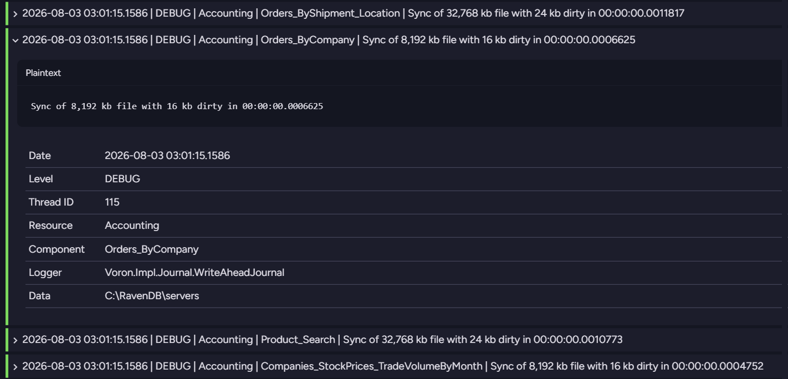

Each row is a single log entry, shown as `Date | Level | Resource | Component | Message` and
cut to the width of the view.  
A colored bar on the left marks the level: grey for `Trace`, green for `Debug`, blue for
`Info`, yellow for `Warn`, orange for `Error`, and red for `Fatal`.

Click a row to expand it. The expanded row shows the full message, followed by the log entry's
fields:

| Field | Description |
| - | - |
| **Date** | The time the log entry was written, in the server's local time. |
| **Level** | The [logging level](overview.mdx#nlog-compliant-logging-levels-version-70-and-above) of the log entry. |
| **Thread ID** | The ID of the thread that produced the log entry. |
| **Resource** | The server or the database the log entry belongs to. |
| **Component** | The component within the resource, e.g., an index name. |
| **Logger** | The full class name of the logger that produced the log entry. |
| **Data** | Additional context, in JSON. |

A field with no value shows a dash.

</ContentFrame>

<ContentFrame>

### The stream controls

* **Search**  
  Show only the log entries that contain the text you type, in any of their fields.
* **Expand all** and **Collapse all**  
  Expand or collapse every log entry currently listed.
* **Display settings**  
  Set the maximum number of log entries the view keeps.

   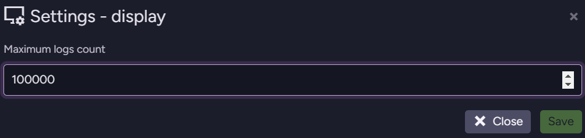

   The default is 100,000, and the value can range from 1 to 200,000.  
   When the number of listed log entries reaches the maximum, Studio pauses the stream, and an
   alert appears, offering to clear the listed log entries or to raise the maximum number of
   entries.  
   `Pause` stays disabled until the number of listed log entries falls below the maximum.

</ContentFrame>

</Panel>
