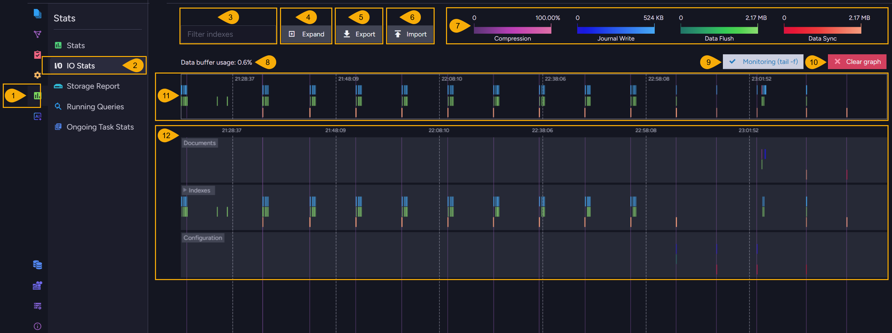
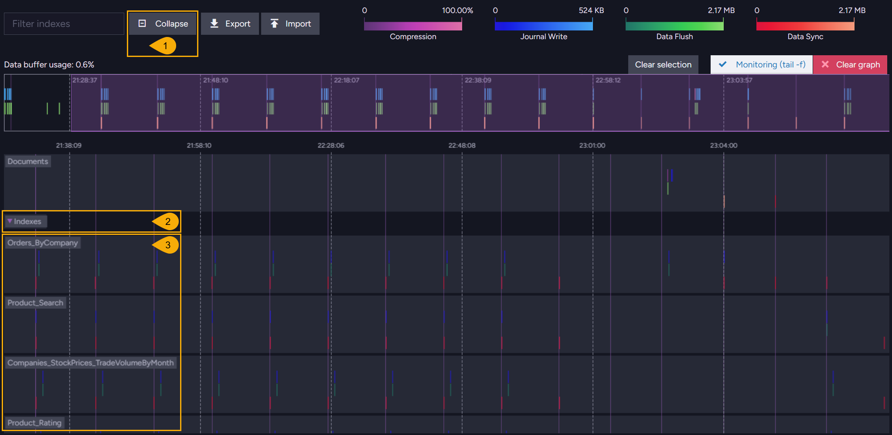
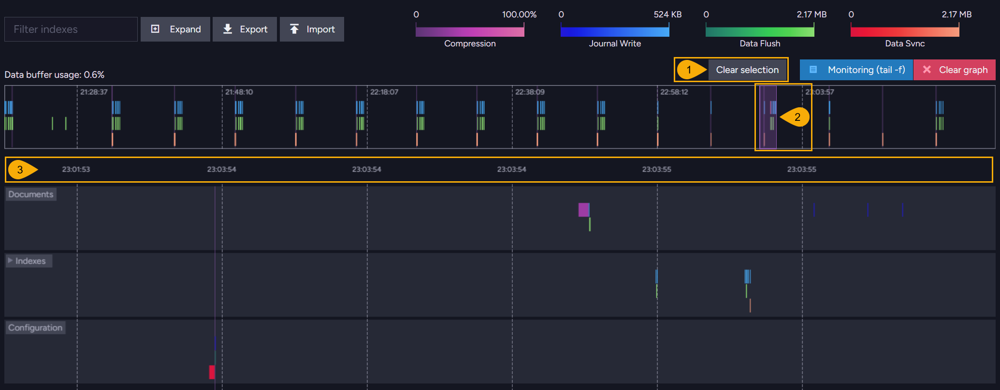
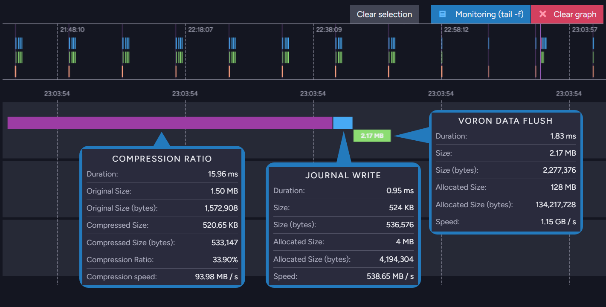
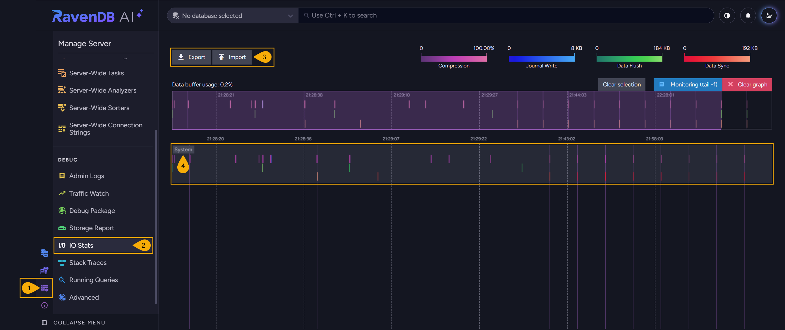

import Admonition from '@theme/Admonition';
import Panel from "@site/src/components/Panel";
import ContentFrame from "@site/src/components/ContentFrame";

# IO Stats

<Admonition type="note" title="">

* The **IO Stats** Studio views draw a timeline of the disk operations performed by
  [Voron](../../server/storage/storage-engine.mdx), RavenDB's storage engine.  
  Use these views to follow a server's disk activity as it happens, and to spot the operations
  that are slow to complete.  

* The **database IO Stats** view (opened from `Stats`) covers a single database.  
  The **server-wide IO Stats** view (opened from `Manage Server`) covers the server-wide and
  cluster-level data RavenDB keeps outside any user database.  
  Both views present the same graph layout over different data.  

* RavenDB keeps the recorded measurements in memory only, so the graph starts empty after a
  server restart.  

* The **IO Stats** widget on the
  [cluster dashboard](../../monitoring/cluster-dashboard/widgets.mdx#io-stats) carries the same
  name, but shows different data: the widget reads per-drive counters from the operating system,
  like IOPS and throughput, while the IO Stats views show the operations RavenDB itself performed.  

* In this article:
   * [Database IO Stats](../../monitoring/performance-views/io-stats.mdx#database-io-stats)
      * [Index tracks](../../monitoring/performance-views/io-stats.mdx#index-tracks)
      * [Selecting a time range](../../monitoring/performance-views/io-stats.mdx#selecting-a-time-range)
      * [What the bars measure](../../monitoring/performance-views/io-stats.mdx#what-the-bars-measure)
   * [Server-wide IO Stats](../../monitoring/performance-views/io-stats.mdx#server-wide-io-stats)
   * [Configuration](../../monitoring/performance-views/io-stats.mdx#configuration)

</Admonition>

<Panel heading="Database IO Stats">

The database **IO Stats** view shows the disk activity of a single database.  
Any user with read access to the database can open this view.  

To open the database IO Stats view: `Stats` > `IO Stats`  

1. **Stats**  
   Click to open the `Stats` menu.

2. **IO Stats**  
   Click to open the IO Stats view.

3. **Filter indexes**  
   Enter a string to list only the index tracks whose names contain this string.

4. **Expand**  
   Show a separate track for each index.

5. **Export**  
   Save the collected measurements to a JSON file.

6. **Import**  
   Load a file saved by **Export** and draw the file's measurements in the graph.  
   A file exported from the server-wide view cannot be loaded into the database view.

7. **Legend**  
   The four measurement types, each with a color scale and the range of values the scale covers.  
   Learn below about
   [what the bars measure](../../monitoring/performance-views/io-stats.mdx#what-the-bars-measure).

8. **Data buffer usage**  
   The share of the view's buffer that the collected measurements occupy.  
   When the buffer fills, the view stops collecting and asks you to clear the graph.

9. **Monitoring (tail -f)**  
   Keep the graph scrolled to the newest measurements as they arrive.

10. **Clear graph**  
    Discard the measurements currently drawn.  
    The view keeps collecting, and new measurements are drawn as they arrive.

11. **Overview strip**  
    All the measurements the view has collected, drawn over the whole collection period.  
    Drag across the strip to select a time range.

12. **The graph**  
    Each track is one
    [storage environment](../../server/storage/directory-structure.mdx#voron-storage-environment)
    of the database: `Documents`, `Configuration`, and one track per index, collapsed into a single
    `Indexes` track until you expand the track bar.  
    A bar is drawn for each recorded operation, positioned at the time the operation started and
    sized by the operation's duration.  
    The time axis does not run at a constant rate: an idle period longer than ten seconds is
    collapsed, so consecutive labels can jump forward by minutes. A vertical line marks each
    collapsed period, and hovering over one of these lines shows the period's start time and
    duration.

<ContentFrame>

### Index tracks

Click **Expand** to draw a separate track for each index.  
When the expanded tracks do not fit the view, you can drag the graph area up or down to reach the
rest.  

1. **Collapse**  
   Fold the index tracks back into a single `Indexes` track.

2. **Indexes**  
   The arrow on the track bar shows whether the index tracks are expanded or collapsed.  
   Clicking the arrow expands and collapses the index tracks as well.

3. **Index tracks**  
   One track per index, labeled with the index name as it appears on disk.  
   Characters that cannot appear in a file name are replaced with an underscore, so the index
   `Orders/ByCompany` is labeled `Orders_ByCompany`.  
   An index name of 64 characters or more is shortened, and a hash is appended to keep the label
   unique.

</ContentFrame>

<ContentFrame>

### Selecting a time range

To examine a busy period closely, select a time range in the overview strip: the main graph then
covers only the selected range.  
Zooming with the mouse wheel over the graph narrows the range as well, and turns off
**Monitoring (tail -f)**.  

1. **Clear selection**  
   Return the main graph to the whole collection period.

2. **The selected range**  
   The part of the collection period the main graph covers, highlighted in the overview strip.  
   Drag the edges of the highlighted area to widen or narrow the range, and drag its middle to move
   the range along the strip.

3. **The main graph's time axis**  
   The timestamps now span the selected range alone. In the example above, the range is short enough
   that consecutive labels fall within the same second.

</ContentFrame>

<ContentFrame>

### What the bars measure

The color of a bar tells which operation RavenDB measured. Each measurement type has its own row
inside a track, and its own color scale in the legend:

| Measurement | Description |
|-------------|-------------|
| **Journal Write** | Writing a committed transaction to the storage environment's write-ahead journal file. This is a write to the disk. |
| **Compression** (**Compression Ratio** in the details popup) | Compressing a transaction's data before the data is written to the journal. This is a memory operation rather than disk activity, and it is measured only for transactions larger than the size set in [Storage.CompressTxAboveSizeInKb](../../server/configuration/storage-configuration.mdx#storagecompresstxabovesizeinkb). |
| **Data Flush** (**Voron Data Flush** in the details popup) | Writing pages from the journals into the data file. The pages are copied into the memory-mapped data file, so a flush is fast; the data reaches the disk on the next sync. |
| **Data Sync** (**Voron Data Sync** in the details popup) | Syncing the data file to the disk. Each sync covers all the pages flushed since the previous sync, so a sync bar is usually large and appears far less often than a flush. |

The four measurements are not four stages of every write.  
A committed transaction always produces a journal write, and produces a compression bar only when
the transaction is large enough. Flushes and syncs run in the background on their own schedules, so
a busy database typically shows many journal writes, fewer flushes, and a few large syncs.

Hovering over a bar shows the details of the operation the bar represents:

For a journal write, a flush, or a sync, the popup shows the operation's duration, the amount of
data the operation handled (**Size**), the allocated size of the file the operation wrote to
(**Allocated Size**), and the resulting speed.  
For a compression, the popup shows the duration, the original and compressed sizes, the compression
ratio, and the compression speed.  
Each size is given both in a rounded form and in bytes.

</ContentFrame>

</Panel>

<Panel heading="Server-wide IO Stats">

The server-wide **IO Stats** view shows the disk activity of the server-wide and cluster-level data
RavenDB keeps outside any user database.  
Only users with `Operator` security clearance can open this view.  

To open the server-wide IO Stats view: `Manage Server` > `IO Stats`  

1. **Manage Server**  
   Click to open the `Manage Server` menu.

2. **IO Stats**  
   Click to open the IO Stats view, under the `Debug` group.

3. **Export** and **Import**  
   Save the collected measurements to a JSON file, and load a file saved from this view.  
   A file exported from a database cannot be loaded into the server-wide view.  
   The index filter and the **Expand** and **Collapse** buttons are absent, since this view has no
   index tracks.

4. **System**  
   The single track of this view, covering the server-wide and cluster-level data.  
   Compression bars appear in this track for nearly every transaction, because the size threshold
   that limits compression in a database does not apply to the server-wide data.

</Panel>

<Panel heading="Configuration">

Four server configuration keys affect the measurements the IO Stats views draw:

| Configuration key | Description |
|-------------------|-------------|
| [Storage.IO.Metrics.Enabled](../../server/configuration/storage-configuration.mdx#storageiometricsenabled) | Enables the collection of I/O measurements, `true` by default. With this key set to `false`, RavenDB records nothing and both views stay empty. |
| [Storage.CompressTxAboveSizeInKb](../../server/configuration/storage-configuration.mdx#storagecompresstxabovesizeinkb) | The transaction size above which RavenDB compresses transaction data. Only transactions above this size produce compression bars. |
| [Storage.SyncJournalsCountThreshold](../../server/configuration/storage-configuration.mdx#storagesyncjournalscountthreshold) | The number of journal files that triggers a sync of the data file. This threshold governs the frequency of the data sync bars. |
| [Storage.IoMetricsCleanupIntervalInHrs](../../server/configuration/storage-configuration.mdx#storageiometricscleanupintervalinhrs) | The interval at which RavenDB removes collected measurements from memory, 24 hours by default. The cleanup runs as part of a database's idle operations. |

</Panel>
