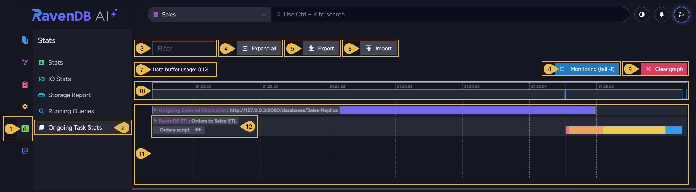
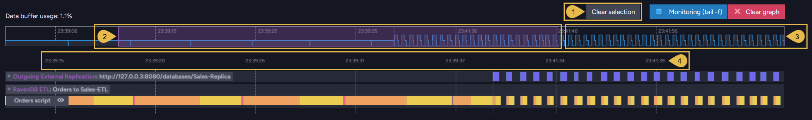
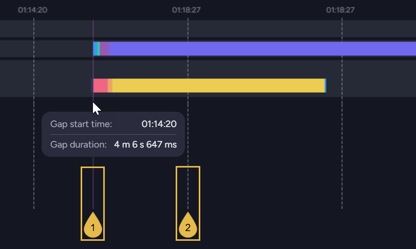
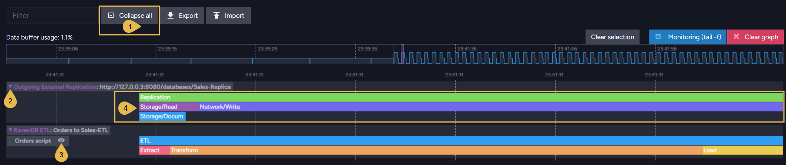
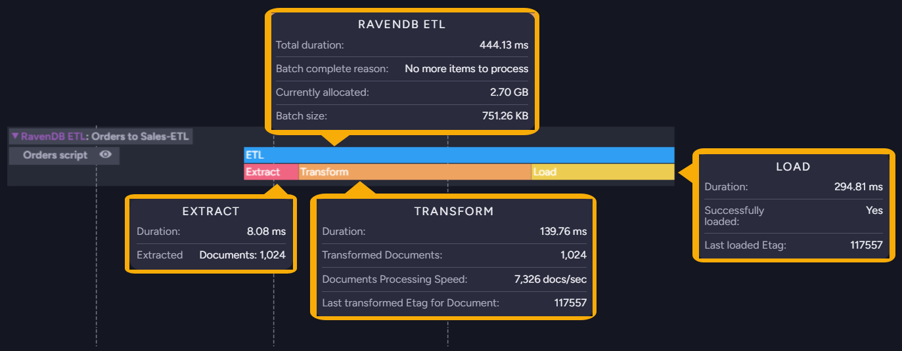
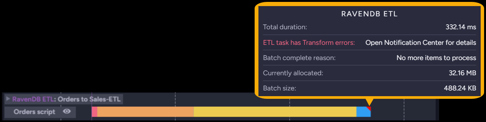
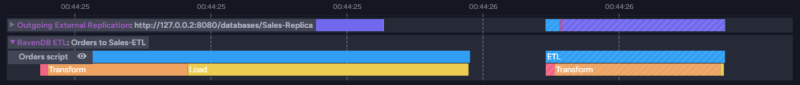
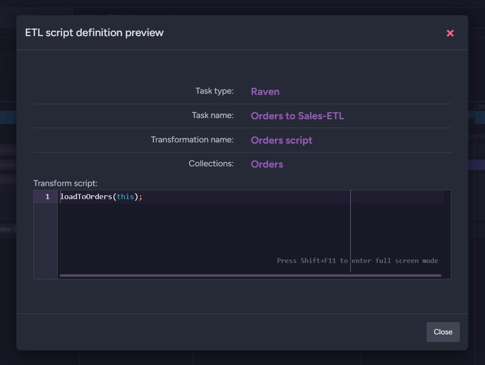
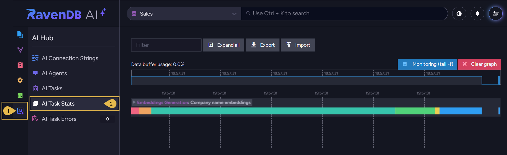

import Admonition from '@theme/Admonition';
import Panel from "@site/src/components/Panel";
import ContentFrame from "@site/src/components/ContentFrame";

# Ongoing Task Stats

<Admonition type="note" title="">

* Studio's **Ongoing Task Stats** view draws a graph of the work a database's
  [ongoing tasks](../../studio/database/tasks/ongoing-tasks/general-info.mdx) perform over time.  
  Use this view to follow tasks as they run. e.g., examine the duration of task operations, the
  volume of data each operation handles, and periods with no task activity.  

* The graph shows a separate track for each monitored task (like an ETL task or a data
  subscription), and for each incoming and outgoing replication connection, including internal
  replication within the database group.  

* Any user with read access to the database can open this view.  
  You can see the activity of the selected database's ongoing tasks, on the node that Studio is
  connected to.  
  On a sharded database, select a shard and one of the nodes hosting this shard before opening
  the view.  

* RavenDB keeps each task's recent activity in memory, so the graph may already be populated when
  you open the view.  

* In this article:
   * [The Ongoing Task Stats view](../../monitoring/performance-views/ongoing-task-stats.mdx#the-ongoing-task-stats-view)
      * [Selecting a time range](../../monitoring/performance-views/ongoing-task-stats.mdx#selecting-a-time-range)
      * [Skipped idle periods](../../monitoring/performance-views/ongoing-task-stats.mdx#skipped-idle-periods)
   * [Task tracks](../../monitoring/performance-views/ongoing-task-stats.mdx#task-tracks)
      * [Expanding a track](../../monitoring/performance-views/ongoing-task-stats.mdx#expanding-a-track)
      * [What a bar reports](../../monitoring/performance-views/ongoing-task-stats.mdx#what-a-bar-reports)
      * [Operations in progress](../../monitoring/performance-views/ongoing-task-stats.mdx#operations-in-progress)
      * [Script or query preview](../../monitoring/performance-views/ongoing-task-stats.mdx#script-or-query-preview)
   * [The tasks shown in the view](../../monitoring/performance-views/ongoing-task-stats.mdx#the-tasks-shown-in-the-view)
      * [Monitoring backup tasks](../../monitoring/performance-views/ongoing-task-stats.mdx#monitoring-backup-tasks)
   * [The AI Task Stats view](../../monitoring/performance-views/ongoing-task-stats.mdx#the-ai-task-stats-view)

</Admonition>

<Panel heading="The Ongoing Task Stats view">

Each bar in the graph spans the duration of one operation, positioned on the time axis at the
operation's start time.  
**`Stats` > `Ongoing Task Stats`**

1. **Stats**  
   Open the **Stats** menu.

2. **Ongoing Task Stats**  
   Open the **Ongoing Task Stats** view.

3. **Filter**  
   Enter a string to show only the tracks whose names contain this string.

4. **[Expand all](../../monitoring/performance-views/ongoing-task-stats.mdx#expanding-a-track)**  
   Expand every track to show the duration of the operations performed by each task.

5. **Export**  
   Save the collected activity to a JSON file.

6. **Import**  
   Load a file saved by **Export** and draw the exported activity in the graph.  
   The view stops recording while an imported file is displayed.  
   `Close import` returns the view to the live graph.

7. **Data buffer usage**  
   The share of the view's buffer in use.  
   When the buffer fills, recording stops and Studio asks you to clear the graph.

8. **Monitoring (tail -f)**  
   Keep the graph scrolled to the newest data.

9. **Clear graph**  
   Clear the graph and empty the Filter box.  
   Plotting resumes as new data arrives, with all tracks collapsed.

10. **[Overview strip](../../monitoring/performance-views/ongoing-task-stats.mdx#selecting-a-time-range)**  
    The whole recorded period at a glance.  
    The line's height shows how many operations were running at each moment.  
    Drag the pointer across the strip to select a time range.

11. **[The graph](../../monitoring/performance-views/ongoing-task-stats.mdx#task-tracks)**  
    The graph area, where the tracks are drawn one under another over a single time axis.  
    A collapsed track shows the operations on a single row, and expanding a track separates the
    operations into several rows.

12. **The track label**  
    The label shows the task type followed by the track name.  
    Click the arrow at the label's left to expand or collapse the track.  
    A task's track is named after the task, and a replication connection's track after the URL of
    the source or destination database.

<ContentFrame>

### Selecting a time range

To examine a specific activity period closely, stretch and slide a time range frame across the
overview strip. The graph will then plot only the selected range.  
Rolling the mouse wheel over the graph zooms in or out as well, and turns off
**Monitoring (tail -f)**.  

1. **Clear selection**  
   Expand the selection to the entire recorded period.

2. **The selected range**  
   The part of the recorded period the graph plots.  
   You can resize the selection frame by clicking and dragging its edges, or click within the
   selected area and slide the frame along the strip.

3. **Data outside the selection**  
   Data recorded outside the selected range still appears in the strip, but is left out of the
   graph.

4. **The time axis**  
   The time labels cover only the selected range.

</ContentFrame>

<ContentFrame>

### Skipped idle periods

The time axis does not run at a constant rate: a period of more than ten seconds with no task
activity is skipped, so consecutive time labels can jump forward by minutes.  
The labels are spaced at even distances along the axis, not at even time intervals, so zooming
into a short time range may display several labels sharing the same second.  

1. **Gap line**  
   A solid purple line marks each skipped time period.  
   Hovering over the line shows the period's start time and duration.

2. **Grid line**  
   A dashed line runs down from each time label. These lines mark the axis only, and carry no
   information about task activity.

</ContentFrame>

</Panel>

<Panel heading="Task tracks">

<ContentFrame>

### Expanding a track

Click the arrow on a track label to expand or collapse a single track, or click a bar in a
collapsed track.  

1. **Collapse all**  
   Collapse all tracks. This button replaces **Expand all** once all tracks are expanded.

2. **Track arrow**  
   The arrow indicates whether the track is expanded or collapsed.

3. **The eye icon**  
   Opens the task's transformation script or query.  
   Learn below about the
   [script or query preview](../../monitoring/performance-views/ongoing-task-stats.mdx#script-or-query-preview).

4. **Nested operations**  
   The top bar of each work batch represents the batch as a whole.  
   The bars beneath it represent the operations included in the batch.

</ContentFrame>

<ContentFrame>

### What a bar reports

Hovering over a bar displays the details recorded for the operation the bar represents.  

The popup for a work batch's top bar is headed by the task type, and gives the batch's total
duration.  
The popup for an operation's bar is headed by the operation name, and gives the duration of the
operation.  
The figures listed after the duration depend on the task type.  
e.g., [RavenDB ETL Stats](../../studio/database/stats/ongoing-tasks-stats/ravendb-etl-stats.mdx#ravendb-etl-stats-expanded-view)
or [Subscription Stats](../../studio/database/stats/ongoing-tasks-stats/subscription-stats.mdx#subscription-stats-expanded-view).

A triangle marks a work batch that ended with errors.  
For an ETL task the popup names the failing stage, transform or load, and points to the
notification center.  

</ContentFrame>

<ContentFrame>

### Operations in progress

Striped bars mark operations that are still running, animating the stripes while the operations
continue.  
The bars turn solid once the operations complete.  

</ContentFrame>

<ContentFrame>

### Script or query preview

An ETL task's track lists each transformation script on a row of its own, and a data
subscription's track lists the subscription query.  
Click the
[eye icon](../../monitoring/performance-views/ongoing-task-stats.mdx#expanding-a-track)
beside the script or query name to open a preview.  

The preview names the task and the transformation script, lists the collections the script runs
on, and shows the script itself.

</ContentFrame>

</Panel>

<Panel heading="The tasks shown in the view">

A track is drawn for each of the following:

| Monitored work | Tracks |
|----------------|--------|
| **ETL tasks** | One track per task, for every ETL type: RavenDB, SQL, Snowflake, OLAP, Elasticsearch, Kafka, RabbitMQ, Azure Queue Storage, and Amazon SQS. [Embeddings generation](../../ai-integration/generating-embeddings/overview.mdx) and [GenAI](../../ai-integration/gen-ai-integration/overview.mdx) tasks are reported as ETL tasks as well. |
| **Queue sinks** | One track per task: Kafka, RabbitMQ, and Azure Service Bus. |
| **CDC sinks** | One track per task. |
| **Data subscriptions** | One track per subscription. |
| **Replication connections** | One track per connection, incoming and outgoing: external replication, internal replication within the database group, and hub and sink replication. |

The following articles describe the figures reported for a specific task type:  
[External Replication Stats](../../studio/database/stats/ongoing-tasks-stats/external-replication-stats.mdx)  
[Subscription Stats](../../studio/database/stats/ongoing-tasks-stats/subscription-stats.mdx)  
[RavenDB ETL Stats](../../studio/database/stats/ongoing-tasks-stats/ravendb-etl-stats.mdx)  
[SQL ETL Stats](../../studio/database/stats/ongoing-tasks-stats/sql-etl-stats.mdx)  
[OLAP ETL Stats](../../studio/database/stats/ongoing-tasks-stats/olap-etl-stats.mdx)

<ContentFrame>

### Monitoring backup tasks

Backup tasks, the only ongoing tasks absent from this view, can be monitored:

* **Via Studio**  
  Backup tasks are listed at `Tasks` > `Backups`, with the
  [details of each task](../../backup/create/periodic-tasks/database-backup.mdx#f-saving-and-managing-the-task).  
  Running backup operations can be followed in the
  [notification center](../../monitoring/alerts-and-notifications/notification-center.mdx#notification-types),
  where they can also be delayed or aborted.

* **Using the client API**  
  To retrieve the status of a backup task after its last run, use
  [GetPeriodicBackupStatusOperation](../../backup/create/periodic-tasks/database-backup.mdx#getting-backup-task-status).

* **Using SNMP endpoints**  
  [Backup SNMP endpoints](../../backup/overview.mdx#backup-snmp-endpoints) report the running
  backup operations, the number of enabled and active backup tasks, and the longest time any
  database has gone since its last backup.

</ContentFrame>

</Panel>

<Panel heading="The AI Task Stats view">

The **AI Task Stats** view, opened from the **AI Hub** menu, is similar in every way to the
**Ongoing Task Stats** view explained above, except for displaying only the activity of
[two AI task types](../../monitoring/performance-views/ongoing-task-stats.mdx#the-tasks-shown-in-the-view):
**embeddings generation** and **GenAI**.  
**`AI Hub` > `AI Task Stats`**

1. **AI Hub**  
   Open the **AI Hub** menu.

2. **AI Task Stats**  
   Open the **AI Task Stats** view.

</Panel>
