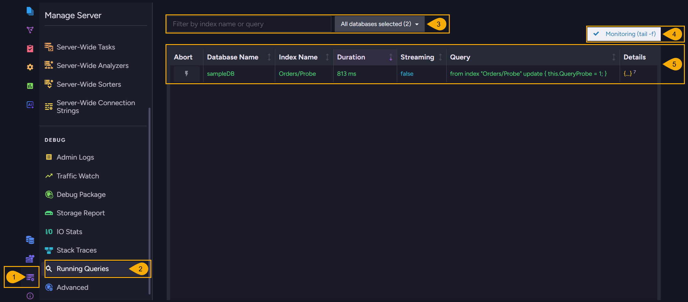
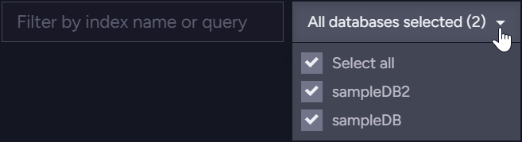
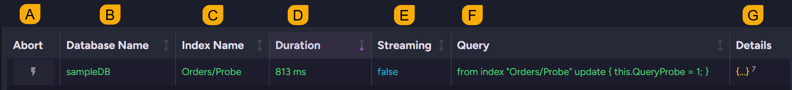
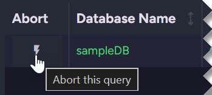
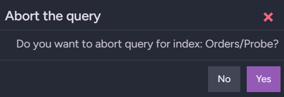
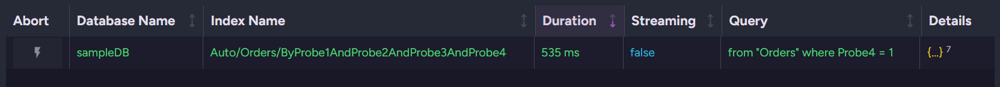
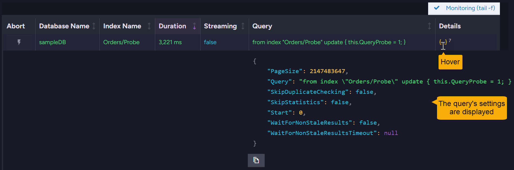
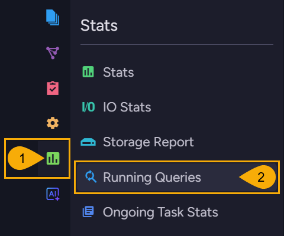

import Admonition from '@theme/Admonition';
import Panel from "@site/src/components/Panel";

# Performance Views: Running Queries
<Admonition type="note" title="">

* The **Running Queries** Studio view lists the queries a server is currently running, one row per
  query.  
  You can abort a query that runs for too long.  

* Open the view from the `Manage Server` menu to list the queries of every database the server has
  loaded, or from a database's `Stats` menu for a single database.  

* The view lists only the queries running on the node you are connected to, and only those that
  have been running for more than 100 milliseconds.  

* In this article:
   * [The Running Queries view](../../monitoring/performance-views/running-queries.mdx#the-running-queries-view)
   * [Opening the view for a single database](../../monitoring/performance-views/running-queries.mdx#opening-the-view-for-a-single-database)

</Admonition>

<Panel heading="The Running Queries view">

The **Running Queries** view lists the queries the server is running right now, and drops each query
from the list as the query completes.  

* Users of every security clearance, including `User`, can open the view.  
* Users with `User` clearance see only the queries of the databases their certificates grant access
  to.  

To open the view: `Manage Server` > `Running Queries`  

1. **Manage Server**  
   Open the `Manage Server` menu.

2. **Running Queries**  
   Open the Running Queries view, under the `Debug` group.

3. **Filters**  
   Narrow the list of running queries:  
   * Enter a string to list only the queries whose index name or query text contains this string.  
   * Use the database filter to select the databases whose queries are listed:  

     

4. **Monitoring (tail -f)**  
   While this option is on, the list of running queries is updated about once a second.  
   Switching this option off stops the updates and keeps the listed rows on screen. This is useful
   while you read a long query.  
   Switching the option back on clears the rows on screen and resumes the updates.

5. **The list of running queries**  
   The list holds one row per query, sorted by duration, with the longest running query first.  
   Patch and delete operations, when they run over an index, are listed as well and can be aborted
   like any other query.  

   

   * **A. Abort**  
     Cancels the query listed in this row:  

     

     Clicking the `Abort` icon opens a confirmation dialog:  

     

     * The abort action does not stop the query on the spot: RavenDB signals the query to stop, and
       the query ends shortly afterwards.  
     * Until the query ends, the row remains listed and the query's duration keeps growing.  
     * The client that issued the query receives an error rather than results, since the query was
       stopped before it could complete. The server reports the error as
       `System.OperationCanceledException`.  
     * RavenDB also cancels a query on its own when the query exceeds the time set by
       [Databases.QueryTimeoutInSec](../../server/configuration/database-configuration.mdx#databasesquerytimeoutinsec),
       or, for a patch or delete operation, by
       [Databases.QueryOperationTimeoutInSec](../../server/configuration/database-configuration.mdx#databasesqueryoperationtimeoutinsec).  

   * **B. Database Name**  
     The database the query runs on.  

   * **C. Index Name**  
     The index that serves the query.  
     When RavenDB answers a query by creating an auto index, the auto index's name is shown:  

     

   * **D. Duration**  
     The number of milliseconds since the query started.  

   * **E. Streaming**  
     `true` for a query whose results are
     [streamed](../../querying/stream-query-results.mdx) to the client.  
     A streaming query can remain in the list far longer than an ordinary query, since it is listed
     for as long as the client keeps reading the query's results.  

   * **F. Query**  
     The RQL text of the query.  

   * **G. Details**  
     Hovering over this cell displays the settings the query was sent with:  

     

     The values of the query's parameters are not displayed, so a query written with parameters
     cannot be read in full in this view.  

</Panel>

<Panel heading="Opening the view for a single database">

The Running Queries entry appears in each database's `Stats` menu as well, but functions as a
shortcut to the view described above, under the
[Manage Server](../../studio/server/manage-server.mdx) menu, which opens with the database filter
already narrowed to the database you were working on.  

To open the view for one database: `Stats` > `Running Queries`  

1. **Stats**  
   Open the `Stats` menu.

2. **Running Queries**  
   Open the Running Queries view for the current database.

</Panel>
