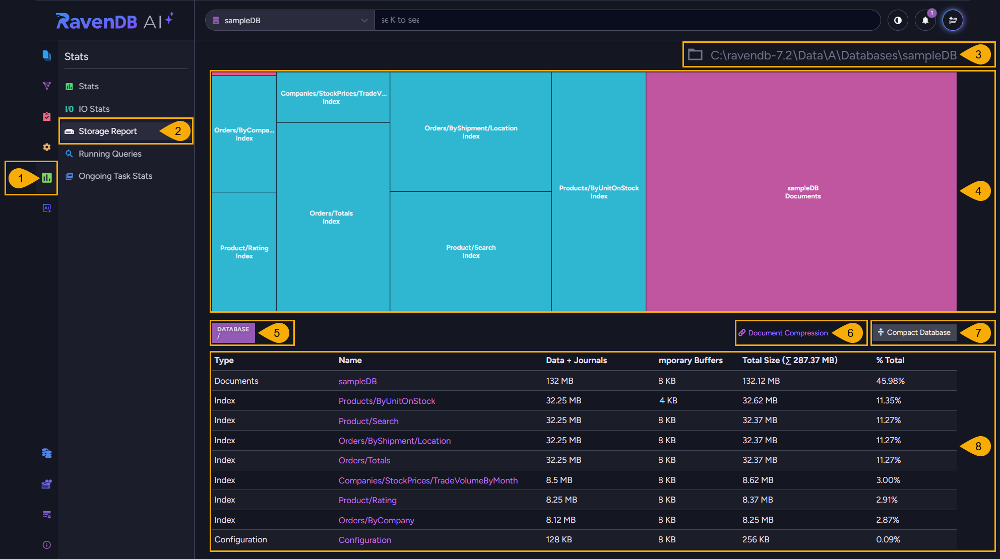
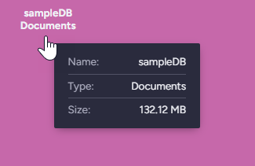
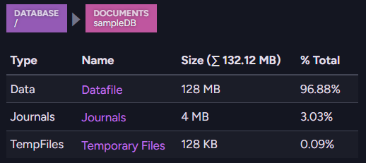
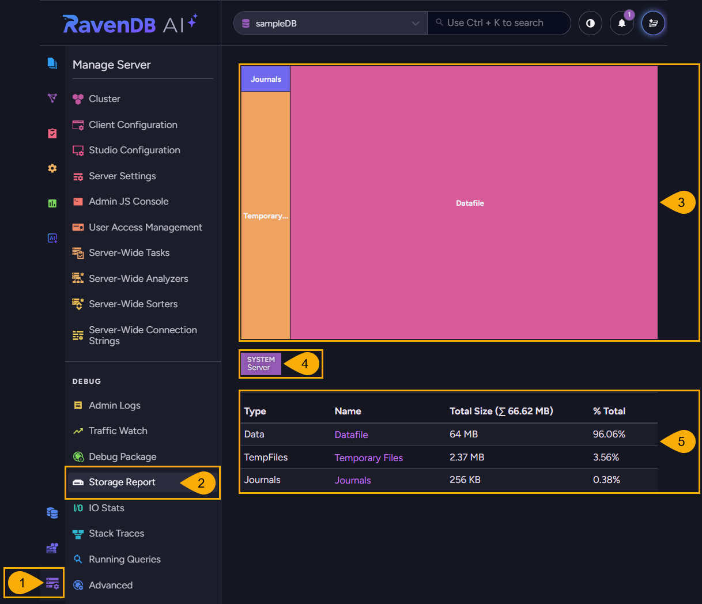
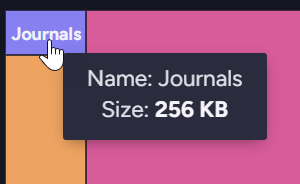
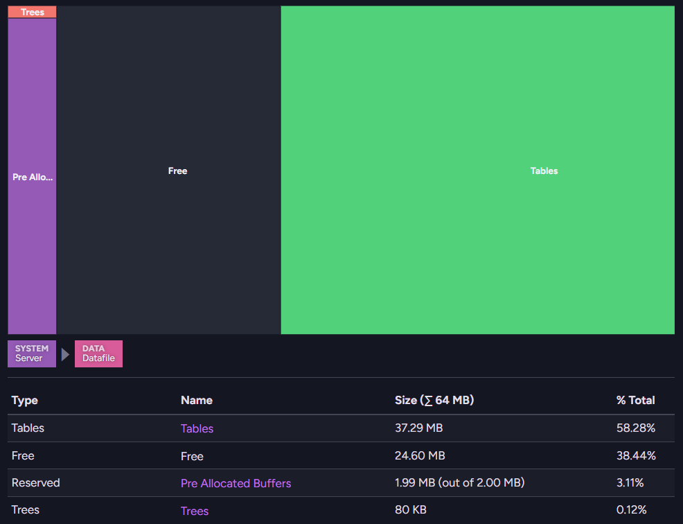

import Admonition from '@theme/Admonition';
import Panel from "@site/src/components/Panel";

# Storage Reports

<Admonition type="note" title="">

* RavenDB provides two **Storage Report** views, each showing how disk space is used, broken down by
  component.  

* The **database Storage Report** (opened from `Stats`) shows the storage of a single database.  
  The **server-wide Storage Report** (opened from `Manage Server`) shows the storage of the
  server-wide and cluster-level data RavenDB keeps outside any user database.  

* In this article:
   * [Database Storage Report](../../monitoring/performance-views/storage-report.mdx#database-storage-report)
   * [Server-wide Storage Report](../../monitoring/performance-views/storage-report.mdx#server-wide-storage-report)

</Admonition>

<Panel heading="Database Storage Report">

The database **Storage Report** shows the disk space a single database uses, broken down by
component: the documents, each index, and the database configuration.  

To open the database Storage Report: `Stats` > `Storage Report`  

1. **Stats**  
   Open the `Stats` menu.  

2. **Storage Report**  
   Open the Storage Report view.  

3. **Database location on disk**  
   The full path to the database's files on the current node.  

4. **Storage map**  
   Each rectangle represents a database component and is sized in proportion to the disk space the
   component occupies.  
   Hovering over a component shows its name and size, and, for some components, its type and entry
   count:  

   

5. **Breadcrumb**  
   Selecting a component displays its position in the breadcrumb path and its details in the table
   below:  

   

   Click an earlier component in the breadcrumb path to return to it.  

6. **Document Compression**  
   Open the [documents compression](../../studio/database/settings/documents-compression.mdx)
   settings for the database.  

7. **Compact Database**  
   Compact the database on the node you are currently connected to, reclaiming disk space left behind
   by deletes. You can compact documents, selected indexes, or both.  
   The database will be offline while the compaction runs.  
   You can also compact the database from the client API, using the
   [compact database operation](../../client-api/operations/server-wide/compact-database.mdx).  

8. **Details table**  
   Lists each component with its type, name, data and journal size, temporary buffer size, total
   size, and share of the database's total storage.  

</Panel>

<Panel heading="Server-wide Storage Report">

The server-wide **Storage Report** shows the disk space RavenDB uses for the server-wide and
cluster-level data it keeps outside any user database.  

This storage is broken down into:  

* the data file  
* the journals  
* the temporary files  

To open the server-wide Storage Report: `Manage Server` > `Storage Report`  

1. **Manage Server**  
   Open the `Manage Server` menu.  

2. **Storage Report**  
   Open the Storage Report view, under the `Debug` group.  

3. **Storage map**  
   Each rectangle represents a component of the server-wide storage and is sized in proportion to
   the disk space the component occupies.  
   Hovering over a component shows its name and size, and, for some components, its type and entry
   count:  

   

4. **Breadcrumb**  
   Selecting a component displays its position in the breadcrumb path and its details in the table
   below.  

   In the example below, the data file is selected, revealing the data file's internal structures:
   tables, trees, free space, and pre-allocated buffers:  

   

   Click an earlier component in the breadcrumb path to return to it.  

5. **Details table**  
   Lists each component with its type, name, total size, and its share of the total server-wide
   storage.  

</Panel>
