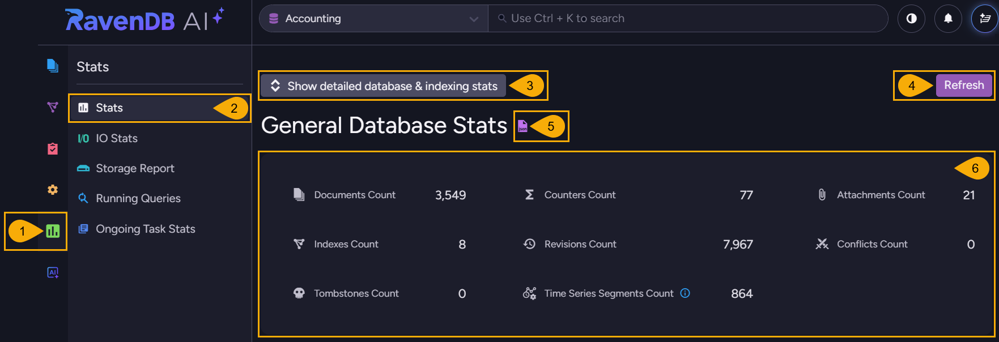
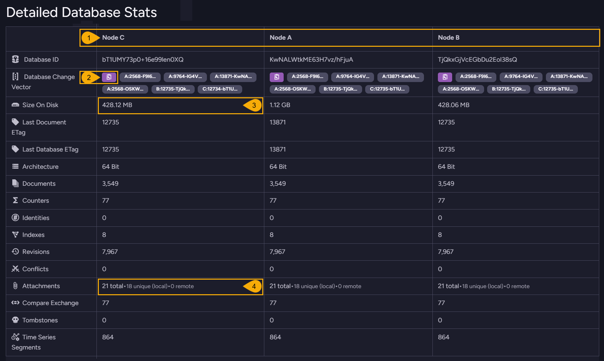
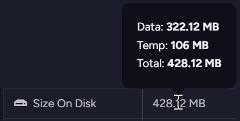
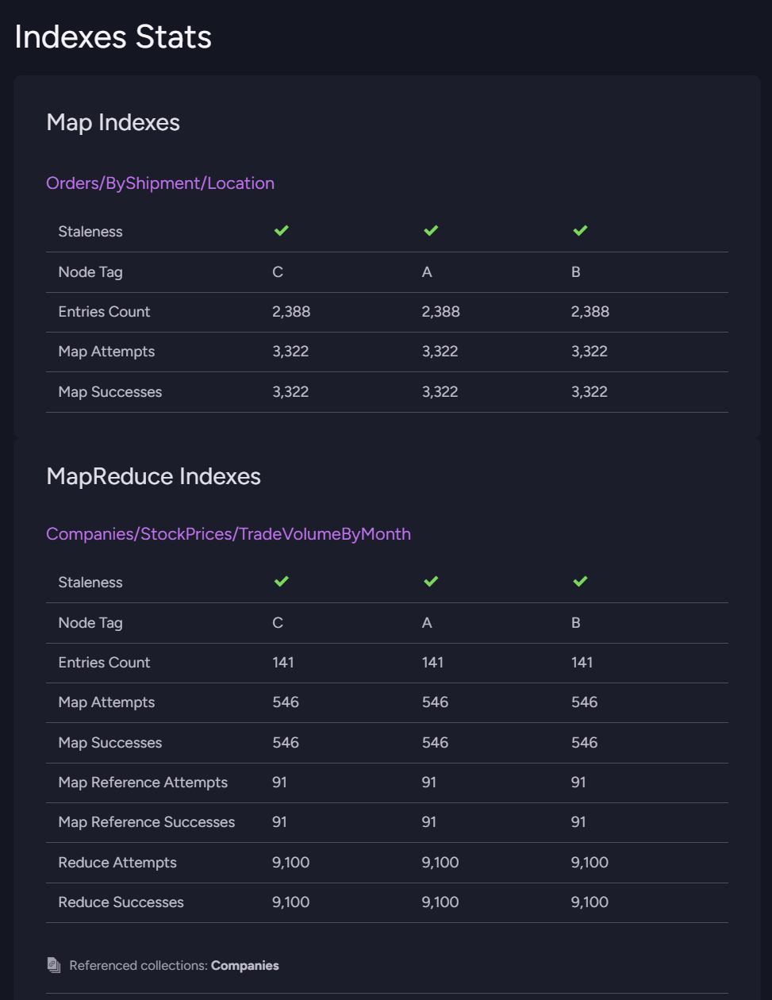
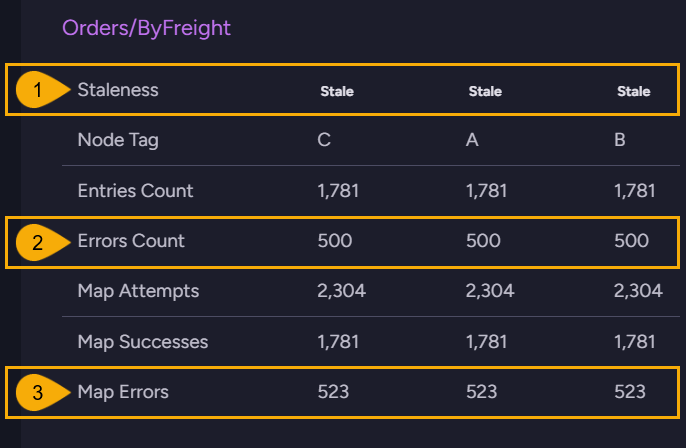
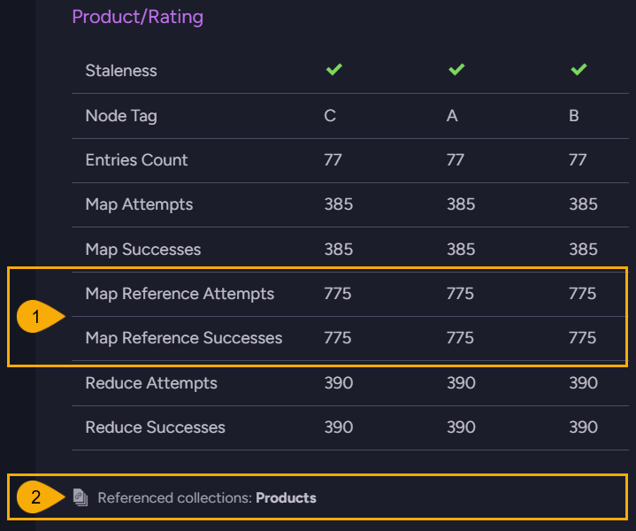

import Admonition from '@theme/Admonition';
import Panel from "@site/src/components/Panel";
import ContentFrame from "@site/src/components/ContentFrame";

# Statistics: Stats view
<Admonition type="note" title="">

* Studio's **Stats view** shows the statistics of a single database: the counts of the
  database's documents and document extensions, per-node details like the database ID and the
  size on disk, and the indexing counters of each index.  

* The statistics are read when you open the view.  
  To update the readings, you need to click `Refresh`.  

* Statistics can also be retrieved using other Studio views and dedicated endpoints, listed in
  the [Overview](overview.mdx) article.  

* In this article:
   * [The Stats view](stats-view.mdx#the-stats-view)
   * [Detailed Database Stats](stats-view.mdx#detailed-database-stats)
   * [Indexes Stats](stats-view.mdx#indexes-stats)
      * [The index tables](stats-view.mdx#the-index-tables)
      * [Staleness and errors](stats-view.mdx#staleness-and-errors)
      * [Indexes that load related documents](stats-view.mdx#indexes-that-load-related-documents)

</Admonition>

<Panel heading="The Stats view">

Any user with read access to the database can open this view. To open: `Stats` > `Stats`  

1. **Stats**  
   Open the Stats **menu**.

2. **Stats**  
   Open the Stats **view**.

3. **Show detailed database & indexing stats**  
   Click to toggle on or off a
   [detailed display](stats-view.mdx#detailed-database-stats) of database and index statistics.

4. **Refresh**  
   Read the statistics again and update the display.

5. **Show raw output**  
   Open the JSON response of the `/databases/<database name>/stats/essential` endpoint
   in a new browser tab.

6. **General Database Stats**  

   | Count | Description |
   | - | - |
   | **Documents Count** | The number of documents in the database. |
   | **Counters Count** | The number of [counter](../../document-extensions/counters/overview.mdx) entries. |
   | **Attachments Count** | The number of [attachments](../../document-extensions/attachments/overview.mdx) in the database. |
   | **Indexes Count** | The number of indexes defined in the database. |
   | **Revisions Count** | The number of [revisions](../../document-extensions/revisions/overview.mdx) stored. |
   | **Conflicts Count** | The number of documents that are currently in [conflict](../../server/clustering/replication/replication-conflicts.mdx). |
   | **Tombstones Count** | The number of [tombstones](../../monitoring/tombstones/overview.mdx), the markers left behind by deleted documents. |
   | **Time Series Segments Count** | The number of segments that hold the database's [time series](../../document-extensions/timeseries/overview.mdx) entries. A segment holds consecutive entries of one time series and grows to 2 KB at most, so a new segment is added as entries accumulate, or once enough time has passed since the last entry. |

</Panel>

<Panel heading="Detailed Database Stats">

The Detailed Database Stats table holds one column per cluster node in the database group, and
one column per shard on a sharded database.

1. **Node columns**  
   The node the column's values were read from.  
   On a sharded database the shard number is shown as well.

2. **Copy to clipboard**  
   Copy the node's full change vector.  
   The badges next to the button show each change vector entry in a shortened form; hovering
   over a badge shows the full entries.

3. **Size On Disk**  
   Hovering over the value displays the sizes of the database's data files and temporary
   buffers.

   

4. **Attachments**  
   The overall number of attachments.  
   When the same file is attached to several documents, RavenDB stores the file once and all
   these attachments point to the single stored copy, so fewer files are stored than the
   overall number of attachments.  
   The row then adds two figures: the number of files stored locally, and the number of
   attachments kept in remote storage.

The rows are:

| Row | Description |
| - | - |
| **Database ID** | The unique identifier of the [database instance](../../glossary/database-id.mdx) on this node. Each node generates an identifier of its own. |
| **Database Change Vector** | The database's current [change vector](../../server/clustering/replication/change-vector.mdx), with one entry per node that has written to the database. |
| **Size On Disk** | The disk space the database occupies on this node, including its temporary buffers. |
| **Last Document ETag** | The [ETag](../../glossary/etag.mdx) of the most recent document change on this node. |
| **Last Database ETag** | The most recent ETag on this node across the whole database, including changes to documents, tombstones, revisions, conflicts, and attachments. |
| **Architecture** | The architecture of the server process on this node, 64-bit or 32-bit. |
| **Documents** | The number of documents on this node. |
| **Counters** | The number of counter entries on this node. |
| **Identities** | The number of identities the database has generated. |
| **Indexes** | The number of indexes defined in the database. |
| **Revisions** | The number of revisions on this node. |
| **Conflicts** | The number of documents that are currently in conflict on this node. |
| **Attachments** | The number of attachments on this node. |
| **Compare Exchange** | The number of [compare exchange](../../compare-exchange/overview.mdx) items. Compare exchange items are stored cluster-wide, so the value is identical for all nodes. |
| **Tombstones** | The number of tombstones on this node. |
| **Time Series Segments** | The number of time series segments on this node. |

</Panel>

<Panel heading="Indexes Stats">

This section shows the indexing counters of each index, node by node.  
The indexes are grouped by type, map indexes first and map-reduce indexes later, and each index
name links to the [Indexing Performance](../../studio/database/indexes/indexing-performance.mdx)
view for that index.

<ContentFrame>

### The index tables

A row appears only when the index has something to report for it, so two indexes in the same
group can show different rows.

The rows are:

| Row | Description |
| - | - |
| **Staleness** | A green check when the index has processed every document it needs to, or a `Stale` badge when some documents are not processed yet. |
| **Node Tag** | The node the column's values were read from. |
| **Shard #** | If the database is sharded: the shard the column's values were read from. |
| **Entries Count** | The number of entries the index currently holds. A single document can produce more than one entry. |
| **Errors Count** | The number of indexing errors stored for the index. |
| **Map Attempts** | The number of documents the index tried to map. |
| **Map Successes** | The number of documents the index mapped successfully. |
| **Map Errors** | The number of documents whose mapping failed. |
| **Map Reference Attempts** | The number of documents the index re-mapped because a document they reference had changed. Shown for indexes that load related documents. |
| **Map Reference Successes** | The number of the re-mappings that succeeded. Shown for indexes that load related documents. |
| **Map Reference Errors** | The number of the re-mappings that failed. |
| **Mapped Per Second Rate** | The rate at which the index is currently mapping documents. Shown while the rate exceeds one document per second. |
| **Reduce Attempts** | The number of reduce operations the index attempted. Shown for map-reduce indexes. |
| **Reduce Successes** | The number of reduce operations that succeeded. Shown for map-reduce indexes. |
| **Reduce Errors** | The number of reduce operations that failed. |
| **Reduced Per Second Rate** | The rate at which the index is currently reducing. Shown while the rate exceeds one operation per second. |

</ContentFrame>

<ContentFrame>

### Staleness and errors

1. **Staleness**  
   A `Stale` badge means the index still has documents to process.  
   Click the badge to open the list of reasons the index is stale.

2. **Errors Count**  
   The number of errors stored for the index.  
   RavenDB keeps the 500 most recent errors of each index, so the count stops at 500.

3. **Map Errors**  
   The number of documents whose mapping failed.  
   This counter is not capped, so an index that has failed on more than 500 documents shows a
   higher Map Errors than Errors Count.

To read the errors themselves, see
[Debugging index errors](../../indexes/troubleshooting/debugging-index-errors.mdx).

</ContentFrame>

<ContentFrame>

### Indexes that load related documents

1. **Map Reference Attempts and Map Reference Successes**  
   An index can use `LoadDocument` to read data from documents related to the document being
   indexed.  
   When a related document changes, the index re-maps every document that references the
   changed document.  
   Map Reference Attempts counts the documents re-mapped this way, and Map Reference Successes
   counts the documents whose re-mapping completed.

2. **Referenced collections**  
   The collections the index loads related documents from.

Learn how to define an index that loads related documents in
[Indexing related documents](../../indexes/indexing-related-documents.mdx).

</ContentFrame>

</Panel>
