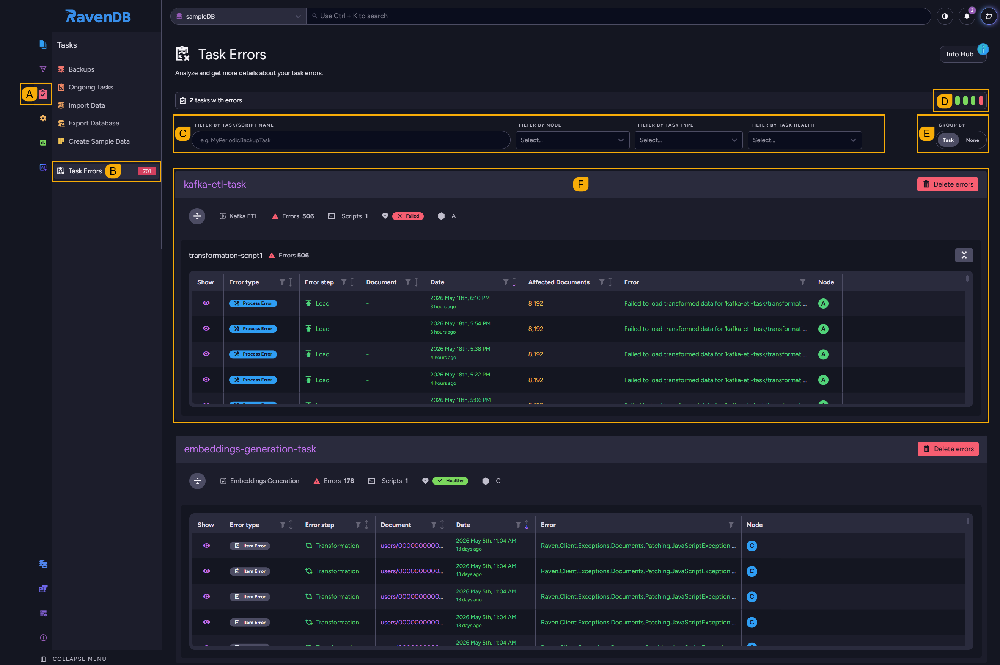
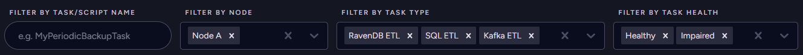
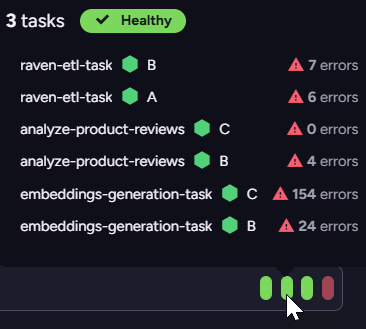
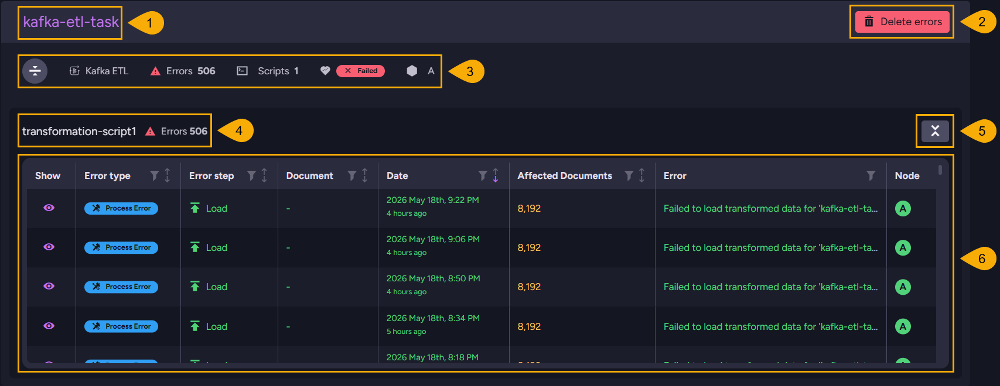
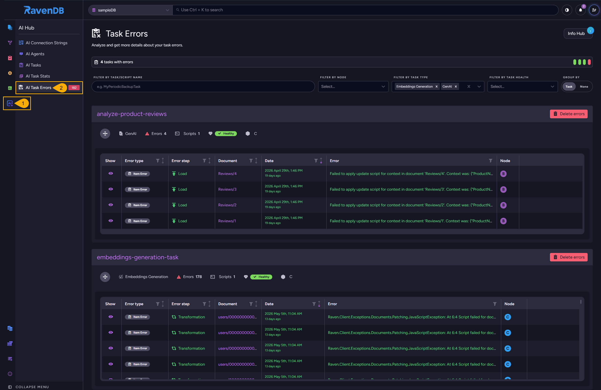
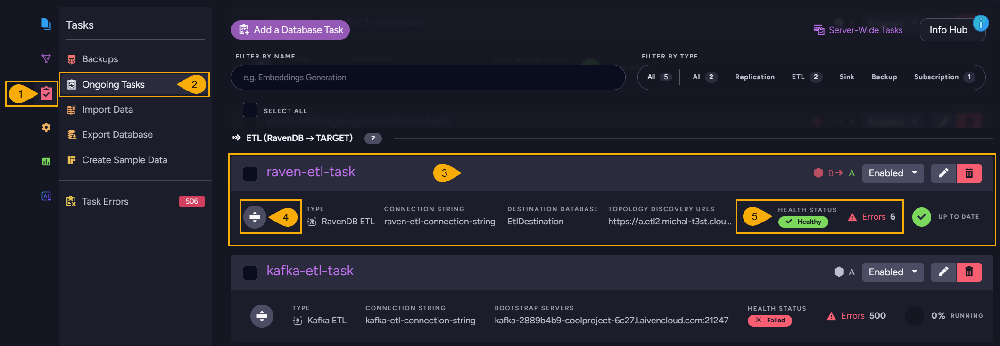
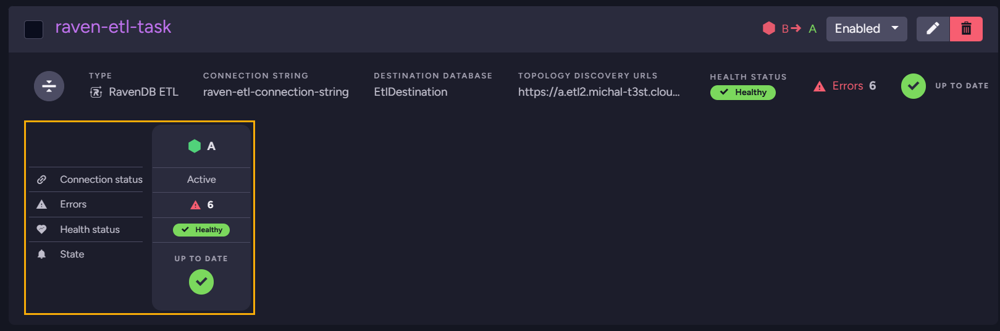

import Admonition from '@theme/Admonition';
import Tabs from '@theme/Tabs';
import TabItem from '@theme/TabItem';
import CodeBlock from '@theme/CodeBlock';
import LanguageSwitcher from "@site/src/components/LanguageSwitcher";
import LanguageContent from "@site/src/components/LanguageContent";
import Panel from "@site/src/components/Panel";
import ContentFrame from "@site/src/components/ContentFrame";

# Task errors: Studio views

<Admonition type="note" title="">

* **`Tasks` > `Task Errors`**  
  Open the `Task Errors` view from the `Tasks` menu to inspect errors raised by ETL and AI tasks.  
  You can browse all errors in a unified list or group them by task, apply various filters, 
  select an error to view it in detail, and see how task health is impacted by recent errors.  

* **`AI Hub` > `AI Task Errors`**  
  The `AI Task Errors` view, opened from the `AI Hub`, is a pre-filtered subset of the `Task Errors` view.  
  Use this view to inspect errors raised by `Embeddings Generation` and `GenAI` tasks.  

* Both views display the same errors for listed tasks; deleting a task's errors from one view is reflected
  in the other.  

* **`Tasks` > `Ongoing Tasks`**  
  Each ETL and AI task bar on the `Ongoing Tasks` view shows the task's health state
  and error count; expanding the bar reveals additional detail.  

* To learn about task errors and how they impact task health, see the
  [Overview](./overview.mdx) page.  

* In this article:
   * [Task Errors view](#task-errors-view)
      * [Opening the view](#opening-the-view)
      * [Task filters](#task-filters)
      * [Task health indicators](#task-health-indicators)
      * [Task errors](#task-errors)
   * [AI Task Errors view](#ai-task-errors-view)
   * [Task health on the Ongoing Tasks view](#task-health-on-the-ongoing-tasks-view)
      * [Collapsed view](#collapsed-view)
      * [Expanded view](#expanded-view)

</Admonition>

<Panel heading="Task Errors view">

In its default layout, `Task Errors` groups errors into per-task segments, each showing the
task's errors in a sortable table.  

<ContentFrame>

### Opening the view

Open the `Task Errors` view from the `Tasks` menu. By default it will open with no filters applied, 
showing a segment for every ETL or AI task that currently has any errors.  

* **A.** Click to open the Tasks menu.  

* **B.** Click to open the Task Errors view.  

* **C.** [Task filters](#task-filters) (see below).

* **D.** [Task health indicators](#task-health-indicators) (see below).

* **E.** Toggle to **group errors by task** or display them in a unified list.

* **F.** [Task errors](#task-errors) (see below).

</ContentFrame>

---

<ContentFrame>

### Task filters

Use the filters bar to narrow the listing to specific tasks and errors. 

* **`Filter by task/script name`**  
  Type a task or script name to narrow the listing to matching tasks.  

* **`Filter by node`**  
  Pick one or more cluster nodes to show only the errors raised on the selected nodes.

* **`Filter by task type`**  
  Pick one or more task types (e.g., Kafka ETL) to show only the errors raised by the selected types.  

* **`Filter by task health`**  
  Pick one or more health states to show only tasks currently in the selected states.  

</ContentFrame>

---

<ContentFrame>

### Task health indicators

The indicators' colors represent task health states: Green for `Healthy`, yellow for 
`Impaired`, and red for `Failed`.  
* Hover an indicator to trigger a popup summary of tasks whose health currently matches 
  the selected state.  
* The summary lists only the node currently running the task and any nodes that recorded
  errors for it, with the error count per node.  

</ContentFrame>

---

<ContentFrame>

### Task errors

The image below shows one of the task segments displayed in the task errors view when errors 
are grouped by task.  

1. **Task name**  
   The name of the ETL or AI task whose errors are displayed here.  

2. **Delete errors**  
   Click to **remove all errors raised by this task**, including both item and process errors.  
   <Admonition type="note" title="">
   Deleting a task's errors does not, on its own, reset the task's health state.  
   Health is driven by the running error rate, not by the rows in the error tables.  
   A task in `Impaired` or `Failed` state will recover only as new batches complete 
   successfully and its error rate falls back below the configured thresholds.  
   See the [Overview](./overview.mdx#health-states) 
   for more.  
   </Admonition>

3. **Task metadata row**
    * A toggle to collapse or expand all errors related to this task.
    * Task type.  
    * Error count for this task.
    * The number of scripts that this task runs.
    * Task's current health state (`Healthy`, `Impaired`, or `Failed`).
    * Tag/s of the cluster node/s currently running the task.

4. **Script sub-segment details**  
   Errors for each script the task runs appear in their own sub-segment, with a header showing 
   the script's name and error count and a toggle to collapse or expand the errors related to this script.  

5. **Errors table**  
   The script's errors, one row per error.  

    * **Column headers**  
      You can filter or sort the table by the content of each column, using the 
      funnel (filter) or arrow (sort) icons at the column header.  

    * **`Show` column**  
      Click the eye icon for a specific error to open an error-details dialog with the full error
      message.  

    * **`Error type` column**  
      Marks the row as `Item Error` (a single document failure the task skipped past) or
      `Process Error` (a batch-scope failure that may affect multiple documents).  

    * **`Error step` column**  
      The processing step the error occurred at: `Configuration`, `Extraction`,
      `Transformation`, `Load`, `Persistence`, `Model Inference`, or `Unknown`.  
      See the [Error steps](./overview.mdx#error-steps) reference on the
      overview.  

    * **`Document` column**  
      For item errors, the ID of the document being processed when the error occurred,
      rendered as a hyperlink to the document.  
      For process errors, the column shows `-` because the error is not bound to a single document.  

    * **`Date` column**  
      The error's creation timestamp, shown in date form and in relation to the current time 
      (e.g., "4 hours ago").  

    * **`Affected Documents` column**  
      For process errors, the number of documents the failing batch attempted to process.  
      Empty for item errors.  

    * **`Error` column**  
      The error message, truncated to one line.  

    * **`Node` column**  
      The tag of the cluster node that recorded the error.  

</ContentFrame>

</Panel>

<Panel heading="AI Task Errors view">

The `AI Task Errors` view lists the same errors listed by the `Task Errors` view, 
with the same layout, controls, and data, but applies a predefined filter to show only 
`Embeddings Generation` and `GenAI` task errors.  

All options documented under
[Task Errors view](#task-errors-view)
above apply here without change.  

1. Click to open the **AI Hub**.  

2. Click to open the AI Task Errors view.  

</Panel>

<Panel heading="Task health on the Ongoing Tasks view">

On the `Ongoing Tasks` view, each ETL or AI task bar displays the task's current health
state and the number of errors recorded for the task. Expanding the bar reveals these
details per node, along with the node's `Connection status`.  

<ContentFrame>

### Collapsed view

1. **Click to open the `Tasks` menu.**

2. **Click to open the `Ongoing Tasks` view.**

3. **Task bar**

4. **Expand details**  
   Click to expand the bar - see the per-node breakdown below.  

5. **Task health and error count**  
   * `Health Status` - the task's current state (`Healthy`, `Impaired`, or `Failed`).  
   * `Errors` - the number of errors currently recorded for the task.  

</ContentFrame>

---

<ContentFrame>

### Expanded view

Each relevant node has its own column showing how the task is doing on that node. Only
the node currently running the task, and any other nodes that recorded errors for it,
are shown.

* `Connection status` - the state of the node's connection to the task's destination.
  The value is `Active` while the connection is up, and `Reconnect` after a failure
  while the task waits to retry.  
  To retry the failing batch immediately, hover `Reconnect` and click the **Retry now**
  button that appears.  

* `Errors` - the number of errors the task has raised on this node.  

* `Health status` - the task's classification on this node (`Healthy`, `Impaired`,
  or `Failed`).  

* `State` - the task's processing state on this node (such as `UP TO DATE` or
  `0% RUNNING`).  

</ContentFrame>

 

See the [Ongoing Tasks - Overview](../../studio/database/tasks/ongoing-tasks/general-info.mdx#the-ongoing-tasks-list)
page for a full walkthrough of the view, including filters, selection, and per-task
actions.  

</Panel>
