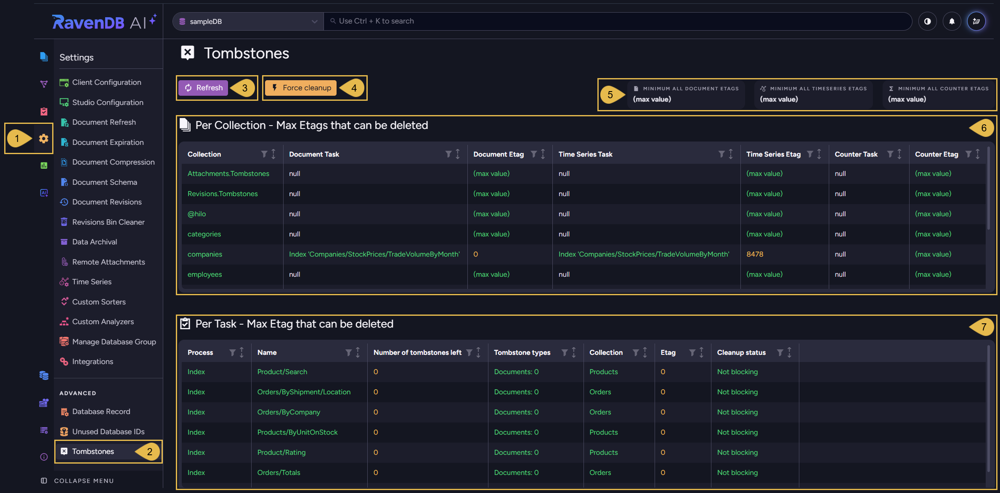
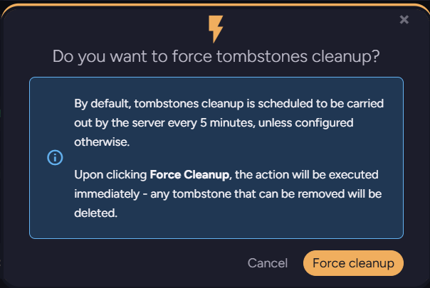
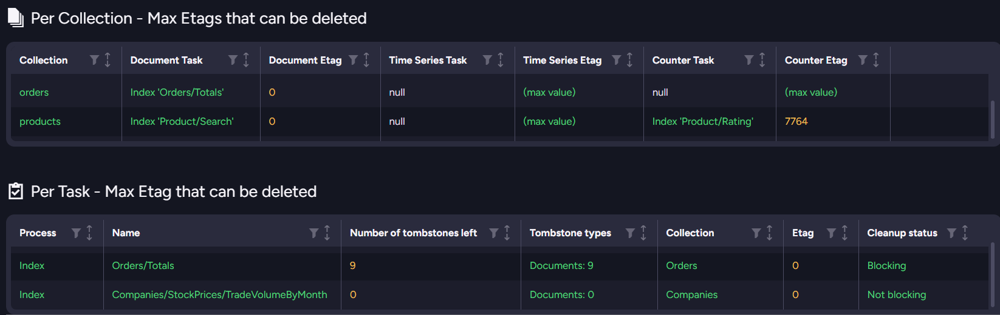

import Admonition from '@theme/Admonition';
import Panel from "@site/src/components/Panel";
import ContentFrame from "@site/src/components/ContentFrame";

# Tombstones: Studio view
<Admonition type="note" title="">

* A [tombstone](./overview.mdx) is the marker RavenDB keeps when a
  document is deleted, so the processes that rely on it (indexing, replication, ETL, and
  incremental backup) can handle the deletion.  

* RavenDB periodically [cleans up](./overview.mdx#tombstone-cleanup) all the tombstones that are no longer needed by any process.

* The **Tombstones** view shows, for each collection, how far its tombstone cleanup has already reached,  
  and for each process, the number of tombstones it still has to process.  

* In this article:
   * [Studio view](#studio-view)
   * [Reading the Tombstones tables](#reading-the-tombstones-tables)
      * [Per Collection table](#per-collection-table)
      * [Per Task table](#per-task-table)
      * [Example: a disabled index blocking cleanup](#example-a-disabled-index-blocking-cleanup)

</Admonition>

<Panel heading="Studio view">

To open the **Tombstones** view, go to `Settings` > `Tombstones`.

1. **Settings**  
   Open the **Settings** menu.  

2. **Tombstones**  
   Under the **Advanced** section, click to open the **Tombstones** view.  

3. **Refresh**  
   Click to reload the tombstone state shown in this view.  

4. **Force cleanup**  
   Click to run a cleanup immediately, instead of waiting for the next scheduled run.  
   A confirmation dialog opens:  

     

   The server runs tombstone cleanup on a schedule, every 5 minutes by default,  
   set by [Tombstones.CleanupIntervalInMin](./configuration.mdx#tombstonescleanupintervalinmin).  
   Clicking **Force cleanup** runs the cleanup immediately, removing every tombstone that can currently be removed.  

5. **Minimum Etags**  
   Three read-only Etag values, for document, time series, and counter tombstones.  
   Each shows how far cleanup has reached across the whole database.  
   `(max value)` means all the matching tombstones can be cleaned up.  
   <Admonition type="note" title="">
   These values come from processes that track tombstones for all collections together, keeping
   a single position for the whole database: replication, incremental backup, and any ETL task or
   index that processes all documents.  
   Processes that track specific collections, such as a collection-scoped index or ETL task, are
   not counted here. Their limits appear in the Per Collection table.
   </Admonition>

   <Admonition type="note" title="">
   An [Etag](../../glossary/etag.mdx) value in this view shows how far cleanup can proceed:  
   `0` - no tombstones can be removed.  
   a number - tombstones up to and including this Etag can be removed.  
   `(max value)` - all tombstones can be removed.
   </Admonition>

6. **Per Collection - Max Etags that can be deleted**  
   For each collection, this table shows how far cleanup can proceed for document, time series, and counter tombstones,
   and the process that is currently setting each limit.  
   See [Per Collection table](#per-collection-table).  

7. **Per Task - Max Etag that can be deleted**  
   Each process that handles tombstones has its own row.  
   The row shows the Etag up to which the process has let cleanup proceed, and whether it is currently blocking cleanup.  
   See [Per Task table](#per-task-table).  

</Panel>

<Panel heading="Reading the Tombstones tables">

<ContentFrame>

### Per Collection table

The columns of the **Per Collection - Max Etags that can be deleted** table:

| Column | Description |
|--------|-------------|
| **Collection** | The collection this row reports on. |
| **Document Task** | The process currently limiting cleanup of this collection's document tombstones, or `null` if no process limits them. |
| **Document Etag** | The Etag up to which this collection's document tombstones can be cleaned up. |
| **Time Series Task** | The process currently limiting cleanup of this collection's time series tombstones, or `null` if no process limits them. |
| **Time Series Etag** | The Etag up to which this collection's time series tombstones can be cleaned up. |
| **Counter Task** | The process currently limiting cleanup of this collection's counter tombstones, or `null` if no process limits them. |
| **Counter Etag** | The Etag up to which this collection's counter tombstones can be cleaned up. |

</ContentFrame>

<ContentFrame>

### Per Task table

The columns of the **Per Task - Max Etag that can be deleted** table:

| Column | Description |
|--------|-------------|
| **Process** | The process type: index, ETL, replication, or periodic backup. |
| **Name** | The name of the specific process, such as the index or task name. |
| **Number of tombstones left** | The number of tombstones this process has not yet processed and is therefore holding back from cleanup. |
| **Tombstone types** | The breakdown of the remaining tombstones by type: documents, time series, and counters. An index processes only documents, so its row shows only the documents count. |
| **Collection** | The collection the remaining tombstones belong to. Blank for a process that tracks the whole database rather than individual collections. |
| **Etag** | The Etag up to which this process has processed its tombstones, so cleanup can remove them up to this Etag. |
| **Cleanup status** | `Blocking` while the process still has tombstones left, `Not blocking` once none are left. |

</ContentFrame>

<ContentFrame>

### Example: a disabled index blocking cleanup

In this example, we disabled the `Orders/Totals` index and then deleted nine documents from the
`Orders` collection.  
The disabled index cannot process the resulting document tombstones, so those tombstones cannot be
cleaned up.

* The **Per Task** table shows the `Orders/Totals` index holding nine document tombstones,
  at Etag `0`, with a Cleanup status of `Blocking`.
* The **Per Collection** table shows the `Orders` collection with `Orders/Totals` as its
  Document Task and a Document Etag of `0`, indicating that none of the collection's document
  tombstones can be cleaned up.  
  The `0` Document Etag is the same Etag the blocking index has reached in the Per Task table.

Once re-enabled, the `Orders/Totals` index will process the waiting tombstones.  
The tombstones will then be cleaned up, and the rows return to `Not blocking`.

</ContentFrame>

</Panel>
