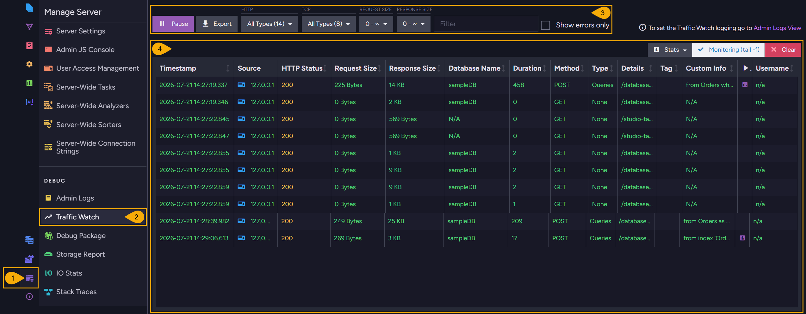
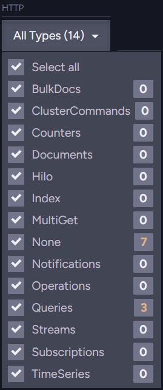
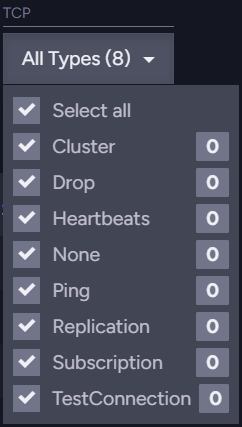
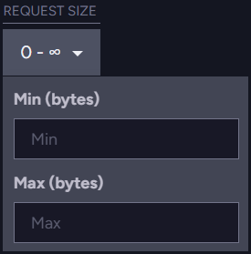
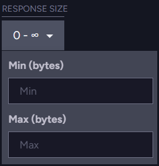
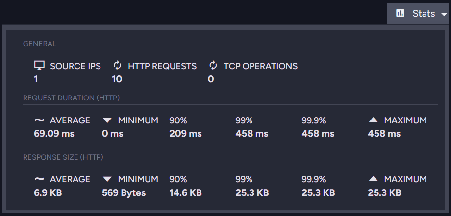

import Admonition from '@theme/Admonition';
import ContentFrame from '@site/src/components/ContentFrame';
import Panel from '@site/src/components/Panel';

# Traffic Watch: Overview

<Admonition type="note" title="">

* Use **Traffic Watch** API calls and endpoints, and the dedicated Studio view, to monitor requests a RavenDB server receives, either as a live stream or by logging the requests to file.  

* Connecting to the live stream, or changing the Traffic Watch configuration, requires [Operator](../../server/security/authorization/security-clearance-and-permissions.mdx) security clearance.  

* In this article:
   * [Traffic Watch](overview.mdx#traffic-watch)
   * [Studio view](overview.mdx#studio-view)
   * [Client API](overview.mdx#client-api)
   * [Performance impact](overview.mdx#performance-impact)

</Admonition>

<Panel heading="Traffic Watch">

Traffic Watch is a server-wide feature that records every HTTP, TCP, and PostgreSQL request the server receives.  
For each request, Traffic Watch captures the HTTP method, URL, database name, response status code, request and response sizes, elapsed time, change type, and the client certificate thumbprint.

You can access this data in two ways:

* **Live stream**: requests received in real time by a client with [Operator](../../server/security/authorization/security-clearance-and-permissions.mdx) access.  
  The stream is active only while a client is connected, and the streamed requests are not written to disk.  
  Watch the live stream in Studio's [Traffic Watch view](overview.mdx#studio-view), or connect to the stream from your own code using the [client API](overview.mdx#client-api).

* **Log-to-file**: a persistent log of requests, written to the server log file.  
  This logging is off by default. Enable it, and choose the requests it records, through the [Traffic Watch configuration keys](configuration.mdx), or adjust the configuration at runtime using the client API.

The live stream and the persistent log can both be active at the same time.

</Panel>

<Panel heading="Studio view">

The Traffic Watch view lists the requests the server receives, updating in real time as new requests arrive.



1. **Manage Server**  
   Open the Manage Server menu.  

2. **Traffic Watch**  
   Select Traffic Watch, under the Debug group, to open the view.  

3. **Capture toolbar**  
   Controls for the live capture, and for filtering the listed requests:
   * **Pause** / **Resume**  
     Pause the live capture to inspect the current entries, and resume to continue capturing.  
   * **Export**  
     Export the captured entries to a file.  
   * **HTTP**  
     Filter the listed HTTP requests by [change type](configuration.mdx#trafficwatchchangetypes).
     The menu lists all change types, each with a live count, and a _Select all_ toggle.  

     
   * **TCP**  
     Filter the listed TCP requests by operation type.  

     
   * **Request Size**  
     Filter by request size. Set a minimum, a maximum, or both, in bytes.  

     
   * **Response Size**  
     Filter by response size, in bytes.  

     
   * **Filter**  
     Filter the entries by free text.  
   * **Show errors only**  
     List only the requests that returned an error status code.  

4. **Results table**  
   The results table lists the captured requests, one row each.  
   The columns, all sortable, show the request's Timestamp, Source, HTTP Status, Request Size, Response Size, Database Name, Duration, Method, Type, Details, Tag, Custom Info, and Username, with a control to expand a row for its full details.
   * **Stats**  
     Show summary statistics for the captured set: the number of source IPs, HTTP requests, and TCP operations, and the request-duration and response-size distributions.  

     
   * **Monitoring (tail -f)**  
     Keep the newest entries in view as they arrive.  
   * **Clear**  
     Discard all captured entries.  

</Panel>

<Panel heading="Client API">

Traffic Watch exposes three server-wide endpoints, each requiring [Operator](../../server/security/authorization/security-clearance-and-permissions.mdx) access:

* `GET /admin/traffic-watch`  
  A WebSocket endpoint that streams the live requests to the connected client.
* `GET /admin/traffic-watch/configuration`  
  Returns the current Traffic Watch logging configuration.
* `POST /admin/traffic-watch/configuration`  
  Updates the Traffic Watch logging configuration.  
  The change takes effect immediately; include `"Persist": true` in the payload to keep it across server restarts.

To read or change this logging configuration from your own code, use the `GetTrafficWatchConfigurationOperation` and `PutTrafficWatchConfigurationOperation` operations.  
The following example enables logging to file for the `Northwind` database, and persists the change across restarts:

```csharp
await store.Maintenance.Server.SendAsync(
    new PutTrafficWatchConfigurationOperation(
        new PutTrafficWatchConfigurationOperation.Parameters
        {
            TrafficWatchMode = TrafficWatchMode.ToLogFile,
            Databases = new List<string> { "Northwind" },
            Persist = true
        }));
```
<br />

For the full list of configuration keys, see the [Traffic Watch configuration keys](configuration.mdx).

</Panel>

<Panel heading="Performance impact">

When neither log-to-file is enabled nor any client is connected to the WebSocket endpoint, no Traffic Watch code executes during request processing and there is no performance overhead.

<ContentFrame>

**When a client is connected to the live stream:**

* **CPU overhead**: Minimal.  
  Per request, Traffic Watch iterates over connected clients, enqueues the event into each client's message queue, and triggers an asynchronous send. This is lightweight and non-blocking for request-handling threads.

* **Memory**: Each connected client maintains an in-memory message queue. Under very high request rates this queue can grow if messages are produced faster than the client can consume them.

</ContentFrame>

<ContentFrame>

**When log-to-file is enabled (`TrafficWatch.Mode = ToLogFile`):**

* **CPU & memory overhead**: Negligible.  
  Traffic Watch logging is processed asynchronously by [NLog](../logs/overview.mdx)'s `AsyncTargetWrapper`.  
  Request-handling threads are never blocked, so request latency and throughput are not affected.

* **I/O overhead**: Minor.
  * Traffic Watch entries are written to the server log file (`server.log` by default), the same file RavenDB uses for all its other logs.
  * These writes are buffered and asynchronous, so they generally do not create I/O bottlenecks.
  * In environments already under heavy storage load, however, disk I/O is the most significant factor to monitor.

* **Disk storage**: Proportional to request volume.
  * Because Traffic Watch entries go to the shared server log file, a high request volume increases the file's size, so the file is archived more frequently.
  * When a log file reaches its size limit, it is archived and a new file is started.
  * The size and retention limits are set by the standard [logging configuration](../logs/configuration.mdx):  
    [`Logs.ArchiveAboveSizeInMb`](../logs/configuration.mdx#logsarchiveabovesizeinmb) (default: 128 MB),  
    [`Logs.MaxArchiveDays`](../logs/configuration.mdx#logsmaxarchivedays) (default: 3 days),  
    [`Logs.MaxArchiveFiles`](../logs/configuration.mdx#logsmaxarchivefiles).  
    Archived files that exceed these limits are deleted automatically.

</ContentFrame>

<Admonition type="tip" title="">
Use the [filter configuration options](configuration.mdx) (databases, HTTP methods, status codes, change types, minimum duration, etc.)
to limit the number of logged entries and reduce storage impact in high-traffic environments.
</Admonition>

</Panel>
