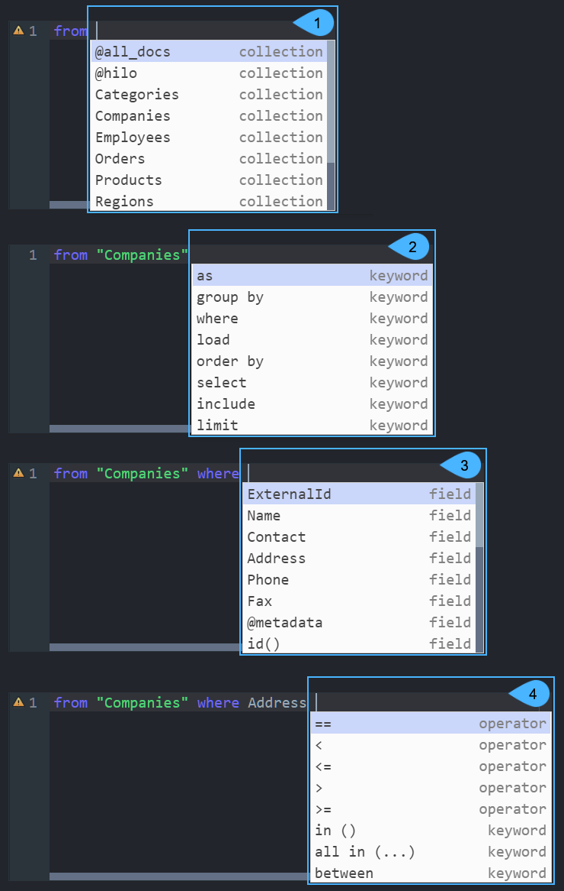
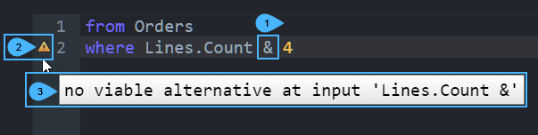

import Admonition from '@theme/Admonition';
import Tabs from '@theme/Tabs';
import TabItem from '@theme/TabItem';
import CodeBlock from '@theme/CodeBlock';
import LanguageSwitcher from "@site/src/components/LanguageSwitcher";
import LanguageContent from "@site/src/components/LanguageContent";
import Panel from "@site/src/components/Panel";
import ContentFrame from "@site/src/components/ContentFrame";

<Admonition type="note" title="">
   
* All queries sent to the RavenDB server use RQL, RavenDB’s rich query language.  
  To learn more about RQL, see [What is RQL](../../querying/rql/what-is-rql.mdx).  

* **RQL Code Assistance** is a RavenDB Studio feature that helps you write RQL queries quickly and correctly  
  by providing context-aware auto-completion and real-time syntax checking.  
  While you type a query in Studio, RQL Code Assistance will:
  * Provide auto-completion (Ctrl+Space) for collections, document fields, indexes, functions, keywords, and operators relevant to your current query context.
  * Update suggestions as you write, showing valid options for the next part of the query.
  * Continuously check syntax and highlight errors with warning icons and detailed messages on hover.    

* **RQL Code Assistance** is available whenever you write a query in the following Studio views:
  * [Query view](../../studio/database/queries/query-view.mdx#query-view)
  * [Patch view](../../studio/database/documents/patch-view.mdx#patch-view)  
  * [Subscription task view](../../studio/database/tasks/ongoing-tasks/subscription-task.mdx#subscription-task-definition)   
    
---

* In this article:  
  * [Auto-completion](../../querying/rql/rql-code-assistance.mdx#auto-completion)  
  * [Syntax verification](../../querying/rql/rql-code-assistance.mdx#syntax-verification)
    
</Admonition>

<Panel heading="Auto-completion">
    
* To invoke auto-completion, press **Ctrl+Space** while writing RQL.  
  The relevant options for the current cursor location will be listed.
    
* Clicking a list item will add it to the query.  
  At the very beginning of a query, the suggested options will be the most basic ones:
  * [from](../../querying/rql/what-is-rql.mdx#from) - to select a collection to query on  
  * [from index](../../querying/rql/what-is-rql.mdx#query-an-index--from-index-index-name) - to select an index to query on  
  * [declare function](../../querying/rql/what-is-rql.mdx#declare) - to create a JavaScript function  

1. **List of available options**  
2. **An available option**  
3. **Option type**, which can be -  
    * A Collection  
    * A Document Field  
    * A Function  
    * A Keyword  
    * An Operator  
    
---
    
**As the query evolves**, new options that are relevant to the current code are suggested.  

<Admonition type="info" title="">
    
**For the collection query shown above, auto-completion presents**:    

1. The list of **collections** that can be queried   
2. The list of **keywords** that can be used with the selected collection  
3. The list of **document fields** that can be queried  
4. The list of **operators** and **keywords** that can be used  

</Admonition>

</Panel>

<Panel heading="Syntax verification">

* As you write your query, its syntax is continuously verified and errors are detected.  
* When an error is detected, a warning sign is displayed on the left side of the editor.  
* Hovering over the warning sign shows the error details.  

1. **Syntax error** (this symbol cannot be used here)  
2. **Warning Sign**  
3. **Error details**  
   Hover over the warning sign to see the error details.

</Panel> 