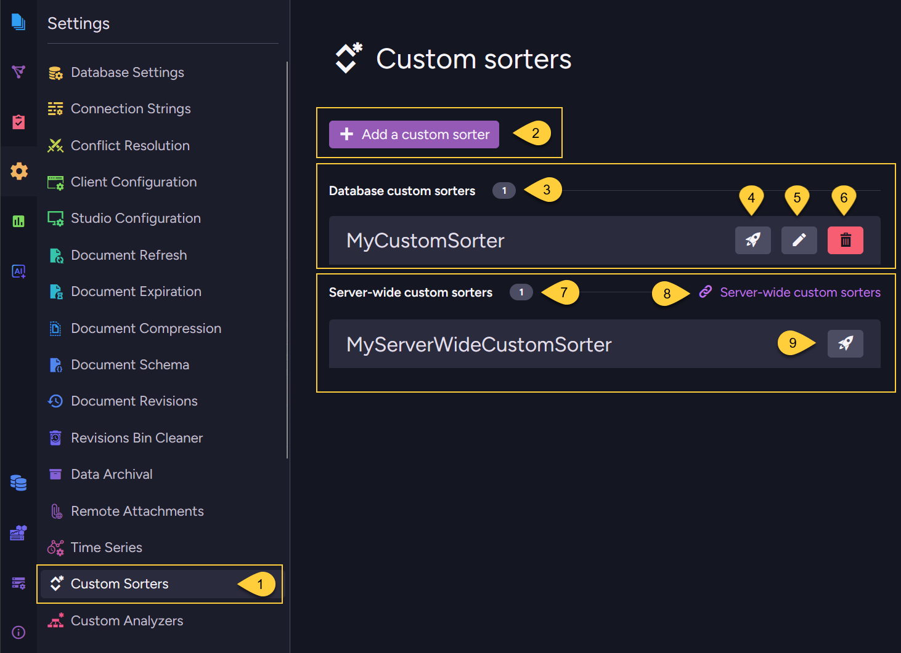
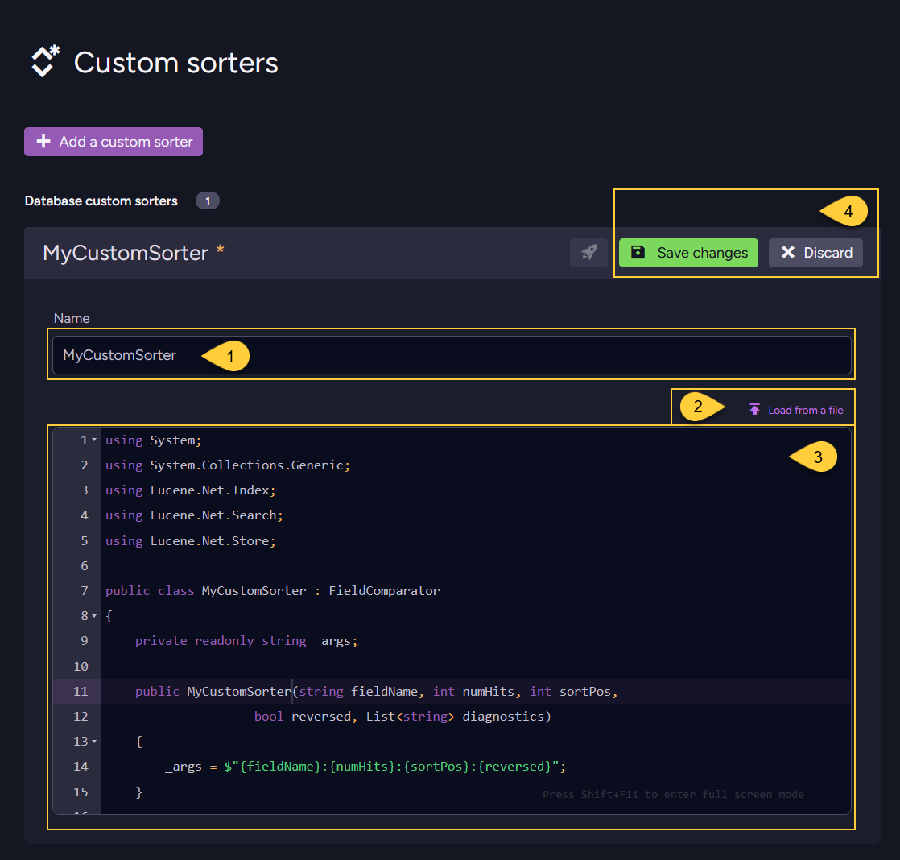
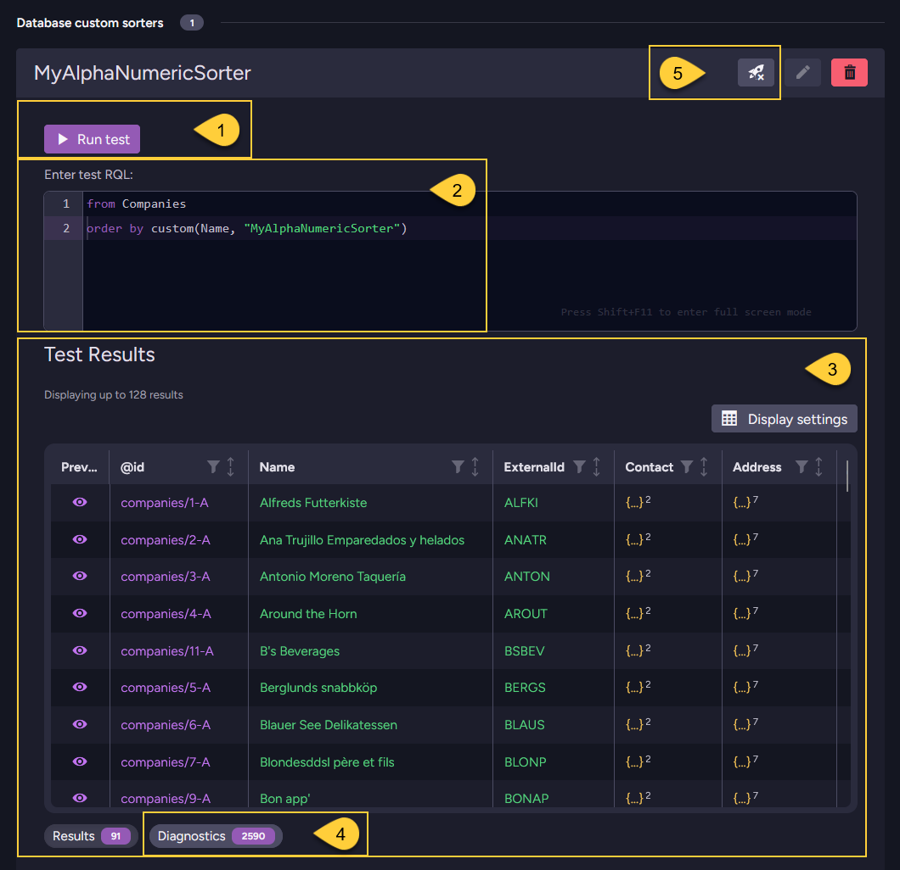
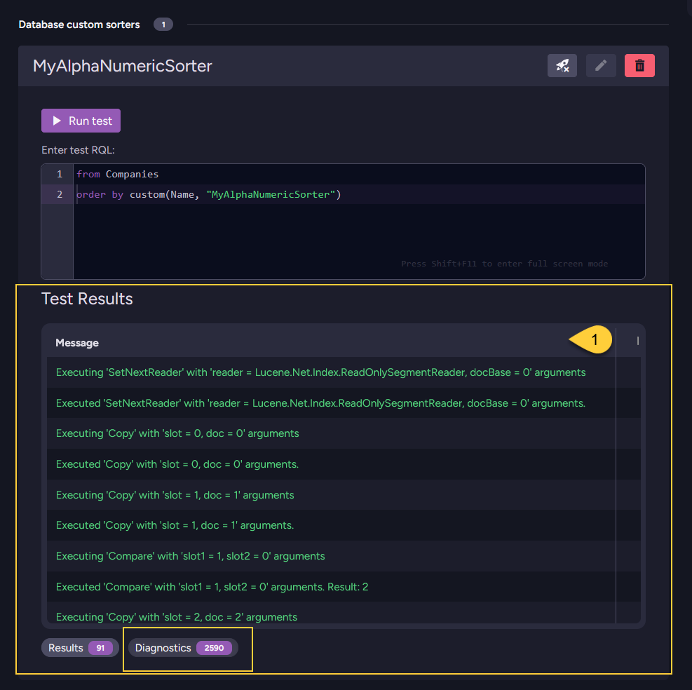

import Admonition from '@theme/Admonition';
import Tabs from '@theme/Tabs';
import TabItem from '@theme/TabItem';
import CodeBlock from '@theme/CodeBlock';
import ContentFrame from '@site/src/components/ContentFrame';
import Panel from '@site/src/components/Panel';

<Admonition type="note" title="">
    
* A custom sorter added at the database level can be used only in queries made on that database.   
  Once deployed, it can be used to sort query results in that database.   

* Server-wide custom sorters are available for use in queries across all databases.  
  To learn how to define and deploy a server-wide custom sorter, see [Server-wide custom sorters](../../../../querying/sorting-query-results/custom-sorters/server-wide-custom-sorters.mdx).  
    
* If a database-level custom sorter and a server-wide custom sorter have the **same name**,  
  the database-level custom sorter will be used for the query.
    
* Custom sorters are available only when using the **Lucene** indexing engine; they are not available with [Corax](../../../../indexes/search-engine/corax.mdx).  
  To learn how to write a custom sorter, see: [How to write a custom sorter](../../../../querying/sorting-query-results/custom-sorters/overview.mdx#how-to-write-a-custom-sorter).      
    
* In this article:
  * [Add database-level custom sorter - via the Client API](../../../../querying/sorting-query-results/custom-sorters/database-level-custom-sorters.mdx#add-database-level-custom-sorter-via-the-client-api)
  * [Add database-level custom sorter - via Studio](../../../../querying/sorting-query-results/custom-sorters/database-level-custom-sorters.mdx#add-database-level-custom-sorter-via-studio)
  * [Delete database-level custom sorter](../../../../querying/sorting-query-results/custom-sorters/database-level-custom-sorters.mdx#delete-database-level-custom-sorter)
  * [Test custom sorter](../../../../querying/sorting-query-results/custom-sorters/database-level-custom-sorters.mdx#test-custom-sorter)
  * [Syntax](../../../../querying/sorting-query-results/custom-sorters/database-level-custom-sorters.mdx#syntax)

</Admonition>

<Panel heading="Add database-level custom sorter - via the Client API">
    
Use `PutSortersOperation` to deploy one or more custom sorters to a specific database.    
Deploying a custom sorter with an existing name replaces the previous version.    

<TabItem>
```js
// Assign the code of your custom sorter as a 'string'
const mySorterCode = "<code of custom sorter>";

// Create the 'SorterDefinition' object
const customSorterDefinition = {
    // The sorter name must be the same as the sorter's class name in your code
    name: "MyCustomSorter",
    
    // The code must be compilable and include all necessary using statements
    code: mySorterCode
};

// Define the put sorters operation, pass the sorter definition
// Note: multiple sorters can be passed, see syntax below
const putSortersOp = new PutSortersOperation(customSorterDefinition);    
 
// Execute the operation by passing it to maintenance.send
await store.maintenance.send(putSortersOp);
```
</TabItem>

You can now order query results using the custom sorter.

<Tabs groupId='languageSyntax'>
<TabItem value="Query" label="Query">
```js
const products = await session
    .query({ collection: "Products" })
    .whereGreaterThan("UnitsInStock", 10)
     // Order by field 'UnitsInStock', pass the name of your custom sorter class
    .orderBy("UnitsInStock", { sorterName: "MyCustomSorter" })
    .all();

// Results will be sorted by the 'UnitsInStock' value
// according to the logic from 'MyCustomSorter' class
```
</TabItem>
<TabItem value="RQL" label="RQL">
```sql
from "Products"
where UnitsInStock > 10
order by custom(UnitsInStock, "MyCustomSorter")
    
// Results will be sorted by the 'UnitsInStock' value
// according to the logic from 'MyCustomSorter' class    
```
</TabItem>
</Tabs>    
    
</Panel>

<Panel heading="Add database-level custom sorter - via Studio">
    
### The custom sorters view:
    
The custom sorters view lists all custom sorters that were uploaded from Studio and from the
[Client API](../../../../querying/sorting-query-results/custom-sorters/database-level-custom-sorters.mdx#add-database-level-custom-sorter-via-the-client-api).



1. Go to **Settings &gt; Custom Sorters**.
2. Click to add a new database-level custom sorter.
   See [Add a custom sorter](../../../../querying/sorting-query-results/custom-sorters/database-level-custom-sorters.mdx#add-a-custom-sorter) below.
3. The custom sorters deployed for this **database** are listed here.
4. Click to test this custom sorter.
   Learn more in [Test custom sorter](../../../../querying/sorting-query-results/custom-sorters/database-level-custom-sorters.mdx#test-custom-sorter) below.
5. Click to edit this custom sorter.
6. Click to delete this custom sorter.
7. The **server-wide** custom sorters are listed here.
8. Follow this link to manage the server-wide custom sorters.    
9. Click to test the server-wide custom sorter on this database.

---
    
### Add a custom sorter



1. The **sorter name** must be the same as the class name of your sorter. 
2. You can load the sorter's code from a `*.cs` file.
3. Or, you can enter the code manually in this editor.    
   The **sorter code** must be compilable and include all necessary `using` statements.  
   The sorter's class should inherit from [Lucene.Net.Search.FieldComparator](https://lucenenet.apache.org/docs/3.0.3/df/d91/class_lucene_1_1_net_1_1_search_1_1_field_comparator.html).  
   Learn more in [How to write a custom sorter](../../../../querying/sorting-query-results/custom-sorters/overview.mdx#how-to-write-a-custom-sorter).   
4. Save your sorter or discard.
    
</Panel>

<Panel heading="Delete database-level custom sorter">
    
In addition to deleting a custom sorter via [The custom sorters view](../../../../querying/sorting-query-results/custom-sorters/database-level-custom-sorters.mdx#the-custom-sorters-view) in the Studio,  
you can ues `DeleteSorterOperation` to delete a database-level custom sorter.  
Once removed, the sorter will no longer be available for ordering query results in the associated database.    

<TabItem>
```js
// Define the delete sorter operation, pass the name of the sorter to delete
const deleteSorterOp = new DeleteSorterOperation("MyCustomSorter");    

// Execute the operation by passing it to maintenance.send
await store.maintenance.send(deleteSorterOp);
```
</TabItem>
    
</Panel>

<Panel heading="Test custom sorter">

You can test a custom sorter from Studio before using it in a query, to verify that it works as expected.  
Click the test button from the [Custom sorters view](../../../../querying/sorting-query-results/custom-sorters/database-level-custom-sorters.mdx#the-custom-sorters-view) to open the test panel:



1. **Run test**  
   Click to execute the test RQL entered in #2.

2. **Test RQL**  
   Enter an RQL query that uses your custom sorter via the `custom()` method.  
   For example: `from Products order by custom(UnitsInStock, "MyAlphaNumericSorter")`

3. **Results tab**  
   Displays the documents returned by the test query, ordered according to your custom sorter logic.

4. **Diagnostics tab**  
   Displays diagnostic messages collected while the custom sorter is executed.
   Studio runs the test query with diagnostics enabled, so you can verify that the sorter was invoked and inspect its execution flow.  
   Studio records comparator execution details during the test, such as calls to `Compare`, `SetBottom`, and `Copy`.  
   You can also add your own messages to this list - see [Adding your own diagnostic messages](../../../../querying/sorting-query-results/custom-sorters/database-level-custom-sorters.mdx#adding-your-own-diagnostic-messages).

5. Click to close the test panel.

---

<Admonition type="note" title="">

### Adding your own diagnostic messages

The custom sorter's constructor receives a `List<string> diagnostics` parameter.  
In normal queries, outside the Studio test panel, this parameter is `null`.

To add your own messages, store the list in the sorter and append to it from your comparator methods:

<TabItem>
```csharp
private readonly List<string> _diagnostics;
private readonly AlphaNumericFieldComparator _inner;

public MySorterWithDiagnostics(string fieldName, int numHits, int sortPos, bool reversed, List<string> diagnostics)
{
    _diagnostics = diagnostics;
    _inner = new AlphaNumericFieldComparator(fieldName, numHits);
}
```
</TabItem>

You can then append messages while the sorter runs, for example, inside `Compare`.
Use the null-conditional operator (`?.`) when appending so your sorter behaves correctly in normal queries, where `diagnostics` is `null`.    

<TabItem>
```csharp
public override int Compare(int slot1, int slot2)
{
    // Add your own diagnostic message
    _diagnostics?.Add($"Compare was called for slots {slot1} and {slot2}");
    return _inner.Compare(slot1, slot2);
}
```
</TabItem>

    
    
1. The messages added to the diagnostics list appear in the **Diagnostics tab** alongside the messages Studio records during the test.  

</Admonition>

</Panel>

<Panel heading="Syntax">
    
### `PutSortersOperation`
Deploys one or more custom sorters to the database scope.

<TabItem>
```js
const putSortersOp = new PutSortersOperation(sortersToAdd);    
```
</TabItem>

| Parameter        | Type           | Description                                                  |
|------------------|----------------|------------------------------------------------------------- |
| **sortersToAdd** | `...object[]`  | One or more Sorter Definition objects to send to the server. |

<TabItem>    
```js
// The sorter definition object 
{
  // The sorter's name. Must match the class name in the source code.   
  name: string; 
    
  // The complete C# source code of the sorter, including all `using` statements. 
  // Must be compilable.     
  code: string;
}
```
</TabItem>    

---
    
### `DeleteSorterOperation`
Removes a custom sorter from the database scope.

<TabItem>
```js
const deleteSorterOp = new DeleteSorterOperation(sorterName);
```
</TabItem>

| Parameter      | Type     | Description                       |
|----------------|----------|-----------------------------------|
| **sorterName** | `string` | The name of the sorter to remove. |
    
</Panel>