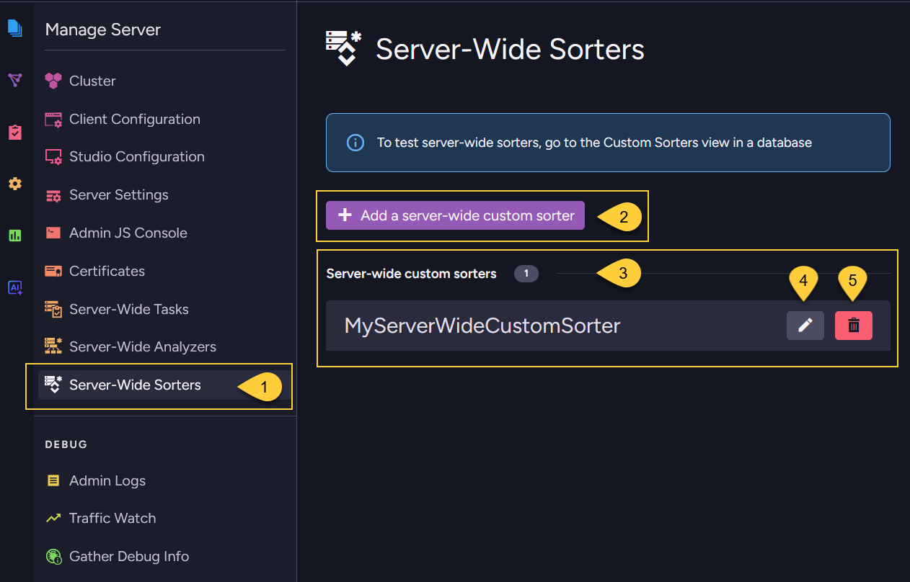
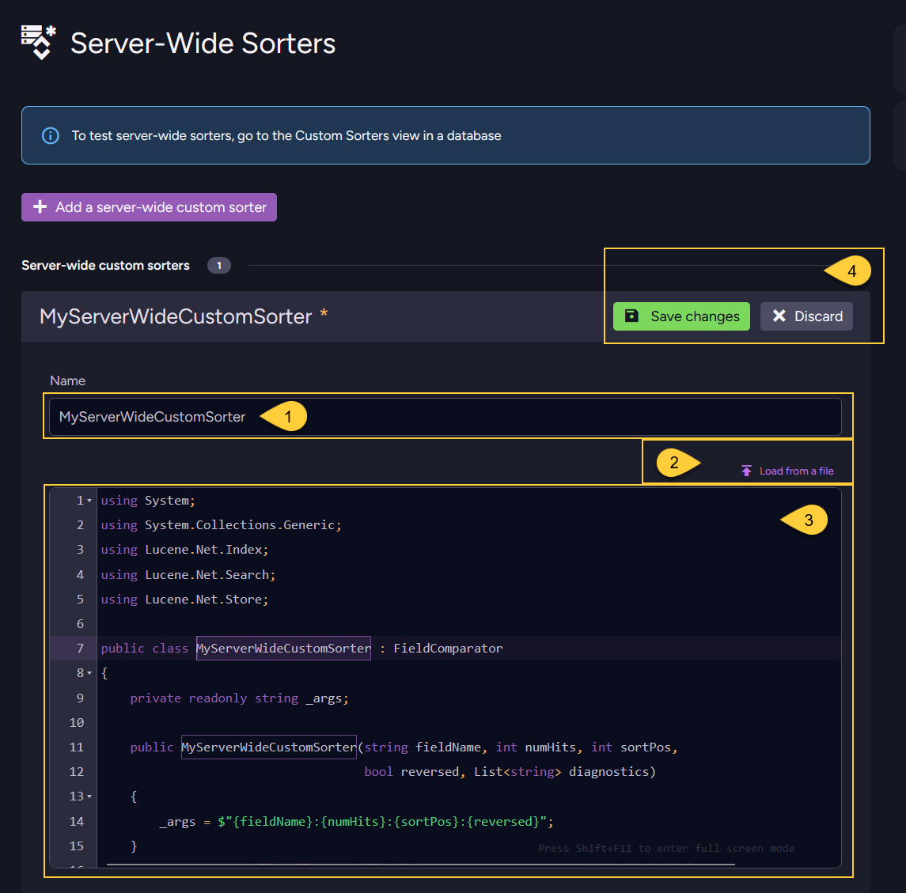

import Admonition from '@theme/Admonition';
import Tabs from '@theme/Tabs';
import TabItem from '@theme/TabItem';
import CodeBlock from '@theme/CodeBlock';
import ContentFrame from '@site/src/components/ContentFrame';
import Panel from '@site/src/components/Panel';

<Admonition type="note" title="">        
    
* A server-wide custom sorter can be used to sort query results in all databases across your cluster.  
  To learn how to define and deploy a database-level custom sorter, see [Database-level custom sorters](../../../../querying/sorting-query-results/custom-sorters/database-level-custom-sorters.mdx).    
    
* If a database-level custom sorter and a server-wide custom sorter have the **same name**,  
  the database-level custom sorter will be used for the query.
    
* Custom sorters are available only when using the **Lucene** indexing engine; they are not available with [Corax](../../../../indexes/search-engine/corax.mdx).  
  To learn how to write a custom sorter, see: [How to write a custom sorter](../../../../querying/sorting-query-results/custom-sorters/overview.mdx#how-to-write-a-custom-sorter). 
    
* In this article:
  * [Add server-wide custom sorter - via the Client API](../../../../querying/sorting-query-results/custom-sorters/server-wide-custom-sorters.mdx#add-server-wide-custom-sorter-via-the-client-api)
  * [Add server-wide custom sorter - via Studio](../../../../querying/sorting-query-results/custom-sorters/server-wide-custom-sorters.mdx#add-server-wide-custom-sorter-via-studio)
  * [Delete server-wide custom sorter](../../../../querying/sorting-query-results/custom-sorters/server-wide-custom-sorters.mdx#delete-server-wide-custom-sorter)
  * [Test custom sorter](../../../../querying/sorting-query-results/custom-sorters/server-wide-custom-sorters.mdx#test-custom-sorter)
  * [Syntax](../../../../querying/sorting-query-results/custom-sorters/server-wide-custom-sorters.mdx#syntax)

</Admonition>

<Panel heading="Add server-wide custom sorter - via the Client API">    

Use `PutServerWideSortersOperation` to deploy one or more server-wide custom sorters.  
Deploying a custom sorter with an existing name replaces the previous version.  
Once deployed, you can use it to sort query results in queries made on **any database** in your cluster.    

<TabItem>
```js
// Assign the code of your custom sorter as a `string`
const mySorterCode = "<code of custom sorter>";

// Create the `SorterDefinition` object
const customSorterDefinition = {
    // The sorter name must be the same as the sorter's class name in your code
    name: "MyServerWideCustomSorter",
    
    // The code must be compilable and include all necessary using statements
    code: mySorterCode
};

// Define the put sorters operation, pass the sorter definition
// Note: multiple sorters can be passed, see syntax below
const putSortersServerWideOp = new PutServerWideSortersOperation(customSorterDefinition);
 
// Execute the operation by passing it to maintenance.server.send
await store.maintenance.server.send(putSortersServerWideOp);
```
</TabItem>
    
You can now order query results using the server-wide custom sorter on any database.    
    
<Tabs groupId='languageSyntax'>
<TabItem value="Query" label="Query">
```js
const products = await session
    .query({ collection: "Products" })
    .whereGreaterThan("UnitsInStock", 10)
     // Order by field 'UnitsInStock', pass the name of your custom sorter class
    .orderBy("UnitsInStock", { sorterName: "MyServerWideCustomSorter" })
    .all();

// Results will be sorted by the 'UnitsInStock' value
// according to the logic from 'MyServerWideCustomSorter' class
```
</TabItem>
<TabItem value="RQL" label="RQL">
```sql
from "Products"
where UnitsInStock > 10
order by custom(UnitsInStock, "MyServerWideCustomSorter")
    
// Results will be sorted by the 'UnitsInStock' value
// according to the logic from 'MyServerWideCustomSorter' class    
```
</TabItem>
</Tabs>   
    
</Panel>

<Panel heading="Add server-wide custom sorter - via Studio">

### The server-wide custom sorters view
    


1. Go to **Manage Server &gt; Server-Wide Sorters**.
2. Click to add a new server-wide custom sorter.
   See [Add a server-wide custom sorter](../../../../querying/sorting-query-results/custom-sorters/server-wide-custom-sorters.mdx#add-a-server-wide-custom-sorter) below.
3. The **server-wide** custom sorters are listed here.
4. Click to edit this server-wide custom sorter.
5. Click to delete this server-wide custom sorter.
    
---
    
### Add a server-wide custom sorter    
    
    
    
1. The **sorter name** must be the same as the class name of your sorter. 
2. You can load the sorter's code from a `*.cs` file.
3. Or, you can enter the code manually in this editor.    
   The sorter code must be compilable and include all necessary `using` statements.  
   The sorter's class should inherit from [Lucene.Net.Search.FieldComparator](https://lucenenet.apache.org/docs/3.0.3/df/d91/class_lucene_1_1_net_1_1_search_1_1_field_comparator.html).  
   Learn more in [How to write a custom sorter](../../../../querying/sorting-query-results/custom-sorters/overview.mdx#how-to-write-a-custom-sorter).   
4. Save your server-wide sorter or discard.    
    
</Panel>

<Panel heading="Delete server-wide custom sorter">
    
In addition to deleting a server-wide custom sorter via [The server-wide custom sorters view](../../../../querying/sorting-query-results/custom-sorters/server-wide-custom-sorters.mdx#the-server-wide-custom-sorters-view) in Studio,  
you can use `DeleteServerWideSorterOperation` to delete a server-wide custom sorter.  
Once removed, the sorter will no longer be available for ordering query results in any database in the cluster. 
    
<TabItem>
```csharp
// Define the delete sorter operation, pass the name of the sorter to delete
const deleteSorterOp = new DeleteServerWideSorterOperation("MyServerWideCustomSorter");;

// Execute the operation by passing it to maintenance.server.send
await store.maintenance.server.send(deleteSorterOp);
```
</TabItem>
    
</Panel>

<Panel heading="Test custom sorter">
    
To test a server-wide sorter, go to the Custom Sorters view in a specific database and use the test option from there.  
See [Test custom sorter](../../../../querying/sorting-query-results/custom-sorters/database-level-custom-sorters.mdx#test-custom-sorter).    
    
</Panel>

<Panel heading="Syntax">
    
### `PutServerWideSortersOperation`
Deploys one or more custom sorters to the server-wide scope.

<TabItem>
```js
const putSortersOp = new PutServerWideSortersOperation(sortersToAdd);        
```
</TabItem>

| Parameter        | Type           | Description                                                         |
|------------------|----------------|---------------------------------------------------------------------|
| **sortersToAdd** | `...object[]`  | One or more sorter definitions to deploy. At least one is required. |

<TabItem>    
```js
// The sorter definition object 
{
  // The sorter's name. Must match the class name in the source code.   
  name: string; 
    
  // The complete C# source code of the sorter, including all `using` statements. 
  // Must be compilable.     
  code: string;
}
```
</TabItem>      

---
    
### `DeleteServerWideSorterOperation`
Removes a custom sorter from the server-wide scope.

<TabItem>
```js
const deleteSorterOp = new DeleteServerWideSorterOperation(sorterName);    
```
</TabItem>

| Parameter      | Type     | Description                       |
|----------------|----------|-----------------------------------|
| **sorterName** | `string` | The name of the sorter to remove. |
    
</Panel>