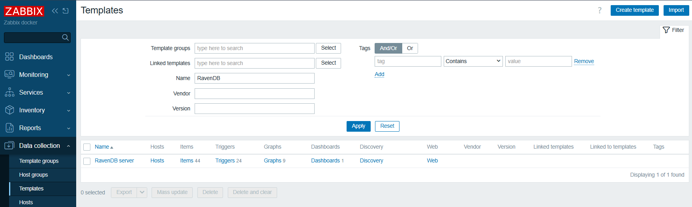
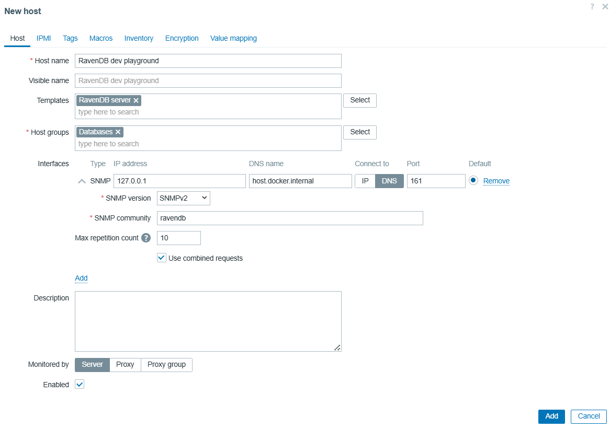
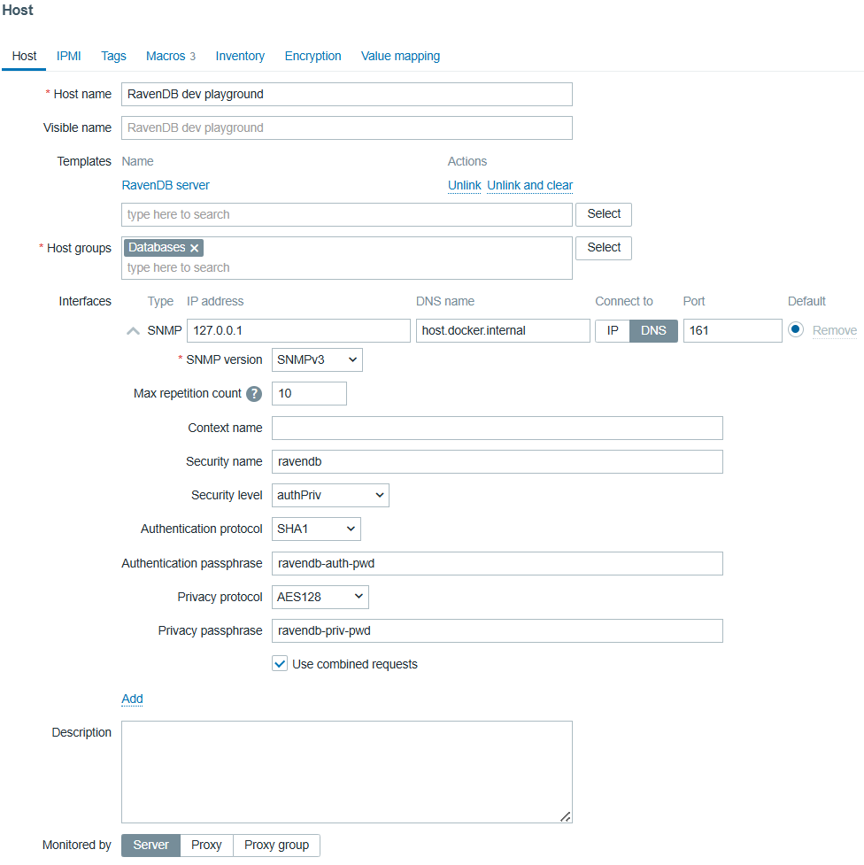
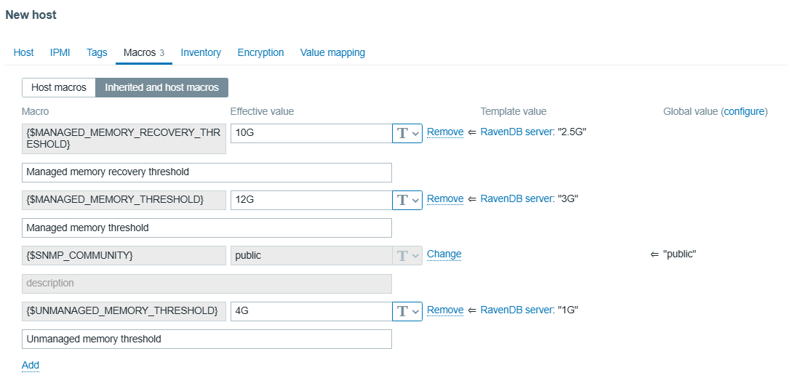
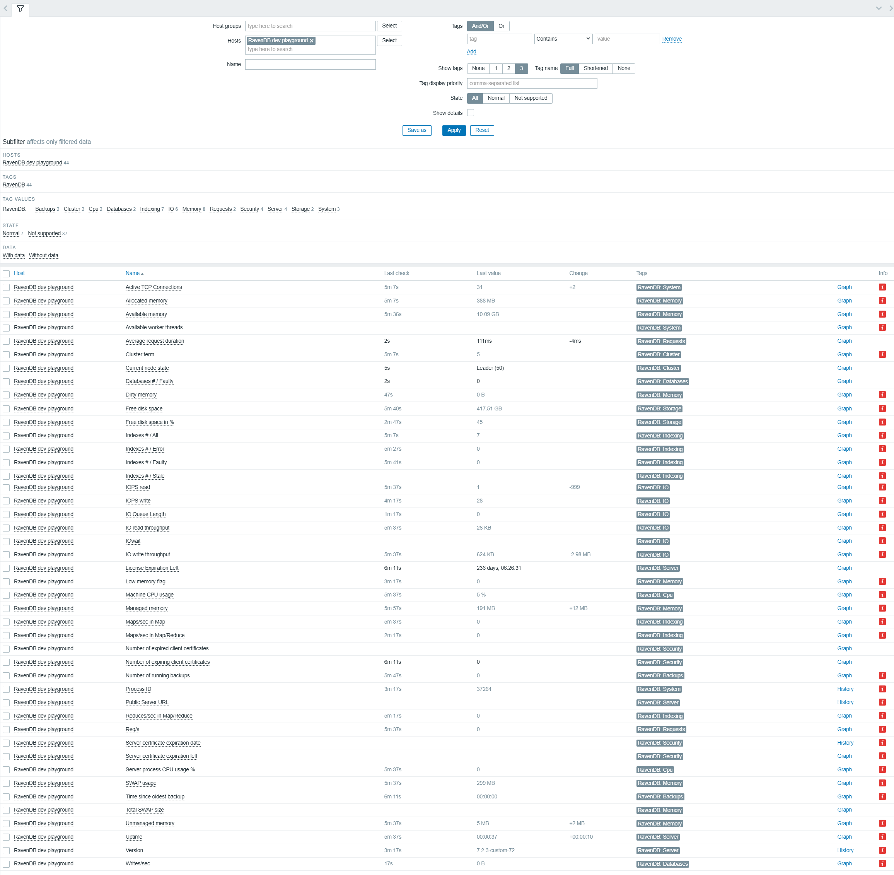
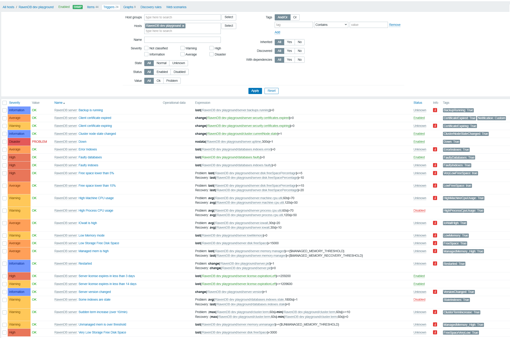

import Admonition from '@theme/Admonition';
import Tabs from '@theme/Tabs';
import TabItem from '@theme/TabItem';
import CodeBlock from '@theme/CodeBlock';
import Panel from "@site/src/components/Panel";
import ContentFrame from "@site/src/components/ContentFrame";

# Zabbix monitoring

<Admonition type="note" title="">

* **Zabbix** is an open-source monitoring system. It periodically reads metrics from the servers and 
  applications you point it at, stores their values over time, plots graphs, and raises alerts each time 
  a value crosses a threshold you have set.

* The **Zabbix community template for RavenDB** is a YAML file that you import into your Zabbix server once.  
  The template lists SNMP queries Zabbix should use to read RavenDB's metrics, alert rules that go with 
  those metrics, graphs the Zabbix frontend should draw, a ready-made dashboard, and configurable memory thresholds.  
  Without the template, you would have to define each query and each alert rule in Zabbix by hand.

* The template is community-maintained, not part of the RavenDB product. For a list of available templates or to contribute 
  a template of your own, see the [community-templates repository](https://github.com/zabbix/community-templates).

* Zabbix reads RavenDB's metrics over SNMP, so SNMP must be enabled on RavenDB before Zabbix can reach it.  
  See [SNMP Support](./snmp-overview.mdx) for the RavenDB-side configuration.

* This page covers: importing the template into Zabbix, acquainting Zabbix with your RavenDB server, 
  checking that metrics are arriving from the server, and reviewing the alerts the template defines.

* For a step-by-step walkthrough that also covers setting up Zabbix in Docker and pointing it at a RavenDB Cloud instance, 
  see [Set up Zabbix monitoring for RavenDB Cloud](../../../../guides/zabbix-setup-guide).

* In this article:
  * [Prerequisites](./setup-zabbix.mdx#prerequisites)
  * [Importing the template](./setup-zabbix.mdx#importing-the-template)
  * [Creating a host](./setup-zabbix.mdx#creating-a-host)
     * [Configuring the SNMP interface](./setup-zabbix.mdx#configuring-the-snmp-interface)
     * [Overriding the memory threshold macros](./setup-zabbix.mdx#overriding-the-memory-threshold-macros)
  * [Confirming Zabbix is collecting values](./setup-zabbix.mdx#confirming-zabbix-is-collecting-values)
  * [Triggers](./setup-zabbix.mdx#triggers)
     * [Triggers included with the template](./setup-zabbix.mdx#triggers-included-with-the-template)
     * [Adding a custom trigger](./setup-zabbix.mdx#adding-a-custom-trigger)
  * [Setting up notifications](./setup-zabbix.mdx#setting-up-notifications)

</Admonition>

<Panel heading="Prerequisites">

Before Zabbix can monitor RavenDB, three things have to be in place:

* **A running Zabbix instance (version 6.0 or later), with administrative access to the Zabbix web frontend.**  
  If you haven't set an instance yet, the [Set up Zabbix monitoring for RavenDB Cloud](../../../../guides/zabbix-setup-guide) 
  guide can walk you through setting it up in Docker.

* **RavenDB with SNMP enabled.**  
  SNMP requires a RavenDB [Enterprise license](../../../licensing/overview.mdx#enterprise-license).  
  To turn SNMP on, set `Monitoring.Snmp.Enabled` to `true` in `settings.json` and restart the server.  
  See [SNMP Support](./snmp-overview.mdx) for the SNMPv2c / SNMPv3 credentials and other configuration.

* **Network access between Zabbix and RavenDB.**  
  Zabbix sends its SNMP queries to RavenDB over UDP on port 161 (the default SNMP port).  
  The network path between them must allow UDP traffic; a firewall configured for TCP only will block the queries.

<Admonition type="note" title="">

The menu names in this page follow Zabbix 6.4 and later.  
On Zabbix 6.0 LTS, `Data collection` is named `Configuration`, and `Alerts` and `Users` are found under `Administration`.

</Admonition>

</Panel>

<Panel heading="Importing the template">

To monitor RavenDB without defining every query and alert by hand, import a **template**: a monitoring configuration you attach to any host.  
Import the file into Zabbix once.  
From then on, every host you link to the template inherits its queries, alert rules, and graphs.

The RavenDB template is published in the Zabbix community-templates repository. To install it:

1. Download `template_ravendb_server.yaml` from 
   [Databases/RavenDB/template_ravendb_server/6.0/](https://github.com/zabbix/community-templates/tree/main/Databases/RavenDB/template_ravendb_server/6.0)  
   (`6.0` here is the Zabbix version, not RavenDB. The template requires Zabbix 6.0 or later).  
2. In Zabbix, open `Data collection` > `Templates` and select `Import`.
3. Choose the downloaded YAML file and select `Import`.

After the import, the template appears in the Templates list as `RavenDB server`:



The template's full inventory is documented in the 
[community template README](https://github.com/zabbix/community-templates/blob/main/Databases/RavenDB/template_ravendb_server/6.0/README.md). 
The Templates list above shows how many items, triggers, graphs, and dashboards come with the version you imported.

</Panel>

<Panel heading="Creating a host">

To start monitoring a RavenDB server, tell Zabbix about it by creating a **host**.  
A host is any target Zabbix watches: a server, a network device, an application.  
Create one host per RavenDB server, link the RavenDB template to that host, and configure the host's SNMP interface so Zabbix can reach the server.

<ContentFrame>

## Configuring the SNMP interface

In Zabbix, open `Data collection` > `Hosts` and select `Create host`.  
Fill in the form:

* **Host name**  
  Any name you choose. Zabbix uses it internally and in alert texts.  
  Example: `RavenDB dev playground`.
* **Templates**  
  Add the `RavenDB server` template you imported earlier.
* **Host groups**  
  Pick or create a group to organize hosts in Zabbix's UI.  
  Example: `Databases`.
* **Interfaces**  
  Select `Add` > `SNMP`. The interface is the network endpoint Zabbix will send queries to.  
  Set `Connect to` to `DNS` and enter the RavenDB server's hostname in `DNS name`.  
  Use `IP` only when the address is fixed.  
  Leave the port at the SNMP default of `161`.

The interface supports either SNMPv2c or SNMPv3:

* **SNMPv2c** sends a community string (a shared secret) in cleartext. Simpler option, for a trusted local network.
* **SNMPv3** adds user authentication and traffic encryption. The right choice when SNMP traffic crosses an untrusted network.

Pick the SNMP version that matches what RavenDB accepts; see [SNMP Support](./snmp-overview.mdx#snmp-configuration-options) 
for the RavenDB-side settings.

#### Example: SNMPv2c interface

Set the SNMP version to `SNMPv2` and the community string to whatever RavenDB expects (the RavenDB default is `ravendb`):



#### Example: SNMPv3 interface

Set the SNMP version to `SNMPv3` and fill in the `Security name`, `Security level`, the authentication settings 
(protocol and passphrase), and the privacy settings (protocol and passphrase). Each field must match what RavenDB accepts:



</ContentFrame>

---

<ContentFrame>

## Overriding the memory threshold macros

**Macros** are template variables you can override on each host. The RavenDB template defines three memory-threshold 
macros, and the template's trigger expressions reference them. Each host can therefore have its own memory thresholds.

The three macros are:

| Macro | Purpose | Template default |
|---|---|---|
| `{$MANAGED_MEMORY_RECOVERY_THRESHOLD}` | Zabbix clears the `Managed memory is high` alert when managed memory drops below this value. | `2.5G` |
| `{$MANAGED_MEMORY_THRESHOLD}` | Zabbix fires the `Managed memory is high` alert when managed memory exceeds this value. | `3G` |
| `{$UNMANAGED_MEMORY_THRESHOLD}` | Zabbix fires the unmanaged-memory alert when unmanaged memory exceeds this value. | `1G` |

The default values are conservative. For a production host, the community-template authors recommend setting:

* `{$MANAGED_MEMORY_RECOVERY_THRESHOLD}`: 65% of total machine RAM.
* `{$MANAGED_MEMORY_THRESHOLD}`: 75% of total machine RAM.
* `{$UNMANAGED_MEMORY_THRESHOLD}`: 25% of total machine RAM.

To override on a host, open the host's `Macros` tab, switch to `Inherited and host macros`, and select 
`Change` next to each macro to set a host-specific value. For a 16 GB RAM host this might look like:



</ContentFrame>

</Panel>

<Panel heading="Confirming Zabbix is collecting values">

After you save the host, Zabbix starts running the template's SNMP queries against it. 
Each item has its own polling interval; most produce a first value within a minute or two.

To see the metrics arriving, open `Monitoring` > `Latest data`. Each row is one item, 
showing the most recent value Zabbix received and how recently. Set the `Hosts` filter to your RavenDB host and select `Apply`:



Server-level items such as uptime, CPU usage, memory, disk, cluster state, and certificate expiration 
show values as soon as the RavenDB process is running, even if no databases exist on the server.  
Database-level items (database count, index count, writes per second) stay at zero, or remain blank, until you create a database on RavenDB.

If every row still shows `No data` after a couple of minutes, Zabbix is probably not reaching RavenDB. Check, in order:

* The SNMP listener is up on the RavenDB host. From PowerShell on the RavenDB host, 
  run `Get-NetUDPEndpoint | Where-Object { $_.LocalPort -eq 161 }` and confirm an entry exists.
* The Zabbix server can reach the RavenDB host on UDP port 161. Firewalls and Docker networking 
  are the common culprits; from inside the Zabbix server container, an `snmpget` against the RavenDB host should return a value.
* The community string (SNMPv2c) or the SNMPv3 credentials on the host's SNMP interface match what RavenDB accepts.

</Panel>

<Panel heading="Triggers">

A **trigger** in Zabbix is an alert rule defined against one or more items.  
Zabbix evaluates each trigger's expression every time a new value arrives for one of its items;  
when the expression matches (for example, the last value is greater than X, or no value has arrived for N minutes), 
Zabbix switches the trigger to a `PROBLEM` state.

<ContentFrame>

## Triggers included with the template

The RavenDB template includes triggers for common operational concerns.  
When you link the template to a host, all the triggers defined by the template are attached to 
the host, providing you with a working set of alerts so you don't have to define them yourself.  

To view the triggers attached to your host, open `Data collection` > `Hosts` and select the `Triggers` count on the host's row:



Grouped by type:

| Type | Triggers |
| ---- | ------ |
| **Availability** | Server down, server restart, server version change, cluster node state change. |
| **Storage** | Low disk space at 5%, 15%, and absolute MB thresholds. |
| **Memory** | Managed and unmanaged memory exceeding the macro thresholds, low-memory mode active. |
| **CPU and IO** | Machine CPU usage, process CPU usage, IOwait. |
| **Indexes** | Faulty, error, or stale indexes. |
| **Databases** | Faulty databases. |
| **Cluster** | Sudden term increase. |
| **Backups** | Backup running. |
| **License and certificates** | Server license about to expire, client certificate expired or expiring. |

The full list of trigger names and expressions is in the 
[community template README](https://github.com/zabbix/community-templates/blob/main/Databases/RavenDB/template_ravendb_server/6.0/README.md#triggers).

</ContentFrame>

---

<ContentFrame>

## Adding a custom trigger

You may want an alert for an event the template leaves out, like **request load**, for example.  
To fill this gap, add your own trigger that uses one of the metrics the template already collects.

To add a trigger to your host:

1. Open the host's `Triggers` page and select `Create trigger`.
2. Name the trigger, choose its severity, and enter an expression that references a template item.
3. Select `Add` to save.

---

#### Example: alert on sustained high request load

This expression raises the trigger when the request rate, averaged over five minutes, exceeds the value you set (here, 1000 requests per second):

```text
avg(/RavenDB dev playground/server.requests.persecond,5m)>1000
```

<br />

Replace `RavenDB dev playground` with your host's name, `server.requests.persecond` with the item you want to watch, and `1000` with your threshold.  
Zabbix evaluates the expression each time a new value arrives for the item, and raises the trigger to `PROBLEM` when the expression matches, exactly as it does for the template's own triggers.


</ContentFrame>

</Panel>

<Panel heading="Setting up notifications">

A trigger that switches to `PROBLEM` appears on Zabbix's dashboard and problem list, but Zabbix does not contact you about it on its own.  
To have Zabbix send a message when a problem starts, set up notifications.

To set up notifications, configure three things:

* **A media type**  
  Defines how Zabbix sends a message: email, a webhook to Slack, or a custom script.  
  Open `Alerts` > `Media types` and configure a type. The built-in `Email` type only needs your SMTP server details.
* **A delivery address on the recipient's user**  
  Tells Zabbix where to send.  
  Open `Users` > `Users`, select the user, open the `Media` tab, and add an address for the media type you configured.
* **A trigger action**  
  Connects a problem to the delivery.  
  Open `Alerts` > `Actions` > `Trigger actions` and select `Create action`.  
  On the `Action` tab, give the action a name.  
  On the `Operations` tab, select `Add` and create a `Send message` operation: set `Send to users` and `Send to media type`.


Once the action is enabled, Zabbix sends a message every time a matching trigger switches to `PROBLEM`, and again on recovery if you add a recovery operation.  
For the full set of options, including escalation steps and message templating, see Zabbix's [notifications documentation](https://www.zabbix.com/documentation/current/en/manual/config/notifications).

</Panel>