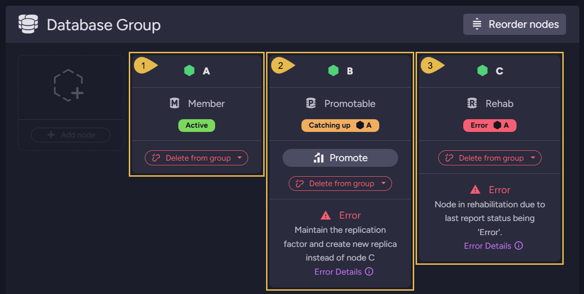
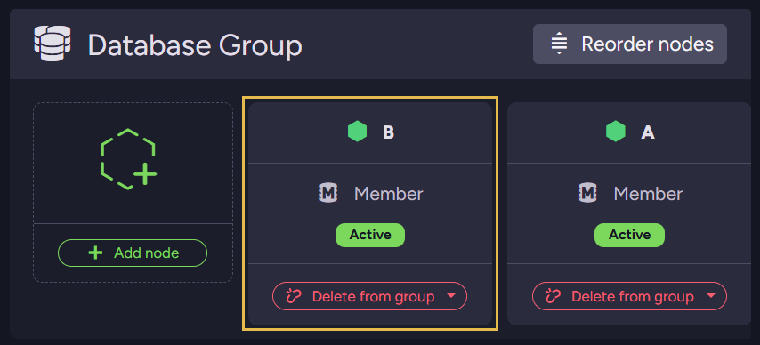

import Admonition from '@theme/Admonition';
import Panel from '@site/src/components/Panel';

# Cluster Observer

<Admonition type="note" title="">

* The primary goal of the **Cluster Observer** is to monitor the health of each database in the cluster
  and adjust its topology to maintain the desired [Replication Factor](../../../server/clustering/distribution/distributed-database.mdx#replication-factor).

* The observer is always running on the [Leader](../../../server/clustering/rachis/cluster-topology.mdx#leader) node.

* The observer logs each decision; read the log in Studio, under the advanced-debug view's
  [Cluster Observer Log](../../../monitoring/debug/advanced-debug-view.mdx#cluster-observer-log-tab) tab.

* In this article:
  * [Operation flow](../../../server/clustering/distribution/cluster-observer.mdx#operation-flow)
  * [States flow](../../../server/clustering/distribution/cluster-observer.mdx#states-flow)
  * [Interacting with the Cluster Observer](../../../server/clustering/distribution/cluster-observer.mdx#interacting-with-the-cluster-observer)

</Admonition>

<Panel heading="Operation flow">

* To maintain the replication factor, every newly elected [Leader](../../../server/clustering/rachis/cluster-topology.mdx#leader) starts measuring the health of each node
  via dedicated maintenance TCP connections to all other nodes in the cluster.  

* Each node reports the current status of _all_  its databases at intervals of [500 milliseconds](../../../server/configuration/cluster-configuration.mdx#clusterworkersampleperiodinms) (by default).  
  The `Cluster Observer` consumes these reports every [1000 milliseconds](../../../server/configuration/cluster-configuration.mdx#clustersupervisorsampleperiodinms) (by default).  

* Upon a **node failure**, the [Dynamic Database Distribution](../../../server/clustering/distribution/distributed-database.mdx#dynamic-database-distribution) sequence
  will take place to ensure that the replication factor does not change.  

    <Admonition type="note" title="">
    
    **For example**:  
    
    * Let us assume a five-node cluster with servers `A`, `B`, `C`, `D`, and `E`.  
      We create a database with a replication factor of 3 and define an ETL task.
    
    * The newly created database will be distributed automatically to three of the cluster nodes.  
      Let's assume it is distributed to `B`, `C`, and `E` (so the database group is [`B`,`C`,`E`]),  
      and the cluster decides that node `C` is responsible for performing the ETL task.
 
    * If node `C` goes offline or becomes unreachable, the Cluster Observer detects the issue.
      Initially:
      * After the duration specified in the [Cluster.TimeBeforeMovingToRehabInSec](../../../server/configuration/cluster-configuration.mdx#clustertimebeforemovingtorehabinsec) configuration key, the observer moves node `C` to `Rehab` mode, allowing time for recovery.
      * The ETL task fails over to another available node in the Database Group.
   
    * If node `C` remains offline beyond the period specified in the [Cluster.TimeBeforeAddingReplicaInSec](../../../server/configuration/cluster-configuration.mdx#clustertimebeforeaddingreplicainsec) configuration key,
      the observer begins replicating the database to another node in the Database Group as a last resort.
    
    </Admonition>

    <Admonition type="warning" title="">

    **Note**:  

    * The _Cluster Observer_ stores its information **in memory**. Therefore, when the `Leader`
      loses leadership, the collected reports of the _Cluster Observer_ and its decision log are lost.

    </Admonition>

</Panel>

<Panel heading="States flow">

The observer moves the members of a database group through a lifecycle of states, visible on
Studio's [Database Group view](../../../studio/database/settings/manage-database-group.mdx):
`Member`, `Promotable`, and `Rehab`.

* When a node is added to a database group, the observer first marks the node `Promotable`.  
  Once the node has caught up with the data of the database group and finished indexing the
  received data, the observer promotes the node to a full `Member`.

* When a member node fails, the observer demotes the failed node to `Rehab`, and, if the
  database's [Dynamic Database Distribution](../../../server/clustering/distribution/distributed-database.mdx#dynamic-database-distribution)
  option is enabled, restores the replication factor by adding another cluster node to the
  group as a `Promotable node`.

1. **Node `A`**  
   A healthy group member.

2. **Node `B`**  
   The replacement: the observer added node `B` to the group as a `Promotable node`, and `B`
   is catching up with the group's data.  
   The message on `B`'s card states the observer's reasoning: maintain the replication factor
   and create a new replica instead of node `C`.

3. **Node `C`**  
   The failed node, demoted to `Rehab`; the card shows the error that took `C` out of service.

Once the replacement has caught up and is promoted, the replication factor is restored and
the observer removes the failed node from the group:

* **Node `B`**  
  The replacement, now a full `Member`.  
  Node `C` is no longer part of the group; the database data `C` holds is deleted only after
  `C` returns and has replicated to the group any documents the group lacks.

</Panel>

<Panel heading="Interacting with the Cluster Observer">

You can interact with the `Cluster Observer` using the following REST API calls:  

| URL                                 | Method  | Query Params   | Description                                                                                                                                                          |
|-------------------------------------|---------|----------------|----------------------------------------------------------------------------------------------------------------------------------------------------------------------|
| `/admin/cluster/observer/suspend`   | POST    | value=[`bool`] | Setting `false` will suspend the _Cluster Observer_ operation for the current [Leader term](../../../studio/cluster/cluster-view.mdx#cluster-nodes-states--types-flow). |
| `/admin/cluster/observer/decisions` | GET     |                | Fetch the log of the recent decisions made by the cluster observer.                                                                                                  |
| `/admin/cluster/maintenance-stats`  | GET     |                | Fetch the latest reports of the _Cluster Observer_                                                                                                                   |

 

Studio's **advanced-debug** view surfaces both in its
[Cluster Observer Log](../../../monitoring/debug/advanced-debug-view.mdx#cluster-observer-log-tab) tab:
the `Suspend cluster observer` button and the decisions table.

</Panel>
