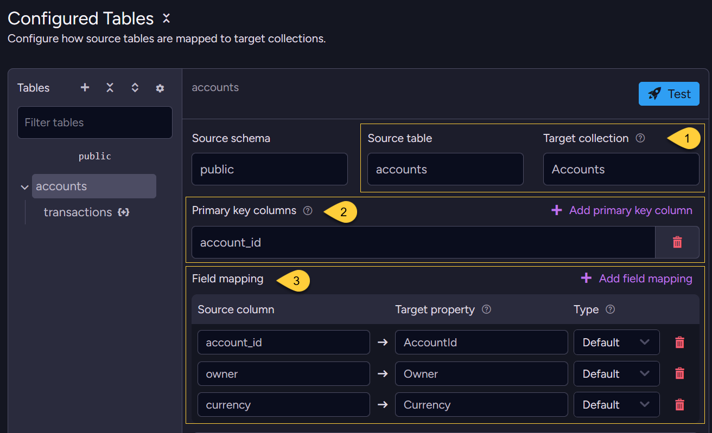
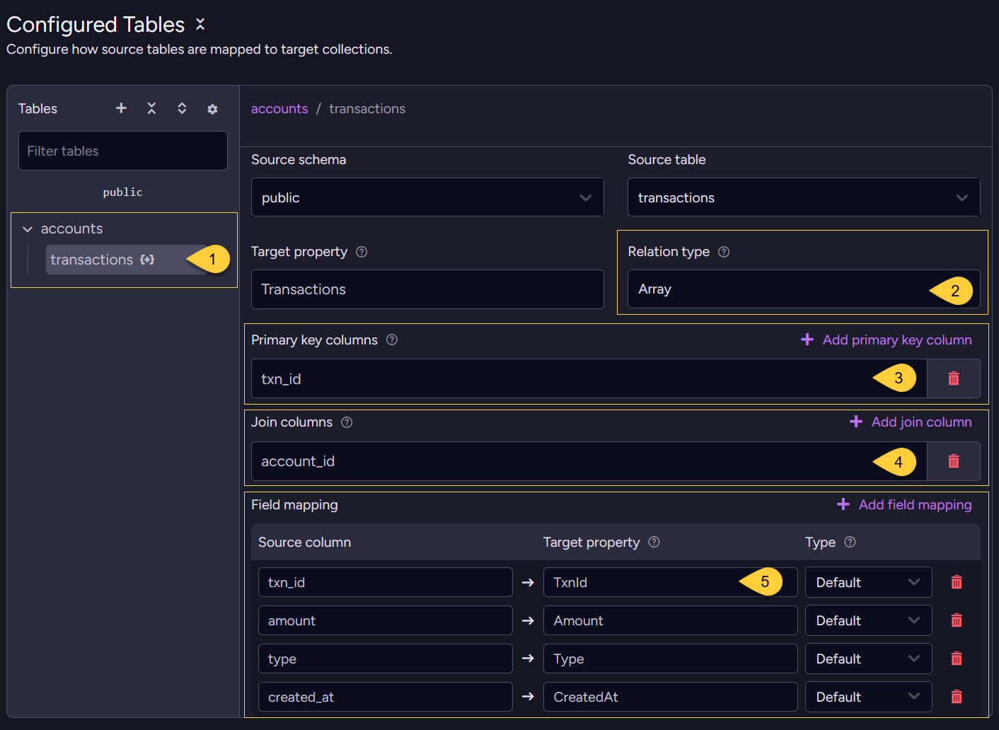
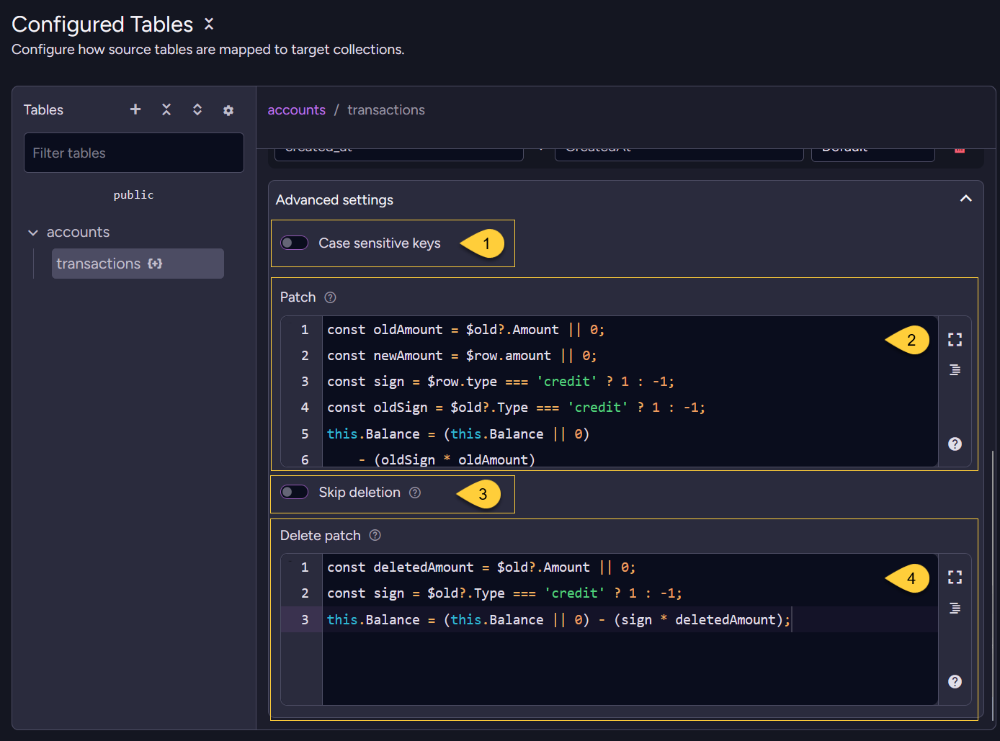
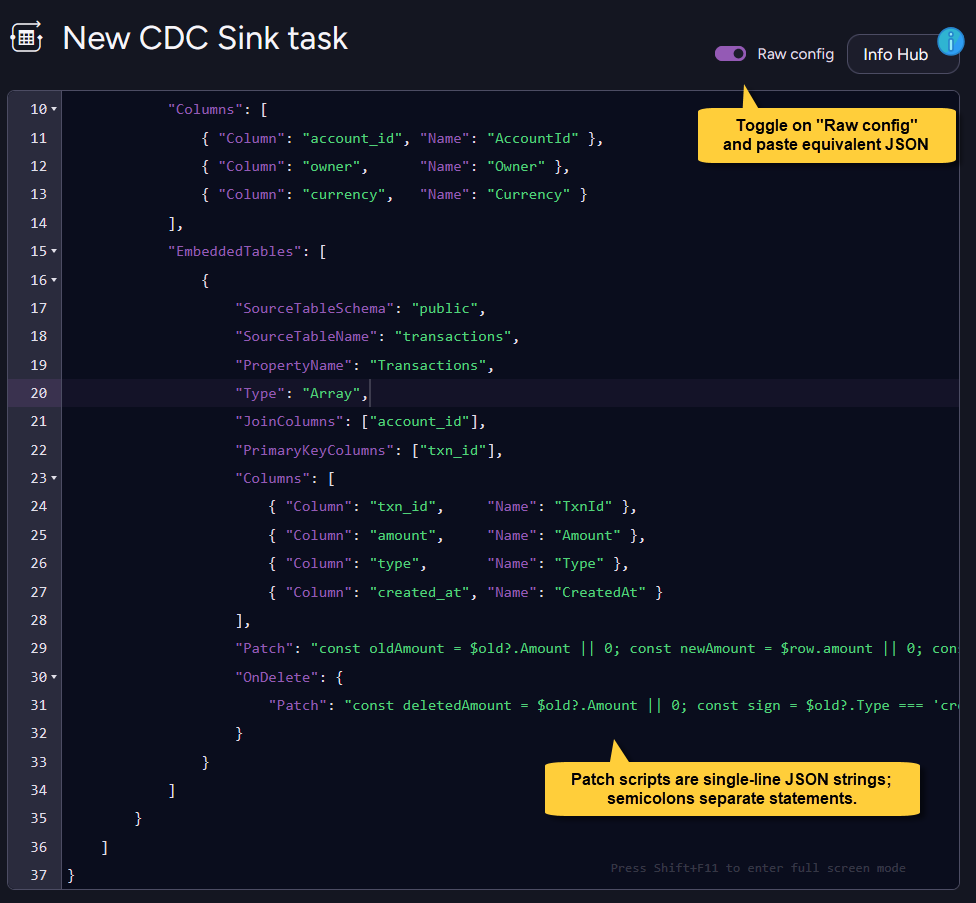

import Admonition from '@theme/Admonition';
import Tabs from '@theme/Tabs';
import TabItem from '@theme/TabItem';
import Panel from '@site/src/components/Panel';

<Admonition type="note" title="">

* This example shows how to use CDC Sink patches to **maintain a computed aggregate** on a RavenDB document   
  as individual event rows arrive from PostgreSQL.

* For detailed instructions on creating a CDC Sink task with the Client API or Studio,  
  see [Create a CDC Sink task](../../../../../server/ongoing-tasks/cdc-sink/manage-cdc-sink-tasks/create-task.mdx).       
    
* In this article:
  * [Source schema](#source-schema)
  * [Goal](#goal)
  * [REPLICA IDENTITY setup](#replica-identity-setup)
  * [Task configuration](#task-configuration)
    * [Via the Client API](#via-the-client-api)
    * [Via Studio](#via-studio)
  * [Resulting documents](#resulting-documents)
  * [Handling deletes](#handling-deletes)

</Admonition>

<Panel heading="Source schema">

An accounts table and a transactions table:

<Tabs>
<TabItem value="sql" label="SQL">
```sql
CREATE TABLE accounts (
    account_id SERIAL PRIMARY KEY,
    owner      TEXT NOT NULL,
    currency   TEXT NOT NULL DEFAULT 'USD'
);

CREATE TABLE transactions (
    txn_id     SERIAL PRIMARY KEY,
    account_id INT NOT NULL REFERENCES accounts(account_id),
    amount     NUMERIC(12,2) NOT NULL,
    type       TEXT NOT NULL CHECK (type IN ('credit', 'debit')),
    created_at TIMESTAMPTZ DEFAULT now()
);
```
</TabItem>
</Tabs>

</Panel>

<Panel heading="Goal">

Store each account as a RavenDB document with a `Balance` field that reflects the running total of all transactions.  
Transaction rows are embedded as an array for history, and `Balance` is maintained using patch logic.

</Panel>

<Panel heading="REPLICA IDENTITY setup">

* The `transactions` table uses `txn_id` as its primary key.  
  The join column `account_id` is not part of that primary key.

* By default, PostgreSQL `REPLICA IDENTITY` sends only primary-key columns.  
  Without `REPLICA IDENTITY FULL`, DELETE events for `transactions` rows would not include `account_id`,  
  and CDC Sink could not route the deleted transaction to the correct account document.
    
* For this example to handle deleted transactions, CDC Sink must receive the `account_id` value in PostgreSQL DELETE events.
  Set `REPLICA IDENTITY FULL` on the `transactions` table:

    <Tabs>
    <TabItem value="sql" label="SQL">
    ```sql
    ALTER TABLE transactions REPLICA IDENTITY FULL;
    ```
    </TabItem>
    </Tabs>

  Learn more in [REPLICA IDENTITY](../../../../../server/ongoing-tasks/cdc-sink/source-database-setup/postgres/replica-identity.mdx).

</Panel>

<Panel heading="Task configuration">

### Via the Client API

Define the task with the client API:

<Tabs>
<TabItem value="csharp" label="csharp">
```csharp
var config = new CdcSinkConfiguration
{
    Name = "Accounts-CDC-Sink",
    ConnectionStringName = "ConnectionStringToPostgreSQL",
    Tables =
    [
        new CdcSinkTableConfig
        {
            CollectionName = "Accounts",
            SourceTableSchema = "public",
            SourceTableName = "accounts",
            PrimaryKeyColumns = ["account_id"],
            Columns =
            [
                new CdcColumnMapping() { Column = "account_id", Name = "AccountId" },
                new CdcColumnMapping() { Column = "owner",      Name = "Owner" },
                new CdcColumnMapping() { Column = "currency",   Name = "Currency" },
            ],
            EmbeddedTables =
            [
                new CdcSinkEmbeddedTableConfig
                {
                    SourceTableSchema = "public",
                    SourceTableName = "transactions",
                    PropertyName = "Transactions",
                    Type = CdcSinkRelationType.Array,
                    JoinColumns = ["account_id"],
                    PrimaryKeyColumns = ["txn_id"],
                    Columns =
                    [
                        new CdcColumnMapping() { Column = "txn_id",     Name = "TxnId" },
                        new CdcColumnMapping() { Column = "amount",     Name = "Amount" },
                        new CdcColumnMapping() { Column = "type",       Name = "Type" },
                        new CdcColumnMapping() { Column = "created_at", Name = "CreatedAt" },
                    ],
                    // Runs after a transaction is inserted or updated;
                    // adjusts Balance by replacing the previous contribution with the new one.
                    Patch = """
                        const oldAmount = $old?.Amount || 0;
                        const newAmount = $row.amount || 0;
                        const sign = $row.type === 'credit' ? 1 : -1;
                        const oldSign = $old?.Type === 'credit' ? 1 : -1;
                        this.Balance = (this.Balance || 0)
                            - (oldSign * oldAmount)
                            + (sign * newAmount);
                        """,
                    // Runs after a transaction is deleted;
                    // uses $old to subtract the removed transaction's last stored contribution.    
                    OnDelete = new CdcSinkOnDeleteConfig
                    {
                        Patch = """
                            const deletedAmount = $old?.Amount || 0;
                            const sign = $old?.Type === 'credit' ? 1 : -1;
                            this.Balance = (this.Balance || 0) - (sign * deletedAmount);
                            """
                    }
                }
            ]
        }
    ]
};

await store.Maintenance.SendAsync(new AddCdcSinkOperation(config));
```
</TabItem>
</Tabs>
    
---

### Via Studio

In Studio, configure how the `accounts` source table maps to the `Accounts` target collection,  
then add `transactions` as an embedded table for each account.    

---
    
First, configure the root `accounts` table:



1. **Source table &rarr; target collection**  
   The `accounts` table maps to the `Accounts` collection.  
   This is a root table, so each row becomes its own document.
2. **Primary key columns**  
   `account_id` is used to build the document ID for each account.
3. **Field mapping**  
   Maps each source column to its target property  
   (`account_id` &rarr; `AccountId`, `owner` &rarr; `Owner`, `currency` &rarr; `Currency`).

---

Then add the embedded `transactions` table:

  

1. **Embedded table**  
   `transactions` is configured as an embedded table inside the `accounts` document, not as its own collection.
2. **Relation type**  
   Each account stores its transactions as a JSON array (`Type: Array` in the config).
3. **Primary key columns**  
   `txn_id` identifies each array element, so later updates and deletes patch the correct transaction.
4. **Join columns**  
   `account_id` links each transaction row to its parent account document.  
   In this example, PostgreSQL DELETE events need this value to route deleted transactions correctly.
5. **Field mapping**  
   Maps each source column to its target property, matching the `Columns` list in the config.

---
    
The embedded `transactions` table and its balance patches (`Patch` / `OnDelete.Patch`) are defined under **Advanced settings**.
    
  

1. **Case sensitive keys**  
   Controls whether primary-key and map-key matching is case sensitive.  
   It only affects string keys, so it has no effect in this example, where the key is the numeric `txn_id`.
2. **Patch**  
   The INSERT/UPDATE patch that maintains `Balance`;  
   runs on the parent account document after a transaction is added or updated.    
3. **Skip deletion**  
   Maps to `IgnoreDeletes`.  
   Leave this off for this example.  
   **Off** = CDC Sink removes the deleted transaction item from the array, and the delete patch updates `Balance`.  
   **On** = CDC Sink skips the automatic removal. If a delete patch is configured, the patch still runs.
4. **Delete patch**  
   The `OnDelete.Patch` script reverses the deleted transaction's contribution to `Balance`.

---
    
Alternatively, toggle **Raw config** and paste the equivalent JSON:

    

<Tabs>
<TabItem value="json" label="Raw config (JSON)">
```json
{
    "Name": "Accounts-CDC-Sink",
    "ConnectionStringName": "ConnectionStringToPostgreSQL",
    "Tables": [
        {
            "CollectionName": "Accounts",
            "SourceTableSchema": "public",
            "SourceTableName": "accounts",
            "PrimaryKeyColumns": ["account_id"],
            "Columns": [
                { "Column": "account_id", "Name": "AccountId" },
                { "Column": "owner",      "Name": "Owner" },
                { "Column": "currency",   "Name": "Currency" }
            ],
            "EmbeddedTables": [
                {
                    "SourceTableSchema": "public",
                    "SourceTableName": "transactions",
                    "PropertyName": "Transactions",
                    "Type": "Array",
                    "JoinColumns": ["account_id"],
                    "PrimaryKeyColumns": ["txn_id"],
                    "Columns": [
                        { "Column": "txn_id",     "Name": "TxnId" },
                        { "Column": "amount",     "Name": "Amount" },
                        { "Column": "type",       "Name": "Type" },
                        { "Column": "created_at", "Name": "CreatedAt" }
                    ],
                    "Patch": "const oldAmount = $old?.Amount || 0; const newAmount = $row.amount || 0; const sign = $row.type === 'credit' ? 1 : -1; const oldSign = $old?.Type === 'credit' ? 1 : -1; this.Balance = (this.Balance || 0) - (oldSign * oldAmount) + (sign * newAmount);",
                    "OnDelete": {
                        "Patch": "const deletedAmount = $old?.Amount || 0; const sign = $old?.Type === 'credit' ? 1 : -1; this.Balance = (this.Balance || 0) - (sign * deletedAmount);"
                    }
                }
            ]
        }
    ]
}
```
</TabItem>
</Tabs>      

</Panel>

<Panel heading="Resulting documents">

After three transactions (credit 100, debit 30, credit 50):

<Tabs>
<TabItem value="json" label="The generated document">
```json
{
    "AccountId": 1,
    "Owner": "Alice",
    "Currency": "USD",
    "Balance": 120.00,
    "Transactions": [
        { "TxnId": 1, "Amount": 100.00, "Type": "credit", "CreatedAt": "..." },
        { "TxnId": 2, "Amount": 30.00,  "Type": "debit",  "CreatedAt": "..." },
        { "TxnId": 3, "Amount": 50.00,  "Type": "credit", "CreatedAt": "..." }
    ],
    "@metadata": { "@collection": "Accounts" }
}
```
</TabItem>
</Tabs>

</Panel>

<Panel heading="Handling deletes">
    
The patches keep `Balance` correct by applying only the change caused by each transaction event:

* **When a transaction row is inserted**:  
  There is no previous embedded item, so the patch adds the new transaction's contribution to `Balance`.

* **When a transaction row is updated**:  
  The patch subtracts the previous contribution from `$old`, then adds the new contribution from `$row`.

* **When a transaction row is deleted**:  
  There is no new row to add.  
  The `OnDelete.Patch` subtracts the deleted transaction's last stored contribution from `$old`.

Without `OnDelete.Patch`, deleting a transaction row from SQL would remove it from the `Transactions` array  
but leave `Balance` stale.  
    
This also keeps `Balance` correct if the same change is re-applied after failover.      
Learn more in [Failover and consistency](../../../../../server/ongoing-tasks/cdc-sink/failover-and-consistency.mdx).

</Panel>