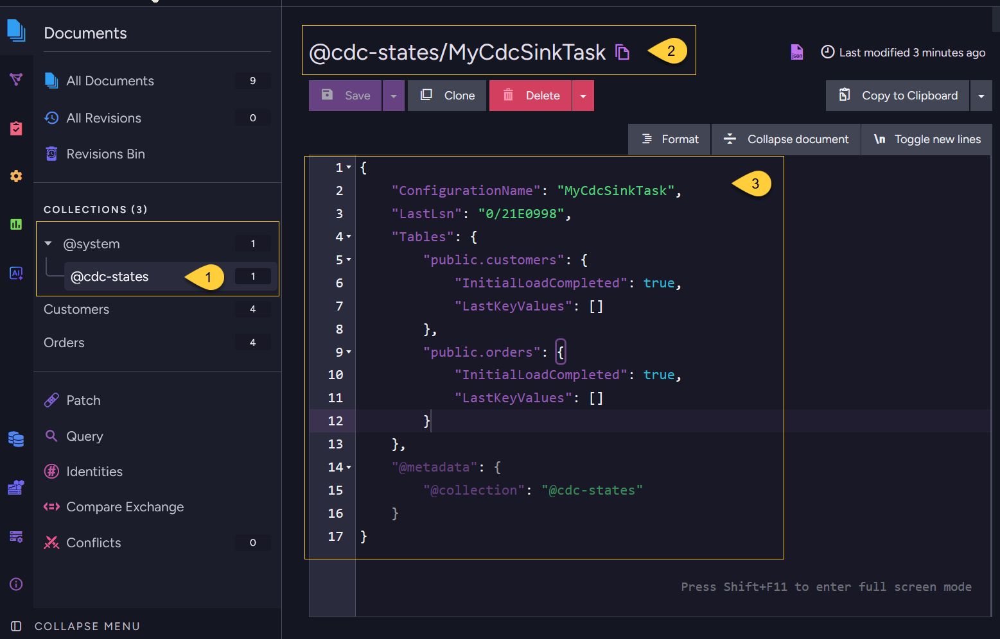

import Admonition from '@theme/Admonition';
import Tabs from '@theme/Tabs';
import TabItem from '@theme/TabItem';
import Panel from '@site/src/components/Panel';
import ContentFrame from '@site/src/components/ContentFrame';

<Admonition type="note" title="">

* This article describes the internal operation of CDC Sink - how it verifies the source
  database, loads initial data, streams changes, preserves transaction order, and handles failover.

* Understanding these mechanics is important when designing patches, planning for failover,
  and updating task configuration. 

* In this article:
  * [Startup and verification](#startup-and-verification)
  * [Initial load](#initial-load)
  * [Streaming changes](#streaming-changes)
  * [Transaction ordering](#transaction-ordering)
  * [State persistence](#state-persistence)
  * [Failover behavior](#failover-behavior)
  * [Updating the task configuration](#updating-the-task-configuration)
  * [Embedded row before root row](#embedded-row-before-root-row)

</Admonition>

<Panel heading="Startup and verification">

When a CDC Sink task starts, it first verifies that the source database is ready for change capture.  
The specific checks depend on the source database provider.  
    
If a check fails, CDC Sink reports the problem and the command an administrator can run to fix it.  
The task does not continue until all checks pass.    

After verification, CDC Sink creates the required change-tracking infrastructure in the source database,  
then begins the initial load.    

<ContentFrame>
    
### PostgreSQL

CDC Sink checks:

* WAL level is set to `logical`
* The connecting user has sufficient privileges
* REPLICA IDENTITY is configured correctly for embedded tables that need delete routing

See the [PostgreSQL prerequisites checklist](../../../server/ongoing-tasks/cdc-sink/source-database-setup/postgres/prerequisites-checklist.mdx)
for the full list of requirements.
    
</ContentFrame>    
<ContentFrame>
    
### SQL Server

CDC Sink checks that Change Data Capture is enabled on the database and on each captured table,  
and that the SQL Server Agent service is running (it drives the CDC capture jobs).  
    
Learn more in [CDC Sink for SQL Server](../../../server/ongoing-tasks/cdc-sink/source-database-setup/sql-server/overview.mdx).

</ContentFrame>    
<ContentFrame>
    
### MySQL / MariaDB

CDC Sink checks that binary logging is enabled with `binlog_format = ROW`,
and that the connecting user has the `REPLICATION SLAVE` and `REPLICATION CLIENT` privileges required to read the binlog.  
    
Learn more in [CDC Sink for MySQL](../../../server/ongoing-tasks/cdc-sink/source-database-setup/mysql/overview.mdx).
    
</ContentFrame>    
    
</Panel>

<Panel heading="Initial load">

Before streaming live changes, CDC Sink performs a full scan of every configured **root** and **embedded** table, using keyset pagination ordered by primary key.
**Linked** tables are neither scanned during the initial load nor registered for change capture -
their foreign-key columns, stored on the owning root or embedded row, are resolved into document-ID references in the target collection.    

**Progress tracking:**
    
During the initial load, CDC Sink stores each table's progress in the task's **state document**.
If the task is restarted, an interrupted initial load resumes from the last processed primary-key value instead of re-scanning the entire table.  
The state document is described in [State persistence](#state-persistence).

**Batch pipelining:**  
    
While one batch is being written to RavenDB, the next batch is read from the source database in parallel,  
so reads and writes overlap instead of running one after another.

**Ordering:**  
    
Tables are scanned in dependency order. 
Root tables are loaded first, then embedded tables.  
This minimizes the number of stub documents created (see [Child before parent](#child-before-parent) below).    

---
    
<Admonition type="note" title="">

#### Change tracking during initial load
    
Change tracking is set up before the initial load begins, but CDC streaming does not start until after the initial load completes. 
The sequence is:    

1. Change-tracking infrastructure is created in the source database  
   (e.g., a replication slot and publication for PostgreSQL, or CDC capture for SQL Server).
2. The full initial table scan runs -  
   changes made during this time are captured by the source database but not yet consumed.
3. Once the initial load is complete, CDC streaming starts from the position captured in step 1.
    
This guarantees no changes are missed: anything that happened during the initial load is retained by the source database and will be processed immediately after.

For very large databases, the source database must retain sufficient change history for the duration of the initial load  
(e.g., enough WAL disk space on PostgreSQL, or a long enough retention window on SQL Server CDC tables).  
Plan accordingly before starting the initial load on large tables.    
    
</Admonition>

</Panel>

<Panel heading="Streaming changes">

After the initial load completes, CDC Sink begins consuming changes from the source database's change log,  
starting from the position captured **before** the initial load began.

CDC Sink processes changes in source transaction order.
Changes from a transaction are applied to RavenDB only after the transaction is committed in the source database, so partial transactions are never written.    

**Document merging:**  
When an UPDATE arrives, CDC Sink merges the new column values onto the existing RavenDB document.  
Properties that are not part of the column mapping are preserved.  
This allows RavenDB-side annotations and computed fields to coexist with CDC-managed properties.  
See [Property Retention](../../../server/ongoing-tasks/cdc-sink/property-retention.mdx) for details.

</Panel>

<Panel heading="Transaction ordering">

CDC Sink preserves the full order of operations within a source database transaction.  
If a single transaction performs multiple operations on the same row, all operations are applied in order.

For example, consider the following source transaction:

<Tabs>
<TabItem value="sql" label="SQL">
```sql
BEGIN;
INSERT INTO items (id, name) VALUES (1, 'Alpha');
UPDATE items SET name = 'Beta' WHERE id = 1;
DELETE FROM items WHERE id = 1;
INSERT INTO items (id, name) VALUES (1, 'Gamma');
UPDATE items SET name = 'Delta' WHERE id = 1;
COMMIT;
```
</TabItem>
</Tabs>

CDC Sink applies all five operations in order. The final RavenDB document has `name` set to `Delta`.

Multiple documents modified in the same transaction are also applied atomically within a single RavenDB batch.

</Panel>

<Panel heading="State persistence">
    
<ContentFrame>
    
### The state document
    
CDC Sink stores processing progress in a single **state document per task**, separate from the task definition:  
  * The task definition is stored in the database record.
  * The processing state is stored as a RavenDB document in the `@cdc-states` system collection.  
    


1. **The `@cdc-states` collection**  
   In the **Documents** view, expand the **@system** group and open the **@cdc-states** collection.  
   It holds one state document per CDC Sink task.    

2. **The state document ID**  
   The document is named `@cdc-states/<task name>` (here, `@cdc-states/MyCdcSinkTask`).

3. **The document contents**  
   The JSON tracks both streaming progress and initial-load progress:  
   * **`ConfigurationName`**  
     The name of the CDC Sink task this state belongs to.
   * **`LastLsn`**  
     The last processed source-database change position, used to resume streaming after a restart.
   * **`Tables`**
     A per-table map, keyed by `schema.tableName`, that stores initial-load progress:
     * **`InitialLoadCompleted`** - whether the full scan for that table has finished.
     * **`LastKeyValues`** - the last primary-key values read, used to resume an interrupted initial load.    
    
     In this example both tables show `InitialLoadCompleted: true` and an empty `LastKeyValues`,  
     meaning the initial load has finished and the task is now streaming changes driven by `LastLsn`.

</ContentFrame>
<ContentFrame>    
    
### Reusing saved state  
    
* Deleting a CDC Sink task removes the task definition, but leaves the matching state document.  
  If you create a new task with the same name, CDC Sink can reuse that state document and resume from the saved position.

* To start from scratch, create the replacement task with a different name.  
  Since no `@cdc-states/<new task name>` document exists yet, CDC Sink has no saved position to resume from.  
  It performs a fresh initial load unless the task is configured with `SkipInitialLoad = true`.
      
* See [Troubleshooting](../../../server/ongoing-tasks/cdc-sink/troubleshooting.mdx) for details on state loss and recovery options.

</ContentFrame>
<ContentFrame>  
    
### Cluster replication  
        
Like any RavenDB document, this state document is subject to [internal replication](../../../server/clustering/replication/replication-overview.mdx#replication-types) behavior.  
Different nodes in a cluster may temporarily have different versions of this document.

</ContentFrame>
    
</Panel>

<Panel heading="Failover behavior">
    
When the cluster elects a new mentor node for the CDC Sink task, the new node reads the state document that was replicated to it.
If the previous mentor processed changes but its latest state update had not yet replicated, the new mentor may resume from an earlier position.

This means:    

* **No data is lost**:  
  CDC Sink resumes from a known position and the source database retains all changes from that position onward.
* **Some changes may be re-read**:  
  Changes between the replicated state and the previous mentor's actual progress will be processed again.

Re-reading is normal and expected. The document merge strategy means that re-applying the same INSERT or UPDATE is safe -
column values are simply overwritten with the same values.

<Admonition type="warning" title="">
    
Patches that are not idempotent can produce incorrect results if the same change is re-read after a failover.  
Design patches to handle re-processing safely.
See [Patching](../../../server/ongoing-tasks/cdc-sink/patching.mdx) for guidance.
    
</Admonition>

</Panel>

<Panel heading="Updating the task configuration">

When you update a CDC Sink task configuration - 
for example, by adding or removing columns from the `Columns` list, changing a `Patch` script, or modifying embedded table configuration - 
the changes take effect **only for new CDC events going forward**.
    
CDC Sink does not retroactively reprocess existing documents.  
Documents that were already created retain their current structure.
    
Common configuration changes behave as follows:

* **Adding a new column mapping**:  
  Existing documents will not have the new property.  
  Only documents created or updated by a subsequent CDC event will include it.
* **Removing a column mapping**:  
  Existing documents retain the property.  
  It will no longer be updated by CDC events, but it is not removed from existing documents.
* **Changing a patch script**:  
  The new patch runs on future events only.  
  Existing documents reflect the results of the previous patch.
* **Adding an embedded or linked table**:  
  Existing parent documents will not reflect the new embedded data or linked references  
  until a CDC event arrives for the relevant source row.    

---
    
<Admonition type="note" title="">
    
#### Applying changes to existing documents    

* Simply restarting the task does not reprocess existing documents. 
  A restart resumes from the task's saved position (see [State persistence](#state-persistence)),
  so it only continues streaming new changes.  

* To apply configuration changes to **all** documents (not just new events), delete the existing CDC Sink task
  and create a new task with a new name and `SkipInitialLoad` disabled. The new task has no matching state document,
  so it performs a fresh initial load, reprocessing all rows with the updated configuration.
    
* If you only need to backfill a specific property on existing documents,  
  you can also use a RavenDB [patch by query](../../../client-api/operations/patching/set-based.mdx) to update existing documents independently of the CDC Sink task.

</Admonition>

</Panel>

<Panel heading="Embedded row before root row">

Tables are scanned one at a time during the initial load.  
Root tables are scanned before their embedded tables, but source data can still change while the initial load is running.

For example, _Orders_ are scanned first. Then, while _OrderLines_ are being scanned,
CDC Sink encounters an _OrderLine_ that belongs to an _Order_ inserted after the _Orders_ scan had already finished.

In this case, CDC Sink creates a **stub document** for the root document containing only the embedded child data.  
When CDC streaming begins after the initial load, it picks up the missing root row and merges its columns onto the stub document.

The final document contains both the root fields and the embedded items.  
No data is lost - the brief intermediate state is resolved automatically once streaming starts.

</Panel>