import Admonition from '@theme/Admonition';
import Tabs from '@theme/Tabs';
import TabItem from '@theme/TabItem';
import Panel from '@site/src/components/Panel';
import ContentFrame from "@site/src/components/ContentFrame";

<Admonition type="note" title="">

* A CDC Sink task consumes Change Data Capture streams from a relational source database  
  (PostgreSQL, SQL Server, or MySQL/MariaDB) and applies inserts, updates, and deletes to documents in RavenDB.    

* This article shows how to **create** a CDC Sink task using the Client API, Studio, or REST API.

* In this article:
  * [Create a CDC Sink task via Client API](#create-a-cdc-sink-task-via-client-api)
  * [Create a CDC Sink task via Studio](#create-a-cdc-sink-task-via-studio)
    * [Create task](#create-task)
    * [Configure basic settings](#configure-basic-settings)
    * [Schema explorer](#schema-explorer)
    * [Configured tables](#configured-tables)
    * [Configure linked tables](#configure-linked-tables)
    * [Configure embedded tables](#configure-embedded-tables)
    * [Test mapping](#test-mapping)
    * [Advanced settings](#advanced-settings)
    * [The created task](#the-created-task)
  * [Create a CDC Sink task via REST API](#create-a-cdc-sink-task-via-rest-api)

</Admonition>

<Panel heading="Create a CDC Sink task via Client API">

Use `AddCdcSinkOperation` to create a new CDC Sink task from a `CdcSinkConfiguration`.

The configuration references a registered SQL connection string by name.
CDC Sink uses the same `SqlConnectionString` type as [SQL ETL](../../../../../server/ongoing-tasks/etl/sql.mdx); 
the connection string's `FactoryName` determines the source engine.

Optionally set `SkipInitialLoad = true` only when the target RavenDB database already contains the initial data and the task should start from new CDC changes.

See [Configuration Reference](../../../../../server/ongoing-tasks/cdc-sink/manage-cdc-sink-tasks/configuration-reference.mdx)
for the full list of configuration classes and properties.    

<Tabs>
<TabItem value="sync" label="Sync">
```csharp
var config = new CdcSinkConfiguration
{  
    // Unique name for the CDC Sink task
    Name = "OrdersSync",   

    // Name of an existing SqlConnectionString, 
    // its FactoryName selects the source database engine
    ConnectionStringName = "MyPostgresConnection",
    
    // Optional: set to true only if RavenDB already contains the initial data.
    // SkipInitialLoad = true,
    
    Tables = new List<CdcSinkTableConfig>
    {
        new CdcSinkTableConfig
        {
            // Map the source table to the Orders collection in RavenDB    
            CollectionName = "Orders", 
            SourceTableName = "orders",   

            // Primary key columns are used to generate document IDs
            // and must be included in Columns    
            PrimaryKeyColumns = new List<string> { "id" },
    
            // Map source columns to RavenDB document properties.
            Columns =
            [
                new CdcColumnMapping() { Column = "id",            Name = "Id" },
                new CdcColumnMapping() { Column = "customer_name", Name = "CustomerName" },
                new CdcColumnMapping() { Column = "total",         Name = "Total" },
            ]
        }
    }
};

// Execute the operation by passing it to Maintenance.Send    
var result = store.Maintenance.Send(new AddCdcSinkOperation(config));

long taskId = result.TaskId;
```
</TabItem>
<TabItem value="async" label="Async">
```csharp
var config = new CdcSinkConfiguration
{  
    // Unique name for the CDC Sink task
    Name = "OrdersSync",   

    // Name of an existing SqlConnectionString, 
    // its FactoryName selects the source database engine
    ConnectionStringName = "MyPostgresConnection",
    
    // Optional: set to true only if RavenDB already contains the initial data.
    // SkipInitialLoad = true,
    
    Tables = new List<CdcSinkTableConfig>
    {
        new CdcSinkTableConfig
        {
            // Map the source table to the Orders collection in RavenDB    
            CollectionName = "Orders", 
            SourceTableName = "orders",   

            // Primary key columns are used to generate document IDs 
            // and must be included in Columns    
            PrimaryKeyColumns = new List<string> { "id" },
    
            // Map source columns to RavenDB document properties.
            Columns =
            [
                new CdcColumnMapping() { Column = "id",            Name = "Id" },
                new CdcColumnMapping() { Column = "customer_name", Name = "CustomerName" },
                new CdcColumnMapping() { Column = "total",         Name = "Total" },
            ]
        }
    }
};

// Execute the operation by passing it to Maintenance.SendAsync    
var result = await store.Maintenance.SendAsync(new AddCdcSinkOperation(config));

long taskId = result.TaskId;
```
</TabItem>
</Tabs>

`AddCdcSinkOperationResult`:

| Property           | Type   | Description |
|--------------------|--------|-------------|
| `TaskId`           | `long` | Assigned task ID |
| `RaftCommandIndex` | `long` | Raft index of the command |

</Panel>

<Panel heading="Create a CDC Sink task via Studio">

### Create task
    
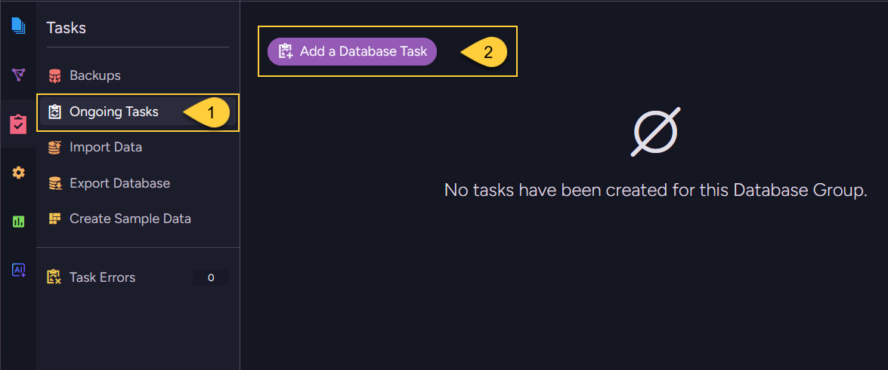    

1. Navigate to **Databases** → your database → **Tasks** → **Ongoing Tasks**.
2. Click **Add a Database Task** 
    
---
    
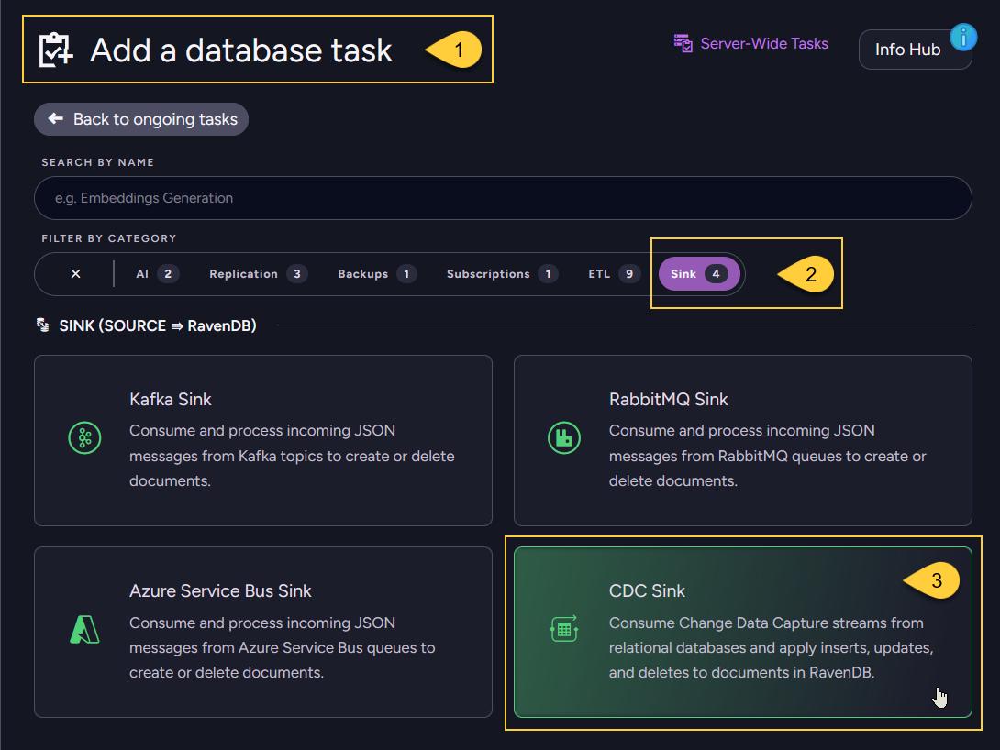        
    
1. The **Add a database task** view opens.
2. Filter by the **Sink** category to show only source-to-RavenDB sink tasks.
3. Select the **CDC Sink** task type.

---
    
### Configure basic settings       
    
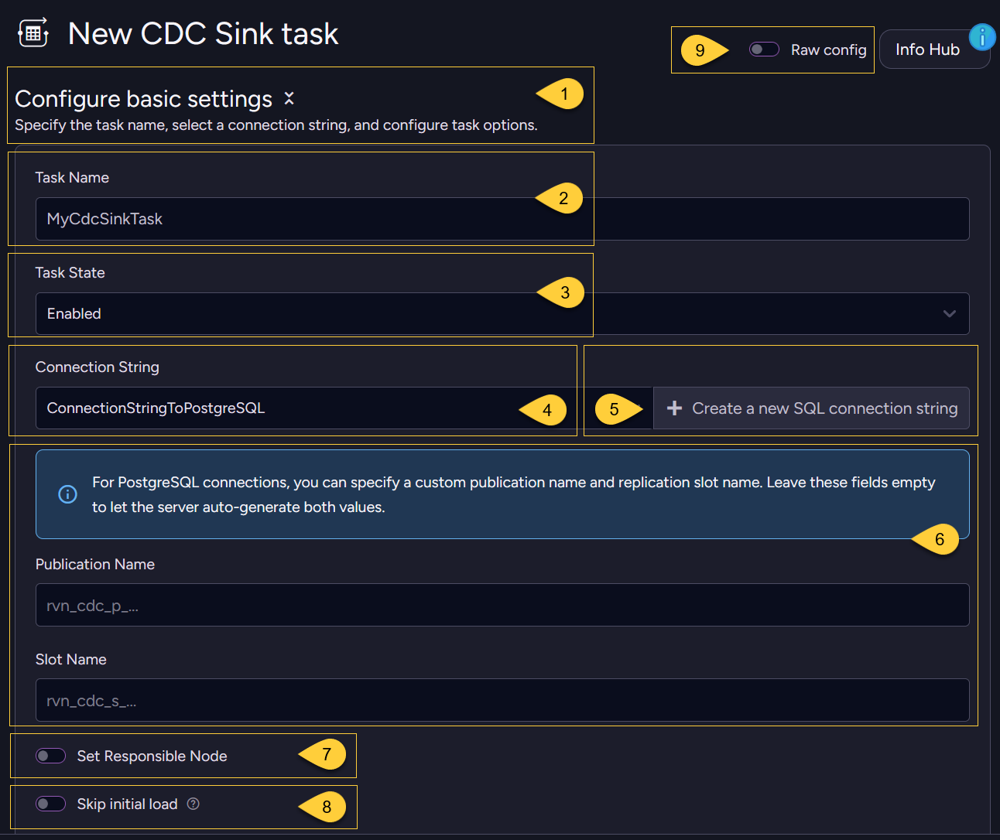   
    
1. **Configure basic settings**  
   In this section you specify the task name, select a connection string, and configure task options.
2. **Task Name**  
   Enter a unique name for the CDC Sink task.
3. **Task State**  
   Set the initial state, **Enabled** or **Disabled**.
4. **Connection String**  
   Select an existing SQL connection string to the source database.
5. Alternatively, click **Create a new SQL connection string** to define a new one.
6. For PostgreSQL connections, you can optionally set a custom **Publication Name** and **Slot Name**.  
   Leave these fields empty to let the server auto-generate both values.
7. **Set Responsible Node**  
   Optionally pin the task to a specific node in the database group.
8. **Skip initial load**  
   Enable only if RavenDB already contains the initial data and the task should start from new CDC changes.
9. **Raw config**   
   Toggle to view or paste the task's JSON configuration directly.  
   Useful for copying a configuration between environments.

---
    
### Schema explorer
    
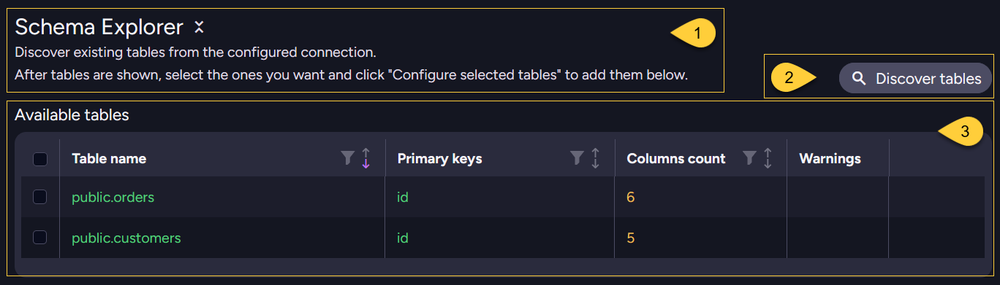     

1. **Schema Explorer**  
   In this section you can discover existing tables from the configured connection.
2. **Discover tables**  
   Click to query the source database for tables.
3. **Available tables**  
   Discovered tables appear here showing each table's name, primary keys, column count, and any warnings.
    
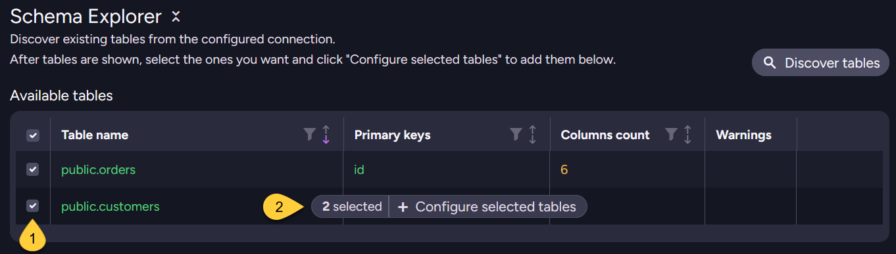     

1. **Select tables**  
   Check the box next to each source table you want to sink into RavenDB as documents.
2. **Configure selected tables**  
   Click _Configure selected tables_ to add the selected tables to the configuration panel below,  
   where you map their columns to RavenDB collections and document properties.
    
---
    
### Configured tables
    
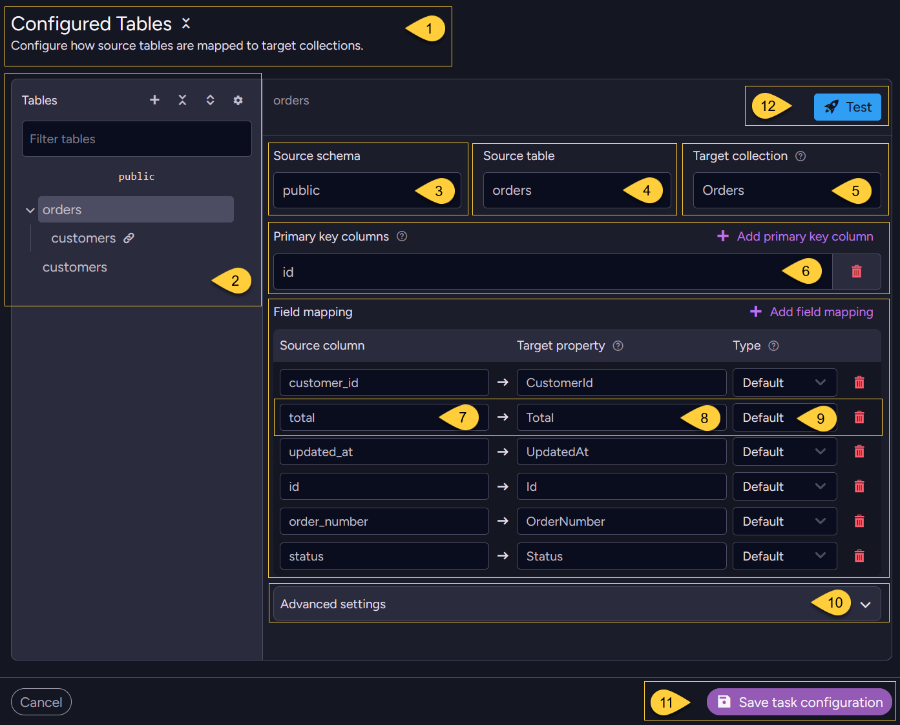      
    
1. **Configured Tables** - In this section, configure how source tables are mapped to target RavenDB collections.
2. **Tables** - the list of configured tables. Select a table to edit its mapping.  
   * A table can be a **root** table (mapped directly to its own collection),  
     or a table nested under a root table - either **linked** or **embedded** (see the sections below).  
   * In this example, `orders` is a root table with `customers` nested under it as a linked table (marked with 🔗); 
     `customers` also appears on its own as a separate root table.
3. **Source schema** - the schema the source table belongs to (e.g. `public`).
4. **Source table** - the name of the source table.
5. **Target collection** - the RavenDB collection that documents are written to.
6. **Primary key columns** - Columns that uniquely identify each source row.  
   Their values are used to derive the RavenDB document ID.  
   Click **Add primary key column** to add more.    
7. **Source column** - the column name in the source table. Click **Add field mapping** to add more.
8. **Target property** - the RavenDB document field where the source column value will be stored.
9. **Type** - select how the source column value is stored in the document:  
   * `Default` - stored as a regular property  
   * `JSON` - parsed as JSON before storing  
   * `Attachment` - stored as a RavenDB attachment  
10. **Advanced settings** - expand to configure patch scripts and delete handling.
11. Once you've finished configuring all tables and their advanced settings (see below),  
    click **Save task configuration** to save the task.
12. Click **Test** to preview the mapping output before saving.
    
---
    
### Configure linked tables    
    
A **linked table** turns a foreign-key relationship into a document-ID reference:
instead of copying the related row's data into the document,
the parent document stores a reference (a document ID) to a document in another collection.
    
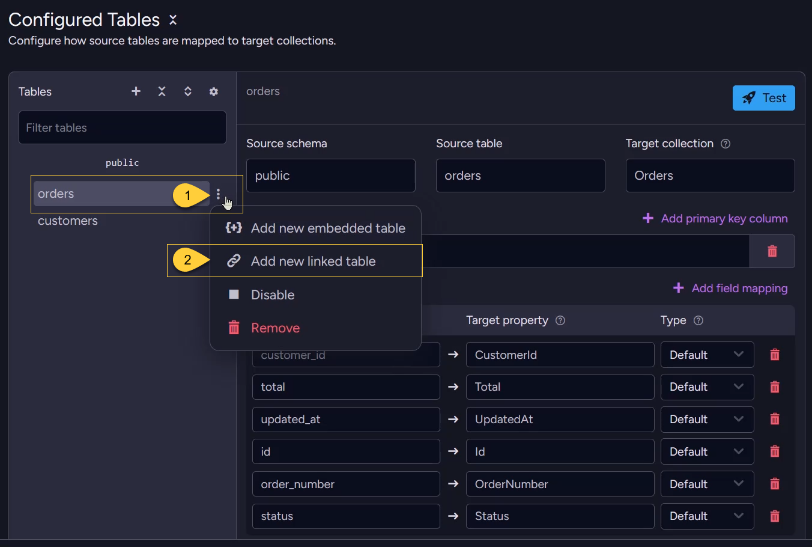
    
1. On a root (or embedded) table in the **Tables** list, click the three-dots **Table actions** icon.
2. Select **Add new linked table**.    
    
---
    
In this example, the `customers` table is linked under the `orders` root table.  
The resulting Order document gets a `Customer` property holding a document-ID reference into the `Customers` collection.    
    
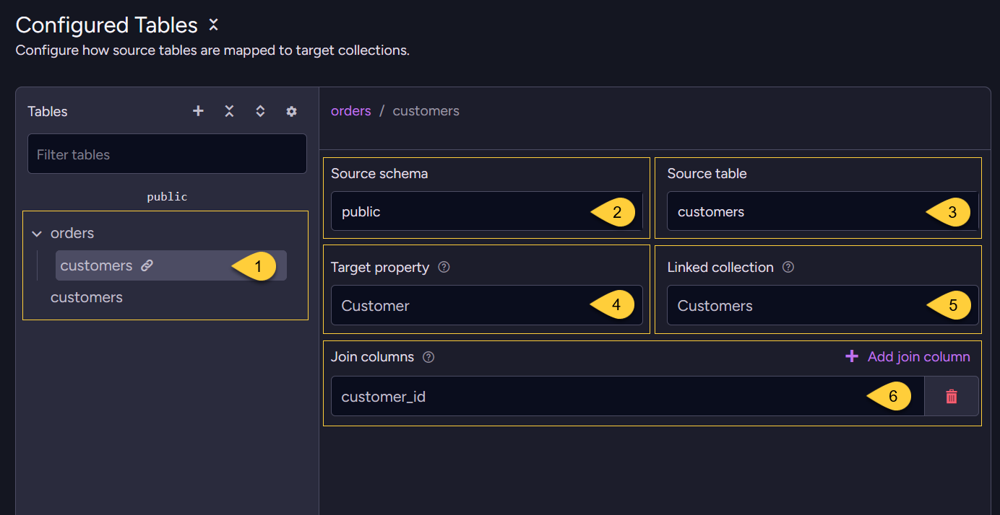

1. **The source table that is linked**    
2. **Source schema**  
   The related source schema.
3. **Source table**  
   The related source table.
4. **Target property**   
   The RavenDB document field that will hold the reference to the linked (related) document.
5. **Linked collection**     
   The RavenDB collection the reference points to.   
   Its name is combined with the join column value(s) to form the referenced document ID   
   (e.g. `Customers` + `customer_id` → `Customers/1`).
6. **Join columns**  
   The foreign key column(s) used to join this linked table to the parent table.  
   Their values, combined with the linked collection name, form the related document ID.  
   Click **Add join column** for a composite key.     
    
---    
    
### Configure embedded tables    
    
An **embedded table** nests the related rows _inside_ the parent document instead of referencing them.
    
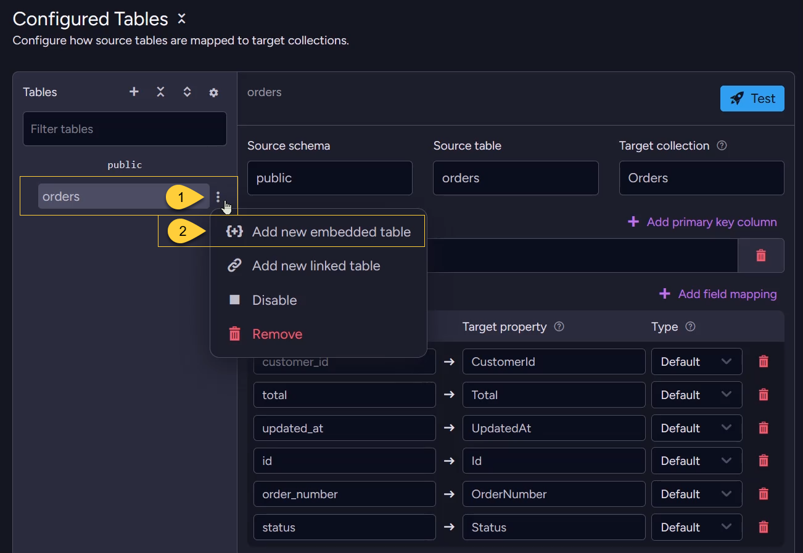
    
1. On a root (or embedded) table in the **Tables** list, click the three-dots **Table actions** icon.
2. Select **Add new embedded table**.
    
---    
    
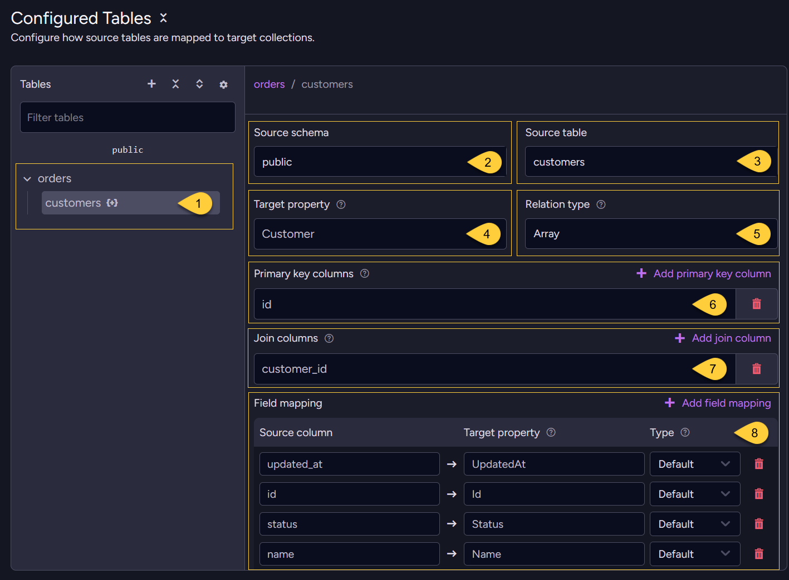
    
1. The embedded table appears nested under its parent in the **Tables** list (marked with `{+}`).
2. **Source schema**  
   The schema of the related source table (e.g. `public`).
3. **Source table**  
   The related source table (e.g. `customers`).
4. **Target property**  
   The RavenDB document field where the embedded related data will be stored.
5. **Relation type**  
   How related rows are embedded in the parent document:  
   * `Array` - multiple rows stored as an array of objects  
   * `Map` - multiple rows stored as a keyed object (dictionary)  
   * `Value` - a single row stored directly as an object  
6. **Primary key columns**  
   Columns that uniquely identify rows in this related table.
7. **Join columns**  
   Columns used to match rows in this related table with rows from the root table.
8. **Field mapping**  
   Map the related table's columns to document properties,  
   each with its own **Type** (Default / JSON / Attachment).        
    
---
    
### Test mapping
    
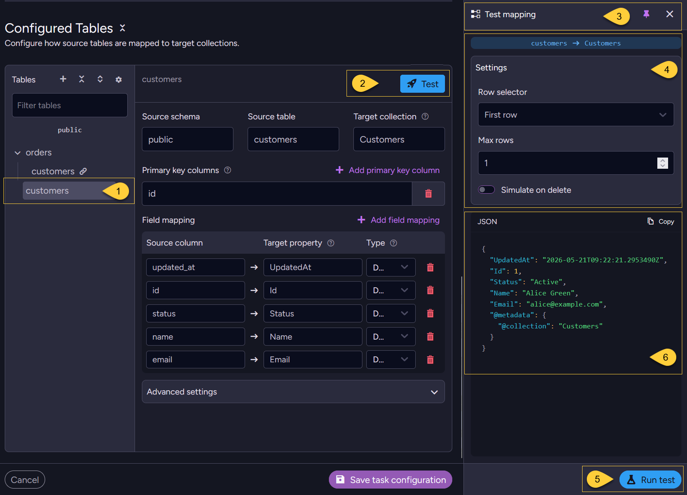
    
1. Select the table whose mapping you want to test.
2. Click **Test** to open the test panel.
3. The **Test mapping** panel shows the selected table-to-collection mapping (e.g. `customers` → `Customers`).
4. **Settings**  
   * **Row selector**   
     Choose which source rows to pull for the test:  
      * `First row`  
        Fetch rows from the top of the table.  
        Set **Max rows** to control how many rows to fetch and preview.  
        Each fetched row is turned into a RavenDB document, so you can preview **multiple** documents at once.  
      * `Primary key`  
        Fetch a **single** specific row by entering its primary key value(s).  
        For a composite primary key, enter one value per key column - together they identify one row.  
   * **Simulate on delete**   
     Run the test as if the rows were DELETE events instead of inserts/updates,  
     to preview your delete handling (Skip deletion / Delete patch).
5. Click **Run test** to execute the test against the source data.
6. The resulting RavenDB document(s) are shown as **JSON**.
    
---    
    
### Advanced settings
    
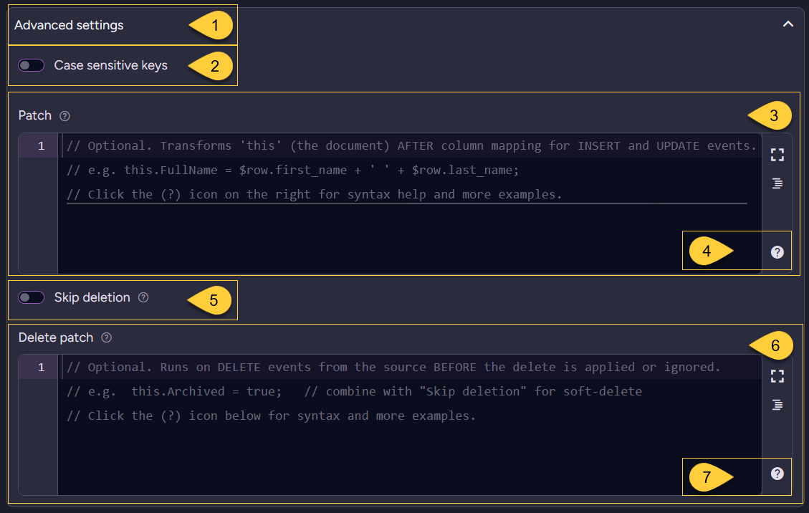
    
1. Expand **Advanced settings** for the selected table.
2. **Case sensitive keys**  
   This option is shown only for **embedded tables**.  
   For `Array` and `Map` embedded tables, it controls whether string primary-key values are matched case-sensitively when locating items within the parent document.  
   Enable it when values that differ only by letter case represent different keys. Default: off.    
3. **Patch**  
   An optional script that transforms `this` (the document) AFTER column mapping, on INSERT and UPDATE events.
4. **Patch syntax help**  
   Click the **(?)** icon for patch syntax help and examples.
5. **Skip deletion**  
   Enable to ignore source DELETE events (useful for soft-delete scenarios). 
6. **Delete patch**  
   An optional script that runs on DELETE events BEFORE the delete is applied or ignored.
7. **Delete-patch syntax help**  
   Click the **(?)** icon for delete-patch syntax help and examples.
    
---
    
### The created task    
    
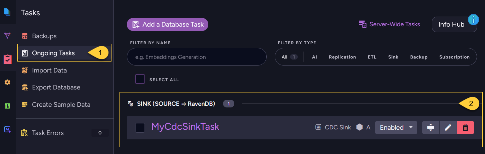    
    
1. The new task appears under **Ongoing Tasks**.
2. It is listed under the **SINK (SOURCE ⇒ RavenDB)** group, showing the task name, its responsible node, and its state.  
   Use the controls on the right to enable/disable, edit, or delete the task.

</Panel>

<Panel heading="Create a CDC Sink task via REST API">
    
<ContentFrame>
    
### Discover the source database schema  
    
Use this endpoint to list tables, columns, primary keys, and foreign keys from the source database.  
Use the returned schema metadata to build the `Tables` section of the `CdcSinkConfiguration` before sending the create-task request.    
    
The request body should include either:
* `ConnectionStringName`, to use a saved SQL connection string, or  
* `Connection`, to pass an inline `SqlConnectionString`. 
    
For PostgreSQL, you can include `Schemas` to limit schema discovery (defaults to `["public"]`).      

| Method | Endpoint | Auth |
|--------|----------|------|
| `POST` | `/databases/{databaseName}/admin/cdc-sink/schema` | `DatabaseAdmin` |

</ContentFrame>
<ContentFrame>
    
### Create the task
    
Send a `PUT` request whose body is the JSON `CdcSinkConfiguration`.  
Omit the `id` query-string parameter to create a new task; the response returns the assigned `TaskId`.

| Method | Endpoint | Auth |
|--------|----------|------|
| `PUT`  | `/databases/{databaseName}/admin/cdc-sink` | `DatabaseAdmin` |

</ContentFrame>    
    
</Panel>
