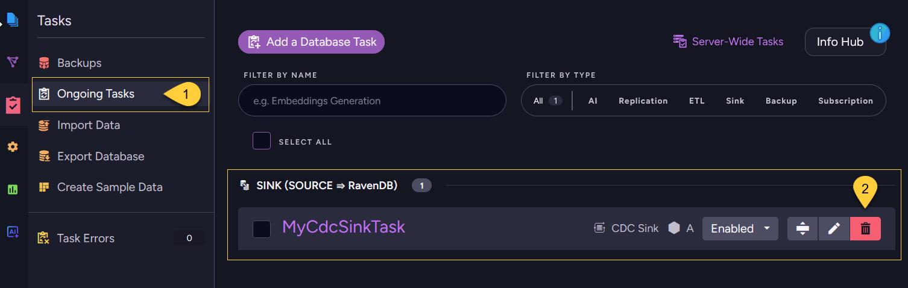

import Admonition from '@theme/Admonition';
import Tabs from '@theme/Tabs';
import TabItem from '@theme/TabItem';
import Panel from '@site/src/components/Panel';

<Admonition type="note" title="">

* Deleting a CDC Sink task:
  * removes the task definition from RavenDB 
  * stops RavenDB from consuming new changes from the source database
    
* Deleting a CDC Sink task does **not** delete:
  * target documents already written to RavenDB
  * the CDC Sink progress document (`@cdc-states/<task name>`) 
  * source-database change-capture or replication objects    

* This article shows how to delete a CDC Sink task using the Client API, Studio, or REST API,  
  and what source-side cleanup may still be needed.

* In this article:
  * [Delete a CDC Sink task via Client API](#delete-a-cdc-sink-task-via-client-api)
  * [Delete a CDC Sink task via Studio](#delete-a-cdc-sink-task-via-studio)
  * [Delete a CDC Sink task via REST API](#delete-a-cdc-sink-task-via-rest-api)
  * [Clean up source-database artifacts](#clean-up-source-database-artifacts)

</Admonition>

<Panel heading="Delete a CDC Sink task via Client API">

Use `DeleteOngoingTaskOperation` with the numeric CDC Sink task ID and `OngoingTaskType.CdcSink`.  

<Tabs>
<TabItem value="sync" label="Sync">
```csharp
store.Maintenance.Send(
    new DeleteOngoingTaskOperation(taskId, OngoingTaskType.CdcSink));
```
</TabItem>
<TabItem value="async" label="Async">
```csharp
await store.Maintenance.SendAsync(
    new DeleteOngoingTaskOperation(taskId, OngoingTaskType.CdcSink));
```
</TabItem>
</Tabs>

</Panel>

<Panel heading="Delete a CDC Sink task via Studio">



1. Navigate to **Databases** → your database → **Tasks** → **Ongoing Tasks**.
2. On the CDC Sink task, click the **delete** (trash) button and confirm.

</Panel>

<Panel heading="Delete a CDC Sink task via REST API">

To delete a CDC Sink task through REST, call the shared ongoing-task delete endpoint.  
Pass the numeric task ID as `id` and the task type as `type=CdcSink`.    

| Method   | Endpoint | Auth |
|----------|----------|------|
| `DELETE` | `/databases/{databaseName}/admin/tasks?id={taskId}&type=CdcSink` | `DatabaseAdmin` |

</Panel>

<Panel heading="Clean up source-database artifacts">

Deleting a CDC Sink task removes it on the **RavenDB** side only.    
RavenDB does **not** connect back to the source database to remove or disable CDC, replication, or privilege-related objects there.
That cleanup must be performed by an administrator with permissions on the source database.    

What remains depends on the source engine:

* **PostgreSQL (logical replication)**  
  A **replication slot** and a **publication** are left behind.
  Removing the slot is the priority: while it exists, PostgreSQL retains WAL segments indefinitely and can eventually fill the disk.
  Drop the slot with `pg_drop_replication_slot()` and the publication with `DROP PUBLICATION`.
  See [Cleanup and Maintenance](../../../../../server/ongoing-tasks/cdc-sink/source-database-setup/postgres/cleanup-and-maintenance.mdx).

* **SQL Server (native CDC)**  
  CDC stays enabled at the table (and database) level, including the capture instances, their change tables, and the CDC capture/cleanup **SQL Server Agent jobs**.
  Disable CDC on the affected tables with `sys.sp_cdc_disable_table` only if those capture instances are no longer used by any other consumer; 
  disable CDC on the database with `sys.sp_cdc_disable_db` only if no other tables use CDC.

* **MySQL / MariaDB (binlog)**  
  Binary logging is a server-wide setting, not a per-task object, so there is usually nothing task-specific to remove.  
  Any dedicated **replication user or granted privileges** created for the task remain and can be revoked if no longer needed.

</Panel>
