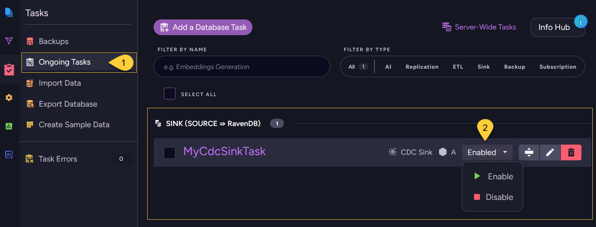
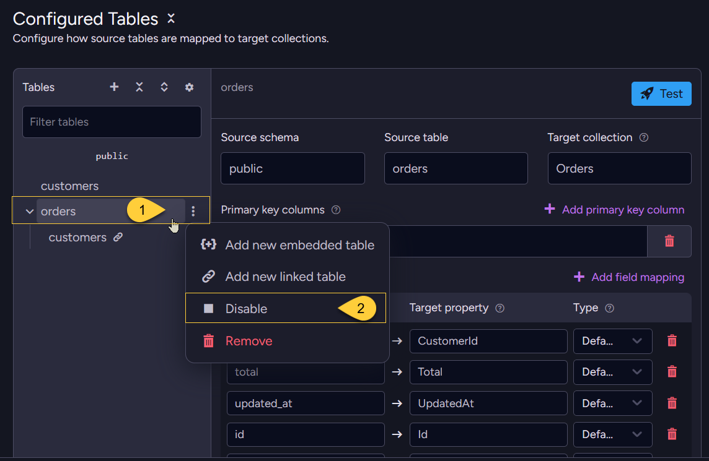

import Admonition from '@theme/Admonition';
import Tabs from '@theme/Tabs';
import TabItem from '@theme/TabItem';
import Panel from '@site/src/components/Panel';

<Admonition type="note" title="">
    
* You can enable or disable CDC Sink at two levels:  
  * **Task level**:  
    Pause or resume the entire CDC Sink task without deleting it.  
    A disabled task keeps its full configuration but stops consuming changes from the source.  
  * **Table level**:  
    Enable or disable an individual configured table.   
    A disabled table is skipped by CDC Sink while the task can continue syncing its other enabled tables.
    
* A CDC Sink task can be reported as one of the following:
  * `Enabled` - the task is enabled, with all configured tables enabled.
  * `PartiallyEnabled` - the task is enabled, but some configured tables are disabled.
  * `Disabled` - the task itself is disabled, or all configured tables are disabled.   

* This article shows how to enable or disable a CDC Sink task or a specific table using the Client API, Studio,  
  or REST API where applicable.      
    
* In this article:
  * [Enable/Disable a CDC Sink task via Client API](#enable-disable-a-cdc-sink-task-via-client-api)
  * [Enable/Disable a CDC Sink task via Studio](#enable-disable-a-cdc-sink-task-via-studio)
  * [Enable/Disable a CDC Sink task via REST API](#enable-disable-a-cdc-sink-task-via-rest-api)
  * [Enable/Disable a configured table via Client API](#enable-disable-a-configured-table-via-client-api)
  * [Enable/Disable a configured table via Studio](#enable-disable-a-configured-table-via-studio)
  * [Source-side effects of pausing a CDC Sink task](#source-side-effects-of-pausing-a-cdc-sink-task)

</Admonition>

<Panel heading="Enable/Disable a CDC Sink task via Client API">

Pause or resume the entire CDC Sink task using `ToggleOngoingTaskStateOperation`.  
Pass the CDC Sink task ID, `OngoingTaskType.CdcSink`, and `disable: true` to pause or `disable: false` to resume.

This operation affects the task as a whole.   
To enable or disable a single table, see [Enable/Disable a configured table via Client API](#enable-disable-a-configured-table-via-client-api).

<Tabs>
<TabItem value="sync" label="Sync">
```csharp
// Pause (disable) the task
store.Maintenance.Send(
    new ToggleOngoingTaskStateOperation(taskId, OngoingTaskType.CdcSink, disable: true));

// Resume (enable) the task
store.Maintenance.Send(
    new ToggleOngoingTaskStateOperation(taskId, OngoingTaskType.CdcSink, disable: false));
```
</TabItem>
<TabItem value="async" label="Async">
```csharp
// Pause (disable) the task
await store.Maintenance.SendAsync(
    new ToggleOngoingTaskStateOperation(taskId, OngoingTaskType.CdcSink, disable: true));

// Resume (enable) the task
await store.Maintenance.SendAsync(
    new ToggleOngoingTaskStateOperation(taskId, OngoingTaskType.CdcSink, disable: false));
```
</TabItem>
</Tabs>

</Panel>

<Panel heading="Enable/Disable a CDC Sink task via Studio">

To enable or disable the entire CDC Sink task from the Studio:

     

1. Navigate to **Databases** → your database → **Tasks** → **Ongoing Tasks**.
2. On the CDC Sink task, click its state dropdown and select **Enable** or **Disable**.  
   Alternatively, open the task for editing and use the **Task State** selector, then **Save**.
    
To enable or disable individual tables, see [Enable/Disable a configured table via Studio](#enable-disable-a-configured-table-via-studio). 

</Panel>

<Panel heading="Enable/Disable a CDC Sink task via REST API">

Use the shared ongoing-task state endpoint to pause or resume the entire CDC Sink task.  
Pass the CDC Sink task ID as `key`, `type=CdcSink`, and `disable=true` to pause or `disable=false` to resume.  
No request body is required.

| Method | Endpoint | Auth |
|--------|----------|------|
| `POST` | `/databases/{databaseName}/admin/tasks/state?key={taskId}&type=CdcSink&disable={true\|false}` | `DatabaseAdmin` |
    
This endpoint affects the task as a whole.  
To enable or disable a single table, see:  
  * [Enable/Disable a configured table via Client API](#enable-disable-a-configured-table-via-client-api)
  * [Enable/Disable a configured table via Studio](#enable-disable-a-configured-table-via-studio)    

</Panel>

<Panel heading="Enable/Disable a configured table via Client API">

In addition to enabling or disabling the task as a whole, you can enable or disable an **individual table** within a CDC Sink task. 
Each table is defined by a `CdcSinkTableConfig` that carries its own `Disabled` flag.

When a table is disabled, CDC Sink skips it:
the table is not initial-loaded, and changes from that table are not applied to RavenDB while it is disabled.
The task's other enabled tables keep syncing.    

Disabling a single table is a configuration change, so there is no dedicated toggle operation for it.  
Set `Disabled` on the relevant table and send the complete updated configuration with `UpdateCdcSinkOperation`  
(the same operation used to [update a task](../../../../../server/ongoing-tasks/cdc-sink/manage-cdc-sink-tasks/update-task.mdx)).

<Tabs>
<TabItem value="sync" label="Sync">
```csharp
// config holds the existing task configuration.

// Disable a single table by setting its Disabled flag
var table = config.Tables.First(t => t.SourceTableName == "orders");
table.Disabled = true;

// To re-enable the table later, set:
// table.Disabled = false;

// Send the complete updated configuration
store.Maintenance.Send(new UpdateCdcSinkOperation(taskId, config));
```
</TabItem>
<TabItem value="async" label="Async">
```csharp
// config holds the existing task configuration.

// Disable a single table by setting its Disabled flag
var table = config.Tables.First(t => t.SourceTableName == "orders");
table.Disabled = true;

// To re-enable the table later, set:
// table.Disabled = false;

// Send the complete updated configuration
await store.Maintenance.SendAsync(new UpdateCdcSinkOperation(taskId, config));
```
</TabItem>
</Tabs>

</Panel>

<Panel heading="Enable/Disable a configured table via Studio">
    
To enable or disable a configured root table from the Studio, open the CDC Sink task for editing  
(**Ongoing Tasks** → click the task name or the edit icon), then go to the **Configured Tables** section:
    
         

1. In the **Tables** list, click the three-dots **Table actions** icon for the table you want to change.
2. Select **Disable** (the same action shows **Enable** when the table is already disabled).

Click **Save task configuration** to apply the change.

A disabled table is shown dimmed in the **Tables** list.  
If the task itself remains enabled and at least one other configured table remains enabled,  
the task is listed as `PartiallyEnabled` in the **Ongoing Tasks** view.

</Panel>

<Panel heading="Source-side effects of pausing a CDC Sink task">
    
These effects apply when the **whole task is paused** and CDC Sink stops advancing its source-database position.  
They do not apply in the same way when an individual table is disabled while the task keeps running.

**PostgreSQL:**  
Pausing a CDC Sink task stops the replication slot from being consumed.
PostgreSQL retains WAL segments for unconsumed slots, so pausing for an extended period causes WAL to accumulate on disk.  
Monitor disk usage if a task is paused for more than a short time.
See [Monitoring PostgreSQL](../../../../../server/ongoing-tasks/cdc-sink/source-database-setup/postgres/monitoring-postgres.mdx).

**SQL Server:**  
Pausing a CDC Sink task for longer than SQL Server's CDC retention period can cause SQL Server to clean up CDC change-table rows that have not yet been consumed. 
If cleanup occurs while the task is paused, CDC Sink will report an error on resume - the task may need to be recreated rather than simply resumed.    
    
</Panel>