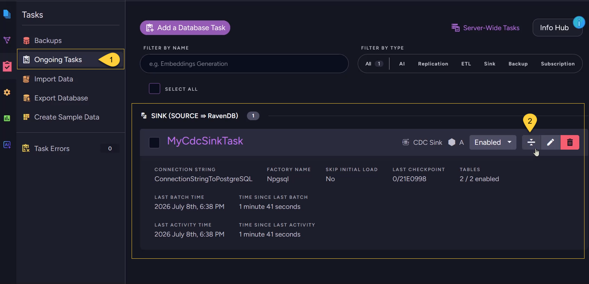

import Admonition from '@theme/Admonition';
import Tabs from '@theme/Tabs';
import TabItem from '@theme/TabItem';
import Panel from '@site/src/components/Panel';
import ContentFrame from "@site/src/components/ContentFrame";

<Admonition type="note" title="">

* Retrieve information about a CDC Sink task, including its configuration, task state,
  connection status, responsible node, and last reported error.

* This article shows how to get CDC Sink task info using the Client API, Studio, or REST API.
    
* In this article:
  * [Get CDC Sink task info via Client API](#get-cdc-sink-task-info-via-client-api)
  * [Get CDC Sink task info via Studio](#get-cdc-sink-task-info-via-studio)
  * [Get CDC Sink task info via REST API](#get-cdc-sink-task-info-via-rest-api)    

</Admonition>

<Panel heading="Get CDC Sink task info via Client API">

Use `GetOngoingTaskInfoOperation` with `OngoingTaskType.CdcSink`  
to retrieve information about a specific CDC Sink task.    

<ContentFrame>

### Get task info by task ID

Pass the numeric `taskId` together with `OngoingTaskType.CdcSink`.

<Tabs>
<TabItem value="sync" label="Sync">
```csharp
var taskInfo = (OngoingTaskCdcSink)store.Maintenance.Send(
    new GetOngoingTaskInfoOperation(taskId, OngoingTaskType.CdcSink));
```
</TabItem>
<TabItem value="async" label="Async">
```csharp
var taskInfo = (OngoingTaskCdcSink)await store.Maintenance.SendAsync(
    new GetOngoingTaskInfoOperation(taskId, OngoingTaskType.CdcSink));
```
</TabItem>
</Tabs>

</ContentFrame>
<ContentFrame>

### Get task info by task name

Pass the task name together with `OngoingTaskType.CdcSink`.

<Tabs>
<TabItem value="sync" label="Sync">
```csharp
var taskInfo = (OngoingTaskCdcSink)store.Maintenance.Send(
    new GetOngoingTaskInfoOperation("MyCdcSinkTaskName", OngoingTaskType.CdcSink));
```
</TabItem>
<TabItem value="async" label="Async">
```csharp
var taskInfo = (OngoingTaskCdcSink)await store.Maintenance.SendAsync(
    new GetOngoingTaskInfoOperation("MyCdcSinkTaskName", OngoingTaskType.CdcSink));
```
</TabItem>
</Tabs>

</ContentFrame> 

---

The returned `OngoingTaskCdcSink` object exposes the task's identity, configuration, connection details,  
and runtime status, including:    

**Identity**

| Field | Description |
|-------|-------------|
| `TaskId` / `TaskName` | Task identity |

**State & status**

| Field | Description |
|-------|-------------|
| `TaskState` | `Enabled`, `Disabled`, or `PartiallyEnabled` |
| `TaskConnectionStatus` | `Active`, `NotActive`, `Reconnect`, or `NotOnThisNode` |
| `ResponsibleNode` | The cluster node currently running the task. |
| `Error` | The last error reported by the task, if any. |
| `HealthIssue` | `null` when healthy; a diagnostic message when the task detects a problem<br/>(fallback mode, stale connection, etc.) |

**Connection & configuration**

| Field | Description |
|-------|-------------|
| `ConnectionStringName` | Name of the connection string the task uses. |
| `FactoryName` | The source provider (PostgreSQL, SQL Server, or MySQL/MariaDB). |
| `Configuration` | The full `CdcSinkConfiguration` (tables, column mappings, and other saved settings). |

**Runtime & lag**

| Field | Description |
|-------|-------------|
| `LastBatchTime` | UTC time of the last successfully completed batch.<br/>`null` if no batch has completed yet. |
| `LastCheckpoint` | The last successfully persisted checkpoint (LSN/GTID). |
| `SecondsSinceLastBatch` | Seconds since the last successful batch. Provides a simple lag indicator.<br/>`null` if no batch has completed yet. |
| `LastActivityTime` | UTC time of the last activity from the source<br/>(poll iteration, replication message, or binlog event).<br/>`null` before the first activity. |
| `SecondsSinceLastActivity` | Seconds since the last source activity.<br/>A large value may indicate a dead connection. |

<Admonition type="info" title="">
For performance and progress metrics (per-table statistics, initial-load progress),
see [Monitoring](../../../../../server/ongoing-tasks/cdc-sink/monitoring.mdx).
</Admonition>

</Panel>

<Panel heading="Get CDC Sink task info via Studio">
    


1. Navigate to **Databases** → your database → **Tasks** → **Ongoing Tasks**.
2. On the CDC Sink task row, click the **details toggle** to expand the task and open the detail view.

</Panel>

<Panel heading="Get CDC Sink task info via REST API">

CDC Sink uses the shared single-task info endpoint.  
Identify the task either by ID (`key`) or by name (`taskName`), together with `type=CdcSink`.

| Method | Endpoint | Auth |
|--------|----------|------|
| `GET`  | `/databases/{databaseName}/task?key={taskId}&type=CdcSink` | `ValidUser` |
| `GET`  | `/databases/{databaseName}/task?taskName={taskName}&type=CdcSink` | `ValidUser` |

</Panel>
