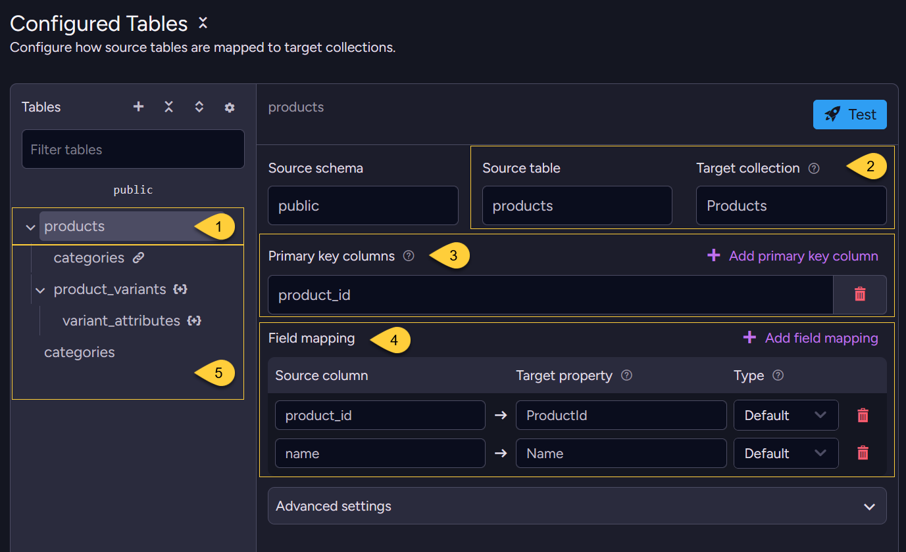
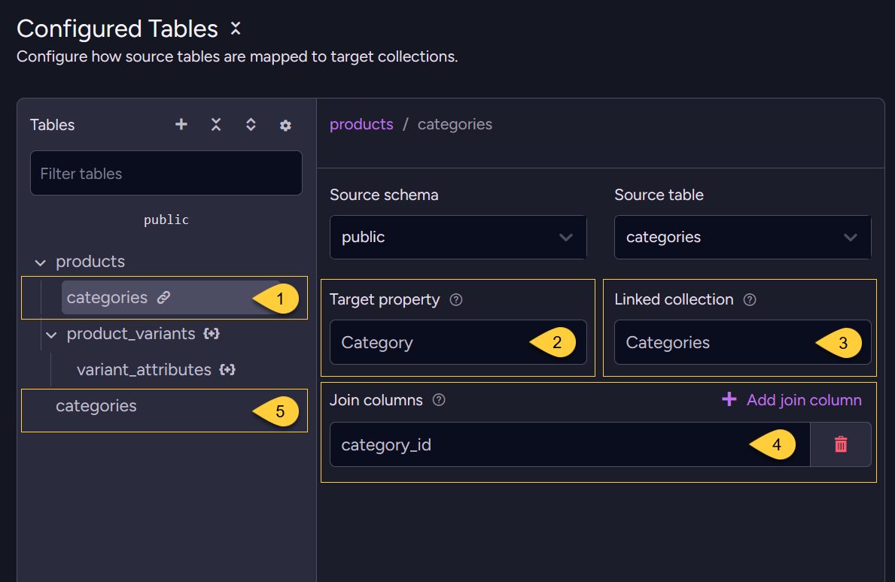
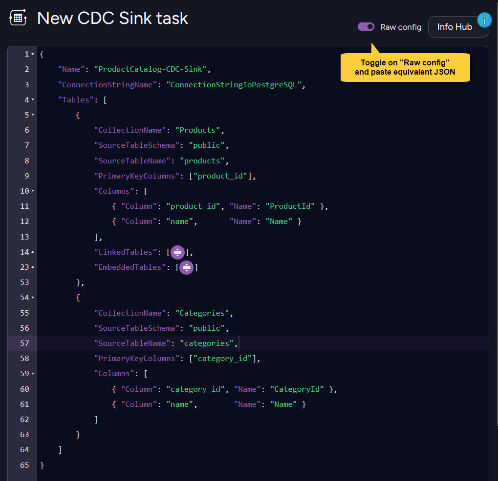

import Admonition from '@theme/Admonition';
import Tabs from '@theme/Tabs';
import TabItem from '@theme/TabItem';
import Panel from '@site/src/components/Panel';

<Admonition type="note" title="">
    
* This example shows how to combine deep **embedded-table nesting** with **linked table references**  
  in one CDC Sink task.

* It models a product catalog as RavenDB documents, with `products` as the root table,  
  nested `product_variants` and `variant_attributes` arrays, and a linked `categories` document reference.    

* For detailed instructions on creating a CDC Sink task with the Client API or Studio,  
  see [Create a CDC Sink task](../../../../../../../server/ongoing-tasks/cdc-sink/manage-cdc-sink-tasks/create-task.mdx).       

* In this article:
  * [Source schema](#source-schema)
  * [REPLICA IDENTITY setup](#replica-identity-setup)
  * [Task configuration](#task-configuration)
    * [Via the Client API](#via-the-client-api)
    * [Via Studio](#via-studio)
  * [Resulting documents](#resulting-documents)

</Admonition>

<Panel heading="Source schema">
    
This schema uses `products` as the root table for `Products` documents.  
    
`categories` is synced as a separate root table and referenced from each product,  
while `product_variants` and `variant_attributes` are embedded under the product document.

`variant_attributes` includes `product_id` even though it joins directly to `product_variants`:  
CDC Sink needs the root primary key on descendant embedded rows to locate the root document.

<Tabs>
<TabItem value="sql" label="SQL">
```sql
CREATE TABLE categories (
    category_id SERIAL PRIMARY KEY,
    name        TEXT NOT NULL
);

CREATE TABLE products (
    product_id  SERIAL PRIMARY KEY,
    name        TEXT NOT NULL,
    category_id INT REFERENCES categories(category_id)
);

CREATE TABLE product_variants (
    variant_id  SERIAL PRIMARY KEY,
    product_id  INT NOT NULL REFERENCES products(product_id),
    sku         TEXT NOT NULL,
    price       NUMERIC(10,2)
);

CREATE TABLE variant_attributes (
    attr_id    SERIAL PRIMARY KEY,
    -- Denormalized root primary key, required for deep nesting
    product_id INT NOT NULL REFERENCES products(product_id),
    variant_id INT NOT NULL REFERENCES product_variants(variant_id),
    attr_name  TEXT NOT NULL,
    attr_value TEXT NOT NULL
);
```
</TabItem>
</Tabs>

</Panel>

<Panel heading="REPLICA IDENTITY setup">

* For delete events, CDC Sink must receive the columns it uses to route the change and identify the embedded item.  
    
* In this schema, both embedded tables use single-column primary keys that do not include their routing columns,  
  so PostgreSQL's default primary-key-only replica identity is not enough.

* Instead of `REPLICA IDENTITY FULL`, which includes all columns,  
  this example uses targeted unique indexes that cover only the required routing and primary-key columns:

    <Tabs>
    <TabItem value="sql" label="SQL">
    ```sql
    -- product_variants:
    -- product_id locates the root Products document, variant_id identifies the embedded item
    CREATE UNIQUE INDEX product_variants_replica_idx
        ON product_variants (product_id, variant_id);
    ALTER TABLE product_variants
        REPLICA IDENTITY USING INDEX product_variants_replica_idx;
    
    -- variant_attributes:
    -- product_id locates the root Products document,
    -- variant_id locates the parent variant,
    -- attr_id identifies the embedded attribute item
    CREATE UNIQUE INDEX variant_attributes_replica_idx
        ON variant_attributes (product_id, variant_id, attr_id);
    ALTER TABLE variant_attributes
        REPLICA IDENTITY USING INDEX variant_attributes_replica_idx;
    ```
    </TabItem>
    </Tabs>

    Learn more in [REPLICA IDENTITY](../../../../../../../server/ongoing-tasks/cdc-sink/source-database-setup/postgres/replica-identity.mdx).

</Panel>

<Panel heading="Task configuration">

Multi-level embedding follows these routing rules:

* Each embedded table's `JoinColumns` points to the primary key of its direct parent.
* Every embedded row must also contain the root primary key (`product_id`) so CDC Sink can locate the root `Products` document.
* For deeper embedded tables, `JoinColumns` still names the direct-parent key.  
  Here, `variant_attributes.JoinColumns` is `variant_id`;  
  `product_id` is present only for root-document routing and does not need to be mapped as an embedded property.

---
    
### Via the Client API

Create the task with the Client API:

<Tabs>
<TabItem value="csharp" label="csharp">
```csharp
var config = new CdcSinkConfiguration
{
    Name = "ProductCatalog-CDC-Sink",
    ConnectionStringName = "ConnectionStringToPostgreSQL",
    Tables =
    [
        new CdcSinkTableConfig
        {
            CollectionName = "Products",
            SourceTableSchema = "public",
            SourceTableName = "products",
            PrimaryKeyColumns = ["product_id"],
            Columns =
            [
                new CdcColumnMapping() { Column = "product_id", Name = "ProductId" },
                new CdcColumnMapping() { Column = "name",       Name = "Name" },
            ],
            // Linked table: category_id FK → document ID in Categories collection
            LinkedTables =
            [
                new CdcSinkLinkedTableConfig
                {
                    SourceTableSchema = "public",
                    SourceTableName = "categories",
                    PropertyName = "Category",
                    LinkedCollectionName = "Categories",
                    JoinColumns = ["category_id"]
                }
            ],
            EmbeddedTables =
            [
                new CdcSinkEmbeddedTableConfig
                {
                    SourceTableSchema = "public",
                    SourceTableName = "product_variants",
                    PropertyName = "Variants",
                    Type = CdcSinkRelationType.Array,
                    JoinColumns = ["product_id"],
                    PrimaryKeyColumns = ["variant_id"],
                    Columns =
                    [
                        new CdcColumnMapping() { Column = "variant_id", Name = "VariantId" },
                        new CdcColumnMapping() { Column = "sku",        Name = "Sku" },
                        new CdcColumnMapping() { Column = "price",      Name = "Price" },
                    ],
                    // Deep-nested: attributes within each variant
                    EmbeddedTables =
                    [
                        new CdcSinkEmbeddedTableConfig
                        {
                            SourceTableSchema = "public",
                            SourceTableName = "variant_attributes",
                            PropertyName = "Attributes",
                            Type = CdcSinkRelationType.Array,
                            // FK to the direct parent (product_variants) PK.
                            // The root PK (product_id) must exist as a denormalized column
                            // but is NOT listed here.
                            JoinColumns = ["variant_id"],
                            PrimaryKeyColumns = ["attr_id"],
                            Columns =
                            [
                                new CdcColumnMapping() { Column = "attr_id", Name = "AttrId" },
                                new CdcColumnMapping() { Column = "attr_name",  Name = "Name" },
                                new CdcColumnMapping() { Column = "attr_value", Name = "Value" },
                            ]
                        }
                    ]
                }
            ]
        },
        // Sync the linked target as its own root table.
        // Without this, this task writes the Category ID string 
        // but does not create the referenced Categories document.    
        new CdcSinkTableConfig
        {
            CollectionName = "Categories",
            SourceTableSchema = "public",
            SourceTableName = "categories",
            PrimaryKeyColumns = ["category_id"],
            Columns =
            [
                new CdcColumnMapping() { Column = "category_id", Name = "CategoryId" },
                new CdcColumnMapping() { Column = "name",        Name = "Name" },
            ]
        }
    ]
};

await store.Maintenance.SendAsync(new AddCdcSinkOperation(config));
```
</TabItem>
</Tabs>
    
---

### Via Studio

In Studio, configure how the `products` source table maps to the `Products` target collection,  
add `categories` as a **linked reference**, and nest `product_variants` and `variant_attributes` as **embedded tables**.  
    
The left **Tables** tree shows the full structure: the root `products` table, its linked `categories` reference,  
the embedded `product_variants` &rarr; `variant_attributes` chain, and the standalone `categories` root table.

---

First, configure the root `products` table:



1. Select the root source table to configure.   
2. **Source table &rarr; target collection**  
   The `products` table maps to the `Products` collection.  
   This is a root table, so each row becomes its own document.
3. **Primary key columns**  
   `product_id` is used to build the document ID for each product.
4. **Field mapping**  
   Maps each source column to its target property  
   (`product_id` &rarr; `ProductId`, `name` &rarr; `Name`).
5. **Linked and embedded children**  
   The linked `categories` reference and the embedded `product_variants` tree are attached to this root table  
   and appear as child nodes under `products` in the Tables tree.

---

Then add the linked `categories` reference:



1. **Linked table**  
   `categories` is added as a **linked reference** on the `products` table, not as an embedded table.  
   It stores a document ID string on the product document rather than nesting a copy of the category.
2. **Target property**  
   The reference is written to the `Category` property of each product document.
3. **Linked collection**  
   `Categories` - the reference resolves to IDs such as `Categories/3`.
4. **Join columns**  
   `category_id` - the foreign key on the product row used to build the linked document ID.
5. **Referenced table as a root table**  
   The lower `categories` node is configured separately as a root table, not as part of the linked reference.  
   This lets CDC Sink create `Categories/<id>` documents that the `Category` link can point to and include.  
   Learn more in [Linked tables](../../../../../../../server/ongoing-tasks/cdc-sink/document-modeling/linked-tables.mdx).
    
---

<Admonition type="note" title="">

#### Embedded tables
    
* The embedded `product_variants` and `variant_attributes` tables (the `{+}` nodes in the tree) are configured by
  selecting their node in the Tables tree and setting the relation type, primary key, join columns, and field mapping.
    
* For an example that shows the embedded-table fields in Studio, see
  [Denormalization with Embedded Tables](../../../../../../../server/ongoing-tasks/cdc-sink/source-database-setup/postgres/examples/example-denormalization.mdx).  
  For the full configuration reference, see [Embedded Tables](../../../../../../../server/ongoing-tasks/cdc-sink/document-modeling/embedded-tables.mdx).

#### Deep nesting is configured the same way 
    
* `variant_attributes` is added as an embedded table *inside* `product_variants`,  
  just as `product_variants` is added inside `products` - one level deeper.
    
* The extra requirement is that descendant embedded rows carry the denormalized root primary key (`product_id`) 
  so CDC Sink can locate the root document.
    
</Admonition>

---

Alternatively, toggle **Raw config** and paste the equivalent JSON:
    
     

<Tabs>
<TabItem value="json" label="Raw config (JSON)">
```json
{
    "Name": "ProductCatalog-CDC-Sink",
    "ConnectionStringName": "ConnectionStringToPostgreSQL",
    "Tables": [
        {
            "CollectionName": "Products",
            "SourceTableSchema": "public",
            "SourceTableName": "products",
            "PrimaryKeyColumns": ["product_id"],
            "Columns": [
                { "Column": "product_id", "Name": "ProductId" },
                { "Column": "name",       "Name": "Name" }
            ],
            "LinkedTables": [
                {
                    "SourceTableSchema": "public",
                    "SourceTableName": "categories",
                    "PropertyName": "Category",
                    "LinkedCollectionName": "Categories",
                    "JoinColumns": ["category_id"]
                }
            ],
            "EmbeddedTables": [
                {
                    "SourceTableSchema": "public",
                    "SourceTableName": "product_variants",
                    "PropertyName": "Variants",
                    "Type": "Array",
                    "JoinColumns": ["product_id"],
                    "PrimaryKeyColumns": ["variant_id"],
                    "Columns": [
                        { "Column": "variant_id", "Name": "VariantId" },
                        { "Column": "sku",        "Name": "Sku" },
                        { "Column": "price",      "Name": "Price" }
                    ],
                    "EmbeddedTables": [
                        {
                            "SourceTableSchema": "public",
                            "SourceTableName": "variant_attributes",
                            "PropertyName": "Attributes",
                            "Type": "Array",
                            "JoinColumns": ["variant_id"],
                            "PrimaryKeyColumns": ["attr_id"],
                            "Columns": [
                                { "Column": "attr_id",    "Name": "AttrId" },
                                { "Column": "attr_name",  "Name": "Name" },
                                { "Column": "attr_value", "Name": "Value" }
                            ]
                        }
                    ]
                }
            ]
        },
        {
            "CollectionName": "Categories",
            "SourceTableSchema": "public",
            "SourceTableName": "categories",
            "PrimaryKeyColumns": ["category_id"],
            "Columns": [
                { "Column": "category_id", "Name": "CategoryId" },
                { "Column": "name",        "Name": "Name" }
            ]
        }
    ]
}
```
</TabItem>
</Tabs>

</Panel>

<Panel heading="Resulting documents">

Given these source rows:

**`categories`**

| category_id | name     |
|-------------|----------|
| 3           | Footwear |

**`products`**

| product_id | name        | category_id |
|------------|-------------|-------------|
| 42         | Hiking Boot | 3           |

**`product_variants`**

| variant_id | product_id | sku       | price |
|------------|------------|-----------|-------|
| 101        | 42         | HB-BLK-10 | 89.99 |
| 102        | 42         | HB-BRN-11 | 89.99 |

**`variant_attributes`**

| attr_id | product_id | variant_id | attr_name | attr_value |
|---------|------------|------------|-----------|------------|
| 1       | 42         | 101        | Color     | Black      |
| 2       | 42         | 101        | Size      | 10         |
| 3       | 42         | 102        | Color     | Brown      |
| 4       | 42         | 102        | Size      | 11         |

<br/>
    
CDC Sink creates the root RavenDB document `Products/42`:

<Tabs>
<TabItem value="json" label="json">
```json
{
    "ProductId": 42,
    "Name": "Hiking Boot",
    "Category": "Categories/3",
    "Variants": [
        {
            "VariantId": 101,
            "Sku": "HB-BLK-10",
            "Price": 89.99,
            "Attributes": [
                { "AttrId": 1, "Name": "Color", "Value": "Black" },
                { "AttrId": 2, "Name": "Size",  "Value": "10" }
            ]
        },
        {
            "VariantId": 102,
            "Sku": "HB-BRN-11",
            "Price": 89.99,
            "Attributes": [
                { "AttrId": 3, "Name": "Color", "Value": "Brown" },
                { "AttrId": 4, "Name": "Size",  "Value": "11" }
            ]
        }
    ],
    "@metadata": { "@collection": "Products" }
}
```
</TabItem>
</Tabs>

The standalone `categories` root table creates `Categories/3`:    

<Tabs>
<TabItem value="json" label="json">
```json
{
    "CategoryId": 3,
    "Name": "Footwear",
    "@metadata": { "@collection": "Categories" }
}
```
</TabItem>
</Tabs>

<Admonition type="note" title="">
    
* The `Category` property is a document ID reference, not an embedded copy of the category row.  
    
* Because `categories` is also configured as a root table, CDC Sink creates the referenced `Categories/3` document,
  which can be included when loading or querying products.
    
</Admonition>

</Panel>