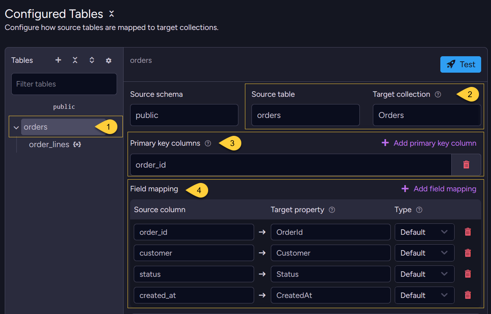
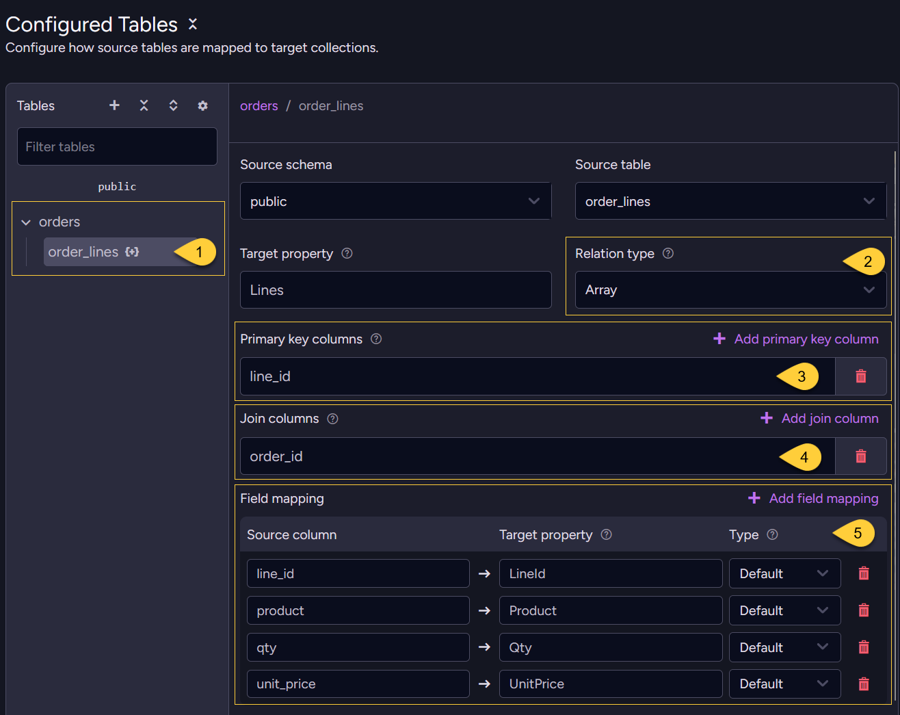
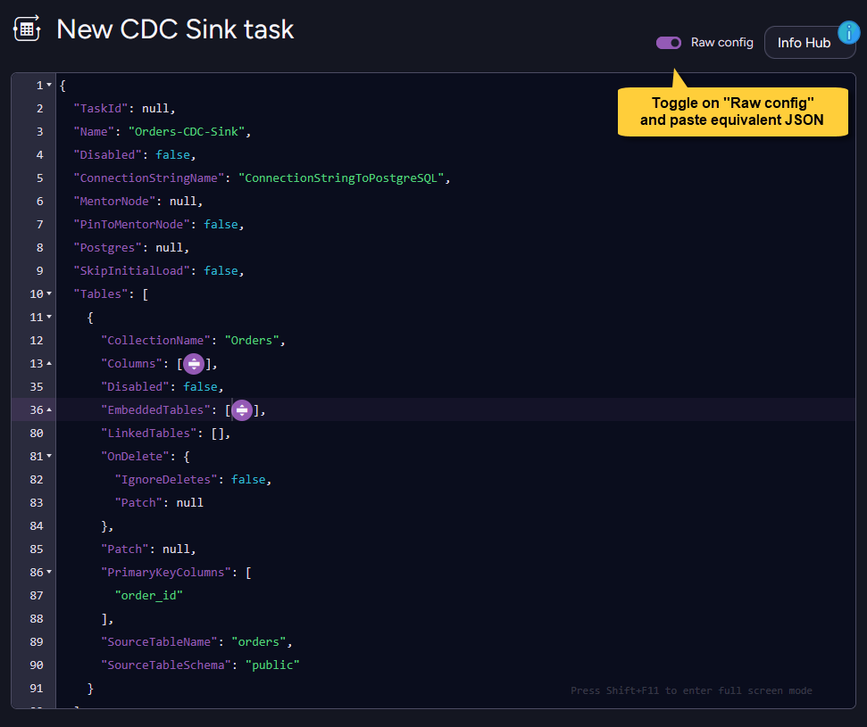

import Admonition from '@theme/Admonition';
import Tabs from '@theme/Tabs';
import TabItem from '@theme/TabItem';
import Panel from '@site/src/components/Panel';
import ContentFrame from "@site/src/components/ContentFrame";

<Admonition type="note" title="">

* This example shows how to model a normalized PostgreSQL `orders` + `order_lines` schema  
  as RavenDB `Orders` documents, each with an embedded `Lines` array.
    
* For detailed instructions on creating a CDC Sink task with the Client API or Studio,  
  see [Create a CDC Sink task](../../../../../../../server/ongoing-tasks/cdc-sink/manage-cdc-sink-tasks/create-task.mdx).       

* In this article:
  * [Source schema](#source-schema)
  * [REPLICA IDENTITY setup](#replica-identity-setup)
  * [Task configuration](#task-configuration)
    * [Via the Client API](#via-the-client-api)
    * [Via Studio](#via-studio)
  * [Resulting documents](#resulting-documents)
  * [What happens on change events](#what-happens-on-change-events)

</Admonition>

<Panel heading="Source schema">
    
The `orders` table is the root table.  
The `order_lines` table stores line items; each row belongs to an order through the `order_id` foreign key.  
CDC Sink later uses this relationship to embed each order's lines in the `Lines` array.    
    
    
<Tabs>
<TabItem value="sql" label="SQL">
```sql
CREATE TABLE orders (
    order_id   SERIAL PRIMARY KEY,
    customer   TEXT NOT NULL,
    status     TEXT NOT NULL DEFAULT 'pending',
    created_at TIMESTAMPTZ DEFAULT now()
);

CREATE TABLE order_lines (
    line_id    SERIAL PRIMARY KEY,
    order_id   INT NOT NULL REFERENCES orders(order_id),
    product    TEXT NOT NULL,
    qty        INT NOT NULL,
    unit_price NUMERIC(10,2) NOT NULL
);
```
</TabItem>
</Tabs>

</Panel>

<Panel heading="REPLICA IDENTITY setup">

* `order_lines` uses `line_id` as its primary key.  
  The `order_id` column points to the parent `orders` row, but it is not part of the primary key.

* With PostgreSQL's default replica identity, DELETE events for `order_lines` include only `line_id`.  
  CDC Sink also needs `order_id` to find the parent `Orders` document before removing the embedded line.

* Setting `REPLICA IDENTITY FULL` on `order_lines` makes PostgreSQL include the full old row in DELETE events,  
  including `order_id`.
    
    <Tabs>
    <TabItem value="sql" label="SQL">
    ```sql
    ALTER TABLE order_lines REPLICA IDENTITY FULL;
    ```
    </TabItem>
    </Tabs>
    
    Learn more in [REPLICA IDENTITY](../../../../../../../server/ongoing-tasks/cdc-sink/source-database-setup/postgres/replica-identity.mdx).

</Panel>

<Panel heading="Task configuration">

### Via the Client API

Define `orders` as the **root** table.  
Then define `order_lines` as an **embedded** table stored in the `Lines` array: 

<Tabs>
<TabItem value="csharp" label="csharp">
```csharp
var config = new CdcSinkConfiguration
{
    Name = "Orders-CDC-Sink",
    ConnectionStringName = "ConnectionStringToPostgreSQL",
    Tables = new List<CdcSinkTableConfig>
    {
        new CdcSinkTableConfig
        {
            CollectionName = "Orders",
            SourceTableSchema = "public",
            SourceTableName = "orders",
            PrimaryKeyColumns = new List<string> { "order_id" },
            Columns =
            [
                new CdcColumnMapping() { Column = "order_id",   Name = "OrderId" },
                new CdcColumnMapping() { Column = "customer",   Name = "Customer" },
                new CdcColumnMapping() { Column = "status",     Name = "Status" },
                new CdcColumnMapping() { Column = "created_at", Name = "CreatedAt" },
            ],
            EmbeddedTables = new List<CdcSinkEmbeddedTableConfig>
            {
                new CdcSinkEmbeddedTableConfig
                {
                    SourceTableSchema = "public",
                    SourceTableName = "order_lines",
                    PropertyName = "Lines",
                    Type = CdcSinkRelationType.Array,
                    JoinColumns = new List<string> { "order_id" },
                    PrimaryKeyColumns = new List<string> { "line_id" },
                    Columns =
                    [
                        new CdcColumnMapping() { Column = "line_id",    Name = "LineId" },
                        new CdcColumnMapping() { Column = "product",    Name = "Product" },
                        new CdcColumnMapping() { Column = "qty",        Name = "Qty" },
                        new CdcColumnMapping() { Column = "unit_price", Name = "UnitPrice" },
                    ]
                }
            }
        }
    }
};

await store.Maintenance.SendAsync(new AddCdcSinkOperation(config));
```
</TabItem>
</Tabs>
    
---

### Via Studio 
    
In Studio, first configure how the `orders` source table maps to the `Orders` target collection.  
Then add `order_lines` as an embedded table inside each `Orders` document.    

---

First, configure the root `orders` table:



1. Select the root source table to configure.    
2. **Source table &rarr; target collection**  
   The `orders` table maps to the `Orders` collection.  
   This is a root table, so each row becomes its own document.
3. **Primary key columns**  
   `order_id` is used to build the document ID for each order (`Orders/<order_id>`).
4. **Field mapping**  
   Maps each source column to its target property  
   (`order_id` &rarr; `OrderId`, `customer` &rarr; `Customer`, `status` &rarr; `Status`, `created_at` &rarr; `CreatedAt`).

---

Then add the embedded `order_lines` table:



1. **Embedded table**  
   `order_lines` is configured as an embedded table inside each `Orders` document, not as its own collection.
2. **Relation type**  
   Each `Orders` document stores its lines as a JSON array (`Type: Array` in the config).
3. **Primary key columns**  
   `line_id` identifies each array element, so later updates and deletes affect the correct line.
4. **Join columns**  
   `order_id` links each line row to its parent `Orders` document.  
   In this example, PostgreSQL DELETE events need this value to route deleted lines correctly.
5. **Field mapping**  
   Maps each source column to its target property, matching the `Columns` list in the config.

---

Alternatively, toggle **Raw config** and paste the equivalent JSON:
   
    

<Tabs>
<TabItem value="json" label="Raw config (JSON)">
```json
{
    "Name": "Orders-CDC-Sink",
    "ConnectionStringName": "ConnectionStringToPostgreSQL",
    "Tables": [
        {
            "CollectionName": "Orders",
            "SourceTableSchema": "public",
            "SourceTableName": "orders",
            "PrimaryKeyColumns": ["order_id"],
            "Columns": [
                { "Column": "order_id",   "Name": "OrderId" },
                { "Column": "customer",   "Name": "Customer" },
                { "Column": "status",     "Name": "Status" },
                { "Column": "created_at", "Name": "CreatedAt" }
            ],
            "EmbeddedTables": [
                {
                    "SourceTableSchema": "public",
                    "SourceTableName": "order_lines",
                    "PropertyName": "Lines",
                    "Type": "Array",
                    "JoinColumns": ["order_id"],
                    "PrimaryKeyColumns": ["line_id"],
                    "Columns": [
                        { "Column": "line_id",    "Name": "LineId" },
                        { "Column": "product",    "Name": "Product" },
                        { "Column": "qty",        "Name": "Qty" },
                        { "Column": "unit_price", "Name": "UnitPrice" }
                    ]
                }
            ]
        }
    ]
}
```
</TabItem>
</Tabs>
    
</Panel>

<Panel heading="Resulting documents">

Assume the source tables contain these rows:

```plain
orders:      order_id=1, customer='Acme Corp', status='pending', created_at='2024-06-01 09:00:00+00'
order_lines: line_id=1, order_id=1, product='Widget A', qty=3, unit_price=9.99
order_lines: line_id=2, order_id=1, product='Widget B', qty=1, unit_price=24.99
```
<br/>
    
CDC Sink creates the RavenDB document `Orders/1`:

<Tabs>
<TabItem value="json" label="The generated document">
```json
{
    "OrderId": 1,
    "Customer": "Acme Corp",
    "Status": "pending",
    "CreatedAt": "2024-06-01T09:00:00+00:00",
    "Lines": [
        {
            "LineId": 1,
            "Product": "Widget A",
            "Qty": 3,
            "UnitPrice": 9.99
        },
        {
            "LineId": 2,
            "Product": "Widget B",
            "Qty": 1,
            "UnitPrice": 24.99
        }
    ],
    "@metadata": { "@collection": "Orders" }
}
```
</TabItem>
</Tabs>

</Panel>

<Panel heading="What happens on change events">

<ContentFrame>
    
**INSERT into `order_lines`**:      
A new item is appended to the `Lines` array.
    
</ContentFrame>        
<ContentFrame>
    
**UPDATE to `order_lines`**:      
If `order_id` stays the same,  
CDC Sink finds the item by `line_id` within the `Lines` array and updates its properties.      
If `order_id` changes,  
CDC Sink removes the line from the old parent document and adds it to the new parent document.      
This also relies on the [`REPLICA IDENTITY FULL` setup](#replica-identity-setup), so CDC Sink receives the old `order_id`.
    
</ContentFrame>        
<ContentFrame>
    
**DELETE from `order_lines`**:      
CDC Sink uses `order_id` to find the parent `Orders` document,  
then uses `line_id` to remove the matching item from the `Lines` array.      
This also relies on the [`REPLICA IDENTITY FULL` setup](#replica-identity-setup), so CDC Sink receives `order_id` from the deleted row.
    
</ContentFrame>        
<ContentFrame>
    
**UPDATE to `orders`**:      
Only the root document properties (`Status`, etc.) are updated.  
The `Lines` array is not affected.
    
</ContentFrame>        
<ContentFrame>
    
**DELETE from `orders`**:      
The entire `Orders/1` document is deleted, including all embedded lines.
    
</ContentFrame>

</Panel>
