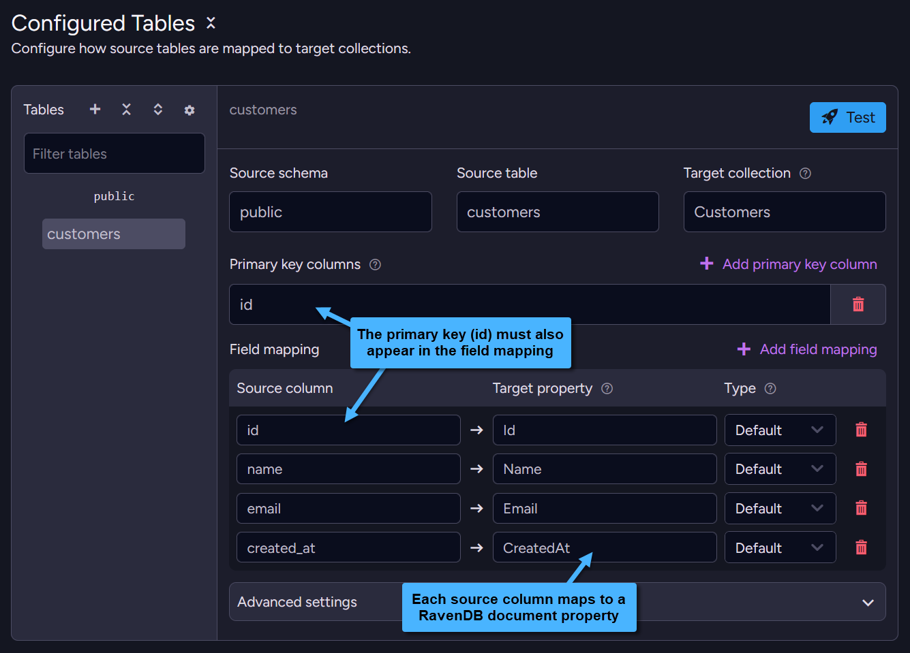
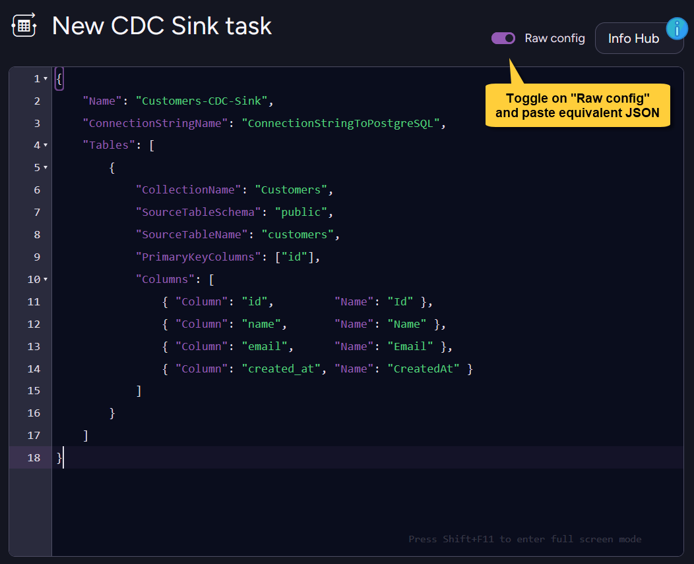

import Admonition from '@theme/Admonition';
import Tabs from '@theme/Tabs';
import TabItem from '@theme/TabItem';
import Panel from '@site/src/components/Panel';

<Admonition type="note" title="">

* This example shows the basic CDC Sink configuration to migrate a single SQL table into a RavenDB collection.

* For step-by-step instructions on creating a CDC Sink task with the Client API or Studio, 
  see [Create a CDC Sink task](../../../../../../../server/ongoing-tasks/cdc-sink/manage-cdc-sink-tasks/create-task.mdx).       

* In this article:
  * [Source schema](#source-schema)
  * [Task configuration](#task-configuration)
    * [Via the Client API](#via-the-client-api)
    * [Via Studio](#via-studio)
  * [Resulting documents](#resulting-documents)

</Admonition>

<Panel heading="Source schema">

A simple customers table:

<Tabs>
<TabItem value="sql" label="SQL">
```sql
CREATE TABLE customers (
    id         SERIAL PRIMARY KEY,
    name       TEXT NOT NULL,
    email      TEXT NOT NULL,
    created_at TIMESTAMPTZ DEFAULT now()
);
```
</TabItem>
</Tabs>

</Panel>

<Panel heading="Task configuration">

### Via the Client API

Define the task with the client API:

<Tabs>
<TabItem value="csharp" label="csharp">
```csharp
var config = new CdcSinkConfiguration
{
    Name = "Customers-CDC-Sink",
    ConnectionStringName = "ConnectionStringToPostgreSQL",
    Tables = new List<CdcSinkTableConfig>
    {
        new CdcSinkTableConfig
        {
            CollectionName = "Customers",
            SourceTableSchema = "public",
            SourceTableName = "customers",
            PrimaryKeyColumns = new List<string> { "id" },
            // Column = source SQL column, Name = RavenDB document property
            Columns =
            [
                new CdcColumnMapping() { Column = "id",         Name = "Id" },
                new CdcColumnMapping() { Column = "name",       Name = "Name" },
                new CdcColumnMapping() { Column = "email",      Name = "Email" },
                new CdcColumnMapping() { Column = "created_at", Name = "CreatedAt" },
            ]
        }
    }
};

await store.Maintenance.SendAsync(new AddCdcSinkOperation(config));
```
</TabItem>
</Tabs>
    
---
    
### Via Studio

Configure the task visually under **Configured Tables**:  
set the source table, target collection, primary key, and field mapping (source column &rarr; target property).
    


Alternatively, toggle **Raw config** and paste the equivalent JSON:

<Tabs>
<TabItem value="json" label="Raw config (JSON)">
```json
{
    "Name": "Customers-CDC-Sink",
    "ConnectionStringName": "ConnectionStringToPostgreSQL",
    "Tables": [
        {
            "CollectionName": "Customers",
            "SourceTableSchema": "public",
            "SourceTableName": "customers",
            "PrimaryKeyColumns": ["id"],
            "Columns": [
                { "Column": "id",         "Name": "Id" },
                { "Column": "name",       "Name": "Name" },
                { "Column": "email",      "Name": "Email" },
                { "Column": "created_at", "Name": "CreatedAt" }
            ]
        }
    ]
}
```
</TabItem>
</Tabs>
    
    

</Panel>

<Panel heading="Resulting documents">

Given this SQL row:

```plain
id=1, name='Alice', email='alice@example.com', created_at='2024-01-15 10:30:00+00'
```
<br/>
    
CDC Sink generates the document ID from `CollectionName` and the configured primary key column value.    
Here, `CollectionName = "Customers"` and `PrimaryKeyColumns = ["id"]`, so the document ID is `Customers/1`.

The `id` column must also be mapped in `Columns`; otherwise, the task configuration is rejected.  
In this example, it is mapped to the `Id` document property.    
   
    
The resulting RavenDB document:

<Tabs>
<TabItem value="json" label="The generated document">
```json
{
    "Id": 1,
    "Name": "Alice",
    "Email": "alice@example.com",
    "CreatedAt": "2024-01-15T10:30:00+00:00",
    "@metadata": {
        "@collection": "Customers"
    }
}
```
</TabItem>
</Tabs>

</Panel>