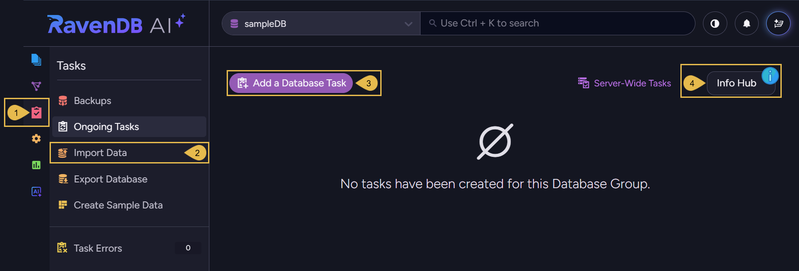
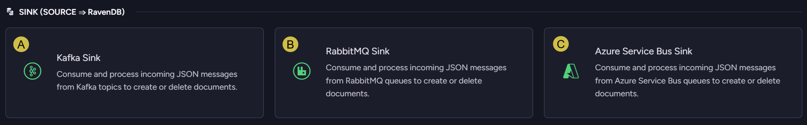
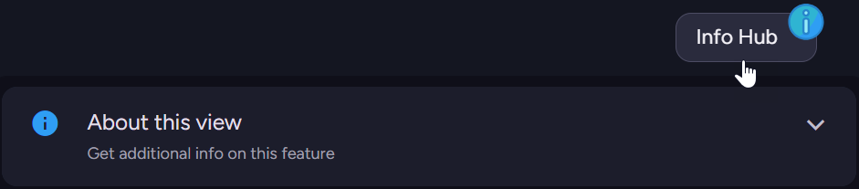
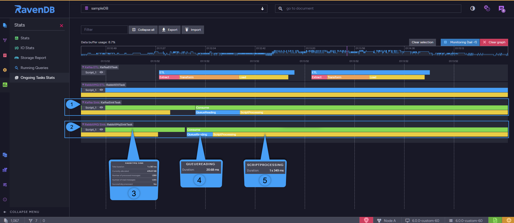

import Admonition from '@theme/Admonition';
import Tabs from '@theme/Tabs';
import TabItem from '@theme/TabItem';
import CodeBlock from '@theme/CodeBlock';
import LanguageSwitcher from "@site/src/components/LanguageSwitcher";
import LanguageContent from "@site/src/components/LanguageContent";

# Ongoing Tasks: Queue Sink Overview
<Admonition type="note" title="">

* Message brokers are high-throughput, distributed messaging services that 
  host data they receive from **producer** applications and serve it to 
  **consumer** clients via FIFO data queues. 
* RavenDB 5.4 and on can function as a _Producer_ in this architecture.  
  RavenDB 6.0 and on can also function as a _Consumer_.  
  <Admonition type="info" title="">
  This overview and the other pages in the Queue Sink section explain 
  **only** RavenDB's role as a _Consumer_ through the implementation of 
  a sink connector.  
  To learn about RavenDB's role as a _Producer_ please refer to the 
  [Queue ETL section](../../../server/ongoing-tasks/etl/queue-etl/overview.mdx).  
  </Admonition>
* RavenDB can run an ongoing Sink task that reads JSON formatted messages 
  from broker queues, apply a user-defined script that can, among other things, 
  construct documents from the retrieved messages, and potentially store 
  manufactured documents in RavenDB's database.  
* Supported message brokers currently include **Apache Kafka**, **RabbitMQ**, and **Azure Service Bus**.  

<Admonition type="info" title="">
Using RavenDB as a message broker sink can benefit users who want to combine 
Kafka, RabbitMQ, or Azure Service Bus's immense capability to collect and stream data with RavenDB's 
ability to process this data, reveal and exploit its value.  
</Admonition>

* In this page:  
   * [Supported Message Brokers](#supported-message-brokers)  
   * [Task Statistics](#task-statistics)  
   * [Licensing](#licensing)  

</Admonition>
## Supported Message Brokers

Message brokers currently supported by RavenDB include **Apache Kafka**, **RabbitMQ**, and **Azure Service Bus**.  

1. Open the **tasks menu**.
2. Open the **ongoing tasks** view.  
3. Create a new **database task**.  
   
   * **A**. **Kafka Sink**  
     Click to define a [Kafka Queue Sink task](../../../server/ongoing-tasks/queue-sink/kafka-queue-sink.mdx).  
   * **B**. **RabbitMQ Sink**  
     Click to define a [RabbitMQ Queue Sink task](../../../server/ongoing-tasks/queue-sink/rabbit-mq-queue-sink.mdx).  
   * **C**. **Azure Service Bus Sink**  
     Click to define an [Azure Service Bus Queue Sink task](../../../server/ongoing-tasks/queue-sink/azure-service-bus-queue-sink.mdx).  
4. Open the **info hub** for information about ongoing tasks and this view.  
   

---

## Task Statistics

Use Studio's [ongoing tasks stats](../../../studio/database/stats/ongoing-tasks-stats/overview.mdx) 
view to see transfer statistics.  

1. **Kafka sink task statistics**  
   All statistics related to the sink task.  
   Click the bars to expand or collide statistics.  
   Hover over bar sections to expose statistics.  
2. **RabbitMQ sink task statistics**  
3. **Sink statistics**  
    * Total duration  
      The time it took to get a batch of documents (in MS) 
    * Currently allocated  
      Memory allocated for the task (in MB)  
    * Number of processed messages  
      The number of messages that were recognized and processed  
    * Number of read messages  
      The number of messages that were actually transferred to the database  
    * Successfully processed  
      Has this batch of messages been fully processed (yes/no)  
4. **Queue readings**  
   The duration of reading from queues (in MS)  
5. **Script processing**  
   The duration of script processing (in MS)  

## Licensing
<Admonition type="info" title="">
Queue Sink is Available on an **Enterprise** license.  
</Admonition>

Learn more about licensing [here](../../../licensing/overview.mdx).  

