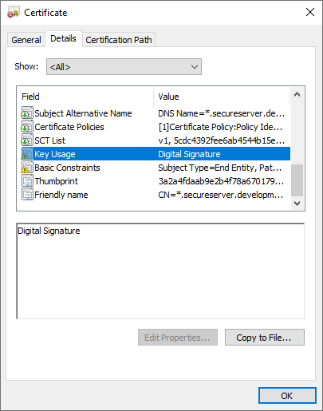
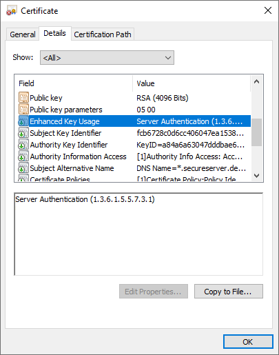

import Admonition from '@theme/Admonition';
import Tabs from '@theme/Tabs';
import TabItem from '@theme/TabItem';
import CodeBlock from '@theme/CodeBlock';
import LanguageSwitcher from "@site/src/components/LanguageSwitcher";
import LanguageContent from "@site/src/components/LanguageContent";

# Authentication: Manual Certificate Configuration
<Admonition type="note" title="Note">
This article explains how to set up authentication **manually** by storing your certificate locally, externally or with logic you create that is foreign to RavenDB. 

Please also take a look at the automated [Setup Wizard](../../../start/installation/setup-wizard) which lets you set up 
authentication in a much easier and faster way with automatic certificate renewals.  

 * The Setup Wizard can process **certificates that you provide**  
 * Or the Wizard can give you a free, highly secure **certificate via [Let's Encrypt](../../../server/security/authentication/lets-encrypt-certificates)**.  
 * We've developed default **automatic renewals** of certificates when setting up with the Setup Wizard **together** with Let's Encrypt.  

 If you choose manual setup and/or to provide your own certificate, **you are responsible for its periodic renewal**.  
 
* In this page:
   * [Prerequisites](../../../server/security/authentication/certificate-configuration#prerequisites)  
   * [Standard Manual Setup With Certificate Stored Locally](../../../server/security/authentication/certificate-configuration#standard-manual-setup-with-certificate-stored-locally)  
      * [Certificate Requirements](../../../server/security/authentication/certificate-configuration#certificate-requirements)  
      * [Certificate Location](../../../server/security/authentication/certificate-configuration#certificate-location)  
   * [With Logic Foreign to RavenDB or External Certificate Storage](../../../server/security/authentication/certificate-configuration#with-logic-foreign-to-ravendb-or-external-certificate-storage)  
   * [Step-by-step Guide to Installing Certificate](../../../server/security/authentication/certificate-configuration#step-by-step-guide-to-installing-certificate)  

</Admonition>

## Prerequisites

To enable authentication, either `Security.Certificate.Path` or `Security.Certificate.Load.Exec` must be set in [settings.json](../../configuration/configuration-options#json). 
 Please note that `Security.Certificate.Load.Exec` has replaced the old `Security.Certificate.Exec` as of 4.2 - [see FAQ](../../../server/security/common-errors-and-faq#automatic-cluster-certificate-renewal-following-migration-to-4.2).  
#### Setting up Client Certificates
When the server is manually set up with a server certificate for the first time, there are no client certificates registered in the server yet. 
The first action an administrator will do is to [generate/register a new client certificate](../../../server/security/authentication/client-certificate-usage).  
Find detailed instructions of the process [below](../../../server/security/authentication/certificate-configuration#step-by-step-guide-to-installing-certificate).  

You can set up various client certificates with different security clearance levels and database permissions. 
See [Certificate Management](../../../server/security/authentication/certificate-management) for more about permissions.  

### Standard Manual Setup With Certificate Stored Locally

#### Certificate Requirements

RavenDB will accept `.pfx` server certificates that contain the private key, are not expired, 
and include a basic (`Key Usage`) field and an enhanced (`Enhanced Key Usage`) field.  

- `Key Usage`  
  Permissions granted by this field: **Digital Signature**, **Key Encipherment**  
  
      

- `Enhanced Key Usage`  
  Permissions granted by this field: **Server Authentication**, **Client Authentication**  
  
      An `Enhanced Key Usage` field must include these two OIDs:  
      **1.3.6.1.5.5.7.3.1** - Server Authentication  
      **1.3.6.1.5.5.7.3.2** - Client Authentication  

       

<Admonition type="note" title="Note">

* Certificates created during setup using [Let's Encrypt](../../../server/security/authentication/lets-encrypt-certificates) 
  are already provided with the above fields and OIDs.  
* User-created certificates must be provided with these properties for RavenDB to accept and be able to use them. 

</Admonition>
#### Certificate Location

A [settings.json](../../configuration/configuration-options#settings.json) file must reside in each node's `Server` folder 
and define the server and certificate settings. The server will retrieve this file and use its settings on startup.  
Read more about RavenDB configuration options [here](../../configuration/configuration-options).  

* **ServerUrl**  
 When setting up securely, you must also set the `ServerUrl` configuration option to an **HTTPS** address.  
 In manual setup, we recommend configuring a permanent port instead of a random one.  In the example below, the port is set to 8080. 
 For a list of IPs and ports already in use on your machine, run `netstat -a` in the command line.  

* **Setup.Mode**  
 Set to "None" if you want a manual setup. If you want to use the [Setup Wizard](../../../start/installation/setup-wizard), set to "Initial" 
 or simply run the `run.ps1` file in your server package via PowerShell.  

* **DataDir**  
 Configure the directory on each machine where the databases will be located.  

* **Path to Certificate**  
 The standard way to enable authentication is to set `Security.Certificate.Path` in the settings.json file with the path to your `.pfx` server certificate.  
 You may also supply a certificate password using `Security.Certificate.Password`, but this is optional.  

For example, this is a typical [settings.json](../../configuration/configuration-options#json) for a manual setup:

<TabItem value="something" label="json">
<CodeBlock language="json">
{`\{
    "ServerUrl": "https://rvn-srv-1:8080",
    "Setup.Mode": "None",
    "DataDir": "/home/RavenData",
    "Security.Certificate": \{
        "Path": "/home/secrets/server.pfx",
        "Password": "s3cr7t p@$$w0rd"
    \}
\} 
`}
</CodeBlock>
</TabItem>

### With Logic Foreign to RavenDB or External Certificate Storage

The second way to enable authentication is to set `Security.Certificate.Load.Exec`. 

This option is useful when you want to protect your certificate (private key) with other solutions such as "Azure Key Vault", "HashiCorp Vault" 
or even Hardware-Based Protection. RavenDB will invoke a process you specify, so you can write your own scripts / mini-programs and 
apply the logic that you need.  
This creates a clean separation between RavenDB and the secret store in use.  

RavenDB expects to get the raw binary representation (byte array) of the .pfx certificate through the standard output.

Let's look at an example -

To use `Security.Certificate.Load.Exec` with a PowerShell script, the [settings.json](../../configuration/configuration-options#json) 
must be stored in each node's `Server` folder and will look something like this:

<TabItem value="something" label="json">
<CodeBlock language="json">
{`\{
    "ServerUrl": "https://rvn-srv-1:8080",
    "Setup.Mode": "None",
    "DataDir": "RavenData",
    "Security.Certificate.Load.Exec": "powershell",
    "Security.Certificate.Load.Exec.Arguments": "C:\\\\secrets\\\\give_me_cert.ps1 90F4BC16CA5E5CB535A6CD8DD78CBD3E88FC6FEA"
\}
`}
</CodeBlock>
</TabItem>

A sample powershell script called `give_me_cert.ps1` that matches the `settings.json` configuration:

<TabItem value="something" label="powershell">
<CodeBlock language="powershell">
{`try
\{
    $thumbprint = $args[0]
    $cert = gci "cert:\\CurrentUser\\my\\$thumbprint"
    $exportedCertBinary = $cert.Export("Pfx")
    $stdout = [System.Console]::OpenStandardOutput()
    $stdout.Write($exportedCertBinary, 0, $exportedCertBinary.Length)
\}
catch
\{
    write-error $_.Exception
    exit 3
\}
`}
</CodeBlock>
</TabItem>

<Admonition type="note" title="Note">
In all secure configurations, the `ServerUrl` must contain the same domain name that is used in the certificate (under the CN or ASN properties).
</Admonition>

### Step-by-Step Guide to Installing Certificate

1. Set up file infrastructure and download server.
   - Create a [user account](https://ravendb.net/buy). You should get an email with your license key.  
   - [Download](https://ravendb.net/download) the RavenDB...zip server package.  
   - Extract the .zip into the folders on each machine where the server nodes will permanently live.  
   - Store server certificate in your desired location with secure permissions.  

2. In each node `Server` folder, create the `settings.json` file which you will configure like the [examples](../../../server/security/authentication/certificate-configuration#standard-manual-setup-with-certificate-stored-locally) above.  
   * You can do this by going into the node `Server` folder &gt; right-click &gt; **New** &gt; **Text Document** &gt; name it `settings.json` instead of 
    ...txt &gt; click **Yes** &gt; open it and begin configuring.
   * Place the `settings.json` inside each node's `Server` folder because when you run the server, RavenDB is programmed to find the settings there.  

3. Configure the `settings.json` file in each node `Server` folder.  
   - Set the `ServerUrl`.  Make sure to use `https` and that it matches the domain established in your certificate.  
   - Set `Setup.Mode` to `None` to deactivate the RavenDB Setup Wizard.  
   - Set `DataDir` to the desired database storage folder on each machine.  
   - Set the `Security.Certificate.Path` to the **.pfx** that you placed in each server folder if certificate is stored with [RavenDB logic on local machines](../../../server/security/authentication/certificate-configuration#standard-manual-setup-with-certificate-stored-locally) 
     or `Security.Certificate.Load.Exec` if using [external location or logic](../../../server/security/authentication/certificate-configuration#with-logic-foreign-to-ravendb-or-external-certificate-storage).  
   - Make sure that the certificate .path or .load script lead to the correct certificate location. `.Path` should look something like this:  
         `"Security.Certificate.Path": "C:/Windows/MyDomainName/A/Server/ravendb.domain.com.pfx"`  
         See [.json example for a .Path situation](../../../server/security/authentication/certificate-configuration#standard-manual-setup-with-certificate-stored-locally) above.  
   - Setting a **password** on the certificate is optional. See [settings.json example](../../../server/security/authentication/certificate-configuration#standard-manual-setup-with-certificate-stored-locally) above.  
   Run

4. Right-click and run the `run.ps1` (or `run.sh` in Linux) in the extracted server package.  In Windows, it runs in PowerShell as a default.
   - If you don't yet have a client certificate installed, it will start up and launch a browser window that should give an error message about a missing client certificate. 
     Setting up the client certificate is the next two steps.  
   - If there is a previously existing client certificate on the machine, the browser will ask which certificate to use. 
     Until you set up the correct client certificate for this server (in the next two steps), it probably won't work and will give an error message. 
     This is because your browser will likely save your choice in the cache if you aren't in 'incognito' mode.  
      - It's best to **first do the next two steps before selecting a client certificate** in your browser. 

5. The PowerShell CLI window will be running the server terminal. The last line should read `ravendb>`. 
  In the CLI, run the [generateClientCert](../../../server/administration/cli#generateclientcert) command to generate a client certificate.  
   - The following is a generic RavenDB CLI command.  
<TabItem value="something" label="plain">
<CodeBlock language="plain">
{`ravendb> generateClientCert <your-client-certificate-name> <path-to-output-folder> <number of months> [optional password]
`}
</CodeBlock>
</TabItem>  
   - In the following example the certificate will be named RavenDBClient, will be stored at C:\Users\administrator\Documents, will be valid for 60 months, and will have no password. 
     If a password is required add it to the end of the command.  
<TabItem value="something" label="plain">
<CodeBlock language="plain">
{`ravendb> generateClientCert RavenDBClient C:\\Users\\administrator\\Documents 60
`}
</CodeBlock>
</TabItem>  
   - A few seconds after running this command, a `.zip` file will download into the output folder that you defined.  

6. Extract the contents of the .zip file generated into the folders where your nodes live.  
   - Install the client certificate into the OS by double-clicking the `admin.client.certificate...pfx` file and complete the OS Certificate Import Wizard.  
     * **To install the client certificate without a password**, you can use the default settings by pressing **Next** all the way through. 
       In most cases, this is sufficient.  
     * **To set a password on the client certificate**, do so in the Import Wizard.  You'll need to use that password every time you [work with the certificate](../../../server/security/authentication/certificate-management).  

       

7. Quit and restart the server with the `run.ps1` script. Select the certificate in the popup and click "OK". 
   The [RavenDB Studio](../../../studio/overview) should now open.  
    - In the PowerShell window type quit to close down the server for the next important step of setting it up as an OS service.  

8. To set up as an OS service, run PowerShell as an administrator and navigate to the root `Server` folder where the `settings.json` is located.  
   Copy and paste the following command `.\rvn.exe windows-service register --service-name RavenDB`.
   <Admonition type="note" title="Note"> It will set up the cluster as an OS service, which [will launch the server automatically](../../../start/installation/running-as-service) every time the machine starts, 
    but will fail to start if the Local Service account doesn't have access to all the required resources.  </Admonition>
   - Open the "Services" manager for Windows. Make sure that the "RavenDB" service is there and that the Startup Type is "Automatic".  

9. Now the service should run whenever the machine starts and the Studio should be accessible by the user with the client certificate.  
   - See [Certificate Management](../../../server/security/authentication/certificate-management) for an easy way to generate various client certificates with customizable permissions.  

