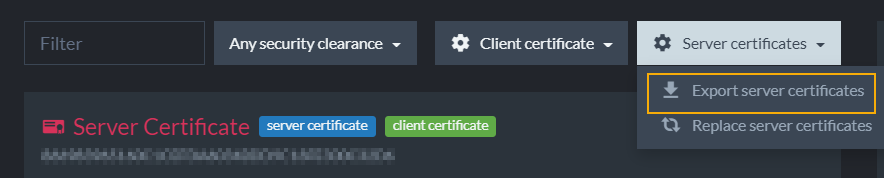

import Admonition from '@theme/Admonition';
import Tabs from '@theme/Tabs';
import TabItem from '@theme/TabItem';
import CodeBlock from '@theme/CodeBlock';
import LanguageSwitcher from "@site/src/components/LanguageSwitcher";
import LanguageContent from "@site/src/components/LanguageContent";

# Authentication: Certificate Management
<Admonition type="note" title="Note">

* Once authentication is set up, it's the administrator's responsibility to issue and manage client certificates.  
  Each client certificate can be configured to specify which databases the certificate can access and its authorization clearance level.  

* Read about the logic and rationale behind RavenDB's client certificates in [The RavenDB Security Authorization Approach](../../../server/security/authentication/certificate-management#the-ravendb-security-authorization-approach) to ensure that you configure them appropriately.  

* See the API article for integrating a client certificate into an application via the [document store](../../../client-api/creating-document-store).  

In this page:  

* [Studio Certificate Management View](../../../server/security/authentication/certificate-management#studio-certificates-management-view)  
* [The RavenDB Security Authorization Approach](../../../server/security/authentication/certificate-management#the-ravendb-security-authorization-approach)  
  * [Authorization Levels in Client Certificates](../../../server/security/authentication/certificate-management#authorization-levels-in-client-certificates)  
  * [Partial Access to Database](../../../server/security/authentication/certificate-management#partial-access-to-database)  
* [Create and Configure Certificates](../../../server/security/authentication/certificate-management#create-and-configure-certificates)  
  * [List of Registered Certificates](../../../server/security/authentication/certificate-management#list-of-registered-certificates)  
  * [Generate Client Certificate](../../../server/security/authentication/certificate-management#generate-client-certificate)  
  * [Edit Certificate](../../../server/security/authentication/certificate-management#edit-certificate)  
* [Enabling Communication Between Servers: Importing and Exporting Certificates](../../../server/security/authentication/certificate-management#enabling-communication-between-servers:-importing-and-exporting-certificates)  
  * [Export Server Certificates](../../../server/security/authentication/certificate-management#export-server-certificates)  
  * [Upload an Existing Certificate](../../../server/security/authentication/certificate-management#upload-an-existing-certificate)  
  * [Certificate Collections](../../../server/security/authentication/certificate-management#certificate-collections)  
  * [Private Keys](../../../server/security/authentication/certificate-management#private-keys)  
  * [Client Certificate Chain of Trust](../../../server/security/authentication/certificate-management#client-certificate-chain-of-trust)  

</Admonition>
## Studio Certificates Management View

1. Click the **Manage Server** tab.
2. Select **Certificates**.
3. **Client certificate**  
   
   * **Generate client certificate**  
     [Create and configure](../../../server/security/authentication/certificate-management#generate-client-certificate) a new client certificate  
   * **Upload client certificate**  
     [Import a client certificate](../../../server/security/authentication/certificate-management#upload-an-existing-certificate) that was exported from another server so that they can communicate.  
4. **Server certificates**  
   
   * **Export server certificates**  
     [Download server certificates](../../../server/security/authentication/certificate-management#export-server-certificates) so that you can download and then import them into another server.  
   * **Replace server certificates**  
     [Replace server certificates](../../../server/security/authentication/certificate-renewal-and-rotation) by uploading another `.pfx` certificate.  
5. Status of the current server certificate. 
   * Click [Renew now](../../../server/security/authentication/certificate-renewal-and-rotation) to renew a server certificate's expiration period.  
    If you did not set up your server with the RavenDB Installation Wizard and Let's Encrypt then **you are responsible** to renew your certificates periodically.  
6. Status of current client certificates active in this server. You can remove or [edit client certificates](../../../server/security/authentication/certificate-management#edit-certificate), 
   including configuring databases permissions and [authorization (security clearance) levels](../../../server/security/authorization/security-clearance-and-permissions#authorization-security-clearance-and-permissions) here. 

<Admonition type="note" title="Note">

Client certificates are managed by RavenDB directly and not by any [Public Key Infrastructure](https://en.wikipedia.org/wiki/Public_key_infrastructure). 

</Admonition>

## The RavenDB Security Authorization Approach

In general, RavenDB assumes that an application will implement its own logic and business rules, limiting 
itself to protect the data from unauthorized access. Applications operate on behalf of developers, and as such, they are in a better position than RavenDB to determine what is
allowed.  This is why access levels of RavenDB databases in each cluster are highly customizable by [cluster admins](../../../server/security/authorization/security-clearance-and-permissions#cluster-admin) 
and [operators](../../../server/security/authorization/security-clearance-and-permissions#operator).  

### Authorization Levels in Client Certificates
The security system in RavenDB does not make assumptions about which types of users should access which type of database. The concept of a user
does not really exist within RavenDB in this manner. Instead, cluster admins or operators create various client certificates and configure each one with a custom set of permissions. 

* [Cluster Admin](../../../server/security/authorization/security-clearance-and-permissions#cluster-admin)  
  Full administrative access to clusters and databases within.  
* [Operator](../../../server/security/authorization/security-clearance-and-permissions#operator)  
  Admin access to databases, but not to modify the cluster.  
* [User](../../../server/security/authorization/security-clearance-and-permissions#user)  
  Lowest levels of privileges. 
  * "User" certificates are configured to specify which databases people can access with each certificate.  
  * ["User" authorization levels](../../../server/security/authentication/certificate-management#setting-user-access-levels) are also configured per database.  

In most cases, users do not access RavenDB directly. Aside from admins and developers during the development process, all access to 
the data inside RavenDB is expected to be done through your applications. A security mechanism on a per-user basis is not practical in complex systems 
because each user (employee or customer) may need different access levels to different portions of the data. 
Also, the same application usually needs to access the same data on behalf of different types of users with different levels of access.  

**Most organizations have fairly complex architectures.** In most systems, the access level
and operations allowed are never simple enough to be able to express them as an Access Control List. They are highly dependent on business rules and
processes, the state of the system, etc. 

**How can authorization levels efficiently handle complex systems?**  By customizing access via client certificates.  For example, an employee may request a vacation day, but the employee
is not permitted to approve their own vacation. The HR manager, on the other hand, may approve the vacation.  

From the point of view of RavenDB, the act of editing a vacation request document or approving it looks very much the same, it's a simple document edit.
The way that a typical business system looks at those operations is often much more complicated. Perhaps the HR manager is given a client certificate with read/write permission to edit documents on the HR database, 
while other employees have a certificate with read-only access. Thus, they must make requests for changes to the HR staff. Also, the HR staff should have read/write access to the HR database, 
but not to development-oriented data, whereas developers might have read/write or admin permissions to relevant databases. 
Meanwhile, customers likely have read/write certification to their user account, but read-only access to the catalog.  

Thus, RavenDB is designed so that **each client certificate has specific and customizable permissions for various databases as well as configurable authorization levels**.  
### Full Access to Database
RavenDB expects the applications and systems using it to utilize the security infrastructure it provides to prevent unauthorized access, such as a different
application trying to access the HR database. However, once access is granted, the access is complete.  

RavenDB security infrastructure operates at the level of the entire database. If you are granted access to a database, you can access 
any and all documents in that database unless protection is explicitly configured.  
### Partial Access to Database

There are two approaches to giving partial access to a database:

 * [Using ETL for selective, one-way data transfer](../../../server/security/authentication/certificate-management#using-etl-for-selective-one-way-data-transfer)  
 * [Setting "User" Access Levels](../../../server/security/authentication/certificate-management#setting-user-access-levels)  

####  *Using ETL for selective, one-way data transfer*  

Some developers need to provide partial access to a database that also contains sensitive data. One approach is to set up an [Extract, Transform, Load (ETL) task](../../../studio/database/tasks/ongoing-tasks/ravendb-etl-task):  

1. [Create](../../../studio/database/create-new-database/general-flow) a dedicated database that the public will be able to access.  
2. [Generate a client certificate](../../../server/security/authentication/certificate-management#generate-client-certificate) with "User" security clearance so that
   you can configure it to give access only to the dedicated, public-facing database.  
3. If the dedicated database is on a different cluster than the source database: (This is optional. If both databases are on the same cluster, skip to step 4.)  
   * [Export (download) server certificates](../../../server/security/authentication/certificate-management#export-server-certificates) from the **destination server**.  
   * [Upload the .pfx certificate](../../../server/security/authentication/certificate-management#upload-an-existing-certificate) to the **source server** to enable the two to connect.  
    * While uploading, configure the certificate to give access to the target source database.  
4. Then set up an [ETL](../../../server/ongoing-tasks/etl/raven) task from the source database to the exposed, destination database.  
   * Set up a Javascript [Transform script](../../../server/ongoing-tasks/etl/basics#transform) in the ETL to automatically filter the information passed from the source to destination databases.  
   * After entering the script code, you can click the blue button to [test the script](../../../server/ongoing-tasks/etl/test-scripts) before saving the ETL.  Once you click the red **Save** button, 
     the ETL task begins to work.  It will transform and add the data to the dedicated database.  
5. Check the dedicated database to make sure that the transform script did what you want it to do. 
   This database should only have the information that you filtered and is ready to expose to the public.

<Admonition type="note" title="Note">

With this approach, you can choose exactly what is exposed, including redacting personal information, hiding details, etc. Because the ETL process is unidirectional, 
this also protects the source data from modifications made to the new database. On the other hand, ETLs are ongoing tasks, so changes made to data 
in the source database will be reflected automatically in the destination database.  

Together, ETL and dedicated databases can be used for fine-grained filtration, but that tends to be the exception, rather than the rule. 

</Admonition>

####  *Setting "User" Access Levels*  

You can also control access by giving a client certificate a [User](../../../server/security/authorization/security-clearance-and-permissions#user) security clearance. 
With this clearance, you can set a different access level to each database. The three "User" access levels are:  

* User [Admin](../../../server/security/authorization/security-clearance-and-permissions#user)  
* [Read/Write](../../../server/security/authorization/security-clearance-and-permissions#section-1)  
* [Read-Only](../../../server/security/authorization/security-clearance-and-permissions#section-2)  
  * Learn more about the [Read-Only access level here](../../../studio/server/certificates/read-only-access-level).  

<Admonition type="note" title="Note">

This approach is similar to the HR Manager and Customers certificates in the example given [above](../../../server/security/authentication/certificate-management#authorization-levels-in-client-certificates). 
It enables developers to control access levels by configuring client certificates.  

</Admonition>

* To learn how to configure each client certificate's database permissions and authorization levels via the RavenDB Studio GUI, see [Create and Configure Certificates](../../../server/security/authentication/certificate-management#create-and-configure-certificates).  
* To learn how to configure client certificates via CLI, see [Authentication: Client Certificate Usage](../../../server/security/authentication/client-certificate-usage#authentication-client-certificate-usage)

## Create and Configure Certificates

### List of Registered Certificates 

In the image below, the client certificates (HR, localcluster.client.certificate, Project Managers) have different **security clearance** and **database permissions** configurations.  
This is done to give admins the ability to protect the contents of their databases by customizing permissions.  

For example, if an application user should have read/write but not admin access over a certain database, while project managers should have operator permissions on all databases, 
you can grant different [access levels](../../../server/security/authorization/security-clearance-and-permissions#authorization-security-clearance-and-permissions) 
by using different client certificates, each with its own set of permissions.  

Each client certificate contains the following:

1. **Name**  
   Client certificate name.  
2. **Thumbprint**  
   Unique key for each certificate.  
3. **Security Clearance**  
   [Authorization level](../../../server/security/authorization/security-clearance-and-permissions#authorization-security-clearance-and-permissions) 
   that determines the types of actions that can be done with this certificate.  
4. **Expiration date**  
   Client certificates are given 5-year expiration periods by default.  
5. **Allowed Databases**  
   The databases in this cluster that this client certificate has access to.  
6. **Edit Certificate**  
   Configure which databases it can access (applicable for User-level) and its authorization clearance level.  
7. **Delete Certificate**  
### Generate Client Certificate 

Using this view, you can generate client certificates directly via RavenDB.  
Newly generated certificates will be added to the list of registered certificates.  

When generating a certificate, you must complete the following fields:

1. Click **Client certificate** and select **Generate client certificate**.  
2. **Name**  
   Enter a name for this certificate. For future clarity, consider naming each certificate after the role that it will enable in your system (Full Stack Development, HR, Customer, Unregistered Guest, etc...)  
3. **Security Clearance**  
   Set authorization level for this certificate. Read about [Security Clearance](../../../server/security/authorization/security-clearance-and-permissions#authorization-security-clearance-and-permissions) 
   to choose the appropriate level.  
4. **Certificate Passphrase**  
   (Optional) Set a password for this certificate.  
5. **Expire in**  
   Set validity period.
6. **Database Permissions**  
   Configure allowed databases and ["User" access level](../../../server/security/authorization/security-clearance-and-permissions#user) for each database.  
   Relevant for "User" authorization level.  "Cluster Admin" and "Operator" have access to all databases.  

<Admonition type="note" title="Note">

This information is used by RavenDB internally and is not stored in the certificate itself.

</Admonition>

<Admonition type="note" title="Note">

Expiration for client certificates is set to 5 years by default.

</Admonition>
### Edit Certificate

To edit existing certificates:

1. **Edit**  
   Click the edit button to configure this certificate.  
2. **Name**  
   Enter a name for this certificate. For future clarity, consider naming each certificate after the role that it will enable in your system 
   (Full Stack Development, HR, Customer, Unregistered Guest, etc...)  
3. **Security Clearance**  
   Set authorization level for this certificate. Read about [Security Clearance](../../../server/security/authorization/security-clearance-and-permissions#authorization-security-clearance-and-permissions) 
   to choose the appropriate level.  
4. **Thumbprint**  
   Click the button to copy the unique code assigned to this certificate.  
5. **Database Permissions**  
   Configure allowed databases and ["User" access level](../../../server/security/authorization/security-clearance-and-permissions#user) for each database.  
   Relevant for "User" authorization level.  "Cluster Admin" and "Operator" have access to all databases.  

<Admonition type="note" title="Note">

This information is used by RavenDB internally and is not stored in the certificate itself.

</Admonition>

<Admonition type="note" title="Note">

Expiration for client certificates is set to 5 years by default.

</Admonition>

## Enabling Communication Between Servers: Importing and Exporting Certificates

There are various situations where developers need to create a database with partial access to another server.  
For example, a source server may contain sensitive information that should not be exposed to the public, but also contain databases that need to be exposed with limited access.  
The following section explains how to give configurable access that enables communication between servers.  

<Admonition type="note" title="Note">

To connect two secure databases, the destination cluster needs to trust the source cluster.  
To achieve that you need to:

a. **Export** ([download](../../../server/security/authentication/certificate-management#export-server-certificates)) the server certificate **from the source server**.  
b. **Upload** ([import](../../../server/security/authentication/certificate-management#upload-an-existing-certificate)) the downloaded certificate **into the destination server**.  

</Admonition>

 1. Click **Manage Server** and select **Certificates** to access the Studio - Certificates Management screen.  
 2. Click **Server certificates** in the source server.  
   
   * **Export server certificates**  
     [Download server certificates](../../../server/security/authentication/certificate-management#export-server-certificates) 
     so that you can download and then import them into another server.  
 3. Click **Client certificate** in the destination server.  
   
   * **Upload client certificate**  
     [Import a client certificate](../../../server/security/authentication/certificate-management#upload-an-existing-certificate) 
     that was exported from another server so that the two can communicate.  
### Export Server Certificates

This option allows you to export the server certificate as a .pfx file. In the case of a cluster which contains several different server certificates, 
a .pfx [collection](../../../server/security/authentication/certificate-management#certificate-collections) will be exported.
### Upload an Existing Certificate

Click the **Client certificate** button, select **Upload client certificate** and you will see the following window.  

When uploading an existing certificate .pfx file, you must configure the certificate by completing the following fields:

1. **Name**  
   Enter a name for this certificate. For future clarity, consider naming each certificate after the role that it will enable in your system (Full Stack Development, HR, Customer, Unregistered Guest, etc...)  
2. **Security Clearance**  
   Set authorization level for this certificate. Read about [Security Clearance](../../../server/security/authorization/security-clearance-and-permissions#authorization-security-clearance-and-permissions) to choose the appropriate level.  
3. **Certificate file**  
   Upload the `.pfx` certificate file from the destination server installation folder.  
4. **Certificate Passphrase**  
   (Optional) Set a password for this certificate.  
4. **Database permissions**  
   Select databases and permission levels for this certificate.  
   If you choose *User* security clearance, you can give access to specific databases on the server and configure [User](../../../server/security/authorization/security-clearance-and-permissions#user) authorization levels for this certificate.  

The uploaded certificate will be added to the list of registered client certificates on this server.  

<Admonition type="note" title="Note">

This information is used by RavenDB internally and is not stored in the certificate itself.

</Admonition>

<Admonition type="note" title="Note">

Expiration for client certificates is set to 5 years by default.

</Admonition>
### Certificate Collections

`.pfx` files may contain a single certificate or a collection of certificates.

When uploading a `.pfx` file with multiple certificates, RavenDB will add all of the certificates to the list of registered certificates as one entry 
and will allow access to all these certificates explicitly by their thumbprint.
### Generating Client Certificates Via Command Line Interface

* RavenDB provides an intuitive certificates management GUI in the Studio.  

* All of the operations which are described below are also available in Command Line Interface (CLI).  
  - Be sure to configure the `SecurityClearance` for each client certificate because the default is [cluster admin](../../../server/security/authorization/security-clearance-and-permissions#cluster-admin) which has full access.
  - There are CLI-based means to [generate](../../../server/security/authentication/client-certificate-usage#example-i---using-the-ravendb-cli) and [configure client certificates in Windows](../../../server/security/authentication/client-certificate-usage#example-ii---using-powershell-and-wget-in-windows).  
  - [Linux](../../../server/security/authentication/client-certificate-usage#example-iii--using-curl-in-linux) developers can use this cURL command sample.  
### Private Keys

It's important to note that RavenDB does _not_ keep track of the certificate's private key. Whether you generate a client certificate
via RavenDB or upload an existing client certificate, the private key is not retained. If a certificate was lost, you'll
need to recreate a new certificate, assign the same permissions, and distribute the certificate again.

<Admonition type="info" title="Implicit Trust" id="implicit-trust" href="#implicit-trust">
If two different RavenDB clusters are communicating securely, and the source cluster has its certificate renewed, the destination cluster could 
still trust this new certificate - provided that the new certificate is signed with the same private key as the original, and was issued by the 
same certificate authority. This is accomplished using a [public key pinning hash](../../../server/security/authentication/certificate-renewal-and-rotation#implicit-trust-by-public-key-pinning-hash).  
</Admonition>
### Client Certificate Chain of Trust

As mentioned above, RavenDB generates client certificates by signing them using the server certificate. 
A typical server certificate doesn't allow acting as an Intermediate Certificate Authority signing other certificates. 
This is the case with Let's Encrypt certificates.

The left side of the following screenshot shows a newly generated client certificate, signed by a Let's Encrypt server certificate. 
You cannot see the full chain of trust because the OS (Windows) doesn't have knowledge of the server certificate.

If you wish to view the full chain, add the server certificate to the OS trusted store. This step is **not necessary** for RavenDB 
and is explained here only to show how to view the full chain in Windows. The right side of the screenshot shows the full chain. 

Because client certificates are managed by RavenDB directly and not through any PKI infrastructure **this is perfectly acceptable**. 
Authenticating a client certificate is done explicitly by looking for the thumbprint in the registered certificates list in the server 
and not by validating the chain of trust. 

