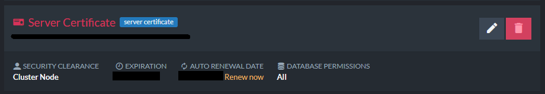
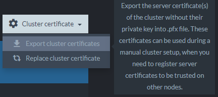
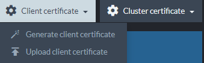

import Admonition from '@theme/Admonition';
import Tabs from '@theme/Tabs';
import TabItem from '@theme/TabItem';
import CodeBlock from '@theme/CodeBlock';
import LanguageSwitcher from "@site/src/components/LanguageSwitcher";
import LanguageContent from "@site/src/components/LanguageContent";

# Let's Encrypt: Solve Certificate Renewal Issue

* If you have External Replication or ETL to another cluster, or if you use 
  your own Let's Encrypt certificates as client certificates, the next certificate 
  renewal may cause permission issues that need to be handled manually.  

* Find [whether this issue is relevant for you](../../../server/security/authentication/solve-cluster-certificate-renewal-issue#current-situation) 
  and if so, [how to handle it](../../../server/security/authentication/solve-cluster-certificate-renewal-issue#solutions).  

* **In this page**:  
   * [Errors Relevant To This Issue](../../../server/security/authentication/solve-cluster-certificate-renewal-issue#errors-relevant-to-this-issue)  
   * [Background And Current Situation](../../../server/security/authentication/solve-cluster-certificate-renewal-issue#background-and-current-situation)  
   * [Solutions](../../../server/security/authentication/solve-cluster-certificate-renewal-issue#solutions)  

## Errors Relevant To This Issue  

If your current cluster certificate is operative, you will encounter 
the errors we discuss here only when an attempt is made to renew the certificate.  

When the cluster certificate is renewed, authentication errors will appear 
as **Studio alerts** and/or **responses to client requests**.  

* The errors will also appear in the logs.  
  ```
  Raven.Server.Documents.ETL.Providers.Raven.RavenEtl, Failed to load transformed data for 'ETL Script', EXCEPTION: Raven.Client.Exceptions.Security.AuthorizationException: Forbidden access to db1@https://a.some.one.ravendb.cloud,  does not have permission to access it or is unknown. Method: GET, Request: https://a.some.one.ravendb.cloud/topology?name=db1&first-topology-update  
  {"Type":"InvalidAuth","Message":"The supplied client certificate 'CN=\*.some.one.ravendb.cloud(Thumbprint: A632C1DBD145B2102CB70D254B7EC1C813444766)' is unknown to the server but has a known Public Key Pinning Hash. Will not use it to authenticate because the issuer is unknown. To fix this, the admin can register the pinning hash of the \*issuer\* certificate: 'jQJTbIh0grw0/1TkHSumWb+Fs0Ggogr621gT3PvPKG0=' in the 'Security.WellKnownIssuer.Admin' configuration entry."}  
  ```

    The Audit Log will contain the following entry:  
    ```
    Information, AuthenticateCertificate, Audit, Connection from  with certificate 'CN=*.some.one.ravendb.cloud (A632C1DBD145B2102CB70D254B7EC1C813444766)' which is not registered in the cluster.  
    Tried to allow the connection implicitly based on the client certificate's Public Key Pinning Hash but the client certificate was signed by an unknown issuer - closing the connection.  
    To fix this, the admin can register the pinning hash of the *issuer* certificate: 'jQJTbIh0grw0/1TkHSumWb+Fs0Ggogr621gT3PvPKG0=' in the 'Security.WellKnownIssuers.Admin' configuration entry.  
    Alternatively, the admin can register the actual certificate ( 'A632C1DBD145B2102CB70D254B7EC1C813444766') explicitly in the cluster.
    ```

## Background and Current Situation

### Background

* **Original Problem**  
  RavenDB versions preceding 4.2 presented the following administration problem when 
  ETL or External Replication was defined between two secured RavenDB clusters:  
  The destination cluster trusts (explicitly) the source cluster's certificate.  
  Once the source cluster renewes its certificate, the destination cluster would 
  no longer trust it because the thumbprint has changed.  
  To solve this, the admin had to access the destination cluster and manually specify 
  that it can trust the new source certificate.  

* **Original Solution**  
  To solve this problem, we introduced [Implicit Trust](../../../server/security/authentication/certificate-renewal-and-rotation#implicit-trust-by-public-key-pinning-hash) 
  by using the certificate's **Public Key Pinning Hash**.  
  Now, if the source cluster renews its certificate **by using the same private key and 
  issuer**, the new certificate will have the same Public Key Pinning Hash, and the 
  destination cluster will be able to trust the new certificate.  
  It will also be registered (implicitly) for future connections.  

* **What you gain**  
  Using this feature means that you can drastically reduce the amount of work 
  an admin has to perform in a multi-cluster topology and gain a system that 
  is set-up once and just keeps working, **as long as you keep using the same 
  private key and issuer**.  
### Current Situation

In September 2020, Let's Encrypt changed their certificate issuer to support full ECDSA 
certificate chains. You can [read about it here](https://letsencrypt.org/2020/09/17/new-root-and-intermediates.html).  

As a result, RavenDB users that use the Public Key Pinning Hash solution need to 
take a few manual steps.  

This is relevant for you -  

1. If you use RavenDB ETL or perform External Replication between two 
   RavenDB clusters.  
     * If you use RavenDB Cloud where certificates are renewed automatically.  
     * If you used our Setup Wizard with Let's Encrypt, and certificates are 
       renewed automatically.  
     * If you used your own Let's Encrypt **cluster** certificate, and you 
       renew it yourself with the same private key.  
2. If you created your own Let's Encrypt **client** certificates, and you renew 
   them using the same private key.  


## Solutions

### Solution 1:

Register the pinning hash of the old issuer in the destination cluster. In settings.json, 
on every node of the destination cluster add the following:  

<TabItem value="something" label="json">
<CodeBlock language="json">
{`"Security.WellKnownIssuers.Admin": "jQJTbIh0grw0/1TkHSumWb+Fs0Ggogr621gT3PvPKG0="
`}
</CodeBlock>
</TabItem>

The hash in the example is the Public Key Pinning Hash of the Let's Encrypt X3 intermediate 
certificate authority which was previously used to sign Let's Encrypt certificates.  

This solution is stronger, it ensures a smooth transparent transition when the source cluster 
certificate will renew itself and the issuer will actually change. The advantage here is that 
there is no downtime.  

The disadvantage is that an admin needs to access the machines themselves. They need to edit 
the settings.json file on all nodes and restart the RavenDB service (node-by-node for no downtime).  
### Solution 2:

1. In the case of ETL or External Replication, go to the source cluster and renew the Let's Encrypt 
   cluster certificate. Then export it and register it in the destination cluster.  

     * Click `Renew` on the server certificate in one of the nodes of the source cluster.  
       
     * Export the new cluster certificate:  
       
     * Use the destination cluster's Studio to upload the exported pfx file as a client certificate.  
       


2. In case you are using your own Let's Encrypt client certificates, simply renew them 
   (on your own) and re-register them in the certificate view in the Studio ([Upload client 
   certificate](../../../studio/database/tasks/import-data/import-from-ravendb#step-#1:-prepare-servers-for-the-import-process-(secure-4.x-servers-only))).  

This solution is easier and doesn't require access to the machines themselves, just an admin 
certificate. The disadvantage is a short downtime in the service, because you must renew the 
certificate first and only then you may export it and upload to the destination cluster.  
This can cause some delay in the ETL or Replication service.  


