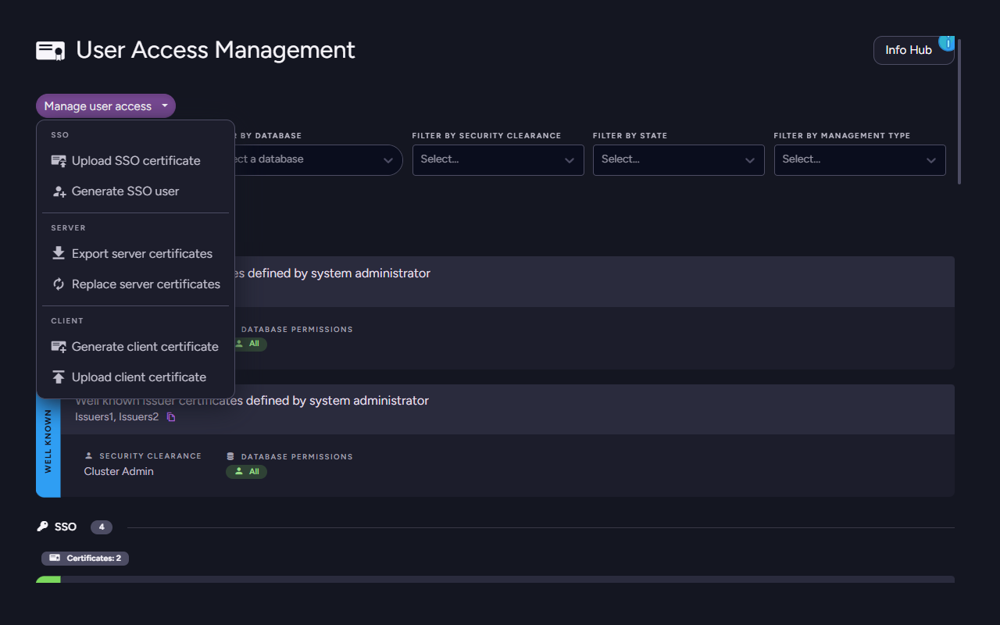
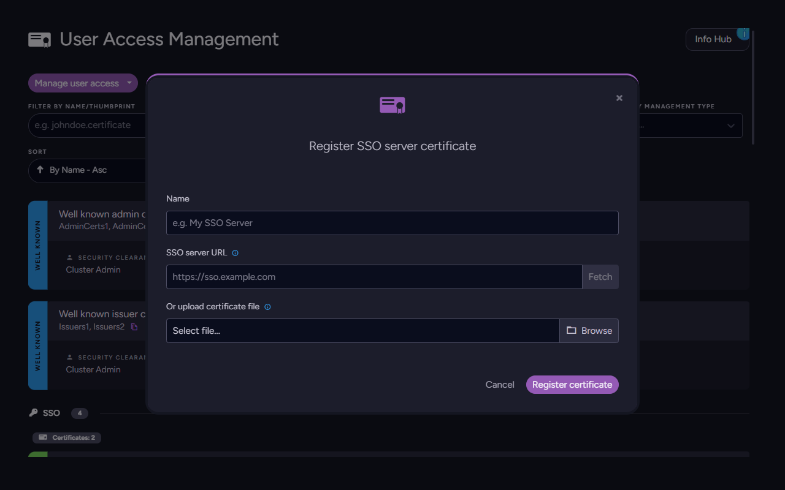
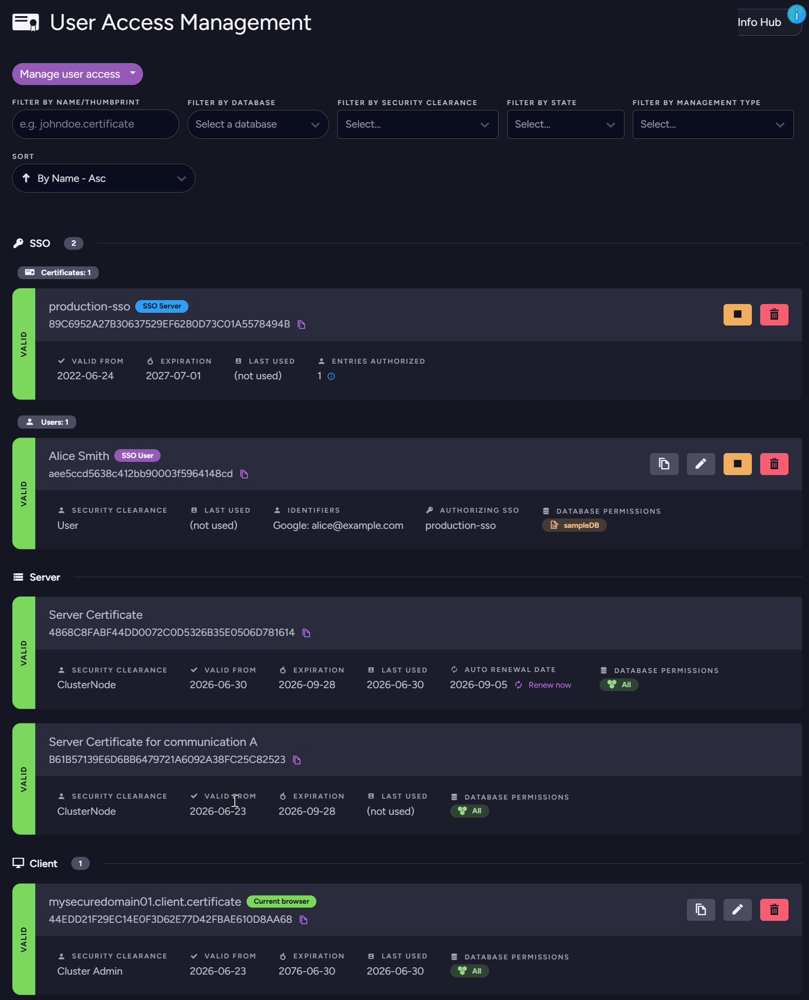
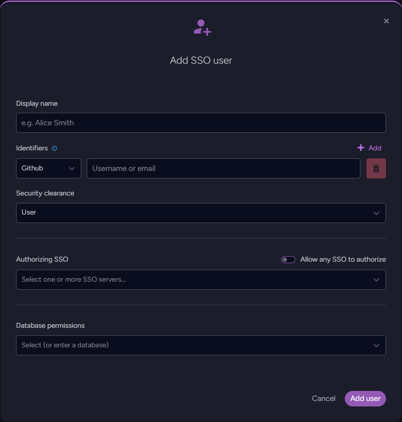

import Admonition from '@theme/Admonition';
import Panel from "@site/src/components/Panel";
import ContentFrame from "@site/src/components/ContentFrame";

# Authentication: SSO Certificates and Users

<Admonition type="note" title="">

* RavenDB can authenticate users who arrive through an [SSO reverse-proxy application](../../../server/security/sso/overview.mdx) - GitHub, Google,
  Microsoft/Entra ID, or Windows/Kerberos - instead of issuing one X.509 client certificate per user.

* The cluster needs to know two things to do this:
   * **Which SSO servers to trust** - registered as certificates with `Usage = SsoServer`.
   * **How to map an SSO identity to RavenDB permissions** - stored as **SSO user entries** with `Usage = SsoClient`.

* Both are managed from **Manage Server → Certificates** in Studio, and live in the same certificate list as your regular server and client certificates.

* For end-to-end deployment of the SSO application itself, see the [SSO section](../../../server/security/sso/overview.mdx). This page focuses on the certificate-management side of the workflow.

* In this article:
   * [Required clearance and license](../../../server/security/authentication/sso-certificates.mdx#required-clearance-and-license)
   * [Register an SSO server certificate](../../../server/security/authentication/sso-certificates.mdx#register-an-sso-server-certificate)
      * [Studio](../../../server/security/authentication/sso-certificates.mdx#studio)
      * [HTTP API](../../../server/security/authentication/sso-certificates.mdx#http-api)
   * [Register an SSO user entry](../../../server/security/authentication/sso-certificates.mdx#register-an-sso-user-entry)
      * [Studio](../../../server/security/authentication/sso-certificates.mdx#studio-1)
      * [HTTP API](../../../server/security/authentication/sso-certificates.mdx#http-api-1)
   * [Renewing the SSO server certificate](../../../server/security/authentication/sso-certificates.mdx#renewing-the-sso-server-certificate)
   * [Supported providers](../../../server/security/authentication/sso-certificates.mdx#supported-providers)
   * [Related reading](../../../server/security/authentication/sso-certificates.mdx#related-reading)

</Admonition>

<Panel heading="Required clearance and license">

<Admonition type="warning" title="Required clearance and license">
SSO is a commercial feature gated by the RavenDB license. Registering an SSO server certificate requires
**Cluster Admin** clearance; SSO user entries can be managed by **Operator** clearance and above.
</Admonition>

</Panel>

<Panel heading="Register an SSO server certificate">

The SSO server presents its public certificate to clients on `https://<sso-domain>`. Registering that
certificate in RavenDB tells the cluster "trust SSO identities forwarded by this server." Identification
is by **[public-key pinning hash](../../../server/security/authentication/certificate-renewal-and-rotation.mdx#implicit-trust-by-public-key-pinning-hash)**, not by the certificate file itself.

<ContentFrame>

### Studio

1. Open **Manage Server → Certificates**.
2. Click **Register SSO server**.
3. Either upload the certificate (PEM/PFX) or paste the SSO URL - the cluster will fetch the certificate
   from `https://<sso-url>/api/certificate`, validate it, and show the parsed details for confirmation.
4. Give it a name and save.

Open the **Manage user access** dropdown to find the SSO actions:



**Upload SSO certificate** opens the registration modal - either fetch the certificate from the SSO URL or
upload a file directly:



Once registered, the SSO server certificate appears under a dedicated **SSO** section of the certificates
list, alongside any existing SSO user entries:



</ContentFrame>

<ContentFrame>

### HTTP API

```http
PUT /admin/certificates
Content-Type: application/json

{
  "Name": "production-sso",
  "Certificate": "<base64-encoded certificate>",
  "Usage": "SsoServer",
  "SecurityClearance": "ValidUser",
  "Permissions": {}
}
```
<br />

To let the cluster fetch the certificate for you:

```http
GET /admin/certificates/sso/server/fetch?url=https://sso.example.com
```
<br />

This downloads `https://sso.example.com/api/certificate`, validates it, and returns the base64 bytes -
hand them to `PUT /admin/certificates` above. The fetch is limited to **1 MB** and times out after
**10 seconds**.

---

<Admonition type="note" title="">
SSO server certificates cannot be generated by RavenDB - they belong to the SSO deployment and must be
imported. `POST /admin/certificates` with `Usage = SsoServer` is rejected.
</Admonition>

</ContentFrame>

</Panel>

<Panel heading="Register an SSO user entry">

An SSO user entry is a mapping from one or more **SSO identities** to a RavenDB [security clearance](../../../server/security/authorization/security-clearance-and-permissions.mdx) and
database permissions. Each identity is a `(Provider, Domain, Identifier)` tuple:

| Field | Type | Example |
|---|---|---|
| `Provider` | `Github` &#124; `Google` &#124; `Microsoft` &#124; `Windows` | `Windows` |
| `Domain` | string | Kerberos realm - only used when `Provider = Windows`; leave empty otherwise. |
| `Identifier` | string | `alice@example.com`, GitHub username, etc. |

Each entry must trust the SSO servers it accepts identities from. You can either:

- list one or more `SsoServerPublicKeyPinningHashes` from registered SSO servers, **or**
- set `AllowAnySsoServer = true` to accept the identity from any SSO server registered in the cluster.

Listing multiple pinning hashes is how you give one user access through several SSO deployments
(production + staging, for example) without duplicating the entry.

<ContentFrame>

### Studio

1. **Manage Server → Certificates → Register SSO user**.
2. Enter a **Name**, choose a **Security Clearance**, and pick the **Permissions** per database.
3. Add one or more SSO identifiers (provider + identifier, plus a domain when the provider is
   Windows - the Kerberos realm).
4. Pick the trust model - either tick **Allow any SSO server**, or select the SSO servers you registered
   above.
5. Save.

The modal collects all the entry's fields on one screen - display name, identifiers, security clearance,
trust scope (per-server pinning or any SSO server), and per-database permissions:



</ContentFrame>

<ContentFrame>

### HTTP API

```http
PUT /admin/certificates/sso/user
Content-Type: application/json

{
  "Name": "alice",
  "Usage": "SsoClient",
  "SsoIdentifiers": [
    { "Provider": "Google", "Domain": "", "Identifier": "alice@example.com" }
  ],
  "SsoServerPublicKeyPinningHashes": ["<pinning-hash-of-registered-sso-server>"],
  "AllowAnySsoServer": false,
  "SecurityClearance": "ValidUser",
  "Permissions": { "Northwind": "ReadWrite" }
}
```
<br />

Validation rules enforced by the endpoint:

- `Name` and at least one entry in `SsoIdentifiers` are required.
- Either `AllowAnySsoServer = true` **or** at least one pinning hash.
- Every pinning hash must reference a previously registered SSO server. Otherwise the request fails with
  a message pointing you back to the SSO server registration step.
- Each `(Provider, Domain, Identifier)` tuple is **unique cluster-wide** - edit the existing entry instead
  of creating a second one for the same identity.

</ContentFrame>

</Panel>

<Panel heading="Renewing the SSO server certificate">

<Admonition type="danger" title="Renew with the same private key">
RavenDB identifies trusted SSO servers by their **public key pinning hash**, not by the certificate file.
Every SSO user entry that doesn't have `AllowAnySsoServer = true` is pinned to one or more specific
hashes. **If you renew the SSO server certificate with a new key pair, the hash changes and every
non-`AllowAnySsoServer` entry stops accepting logins through that server until you re-register the new
certificate and update each user entry's pinning list.**

To keep SSO authentication working continuously across renewals, always renew the SSO server certificate
with **the same private key** (the same Certificate Signing Request). The public key - and therefore the
pinning hash - stays identical, and every existing SSO user entry keeps working without any change in
RavenDB.
</Admonition>

This is the same mechanism RavenDB uses for [implicit trust between server and client certificates](../../../server/security/authentication/certificate-renewal-and-rotation.mdx#implicit-trust-by-public-key-pinning-hash) - see that section
for the underlying details.

Practical guidance:

- **Let's Encrypt via the bundled SSO `certbot`** - already pins `--key-type rsa` and `--reuse-key`,
  so renewals automatically keep the public key stable. No action is needed on the RavenDB side.
- **Manually managed certificates** - when generating a renewal, re-use the existing CSR or private key
  rather than creating a fresh key pair. Most ACME clients and CAs accept a CSR-based renewal explicitly
  for this reason.
- **If you must rotate the key** - register the new SSO server certificate as a second `SsoServer` entry
  before retiring the old one. Update every SSO user entry to include the new pinning hash alongside the
  old one. Once all clients are on the new certificate, you can remove the old `SsoServer` entry and the
  old hash from the user entries.

</Panel>

<Panel heading="Supported providers">

| `SsoProvider` | Typical `Identifier` | When to set `Domain` |
|---|---|---|
| `Github` | GitHub username | Not used - leave empty. |
| `Google` | Email address | Not used - leave empty. |
| `Microsoft` | Email or object id | Not used - leave empty. |
| `Windows` | `user@DOMAIN` | **Required** - set to the Kerberos realm. |

`Domain` is only consulted when `Provider = Windows`. For the OAuth providers it is ignored - leave it
empty (or omit it from the JSON payload).

</Panel>

<Panel heading="Related reading">

- [SSO Overview](../../../server/security/sso/overview.mdx) - what the SSO application does and how the auth flow works.
- [Deploying the SSO application](../../../server/security/sso/deploying-sso-app.mdx) - installer and Docker Compose setup.
- [Certificate Renewal & Rotation](../../../server/security/authentication/certificate-renewal-and-rotation.mdx#implicit-trust-by-public-key-pinning-hash) - the public-key pinning hash mechanism that underpins SSO server trust.

</Panel>
