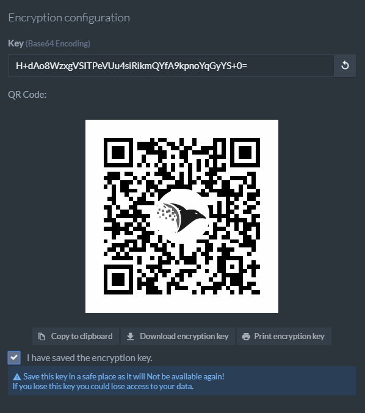

import Admonition from '@theme/Admonition';
import Tabs from '@theme/Tabs';
import TabItem from '@theme/TabItem';
import LanguageSwitcher from "@site/src/components/LanguageSwitcher";
import LanguageContent from "@site/src/components/LanguageContent";
import Panel from "@site/src/components/Panel";
import ContentFrame from "@site/src/components/ContentFrame";

<Admonition type="note" title="">

* RavenDB supports database encryption at rest.  
  Each encrypted database has its own secret key, used to encrypt and decrypt its data.

* In this article:
    * [Creating an encrypted database using Studio](#creating-an-encrypted-database-using-studio)
    * [Creating an encrypted database using the REST API and the Client API](#creating-an-encrypted-database-using-the-rest-api-and-the-client-api)
      * [Windows example](#windows-example)
      * [Linux example](#linux-example)
    * [Considerations for encrypted databases](#considerations-for-encrypted-databases)

</Admonition>

<Panel heading="Creating an encrypted database using Studio">

When [creating an encrypted database using Studio](../../../studio/database/create-new-database/encrypted.mdx), Studio provides the database's secret key.  
Save this key for recovery, including restoring backups encrypted with that key.  
You do not need to supply it during normal database operations.    
See [Secret Key Management](../../../server/security/encryption/secret-key-management.mdx) for more information.  



<Admonition type="danger" title="">
    
#### Save the secret key
    
Download, print, or copy the secret key and store it in a safe place before completing database creation.  
After creation, the key will no longer be displayed in the database creation dialog.
    
</Admonition>

</Panel>

<Panel heading="Creating an encrypted database using the REST API and the Client API">

Before creating the database, generate a 32-byte (256-bit) key and supply it as a Base64 string.  
    
The examples below use RavenDB's key generation endpoint.  
If you generate your own key, use a cryptographically secure random number generator.  
Keep a secure copy of the key for recovery.

These examples require:

* A RavenDB server configured for HTTPS and authentication.
* A license that includes database encryption.
* A client certificate with `Operator` or `ClusterAdmin` clearance.
* An initialized `DocumentStore` configured with that certificate.

The examples create `MyEncryptedDatabase` on a single node (`A`).  
Replace `https://your-server-url` with the URL of the node that will host the database,   
and replace `A` with that node's tag.

Storing a key through `/admin/secrets` installs it only on the server receiving the request.  
For multiple nodes, use `POST /admin/secrets/distribute?name=MyEncryptedDatabase&node=A&node=B&node=C`  
to store the same key on each node before creating the database.  
Send the Base64 key in the request body. Include those same nodes in `DatabaseRecord.Topology.Members`.

Use a new database name when repeating the complete example.  
By default, RavenDB rejects a different secret key if one is already stored for that name.

<ContentFrame>

### Windows example

These commands use Windows PowerShell 5.1.

Load the client certificate:
    
```powershell
$cert = Get-PfxCertificate -FilePath C:\secrets\admin.client.certificate.example.pfx
```
<br/>

Configure Windows PowerShell to use TLS 1.2:

```powershell
[Net.ServicePointManager]::SecurityProtocol = [Net.SecurityProtocolType]::Tls12
```
<br/>

Ask RavenDB to generate a key for you: 

```powershell
$response = Invoke-WebRequest -UseBasicParsing `
    -Uri "https://your-server-url/admin/secrets/generate" `
    -Certificate $cert
```
<br/>

Store the key on the node that will host the database, using the future database name (`MyEncryptedDatabase`).  
The database does not need to exist yet:

```powershell
$payload = [System.Text.Encoding]::ASCII.GetString($response.Content)

Invoke-WebRequest -UseBasicParsing `
    -Uri "https://your-server-url/admin/secrets?name=MyEncryptedDatabase" `
    -Certificate $cert `
    -Method POST `
    -ContentType "text/plain" `
    -Body $payload
```
<br/>

Finally, create the encrypted database using the Client API:
<Tabs groupId='languageSyntax'>
<TabItem value="Sync" label="Sync">
```csharp
store.Maintenance.Server.Send(
    new CreateDatabaseOperation(
        new DatabaseRecord("MyEncryptedDatabase")
        {
            Encrypted = true,
            Topology = new DatabaseTopology
            {
                Members = { "A" }
            }
        }));
```
</TabItem>
<TabItem value="Async" label="Async">
```csharp
await store.Maintenance.Server.SendAsync(
    new CreateDatabaseOperation(
        new DatabaseRecord("MyEncryptedDatabase")
        {
            Encrypted = true,
            Topology = new DatabaseTopology
            {
                Members = { "A" }
            }
        }));
```
</TabItem>
</Tabs>

</ContentFrame>

<ContentFrame>

### Linux example

The certificate ZIP downloaded from Studio contains `.pfx`, `.crt`, and `.key` files.  
Use the `.crt` and `.key` files to create a `.pem` file:

```bash
cat admin.client.certificate.example.crt \
    admin.client.certificate.example.key > clientCert.pem
```
<br/>

Ask RavenDB to generate a key for you: 

```bash
key=$(
    curl --fail --silent --show-error \
        --cert clientCert.pem \
        "https://your-server-url/admin/secrets/generate"
)
```
<br/>

Store the key on the node that will host the database, using the future database name (`MyEncryptedDatabase`).  
The database does not need to exist yet:

```bash
curl --fail --silent --show-error \
    -X POST \
    -H "Content-Type: text/plain" \
    --data "$key" \
    --cert clientCert.pem \
    "https://your-server-url/admin/secrets?name=MyEncryptedDatabase"
```
<br/>

Finally, create the encrypted database using the Client API:
<Tabs groupId='languageSyntax'>
<TabItem value="Sync" label="Sync">
```csharp
store.Maintenance.Server.Send(
    new CreateDatabaseOperation(
        new DatabaseRecord("MyEncryptedDatabase")
        {
            Encrypted = true,
            Topology = new DatabaseTopology
            {
                Members = { "A" }
            }
        }));
```
</TabItem>
<TabItem value="Async" label="Async">
```csharp
await store.Maintenance.Server.SendAsync(
    new CreateDatabaseOperation(
        new DatabaseRecord("MyEncryptedDatabase")
        {
            Encrypted = true,
            Topology = new DatabaseTopology
            {
                Members = { "A" }
            }
        }));
```
</TabItem>
</Tabs>

</ContentFrame>

</Panel>

<Panel heading="Considerations for encrypted databases">

<Admonition type="note" title="">
    
### Enabling database encryption
    
* Database encryption must be enabled when creating the database.
   
* To encrypt an existing database, export its data and import it into a new encrypted database.
    
</Admonition>

<Admonition type="note" title="">
    
### Indexing transaction size
    
* Indexing is most efficient when it is performed in the largest transactions possible.  
  However, using encryption is very memory intensive, and if memory runs out before the transaction completes, the entire transaction will fail.
    
* To avoid this, you can limit the size of indexing batches in encrypted databases 
  using [Indexing.Encrypted.TransactionSizeLimitInMb](../../../server/configuration/indexing-configuration.mdx#indexingencryptedtransactionsizelimitinmb).
    
</Admonition>

<Admonition type="note" title="">
    
### Vector search node cache
    
* The HNSW node cache is disabled for **Corax vector indexes on encrypted databases**.
  This applies to both static indexes and auto-indexes created by dynamic vector queries.

* The cache is incompatible with encryption, so [Indexing.Corax.VectorSearch.CacheSizeInMb](../../../server/configuration/indexing-configuration.mdx#indexingcoraxvectorsearchcachesizeinmb) is ignored on encrypted databases.
  Vector queries read the HNSW graph from disk.

* Without the cache, vector queries may require more disk reads, which can reduce query performance.  
  Query results remain unchanged.

* Lucene indexes and Corax indexes without vector fields are unaffected.  
  On unencrypted databases, the HNSW node cache remains available and is controlled by `Indexing.Corax.VectorSearch.CacheSizeInMb`.
    
</Admonition>

<Admonition type="warning" title="">
    
### Recovering vector indexes affected by RavenDB 7.2.5 regression   
    
* A regression in RavenDB 7.2.5 caused Corax vector indexes on encrypted databases to fail during indexing.
    
* If an index entered Error state because of this regression, upgrade to RavenDB 7.2.6 or later and [reset the affected index](../../../indexes/index-administration.mdx#reset-index).
  With the [default index startup behavior](../../../server/configuration/indexing-configuration.mdx#indexingerrorindexstartupbehavior), upgrading alone does not clear the Error state.  
  Resetting rebuilds the index from the documents.
    
</Admonition>

</Panel>
