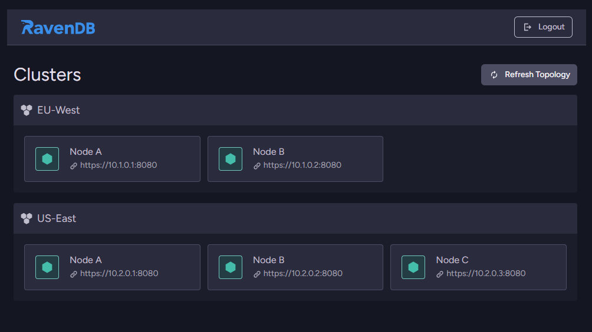

import Admonition from '@theme/Admonition';
import Tabs from '@theme/Tabs';
import TabItem from '@theme/TabItem';
import Panel from "@site/src/components/Panel";
import ContentFrame from "@site/src/components/ContentFrame";

# SSO: Deploying the SSO Application

<Admonition type="note" title="">

* The SSO application is distributed as a single Docker image (`ravendb/sso`) that bundles Nginx, the
  authentication sidecar, and `oauth2-proxy`.

* The [ravendb/sso](https://github.com/ravendb/sso) repository ships with an **interactive installer**
  (`install.sh` for Linux/macOS, `install.ps1` for Windows) that asks all the questions, pre-flights DNS
  and host permissions, generates a complete deployment directory, and optionally starts the stack. This
  is the recommended way to set up a new SSO application.

<Admonition type="tip" title="Use the installer">
Unless you have a specific reason to assemble the deployment by hand (for example because you're
integrating into existing automation), run `install.sh` / `install.ps1`.  
The installer produces the same artifacts
that the manual setup below describes, but with secrets generated for you, file permissions set, and DNS
sanity-checked.
</Admonition>

* In this article:
   * [Prerequisites](../../../server/security/sso/deploying-sso-app.mdx#prerequisites)
   * [DNS setup](../../../server/security/sso/deploying-sso-app.mdx#dns-setup)
   * [Recommended: interactive installer](../../../server/security/sso/deploying-sso-app.mdx#recommended-interactive-installer)
      * [What the installer produces](../../../server/security/sso/deploying-sso-app.mdx#what-the-installer-produces)
   * [Manual deployment with Docker Compose](../../../server/security/sso/deploying-sso-app.mdx#manual-deployment-with-docker-compose)
      * [1. Copy and fill the environment files](../../../server/security/sso/deploying-sso-app.mdx#1-copy-and-fill-the-environment-files)
      * [2. (Optional) Configure clusters via settings.json](../../../server/security/sso/deploying-sso-app.mdx#2-optional-configure-clusters-via-settingsjson)
      * [3. Start the stack](../../../server/security/sso/deploying-sso-app.mdx#3-start-the-stack)
      * [4. Volumes and on-host layout](../../../server/security/sso/deploying-sso-app.mdx#4-volumes-and-on-host-layout)
   * [Quick start (single container)](../../../server/security/sso/deploying-sso-app.mdx#quick-start-single-container)
   * [Registering OAuth providers](../../../server/security/sso/deploying-sso-app.mdx#registering-oauth-providers)
      * [GitHub](../../../server/security/sso/deploying-sso-app.mdx#github)
      * [Google](../../../server/security/sso/deploying-sso-app.mdx#google)
      * [Microsoft / Entra ID](../../../server/security/sso/deploying-sso-app.mdx#microsoft--entra-id)
      * [Cookie secret](../../../server/security/sso/deploying-sso-app.mdx#cookie-secret)
   * [Kerberos / Active Directory](../../../server/security/sso/deploying-sso-app.mdx#kerberos-active-directory)
   * [Logs](../../../server/security/sso/deploying-sso-app.mdx#logs)
   * [Troubleshooting](../../../server/security/sso/deploying-sso-app.mdx#troubleshooting)
   * [Next steps](../../../server/security/sso/deploying-sso-app.mdx#next-steps)

</Admonition>

<Panel heading="Prerequisites">

- [Docker](https://www.docker.com) (Compose v2).
- A public domain you control, with the ability to create DNS records.
- At least one of:
  - OAuth credentials for **GitHub**, **Google**, or **Microsoft/Entra ID**, or
  - A Kerberos keytab for an Active Directory service principal.
- For the bundled [Let's Encrypt](https://letsencrypt.org) option: an **AWS account** with **Route53** hosting the SSO domain and an
  IAM user authorized to create TXT records (DNS-01 challenge). The installer can also wire up a
  manually-supplied certificate instead.

</Panel>

<Panel heading="DNS setup">

The SSO application is reached at a base domain (e.g. `sso.example.com`). Each RavenDB cluster behind it is
exposed at `<cluster-alias>.<sso-domain>` - for example `my-cluster.sso.example.com`. You therefore need
both an apex record and a wildcard for sub-aliases:

| Type | Name | Value |
|---|---|---|
| `A` | `sso.example.com` | your server's public IP |
| `CNAME` | `*.sso.example.com` | `sso.example.com` |

The installer probes both records before continuing and will warn (but not block) if they are missing.

</Panel>

<Panel heading="Recommended: interactive installer">

The installer is a single self-contained script - every template it writes (including `nlog.config` and
the `docker-compose.yml`) is embedded inline, so you can download and run it directly without cloning the
repository.

<Tabs>
<TabItem value="linux" label="Linux / macOS">

Download and run:

```bash
curl -fsSL https://ravendb-build-assets.s3.us-east-1.amazonaws.com/Sso/install.sh -o install.sh
chmod +x install.sh
./install.sh
```
<br />

Or pipe directly into Bash:

```bash
bash <(curl -fsSL https://ravendb-build-assets.s3.us-east-1.amazonaws.com/Sso/install.sh)
```

</TabItem>
<TabItem value="windows" label="Windows">

Download and run:

```powershell
Invoke-WebRequest -Uri https://ravendb-build-assets.s3.us-east-1.amazonaws.com/Sso/install.ps1 -OutFile install.ps1
.\install.ps1
```
<br />

Or run directly from the URL:

```powershell
iex (irm https://ravendb-build-assets.s3.us-east-1.amazonaws.com/Sso/install.ps1)
```

</TabItem>
</Tabs>

If you'd rather have the rest of the repository (for the manual `example/` deployment, source, or tests),
clone it and run the script from there instead:

```bash
git clone https://github.com/ravendb/sso.git && cd sso && ./install.sh
```
<br />

The script walks through the following steps:

1. **Output directory** - defaults to `./sso-deploy`. Must be empty.
2. **Host user check** *(Linux only)* - verifies that UID `10000` exists; offers to create the
   `ravendb-sso` system user (the SSO container runs as `10000:10000`).
3. **SSO URL** - your public `https://sso.example.com`.
4. **DNS sanity check** - resolves the apex `A` record and probes a random subdomain to confirm the
   wildcard `CNAME` is in place.
5. **TLS certificate strategy** - pick `certbot-route53` (automated Let's Encrypt via Route53 DNS-01) or
   `manual` (you supply `fullchain.pem` and `privkey.pem`).
6. **Authentication providers** - multi-select between GitHub, Google, Microsoft/Entra ID, and Kerberos.
   Each selected provider expands into its own credential prompts.
7. **Kerberos files** *(if Kerberos was chosen)* - paths to `krb5.conf` and `krb5.keytab`. On Linux the
   script verifies that UID `10000` can read both files and offers to apply an ACL (`setfacl -m u:10000:r`)
   if not.
8. **Clusters** - for each RavenDB cluster, an alias (lowercase letters, digits, hyphens) and one or more
   node URLs (HTTPS only).
9. **Summary and confirmation**, then file generation.

<ContentFrame>

### What the installer produces

The installer generates a self-contained deployment directory:

```
sso-deploy/
  sso.env               # SSO secrets - mode 600
  certbot.env           # AWS creds + LE email (only if cert mode = certbot) - mode 600
  docker-compose.yml    # Two services if certbot, one if manual certs
  config/
    settings.json       # Generated cluster topology
    nlog.config         # Copied from the example
  certs/                # Pre-created, owned by UID 10000 (populated by certbot or pre-staged)
  logs/                 # Pre-created, owned by UID 10000
  README-deploy.md      # Per-deployment quick reference
```
<br />

`OAUTH2_PROXY_COOKIE_SECRET` is generated automatically (32 hex chars). `config/`, `certs/`, and `logs/`
are chowned to `10000:10000` so the container can write to them. After the script finishes, start the
stack from the generated directory:

```bash
cd sso-deploy
docker compose up -d
```
<br />

As its final step, the installer offers to run `docker compose up -d` for you.

</ContentFrame>

</Panel>

<Panel heading="Manual deployment with Docker Compose">

If you can't or don't want to run the installer, the example under `Raven.Sso/example/` in the
[ravendb/sso](https://github.com/ravendb/sso) repository is the same layout the installer generates, just
filled in by hand. The compose file runs two containers:

- **[certbot](https://certbot.eff.org)** - `certbot/dns-route53`. Obtains the wildcard certificate on first start and renews every 12 hours.
- **`sso`** - `ravendb/sso:latest`. Starts once `certbot` has produced a valid certificate, and reloads Nginx
  every 6 hours to pick up renewals.

<ContentFrame>

### 1. Copy and fill the environment files

The example splits environment variables into two files so AWS credentials aren't exposed to the SSO container:

```bash
cp sso.env.example sso.env
cp certbot.env.example certbot.env
```
<br />

Edit each file with your domain, OAuth credentials, and AWS keys. The complete list of variables is on the
[SSO application configuration](../../../server/security/sso/sso-configuration.mdx) page.

</ContentFrame>

<ContentFrame>

### 2. (Optional) Configure clusters via `settings.json`

The list of RavenDB clusters the SSO application should proxy can live in `config/settings.json`:

```json
{
  "Clusters": [
    {
      "ClusterUrls": ["https://a.my-cluster.example.com"],
      "ClusterAlias": "my-cluster"
    }
  ]
}
```
<br />

Alternatively, set `RAVENDBSSO_Clusters` in `sso.env` to the same JSON array - environment variables override
file values.

</ContentFrame>

<ContentFrame>

### 3. Start the stack

```bash
docker compose up -d
```
<br />

On first run, `certbot` requests the wildcard certificate from Let's Encrypt; this can take 1–2 minutes
while the DNS TXT record propagates. The SSO container's `depends_on` waits for `certbot` to report healthy
before starting Nginx.

<Admonition type="warning" title="Use RSA keys">
The example's `certbot` entrypoint pins `--key-type rsa`. RavenDB's certificate utilities only support RSA;
do not switch this to ECDSA.
</Admonition>

</ContentFrame>

<ContentFrame>

### 4. Volumes and on-host layout

The deployment maps these host directories into the containers:

```
example/
  sso.env                # SSO env vars
  certbot.env            # certbot env vars
  docker-compose.yml
  config/
    settings.json        # optional - clusters can come from env vars instead
    nlog.config          # optional - logging configuration (autoReload)
  certs/                 # populated by certbot
    live/<domain>/
      fullchain.pem
      privkey.pem
  logs/                  # SSO + Nginx logs
```

</ContentFrame>

</Panel>

<Panel heading="Quick start (single container)">

For local testing without Let's Encrypt, build the image directly and pass credentials on the command line:

```bash
docker build -t ravendb/sso .

docker run --rm -it \
    -p 8080:8080 \
    -e OAUTH2_PROXY_COOKIE_SECRET=$(openssl rand -base64 32) \
    -e GITHUB_CLIENT_ID=... \
    -e GITHUB_CLIENT_SECRET=... \
    -e GOOGLE_CLIENT_ID=... \
    -e GOOGLE_CLIENT_SECRET=... \
    -e MICROSOFT_CLIENT_ID=... \
    -e MICROSOFT_CLIENT_SECRET=... \
    -e MICROSOFT_TENANT=common \
    -v /path/to/app.keytab:/etc/nginx/app.keytab:ro \
    -v /path/to/krb5.conf:/etc/krb5.conf:ro \
    ravendb/sso
```
<br />

Any combination of providers can run concurrently. Volumes for the keytab and `krb5.conf` are only needed
when using Kerberos.

After login, the SSO portal lists the clusters the user can reach - each cluster is exposed under its own
sub-alias of the SSO domain:



</Panel>

<Panel heading="Registering OAuth providers">

For every OAuth provider you enable, the redirect URI is
`https://<sso-domain>/oauth2/<provider>/callback`.

<ContentFrame>

### GitHub

1. Open [GitHub Settings → Developer settings → OAuth Apps](https://github.com/settings/developers).
2. **New OAuth App**.
3. Set **Homepage URL** to your SSO URL and **Authorization callback URL** to
   `https://<sso-domain>/oauth2/github/callback`.
4. Generate a client secret. Set `GITHUB_CLIENT_ID` and `GITHUB_CLIENT_SECRET`.

</ContentFrame>

<ContentFrame>

### Google

1. In [Google Cloud Console](https://console.cloud.google.com/) → **APIs & Services → Credentials**, create
   an **OAuth 2.0 Client ID** of type **Web application**.
2. Add `https://<sso-domain>/oauth2/google/callback` to **Authorized redirect URIs**.
3. Set `GOOGLE_CLIENT_ID` and `GOOGLE_CLIENT_SECRET`.

</ContentFrame>

<ContentFrame>

### Microsoft / Entra ID

The SSO image uses oauth2-proxy's `entra-id` provider, which supports both single-tenant and multi-tenant
apps.

1. In [Azure Portal → App registrations](https://portal.azure.com/#view/Microsoft_AAD_RegisteredApps/ApplicationsListBlade),
   click **New registration**.
2. Pick **Supported account types** - single-tenant, multi-tenant, or multi-tenant + personal accounts.
   This must match the `MICROSOFT_TENANT` value you choose.
3. Set **Redirect URI** (Web) to `https://<sso-domain>/oauth2/microsoft/callback`.
4. Under **Token configuration**, add `email` as an **optional claim** for the ID token - organizational
   accounts don't emit it by default, and the SSO application uses it as the username.
5. Under **Certificates & secrets**, create a client secret.
6. Set `MICROSOFT_CLIENT_ID`, `MICROSOFT_CLIENT_SECRET`, and `MICROSOFT_TENANT`:
   - **Single-tenant**: your tenant GUID.
   - **Multi-tenant (orgs only)**: `organizations`.
   - **Multi-tenant + personal accounts**: `common`.
7. For multi-tenant apps, scope access by setting `MICROSOFT_ALLOWED_TENANTS` (comma-separated tenant
   GUIDs) and / or `MICROSOFT_ALLOWED_EMAIL_DOMAINS`. Without these allowlists a multi-tenant app accepts
   **any** organization's users.

</ContentFrame>

<ContentFrame>

### Cookie secret

`oauth2-proxy` requires an encryption key for its session cookie.

```bash
# Single-container quick-start (32-byte base64):
openssl rand -base64 32

# docker-compose example (16/24/32-char hex):
openssl rand -hex 16
```
<br />

Set the result as `OAUTH2_PROXY_COOKIE_SECRET`.

</ContentFrame>

</Panel>

<Panel heading="Kerberos / Active Directory">

On a domain controller (or with delegated rights):

```powershell
# 1. Create a service account, e.g. svc_docker, then map an SPN to it:
setspn -A HTTP/app.domain.com svc_docker

# 2. Export a keytab:
ktpass /princ HTTP/app.domain.com@DOMAIN.COM `
       /mapuser DOMAIN\svc_docker `
       /pass YourPassword123 `
       /out C:\temp\app.keytab `
       /crypto All `
       /ptype KRB5_NT_PRINCIPAL
```
<br />

Mount the keytab at `/etc/nginx/app.keytab` and supply a Kerberos client config at `/etc/krb5.conf`:

```ini
[libdefaults]
    default_realm = DOMAIN.COM
    dns_lookup_kdc = true
    dns_lookup_realm = false

[realms]
    DOMAIN.COM = {
        kdc = dc01.domain.com
        admin_server = dc01.domain.com
    }

[domain_realm]
    .domain.com = DOMAIN.COM
    domain.com = DOMAIN.COM
```
<br />

If Kerberos auth fails or isn't available, Nginx falls back to OAuth automatically.

</Panel>

<Panel heading="Logs">

All logs are written under `/app/logs/` inside the container - mount the directory to keep them on the host:

| File | Source | Content |
|---|---|---|
| `app.log` | NLog (rotating, 7-day retention) | Startup, certificate generation, cluster polling, errors |
| `audit.log` | NLog (rotating, 30-day retention) | Login success/failure, access denied, logout - with user and client IP |
| `app.out.log` | stdout | Raw .NET process stdout |
| `app.err.log` | stderr | Raw .NET process stderr |
| `nginx-access.log` | Nginx | Standard combined access log |
| `nginx-error.log` | Nginx | Errors and warnings |
| `nginx-audit.log` | Nginx | Per-request audit log - real client IP, authenticated user, target host, status, response time |

`nlog.config` is loaded from `/app/config/nlog.config` at startup with `autoReload="true"`, so log levels
can be changed without restarting the container.

</Panel>

<Panel heading="Troubleshooting">

Common symptoms and their likely causes:

| Symptom | Likely cause |
|---|---|
| `certbot` fails with a Route53 error | AWS credentials or the DNS zone isn't actually in Route53. |
| `sso` container exits immediately | `RAVENDBSSO_Url` not set in `sso.env`. |
| `502 Bad Gateway` shortly after startup | The .NET sidecar on `127.0.0.1:3000` is still warming up - retry. |
| Login loops back to the provider | Wrong callback URL registered, or `OAUTH2_PROXY_COOKIE_SECRET` length is invalid (must be 16, 24, or 32 chars). |

To find the cause of any of these symptoms, check the container logs:

```bash
docker logs ravendb-sso     # nginx + .NET app
docker logs certbot         # certificate issues
```

</Panel>

<Panel heading="Next steps">

Once the SSO application is up, register its certificate and create SSO user entries in your RavenDB cluster
following [SSO Certificates and Users](../../../server/security/authentication/sso-certificates.mdx).

</Panel>
