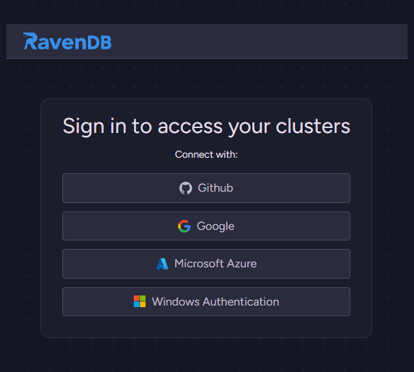

import Admonition from '@theme/Admonition';
import Panel from "@site/src/components/Panel";
import ContentFrame from "@site/src/components/ContentFrame";

# SSO: Overview

<Admonition type="note" title="">

* RavenDB SSO lets users access a cluster using their existing identity provider - GitHub, Google,
  Microsoft/Entra ID, or Windows/[Kerberos](https://en.wikipedia.org/wiki/Kerberos_%28protocol%29) - instead of distributing X.509 client certificates per user.

* A dedicated **SSO application** (an authenticating reverse proxy) handles authentication, sitting
  in front of one or more RavenDB clusters.

* RavenDB itself only needs to know which SSO servers it trusts and how to map an SSO identity to a
  [security clearance](../../../server/security/authorization/security-clearance-and-permissions.mdx) and database permissions.

* In this article:
   * [Setting up SSO](../../../server/security/sso/overview.mdx#setting-up-sso)
   * [Components](../../../server/security/sso/overview.mdx#components)
   * [Authentication flow](../../../server/security/sso/overview.mdx#authentication-flow)
   * [Trust model](../../../server/security/sso/overview.mdx#trust-model)
   * [Licensing](../../../server/security/sso/overview.mdx#licensing)
   * [Security considerations](../../../server/security/sso/overview.mdx#security-considerations)
   * [Auditing and monitoring](../../../server/security/sso/overview.mdx#auditing-and-monitoring)
      * [Auditing](../../../server/security/sso/overview.mdx#auditing)
      * [Monitoring](../../../server/security/sso/overview.mdx#monitoring)
      * [SSO application logs](../../../server/security/sso/overview.mdx#sso-application-logs)

</Admonition>

<Panel heading="Setting up SSO">

Setting up SSO takes three one-time steps:

1. **Deploy the SSO application** in front of your cluster.  
   See [Deploying the SSO application](../../../server/security/sso/deploying-sso-app.mdx) and its
   [configuration reference](../../../server/security/sso/sso-configuration.mdx).
2. **Register the SSO server certificate** with your RavenDB cluster, as a Cluster Admin.  
   See [Register an SSO server certificate](../../../server/security/authentication/sso-certificates.mdx#register-an-sso-server-certificate).
3. **Create an SSO user entry** for each user or group, as an Operator or higher.  
   See [Register an SSO user entry](../../../server/security/authentication/sso-certificates.mdx#register-an-sso-user-entry).

Once the application, certificate, and user entries are in place, users sign in at the SSO URL
and RavenDB matches each SSO identity to its user entry.  
See [Authentication flow](../../../server/security/sso/overview.mdx#authentication-flow) for what happens on each sign-in.

</Panel>

<Panel heading="Components">

An SSO setup has three components:

| Component | Role |
|---|---|
| **SSO application** | Nginx + .NET 10 sidecar packaged as `ravendb/sso`. Terminates TLS, runs [OAuth2](https://oauth.net/2/) / Kerberos, issues a per-user ECDSA client certificate, and proxies to RavenDB over mTLS. |
| **[oauth2-proxy](https://github.com/oauth2-proxy/oauth2-proxy)** | Bundled inside the SSO image. Handles the OAuth2 dance for GitHub, Google, and Microsoft. |
| **RavenDB cluster** | Trusts the SSO server's certificate and resolves the SSO identity (embedded in the per-user cert) to a registered SSO user entry. |

</Panel>

<Panel heading="Authentication flow">

Once SSO is set up, every sign-in runs through these steps automatically:

1. The browser hits the SSO URL - for example `https://my-cluster.sso.example.com/studio/`.
2. Nginx checks for a valid JWT cookie. If none is present, it redirects to upstream auth:
   - `/auth` - Kerberos/AD (`auth_gss`), or
   - `/oauth` - `oauth2-proxy` for GitHub, Google, or Microsoft.
3. After upstream auth succeeds, Nginx forwards the authenticated username to the .NET sidecar at `/auth`
   via the `X-Auth-User` header.
4. The sidecar generates a unique ECDSA client certificate for the user (cached by thumbprint) and issues
   a JWT cookie containing the certificate and key paths.
5. Nginx validates the JWT and uses the referenced certificate to open an mTLS connection to RavenDB.
6. RavenDB sees a client certificate whose subject carries an **SSO identity extension**
   (`Provider`, `Domain`, `Identifier` - `Domain` is only populated when `Provider = Windows`, where it
   carries the Kerberos realm). RavenDB looks up a matching **SSO user entry** in the cluster
   and applies the entry's security clearance and database permissions.

</Panel>

<Panel heading="Trust model">

To accept users who sign in through SSO, the cluster keeps two records:

1. The certificate of an SSO server the cluster trusts.
2. An SSO user entry that grants RavenDB permissions to an SSO identity.

The cluster stores both records as certificates, told apart by their `Usage`:

1. **`Usage = SsoServer`**  
   One per trusted SSO server.
2. **`Usage = SsoClient`**  
   An SSO user entry is the SSO counterpart to a client certificate's permissions: it names one or
   more SSO identities and the RavenDB permissions those identities receive.  
   The entry also names the SSO servers that may present those identities: specific servers, by
   their [public-key pinning hash](../../../server/security/authentication/certificate-renewal-and-rotation.mdx#implicit-trust-by-public-key-pinning-hash),
   or any registered SSO server (`AllowAnySsoServer`).  
   See [Register an SSO user entry](../../../server/security/authentication/sso-certificates.mdx#register-an-sso-user-entry).

</Panel>

<Panel heading="Licensing">

SSO is a commercial feature. Registering an SSO server certificate requires **Cluster Admin**
clearance; creating SSO user entries requires **Operator** clearance or higher.

<Admonition type="warning" title="Commercial feature">
Both registering an SSO server certificate and creating an SSO user entry fail with a license
error if your license does not permit SSO.
</Admonition>

</Panel>

<Panel heading="Security considerations">

When setting up SSO, weigh these points:

- **Two-factor authentication does not cover SSO users.**  
  Because RavenDB cannot enforce a second factor for an SSO sign-in, require multi-factor
  authentication through your identity provider.  
  See [Register an SSO user entry](../../../server/security/authentication/sso-certificates.mdx#register-an-sso-user-entry).
- **Enable `AllowAnySsoServer` only when you mean it.**  
  With this setting on, RavenDB accepts a user's identity from any registered SSO server; keep it
  off to limit the user to the servers you list.  
  See [Trust model](../../../server/security/sso/overview.mdx#trust-model).
- **Renew the SSO server certificate with its existing key.**  
  RavenDB trusts the certificate by its key, so a renewal that changes the key can lock out SSO
  users until you re-register the new certificate.  
  See [Renewing the SSO server certificate](../../../server/security/authentication/sso-certificates.mdx#renewing-the-sso-server-certificate).
- **Protect the SSO application's secrets and file paths.**  
  Keep the secret that protects its session cookies private, and keep its certificate and key
  files within the application's own directories.  
  See [SSO application configuration](../../../server/security/sso/sso-configuration.mdx).

</Panel>

<Panel heading="Auditing and monitoring">

You can review SSO activity on both the RavenDB cluster and the SSO application:

<ContentFrame>

### Auditing

RavenDB's [audit log](../../../server/security/audit-log/audit-log-overview.mdx) records each
connection to the cluster, including the certificate used and the access granted.  
An SSO user connects with the per-user certificate that the SSO application issued, so the
audit log records the login under the user's SSO identity, alongside your regular client
connections.

</ContentFrame>

<ContentFrame>

### Monitoring

You can use **Traffic Watch** to see who is really behind a request that the SSO application
proxied to the server.  
Traffic Watch is a Studio view, opened from `Manage Server` > `Traffic Watch`, that lists the
HTTP requests reaching a server and lets you follow them live and trace a single request.  
The Traffic Watch view shows the **SSO user** behind a proxied request (the identity carried in
the per-user certificate), along with the real client IP (listed separately from the SSO
application's own proxy IP).

</ContentFrame>

<ContentFrame>

### SSO application logs

The SSO application keeps its own audit log as well, recording login successes and failures,
access denials, and logouts, each with the user and client IP.  
See [the SSO application's logs](../../../server/security/sso/deploying-sso-app.mdx#logs).

</ContentFrame>

</Panel>