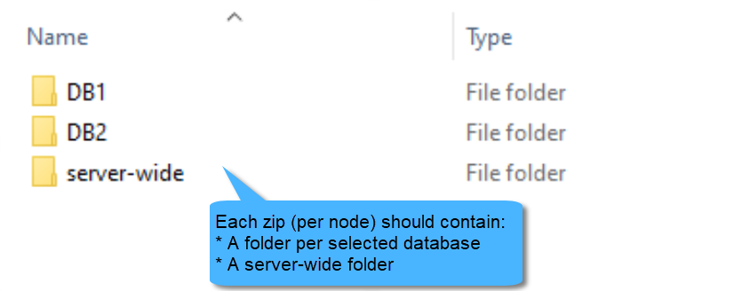
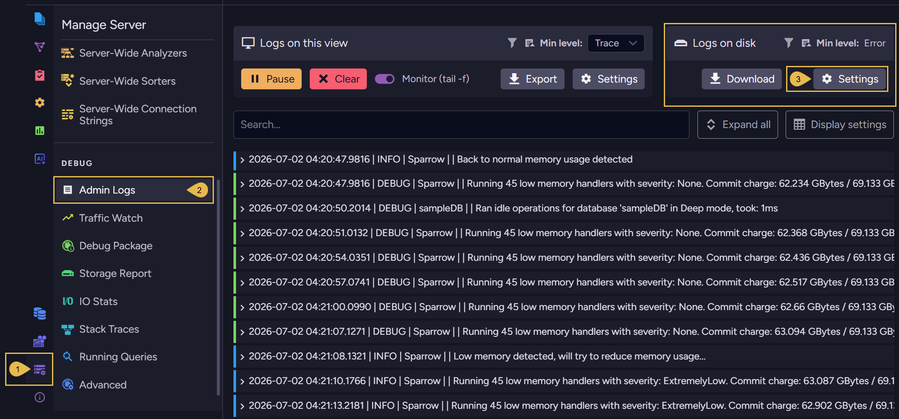
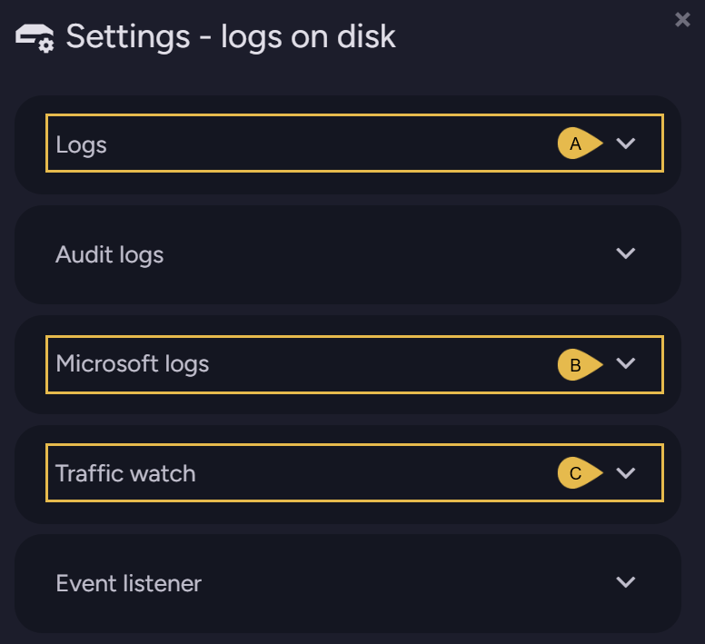
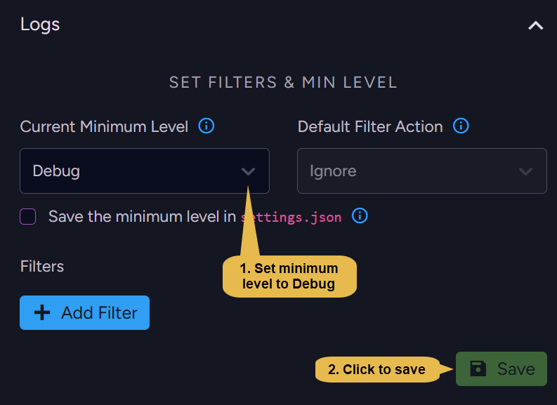
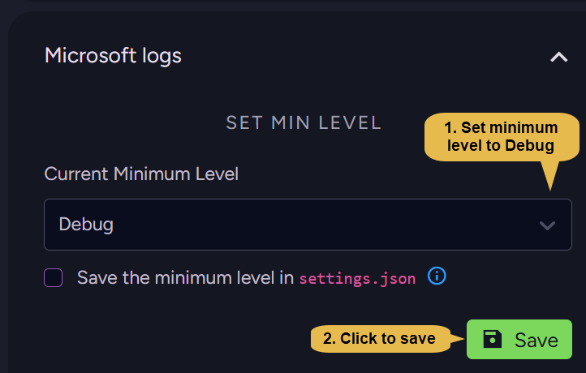
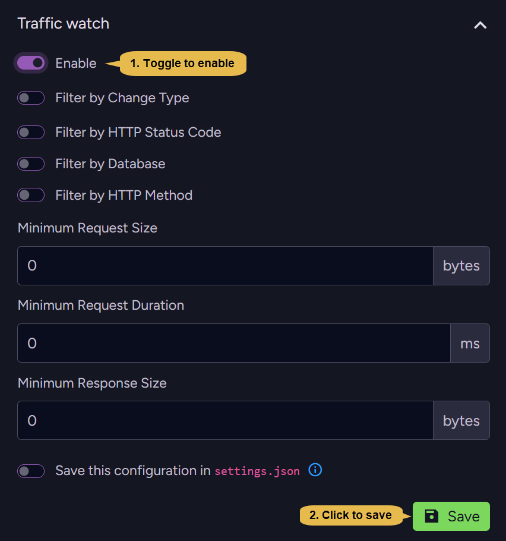
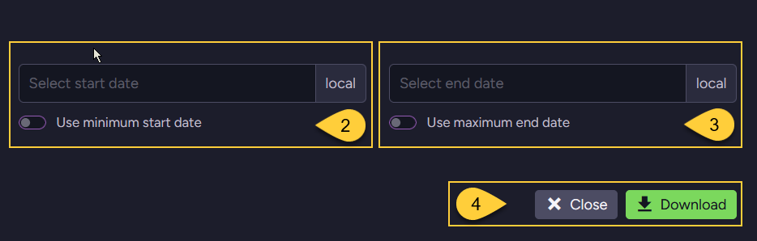
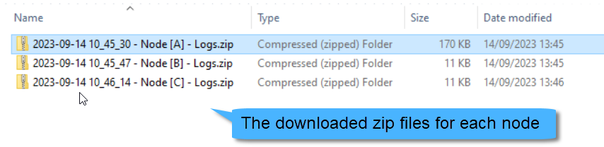

import Admonition from '@theme/Admonition';
import Tabs from '@theme/Tabs';
import TabItem from '@theme/TabItem';
import CodeBlock from '@theme/CodeBlock';
import LanguageSwitcher from "@site/src/components/LanguageSwitcher";
import LanguageContent from "@site/src/components/LanguageContent";
import ContentFrame from '@site/src/components/ContentFrame';
import Panel from '@site/src/components/Panel';

# Collecting Information on Incidents for Support

<Admonition type="note" title="">

* When encountering incidents or issues with RavenDB, it is essential to gather as much information as possible 
  to help the support team diagnose and resolve the problem effectively.

* Follow the steps described in this article to collect relevant information for RavenDB support.

* In this article:

  * [Provide incident description](../../server/troubleshooting/collect-info.mdx#provide-incident-description)
  * [Create debug package](../../server/troubleshooting/collect-info.mdx#create-debug-package)
  * [Enable logs for ongoing issues](../../server/troubleshooting/collect-info.mdx#enable-logs-for-ongoing-issues)
  * [Download logs](../../server/troubleshooting/collect-info.mdx#download-logs)
  * [Reproduce scenario](../../server/troubleshooting/collect-info.mdx#reproduce-scenario)
  * [Create failing test](../../server/troubleshooting/collect-info.mdx#create-failing-test)

</Admonition>

<Panel heading="Provide incident description">

* **Description**:  
  * Provide a detailed description of the incident you are experiencing.
  * Include any error messages, warnings, or unexpected behavior you have encountered.

* **Exceptions**:  
  * If an exception was thrown, attach the **full exception stack trace** including the error message as plain text.
  * Specify the exception's origin (e.g., RavenDB Studio, client, server logs, etc.).

* **Versions**:  
  * Specify your RavenDB server, Studio, and client **versions**.

</Panel>

<Panel heading="Create debug package">

Studio's **Debug Package** view allows you to collect diagnostic information about your server or cluster into a debug package (a `.zip` file).  
To create such a package, go to **Manage Server &gt; Debug Package** and click **Download package for entire cluster** (or choose your current server 
from the dropdown).  

For the full walkthrough, see [Create a Debug Package](../../server/troubleshooting/debug-package/create-debug-package.mdx).

<Admonition type="info" title="">

**If Studio is unavailable**:

* Try to download the debug package by issuing an HTTP GET request to the following endpoint:  
  `{SERVER_URL}/admin/debug/info-package`.

* Execute this request for each cluster node, replacing `{SERVER_URL}` with the relevant node's URL.

</Admonition>

<Admonition type="note" title="">

**Before sending the debug package zip file**, perform the following checks:  

  * Verify that the zip file can be successfully extracted.
  * Verify that the content is similar to the following sample images.

</Admonition>

</Panel>

<Panel heading="Enable logs for ongoing issues">

If the issue you're encountering is still **ongoing**, enable the following logs on disk (if not already enabled) 
before [downloading the log files](../../server/troubleshooting/collect-info#download-logs).

1. Navigate to **Manage Server &gt; Admin Logs**

2. Click **Settings** in the "Logs on disk" section.  
   The following Settings dialog will open:

### Server logs:
  
### Microsoft logs:
  
### Traffic watch logs:
  
<Admonition type="warning" title="">

Be aware that a server restart will reset all log settings to their default values.  
To preserve your settings even through a restart, either:

  * **Save the settings** in each log dialog to the `settings.json` file by checking the UI checkbox:  
    (Scroll down in the Traffic watch logs dialog to see this option)  
    

  * or **Set the relevant configuration key** as described in the [configuration overview](../../server/configuration/configuration-options.mdx):
    * For **Server logs**: set the [Logs.MinLevel](../../server/configuration/logs-configuration.mdx#logsminlevel) configuration key.  
    * For **Microsoft logs**: set the [Logs.Microsoft.MinLevel](../../server/configuration/logs-configuration.mdx#logsmicrosoftminlevel) configuration key.
    * For **Traffic watch logs**: set the [TrafficWatch.Mode](../../server/configuration/traffic-watch-configuration.mdx#trafficwatchmode) configuration key.

</Admonition>

</Panel>

<Panel heading="Download logs">

Perform the following for each cluster node:

<Admonition type="note" title="">

1. Navigate to **Manage Server &gt; Admin Logs** and click 'Download Logs' in the "Logs on disk" section.

2. Either check 'Use minimum start date' to retrieve logs information from the time the server was started,  
   or enter a specific (local) time.

3. Either check 'Use maximum end date' to retrieve logs information up to the current time,  
   or enter a specific (local) time.

4. Click 'Download'.  
   A zip file containing the logs will be downloaded.

</Admonition>

<Admonition type="info" title="">

**If Studio is unavailable**, or the logs downloaded via Studio appear erroneous,  
copy the log files directly from disk to another location to ensure they are kept,  
avoiding potentially losing them due to retention policy.

* **Log files location** is set by the [Logs.Path](../../server/configuration/logs-configuration.mdx#logspath) configuration key.

* **Logs deletion** is controlled by the following configuration keys:
  * [Logs.MaxArchiveDays](../../server/configuration/logs-configuration.mdx#logsmaxarchivedays)
  * [Logs.MaxArchiveFiles ](../../server/configuration/logs-configuration.mdx#logsmaxarchivefiles)

</Admonition> 

<Admonition type="note" title="">

**Before sending the log files**, perform the following checks:

* Verify that the zip files can be successfully extracted.  
* Confirm that the logs correspond to the time of the incident.  
* Verify that the content is similar to the following sample images.

</Admonition>

</Panel>

<Panel heading="Reproduce scenario">

* If the incident is over and you can reproduce it, verify first that the logging level is set to '**Debug**'.  

* See how to enable the logs in [Enable logs](../../server/troubleshooting/collect-info.mdx#enable-logs-for-ongoing-issues).

</Panel>

<Panel heading="Create failing test">

* If possible, it is advised to create a unit test that showcases the failure in your client code.

* Refer to [Writing your unit test](../../start/test-driver.mdx) to learn how to use RavenDB's **TestDriver**.

</Panel>