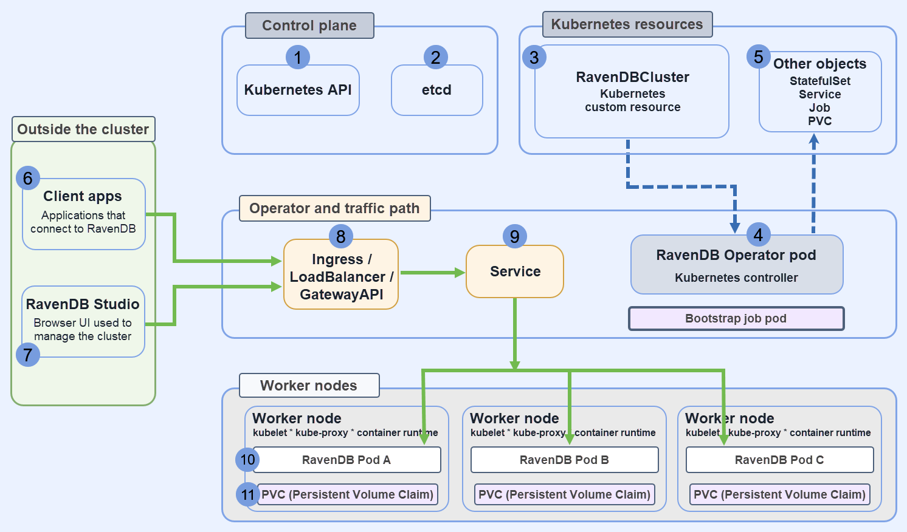

import Admonition from '@theme/Admonition';
import Tabs from '@theme/Tabs';
import TabItem from '@theme/TabItem';
import LanguageSwitcher from "@site/src/components/LanguageSwitcher";
import LanguageContent from "@site/src/components/LanguageContent";
import Panel from "@site/src/components/Panel";
import ContentFrame from "@site/src/components/ContentFrame";

<Admonition type="note" title="">

* This article serves as an **overview** for the operator workflow: it explains what the Kubernetes RavenDB Operator is, how the operator-managed deployment works, and how to use the running cluster afterward.  

* For the **full end-to-end walkthrough**, including the detailed setup, configuration, and bootstrap steps, see:  
  [The RavenDB Kubernetes Operator way](../../../guides/the-ravendb-kubernetes-operator-way#prologue)

* In this article:  
  - [What the operator is](../../start/containers/kubernetes-operator#what-the-operator-is)
  - [Before you start](../../start/containers/kubernetes-operator#before-you-start)
  - [Install the operator](../../start/containers/kubernetes-operator#install-the-operator)
  - [Prepare the namespace and Secrets](../../start/containers/kubernetes-operator#prepare-the-namespace-and-secrets)
  - [Define `RavenDBCluster`](../../start/containers/kubernetes-operator#define-ravendbcluster)
  - [Apply the cluster](../../start/containers/kubernetes-operator#apply-the-cluster)
  - [Use the cluster](../../start/containers/kubernetes-operator#use-the-cluster)
  - [Observe and troubleshoot](../../start/containers/kubernetes-operator#observe-and-troubleshoot)
  - [Upgrade the cluster](../../start/containers/kubernetes-operator#upgrade-the-cluster)
  - [Current limitation: topology changes after bootstrap](../../start/containers/kubernetes-operator#current-limitation-topology-changes-after-bootstrap)

</Admonition>

---

<Panel heading="What the operator is">

A Kubernetes Operator is a component dedicated to managing a specific application.  
In Kubernetes terms, the operator is a controller: a component that reads a declared configuration and carries out the work needed to make the actual deployment match it.

The Kubernetes RavenDB Operator applies this pattern to a secure RavenDB cluster.  
The configuration you declare is a `RavenDBCluster` custom resource, that defines the RavenDB cluster you want Kubernetes to run.  
When you apply this resource, the operator creates and maintains the Kubernetes resources needed for the cluster deployment.

<ContentFrame>

### Why use an operator

Running RavenDB on Kubernetes involves more than starting Pods. Each RavenDB node stores durable data, so the deployment must provide persistent storage that remains attached correctly even when Pods restart or are rescheduled. The cluster also depends on certificates, networking, Secrets, Jobs, and other Kubernetes resources that need to match the declared cluster configuration. The operator is the component that takes responsibility for coordinating that work inside Kubernetes.

</ContentFrame>

<ContentFrame>

### What the operator manages

In practice, the operator manages work such as:

- Creating and maintaining the Kubernetes resources the cluster depends on
- Bootstrapping the initial cluster
- Wiring certificates and TLS
- Configuring external access
- Provisioning persistent storage
- Reporting health and status
- Carrying out rolling upgrades

</ContentFrame>

<ContentFrame>

The following diagram shows the main components of an operator-managed RavenDB deployment, where they are located, and how they relate to each other.


*RavenDBCluster is stored in etcd and exposed via the Kubernetes API server; The RavenDB Operator watches this custom resource and reconciles it by creating and managing the required Kubernetes objects; RavenDB itself runs in Pod-assigned containers on worker nodes.*

1. **Kubernetes API**  
   The control-plane component that accepts and serves Kubernetes objects.

2. **etcd**  
   The datastore that stores the Kubernetes cluster state.

3. **RavenDBCluster resource**  
   A Kubernetes custom resource that defines the RavenDB cluster configuration.

4. **RavenDB Operator Pod**  
   A Kubernetes controller that reads the `RavenDBCluster` resource and manages the Kubernetes objects needed for the deployment.

5. **Managed Kubernetes objects**  
   Objects such as a StatefulSet, Service, Job, and PVCs that the operator creates or updates.

6. **Client apps**  
   Applications that connect to RavenDB.

7. **RavenDB Studio**  
   The browser UI used to manage the running RavenDB cluster.

8. **Ingress / LoadBalancer**  
   The network entry point used by traffic coming from outside the cluster.

9. **Service**  
   Routes requests to a RavenDB Pod.

10. **RavenDB Pods**  
    The actual RavenDB server processes. RavenDB itself runs here, on worker nodes.

11. **Persistent storage**  
    Storage attached to each RavenDB Pod for RavenDB data.

</ContentFrame>

</Panel>

<Panel heading="Before you start">

Before setting up the operator, make sure the Kubernetes environment can support a secure RavenDB cluster and that the required materials are ready.

* To deploy a RavenDB cluster using the operator, you need the license and certificates from the generated setup package.

* **Kubernetes environment**  
   - You need a running Kubernetes cluster, `kubectl`, Helm, and `cert-manager`.
   - The operator uses admission webhooks to validate and mutate resources during creation and updates; these webhooks require TLS certificates managed by `cert-manager`.  
`cert-manager` is used to issue and manage those certificates.

* For the full environment setup, `cert-manager`, and operator installation, see [Part 1: Setup & Operator Installation](../../../guides/the-ravendb-kubernetes-operator-way#part-1-setup--operator-installation).

</Panel>

<Panel heading="Install the operator">


The recommended installation method is Helm.

```bash
helm repo add ravendb-operator https://ravendb.github.io/ravendb-operator/helm
helm repo update

helm install ravendb-operator ravendb-operator/ravendb-operator \
  -n ravendb-operator-system \
  --create-namespace
```
<br />
This installs the operator itself in the `ravendb-operator-system` namespace,  
it does not create a RavenDB cluster yet.

The operator starts managing RavenDB only after you create the required Secrets and apply a `RavenDBCluster` resource that references them.

For the full installation flow, including Helm, `make deploy`, and OLM, see [Part 1: Setup & Operator Installation](../../../guides/the-ravendb-kubernetes-operator-way#part-1-setup--operator-installation).

</Panel>

<Panel heading="Prepare the namespace and Secrets">


After the operator is installed, create a namespace for the cluster and prepare the **Secrets** that the `RavenDBCluster` will reference.

```bash
kubectl create namespace ravendb
```

<ContentFrame>

<Admonition type="note" title="">
Learn more about the deployment of secrets in the operator [readme file](https://github.com/ravendb/ravendb-operator?tab=readme-ov-file#installation).
</Admonition>

At a minimum, you need:
- A license Secret
- A client certificate Secret
- Server certificate Secrets for the RavenDB nodes

Each Secret has a different role.
- The **license Secret** makes the RavenDB license available to the cluster.
- The **client certificate Secret** contains the `ClusterAdmin` certificate used by the bootstrap job when it calls RavenDB management APIs during the initial cluster formation.
- The **server certificate Secrets** contain the certificates used by the RavenDB nodes themselves.

</ContentFrame>

A minimal setup looks like this:

```bash
kubectl create secret generic ravendb-license \
  --from-file=license.json=./license.json \
  -n ravendb

kubectl create secret generic ravendb-client-cert \
  --from-file=client.pfx=./admin-client-cert.pfx \
  -n ravendb

kubectl create secret generic ravendb-certs-a \
  --from-file=server.pfx=./setup-package/A/server-cert.pfx \
  -n ravendb
```
<br />
Create one server-certificate Secret per node, and reference each one from the matching node entry in `spec.nodes`.

The exact certificate files depend on the TLS mode you choose.
- In **Let’s Encrypt mode**, the operator workflow uses the certificate files generated earlier by the secure RavenDB setup flow and stored in the RavenDB setup package.
- In **self-signed mode**, you provide the certificate files yourself.  
  In this case, the CA certificate is also needed, because it tells RavenDB and its clients which certificate authority issued the server certificates.

For the detailed certificate flows and the exact prerequisites they produce, see [Part 4: TLS](../../../guides/the-ravendb-kubernetes-operator-way#part-4-tls).  
The full apply sequence that creates the prerequisites and then applies the cluster is shown in [Part 6: Bringing the Cluster to Life](../../../guides/the-ravendb-kubernetes-operator-way#part-6-bringing-the-cluster-to-life).

</Panel>

<Panel heading="Define `RavenDBCluster`">


`RavenDBCluster` is the custom resource that defines the intended RavenDB deployment.  
The operator reads this resource and uses it to create and manage the cluster.

Instead of applying and maintaining a StatefulSet, Service, Job, and PVCs separately, you describe the cluster here and let the operator manage these resources.

A typical definition includes:

- The RavenDB nodes and their public URLs
- The image to run
- The TLS mode
- The Secrets for the license and certificates
- The storage configuration
- The external access configuration

The example below shows the general shape of an operator-managed cluster:

```yaml
apiVersion: ravendb.ravendb.io/v1
kind: RavenDBCluster
metadata:
  name: ravendbcluster-sample
  namespace: ravendb

spec:
  nodes:
    - tag: a
      publicServerUrl: https://a.example.development.run:443
      publicServerUrlTcp: tcp://a-tcp.example.development.run:443
      certSecretRef: ravendb-certs-a
    - tag: b
      publicServerUrl: https://b.example.development.run:443
      publicServerUrlTcp: tcp://b-tcp.example.development.run:443
      certSecretRef: ravendb-certs-b
    - tag: c
      publicServerUrl: https://c.example.development.run:443
      publicServerUrlTcp: tcp://c-tcp.example.development.run:443
      certSecretRef: ravendb-certs-c

  storage:
    data:
      size: 10Gi
      storageClassName: local-path

  externalAccessConfiguration:
    type: ingress-controller
    ingressControllerContext:
      ingressClassName: nginx

  image: ravendb/ravendb:latest
  imagePullPolicy: IfNotPresent

  mode: LetsEncrypt
  email: user@example.com
  domain: example.development.run

  licenseSecretRef: ravendb-license
  clientCertSecretRef: ravendb-client-cert
```

<ContentFrame>

### Fields that matter most

A few fields deserve special attention:

- `nodes` defines the RavenDB nodes that make up the cluster.
- `publicServerUrl` and `publicServerUrlTcp` are the addresses RavenDB advertises to clients and other nodes.
- `certSecretRef` ties each node to its server certificate Secret.
- `licenseSecretRef` and `clientCertSecretRef` connect the cluster to the Secrets prepared earlier.
- `externalAccessConfiguration` defines how Kubernetes exposes the nodes.
- `storage` defines the persistent storage RavenDB will use.

</ContentFrame>

The `externalAccessConfiguration` block is the part that changes most from one environment to another.

Ingress-based deployments, cloud load balancers, and node-specific public IP mappings all use different configurations, but the role of this block is always the same: tell the operator what networking resources it needs to create and manage so the declared RavenDB URLs are actually reachable.

For the structure of the custom resource itself, see [Part 2: RavenDBCluster CRD](../../../guides/the-ravendb-kubernetes-operator-way#part-2-ravendbcluster-crd).  
For the networking side of the spec, see [Part 3: External Access - How Clients Reach the Cluster](../../../guides/the-ravendb-kubernetes-operator-way#part-3-external-access---how-traffic-reaches-your-cluster).  
For the TLS and storage parts of the spec, see [Part 4: TLS](../../../guides/the-ravendb-kubernetes-operator-way#part-4-tls) and [Part 5: Storage](../../../guides/the-ravendb-kubernetes-operator-way#part-5-storage).

</Panel>

<Panel heading="Apply the cluster">


Once the Secrets and the `RavenDBCluster` manifest are ready, apply the cluster:

```bash
kubectl apply -f ravendbcluster.yaml
```
<br/>
Then watch what Kubernetes creates:

```bash
kubectl get pods -n ravendb
kubectl get jobs -n ravendb
```
<br />
During the initial deployment, the operator creates the RavenDB Pods and a short-lived bootstrap Job.

That Job waits for the Pods to run, checks HTTPS reachability, registers the admin client certificate, and forms the initial cluster.  
This is part of the operator's role in forming the cluster, not just starting Pods.

You can inspect the bootstrap Job logs directly:

```bash
kubectl logs job/ravendb-cluster-init -n ravendb
```
<br />
A successful bootstrap run will show readiness checks, client certificate registration, and the nodes joining the cluster.  
When the bootstrap Job later reaches `Completed`, that is expected.  
It means the initialization work finished and the RavenDB nodes are left running.

For the full apply sequence, including the complete manifest and the bootstrap flow, see [Part 6: Bringing the Cluster to Life](../../../guides/the-ravendb-kubernetes-operator-way#part-6-bringing-the-cluster-to-life).

</Panel>

<Panel heading="Use the cluster">


After bootstrap completes, open one of the node HTTPS URLs you declared in `spec.nodes.publicServerUrl`.

That URL is the public address the operator deployment is built around, and it is the address RavenDB advertises to clients.  
When external access is configured correctly, browsing to that address opens RavenDB Studio for that node.

Authenticate with the client certificate prepared earlier.

<ContentFrame>

### What this means in practice

In a local or lab environment, the hostnames used in the node public URLs may not be resolvable yet from the machine where you open the browser.  
If so, add local DNS or host-file entries so these hostnames resolve correctly.

To open Studio, use one of the node HTTPS URLs declared in `spec.nodes.publicServerUrl`.  
Do not use an internal Pod address. Open that URL in the browser and authenticate with the client certificate.

</ContentFrame>

From this point on, use the cluster like any other secure RavenDB cluster.  
You can open Studio, inspect the cluster, create databases, and connect client applications through the declared public URLs.

<Admonition type="note" title="">
The operator changes how the cluster is deployed, upgraded, and observed on Kubernetes.  
It does **not** change the normal RavenDB workflows in Studio or the client API.
</Admonition>

For the full walkthrough that ends with opening the running cluster in the browser, see [Part 6: Bringing the Cluster to Life](../../../guides/the-ravendb-kubernetes-operator-way#part-6-bringing-the-cluster-to-life).  
For certificate-based access, see [Client certificate usage](../../server/security/authentication/client-certificate-usage).

</Panel>

<Panel heading="Observe and troubleshoot">


When a deployment does not become ready, start with the custom resource, `RavenDBCluster `.

Because the operator is the component responsible for carrying out the deployment, the custom resource is usually the best place to see what it is waiting for and why.

```bash
kubectl describe ravendbclusters ravendbcluster-sample -n ravendb
kubectl get pods -n ravendb
kubectl get pvc -n ravendb
kubectl logs job/ravendb-cluster-init -n ravendb
```
<br />
These commands answer different questions:

- `kubectl describe ravendbclusters ...`  
  shows the operator's view of the deployment: phase, conditions, and recent Events.
- `kubectl get pods`  
  shows whether RavenDB Pods or the bootstrap Job are `Pending`, `Running`, `CrashLoopBackOff`, or `Completed`.
- `kubectl get pvc`  
  helps verify that storage claims were created and bound.
- `kubectl logs job/ravendb-cluster-init ...`  
  shows what happened during the initial cluster formation.

<ContentFrame>

### Typical failure patterns

- **Pods remain `Pending`**  
  This usually points to storage, scheduling, or node-capacity problems.

- **Pods are `Running`, but the cluster is not formed**  
  This usually points to reachability or certificate issues.

- **The cluster resource reports licensing or certificate failures**  
  This usually means a Secret is missing, referenced under the wrong name, or contains the wrong material for the selected TLS mode.

</ContentFrame>

For the full troubleshooting flow, including Events and logs, see [Part 7: Events and Logging](../../../guides/the-ravendb-kubernetes-operator-way#part-7-events-and-logging).

</Panel>

<Panel heading="Upgrade the cluster">


To upgrade RavenDB, change the image tag in the `RavenDBCluster` spec and apply the manifest again.

```yaml
spec:
  image: ravendb/ravendb:7.2.1
```
<br />
```bash
kubectl apply -f ravendbcluster.yaml
```
<br />
The operator performs a rolling upgrade node by node and stops if a health gate is not satisfied.

For the detailed upgrade flow and the operator's safety gates, see [Part 8: Rolling Upgrades](../../../guides/the-ravendb-kubernetes-operator-way#part-8-rolling-upgrades).

</Panel>

<Panel heading="Current limitation: topology changes after bootstrap">


The operator bootstraps the initial topology from `spec.nodes`, but it does not yet treat later edits to that list as live topology changes.

This matters because the operator does manage much of the deployment lifecycle, but a change to `spec.nodes` after bootstrap is not currently interpreted as an instruction to reshape the running RavenDB cluster.

For example, once a three-node cluster is already running, the following changes to `spec.nodes` do **not** automatically resize or re-form the live RavenDB cluster:  
- Adding a new node d
- Removing node c
- Changing the intended member layout

Plan the initial topology before the first bootstrap.  

For RavenDB clustering background, see [Clustering Overview](../../server/clustering/overview).

</Panel>

## Related Articles

- [The RavenDB Kubernetes Operator Way](../../../guides/the-ravendb-kubernetes-operator-way)
- [Containers: General Guide](../../start/containers/general-guide)
