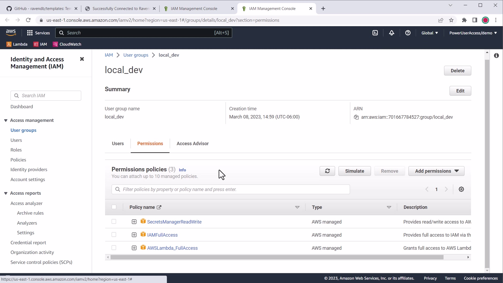

import Admonition from '@theme/Admonition';
import Tabs from '@theme/Tabs';
import TabItem from '@theme/TabItem';
import CodeBlock from '@theme/CodeBlock';
import LanguageSwitcher from "@site/src/components/LanguageSwitcher";
import LanguageContent from "@site/src/components/LanguageContent";

# Guides: AWS Lambda (.NET C#)
<Admonition type="note" title="Note">

* **AWS Lambda** is a serverless platform that supports multiple languages and frameworks 
  that let you deploy workloads that scale without managing any infrastructure.  
  Learn more about [working with AWS Lambda][aws-lambda].  

* In this guide, you will learn how to deploy a .NET C# Lambda Handler Function using the 
  [RavenDB AWS Lambda C# template][template] that is connected to your RavenDB database.  

* Watch our tutorial video [below](../../../start/guides/aws-lambda/overview#tutorial-video) 
  or [on YouTube](https://www.youtube.com/watch?v=T2r9sqrTrYE).  

* In this page:  
   * [Before We Get Started](../../../start/guides/aws-lambda/overview#before-we-get-started)  
   * [Create a Local Lambda Function](../../../start/guides/aws-lambda/overview#create-a-local-lambda-function)  
   * [Configuring Local Connection to RavenDB](../../../start/guides/aws-lambda/overview#configuring-local-connection-to-ravendb)  
   * [Deploying to AWS](../../../start/guides/aws-lambda/overview#deploying-to-aws)  
   * [Configuring Production Connection to RavenDB](../../../start/guides/aws-lambda/overview#configuring-production-connection-to-ravendb)  
   * [Verify the Connection Works](../../../start/guides/aws-lambda/overview#verify-the-connection-works)  
   * [Using RavenDB in the Lambda Function](../../../start/guides/aws-lambda/overview#using-ravendb-in-the-lambda-function)  
   * [Next Steps](../../../start/guides/aws-lambda/overview#next-steps)  
   * [Tutorial Video](../../../start/guides/aws-lambda/overview#tutorial-video)  

</Admonition>

## Before We Get Started

You will need the following before continuing:  

- A [RavenDB Cloud][cloud-signup] account or self-hosted client certificate  
- A local [AWS .NET development environment][aws-dotnet] set up  
  - _Recommended_: [AWS Toolkit for VS Code][aws-vs-code]  
  - _Recommended_: [AWS Toolkit for Visual Studio][aws-vs]  
- [Amazon Lambda Tools package for .NET CLI][aws-dotnet-lambda]  
- [Git](https://git-scm.org)  
- [.NET 6.x][download-dotnet]  

If you are new to AWS Lambda local development, see the [AWS Lambda Developer Guide][aws-lambda] 
for how to get up and running with your toolchain of choice.  

## Create a Local Lambda Function

The [RavenDB AWS Lambda C# template][template] is a template repository on GitHub which means 
you can either create a new repository derived from the template or clone and push it to a new repository.  

This will set up a local Lambda C# function that we will deploy to your AWS account at the end of the guide.  

### Creating a New Repository from the Template

Depending on your environment, there are several ways to clone the template and initialize a new Git repository.  
The template repository lists each clone method you can copy & paste directly.  

**Using `npx` and the [degit][tool-degit] tool if you have Node.js installed:**  

<TabItem value="something" label="bash">
<CodeBlock language="bash">
{`npx degit ravendb/templates/aws-lambda/csharp-http my-project
cd my-project
git init
`}
</CodeBlock>
</TabItem>

**Using Bash or PowerShell:**

<TabItem value="something" label="bash">
<CodeBlock language="bash">
{`git clone https://github.com/ravendb/templates my-project
cd my-project
git filter-branch --subdirectory-filter aws-lambda/csharp-http
rm -rf .git       # Bash
rm -r -force .git # PowerShell
git init
`}
</CodeBlock>
</TabItem>

### Install Dependencies

After cloning the repository locally, restore .NET dependencies with `dotnet`:  

<TabItem value="something" label="bash">
<CodeBlock language="bash">
{`dotnet restore
`}
</CodeBlock>
</TabItem>

By default, the template is configured to connect to the Live Test instance of RavenDB.  
Since this is only for testing purposes, next you will configure the app to connect to 
your existing RavenDB database.  

### Starting the Function

You can start the Lambda function locally using:  

<TabItem value="something" label="bash">
<CodeBlock language="bash">
{`dotnet run
`}
</CodeBlock>
</TabItem>

If you are using Visual Studio Code, you can also debug the function with F5 debugging.  

You will see the welcome screen if the template is set up correctly:  

### Install AWS .NET tools

You will need the .NET Global Tools for Lambda installed to perform the deployment steps later.  

Install the `Amazon.Lambda.Tools` package:  

<TabItem value="something" label="bash">
<CodeBlock language="bash">
{`dotnet tool install -g Amazon.Lambda.Tools\`
`}
</CodeBlock>
</TabItem>

Or make sure it's updated if you already have it:  

<TabItem value="something" label="bash">
<CodeBlock language="bash">
{`dotnet tool update -g Amazon.Lambda.Tools
`}
</CodeBlock>
</TabItem>

### Set Up Your Environment

AWS libraries, SDKs and this template rely on several environmental artifacts to work.  
One is your AWS credentials, stored in  `~/.aws/credentials` and the other is the default AWS region to use.  

**Using the defaults file:** You can use the template's `aws-lambda-tools-defaults.json` to set your Functions region:  

<TabItem value="something" label="json">
<CodeBlock language="json">
{`\{
  ...
  "region": "us-east-1",
  ...
\}
`}
</CodeBlock>
</TabItem>

**Using an environment variable:** Set the `AWS_REGION` environment variable in your terminal session or profile.  

Learn more about [setting up AWS credentials or the default AWS region][aws-dotnet-project-setup].  

## Configuring Local Connection to RavenDB

To configure the local version of your AWS Lambda function to connect to RavenDB, 
you will need to update the `appsettings.json` file with the `RavenSettings.Urls` 
value and `RavenSettings.DatabaseName` value.  

An example `appsettings.json` connecting to the RavenDB live test cluster might look like:  

<TabItem value="something" label="json">
<CodeBlock language="json">
{`\{
  "Logging": \{
    "LogLevel": \{
      "Default": "Information",
      "Microsoft.AspNetCore": "Warning"
    \}
  \},
  "AllowedHosts": "*",
  "RavenSettings": \{
    "Urls": ["http://live-test.ravendb.net"],
    "DatabaseName": "demo",
    "CertFilePath": "",
    "CertPassword": ""
  \}
\}
`}
</CodeBlock>
</TabItem>

If using an authenticated RavenDB URL, you will need a local client certificate.  
Learn more about [configuring client authentication for RavenDB][docs-client-certs].  

### Using a PFX Certificate File

To configure the local Lambda function to load a certificate from outside the project 
directory, specify the `RavenSettings.CertFilePath` and, optionally, the `RavenSettings.CertPassword` settings:  

<TabItem value="something" label="json">
<CodeBlock language="json">
{`\{
  "Logging": \{
    "LogLevel": \{
      "Default": "Information",
      "Microsoft.AspNetCore": "Warning"
    \}
  \},
  "AllowedHosts": "*",
  "RavenSettings": \{
    "Urls": ["https://a.MYCOMPANY.ravendb.cloud"],
    "DatabaseName": "MyDB",
    "CertFilePath": "../certs/free.MYCOMPANY.client.certificate.without.password.pfx"
  \}
\}
`}
</CodeBlock>
</TabItem>

This will connect to the `a.MYCOMPANY.ravendb.cloud` RavenDB Cloud cluster using the local certificate file.  
The file path can be relative to the `.csproj` file or absolute.

<Admonition type="warning" title="Do not commit and publish PFX files" id="do-not-commit-and-publish-pfx-files" href="#do-not-commit-and-publish-pfx-files">
It is recommended to only use the PFX file locally, e.g. `free.MYCOMPANY.client.certificate.without.password.pfx` 
and keep it outside your project directory. The template is configured by default to ignore it in Git and to never 
copy PFX files to the `bin` and `publish` folders.
</Admonition>

#### Using the password-protected PFX file

If you prefer to use the password-protected PFX file, you can store the `CertPassword` using the 
[.NET User Secrets Tool][dotnet-user-secrets].  
However, keep in mind that your team will need this secret configured locally to use the PFX file.  

<TabItem value="something" label="bash">
<CodeBlock language="bash">
{`dotnet user-secrets init
dotnet user-secrets set "RavenSettings:CertPassword" "<CERT_PASSWORD>"
`}
</CodeBlock>
</TabItem>

### Loading Configuration from AWS Secrets Manager

The template uses [Kralizek.Extensions.Configuration.AWSSecretsManager][kralizek] to automatically 
load .NET configuration from AWS Secrets Manager to support securely loading certificates instead 
of relying on production environment variables. This has an added cost but it may scale better for 
a large team and help you better manage the lifecycle of your certificates.  

The configuration will be loaded from AWS Secrets Manager if it exists, otherwise `appsettings.json` will be used.  

## Deploying to AWS

At this point, the local Lambda app is ready to be deployed.  
There are 4 main ways to deploy your new AWS Lambda function:  
GitHub actions, .NET CLI, AWS SDK CLI, and or the AWS Toolkit extensions.  

The template has already been set up to use continuous deployment using GitHub Actions.  
For the other methods, see [Deploying AWS Lamda Functions][aws-lambda-deploy].  

However, we need to do a deployment manually for the first-time setup, such as setting 
the Function role and policy. Once it is setup, GitHub Actions will automatically deploy 
on new commits.  

Start by deploying your function manually using the .NET CLI:  

<TabItem value="something" label="bash">
<CodeBlock language="bash">
{`dotnet lambda deploy-function <FUNCTION_NAME>
`}
</CodeBlock>
</TabItem>

<Admonition type="note" title="Note">
The function name should match the name of the `.csproj` file.  
</Admonition>

The tool will walk you through the first-time deployment:  

- **Function IAM Role:** This can be the name of your function name plus "Role", e.g. `RavenDBTemplateRole`  
- **Function Policy:** Choose `AWSLambdaBasicExecutionRole` to allow for basic AWS Lambda execution permissions  

### Create a deployment AWS Access Key

If you do not have code deployment user, create a new IAM user to be used by your GitHub automation (e.g. `gh_actions`).  

You will need the following security policies (assigned to group or user):  

- `AWSLambda_FullAccess`  
- `IAMReadOnlyAccess`  

Once you have the user created, create and obtain an AWS access key specific for your GitHub action deployment workflow.  

<Admonition type="warning" title="Do not use Root Keys" id="do-not-use-root-keys" href="#do-not-use-root-keys">
It is recommended to use a dedicated deployment IAM user with specific access policies for automated deployment 
through GitHub Actions.  
Ensure you don't store your AWS keys in plain-text on your machine or elsewhere. They are password-equivalents.  
GitHub Secrets are encrypted and cannot be retrieved after being stored.  
</Admonition>

### Configure GitHub Secrets and Variables

The GitHub deployment workflow relies on having some specific secrets and variables set.  

#### Setting up Secrets

1. Obtain or create an Access Key for the user  
1. Go to your [GitHub repository's secrets settings][gh-secrets]  
1. Add a new secret  
    - Name: `AWS_ACCESS_KEY_ID`  
    - Value: The access key ID  
1. Add a new secret  
    - Name: `AWS_SECRET_ACCESS_KEY`  
    - Value: The secret access key  

#### Setting up Variables

1. Go to your [GitHub repository's variables settings][gh-variables]  
1. Add or modify a variable  
    - Name: `AWS_LAMBDA_FUNCTION_NAME`  
    - Value: The name of your function used in the deploy command  
1. Add or modify a variable  
    - Name: `AWS_LAMBDA_FUNCTION_ROLE`  
    - Value: The IAM role name of the Function set when you first deployed  
1. If you are **not** using the `aws-lambda-tools-defaults.json` file to set the region, add or modify a variable:  
    - Name: `AWS_REGION`  
    - Value: The default region your Function will deploy to  

### Trigger a Deployment

Your repository and GitHub action is now set up. To test the deployment, you can push a commit to the repository.  

If you have already committed and pushed, it is likely that the Action failed and you can re-run the job using 
the new secret variable.  
Once deployed, using the default settings, the Function will connect to the Live Test database.  

### Changing Application Configuration for Production

By default, configuration will be loaded from `appsettings.json` but it is likely you may have 
different configuration needed once the Lambda function is deployed.  

## Configuring Production Connection to RavenDB

To configure the production version of your AWS Lambda function to connect to RavenDB, you will 
need to override your app settings through environment variables or, optionally, using AWS Secrets Manager.  

### Environment Variable Configuration

The convention to override .NET app settings would look like:  

- `RavenSettings__Urls__0` -- Specify database URLs in array format (zero-indexed)  
- `RavenSettings__DatabaseName` -- Specify database name  

You only need to provide the environment variables you want to override in the `appsettings.json`.  

#### Using a PEM Certificate

You will need to configure the client certificate to connect to an authenticated RavenDB cluster.  
If you are not using AWS Secrets Manager, you will need to use environment variables.  
There is a 5KB limit on the size of variables, which poses an issue for using certificate auth.  
To accomodate this, you will need to set `RavenSettings__CertPublicKeyFilePath` and `RavenSettings__CertPrivateKey`.  

First, copy your PEM-encoded `.crt` public key certificate to your project. It is safe to commit 
and deploy since it does not contain your private key. The template is configured to automatically 
copy `*.crt` files to your `bin` and `publish` directories.  

Specify the path to the file relative to your `.csproj`:  

<TabItem value="something" label="json">
<CodeBlock language="json">
{`\{
  "RavenSettings": \{
    "Urls": ["https://a.MYCOMPANY.ravendb.cloud"],
    "DatabaseName": "MyDB",
    "CertFilePath": "../certs/free.MYCOMPANY.client.certificate.without.password.pfx",
    "CertPublicKeyFilePath": "free.MYCOMPANY.client.certificate.crt"
  \}
\}
`}
</CodeBlock>
</TabItem>

You can choose whether to set this in production through the `RavenSettings__CertPublicKeyFilePath` 
or in your `appsettings.json` file.  

The `RavenSettings__CertPrivateKey` environment variable should be set to the contents of the `.key` 
file from the RavenDB client certificate package.  

**Example value:**

<TabItem value="something" label="bash">
<CodeBlock language="bash">
{`RavenSettings__CertPrivateKey=----- BEGIN RSA PRIVATE KEY ----- MIIJKA...
`}
</CodeBlock>
</TabItem>

It will look like this in the AWS console:  

The template will automatically decode the value and construct a PEM certificate from 
these two settings using the .NET [X502Certificate2.CreateFromPem][dotnet-createfrompem] API.  

### AWS Secrets Manager Configuration (optional)

The template uses [Kralizek.Extensions.Configuration.AWSSecretsManager][kralizek] to automatically 
load .NET configuration from AWS Secrets Manager to support securely loading certificates instead of 
relying on production environment variables.  

[Learn more about configuring AWS Secrets Manager](secrets-manager "Learn more about configuring AWS Secrets Manager")

## Verify the Connection Works

Once the environment variables are set up correctly, your Lambda function should authenticate 
successfully to your cluster.  

You should see a welcome screen like this with the connection information:  

This means your Lambda function is correctly configured and ready to work with RavenDB.  

## Using RavenDB in the Lambda Function

The template sets up a singleton `DocumentStore` and dependency injection for the 
`IAsyncDocumentStore` per handler invocation which you can inject into Function classes.  

### Example: Injecting `IAsyncDocumentSession`

Pass the `IAsyncDocumentSession` in the handler function using `[FromServices]` which is 
available from `Amazon.Lambda.Annotations` package:  

<TabItem value="something" label="csharp">
<CodeBlock language="csharp">
{`using System.Threading.Tasks;
using Amazon.Lambda.Annotations;
using Amazon.Lambda.Annotations.APIGateway;
using Amazon.Lambda.Core;
using Raven.Client.Documents.Session;

[assembly: LambdaSerializer(typeof(
    Amazon.Lambda.Serialization.SystemTextJson.DefaultLambdaJsonSerializer))]

namespace RavenDBLambda;

public class Functions
\{
  [LambdaFunction]
  [HttpApi(LambdaHttpMethod.Get, "/")]
  public async Task<string> FunctionHandler([FromServices] 
    IAsyncDocumentSession session, ILambdaContext context)
    \{
        var node = await session.Advanced.GetCurrentSessionNode();

        return $"Successfully connected to RavenDB - Node \{node.ClusterTag\}";
    \}
\}
`}
</CodeBlock>
</TabItem>

### Example: Injecting `IDocumentStore`

You can also inject an `IDocumentStore` to get a reference to the current store instance.  
For singleton references, inject using a public class constructor:  

<TabItem value="something" label="csharp">
<CodeBlock language="csharp">
{`using System.Threading.Tasks;
using Amazon.Lambda.Annotations;
using Amazon.Lambda.Annotations.APIGateway;
using Amazon.Lambda.Core;
using Raven.Client.Documents;

[assembly: LambdaSerializer(typeof(
    Amazon.Lambda.Serialization.SystemTextJson.DefaultLambdaJsonSerializer))]

namespace RavenDBLambda;

public class Functions
\{

  private readonly IDocumentStore _store;

  public Functions(IDocumentStore store) \{
    _store = store;
  \}

  [LambdaFunction]
  [HttpApi(LambdaHttpMethod.Get, "/")]
  public async string FunctionHandler(ILambdaContext context)
  \{
    // Access _store DocumentStore methods
  \}
\}
`}
</CodeBlock>
</TabItem>

### Example: Loading a user

<TabItem value="something" label="javascript">
<CodeBlock language="javascript">
{`using System.Threading.Tasks;
using Amazon.Lambda.Annotations;
using Amazon.Lambda.Annotations.APIGateway;
using Amazon.Lambda.Core;
using Raven.Client.Documents.Session;

[assembly: LambdaSerializer(typeof(
    Amazon.Lambda.Serialization.SystemTextJson.DefaultLambdaJsonSerializer))]

namespace RavenDBLambda;

public class Functions
\{
  [LambdaFunction]
  [HttpApi(LambdaHttpMethod.Get, "/users/\{id\}")]
  public async Task<User> FunctionHandler([FromServices] 
    IAsyncDocumentSession session, string id, ILambdaContext context)
    \{
        var user = await session.Load<User>("users/" + id);

        return user;
    \}
\}
`}
</CodeBlock>
</TabItem>

## Next Steps

* For more robust certificate handling, [configure AWS Secrets Manager support][docs-lambda-secrets]  
* Learn more about [deployment considerations](deployment) for RavenDB and AWS Lambda  
* Learn more about [using the RavenDB .NET client SDK][ravendb-dotnet]  

## Tutorial Video

Watch our _How To Use AWS Lambda with RavenDB .NET_ tutorial:  
&lt;iframe width="560" height="315" src="https://www.youtube.com/embed/T2r9sqrTrYE?si=mLHnncOBhcSbcJh5" title="YouTube video player" frameborder="0" allow="accelerometer; autoplay; clipboard-write; encrypted-media; gyroscope; picture-in-picture; web-share" referrerpolicy="strict-origin-when-cross-origin" allowfullscreen&gt;&lt;/iframe&gt;

[download-dotnet]: https://dotnet.microsoft.com/en-us/download/dotnet/6.0
[aws-lambda]: https://docs.aws.amazon.com/lambda/latest/dg/welcome.html
[aws-dotnet]: https://aws.amazon.com/sdk-for-net/
[aws-dotnet-project-setup]: https://docs.aws.amazon.com/sdk-for-net/v3/developer-guide/net-dg-config.html
[aws-dotnet-lambda]: https://docs.aws.amazon.com/lambda/latest/dg/csharp-package-cli.html
[aws-vs-code]: https://aws.amazon.com/visualstudiocode/
[aws-vs]: https://aws.amazon.com/visualstudio/
[aws-lambda-deploy]: https://docs.aws.amazon.com/sdk-for-net/v3/developer-guide/deploying-lambda.html
[dotnet-user-secrets]: https://learn.microsoft.com/en-us/aspnet/core/security/app-secrets
[dotnet-createfrompem]: https://learn.microsoft.com/en-us/dotnet/api/system.security.cryptography.x509certificates.x509certificate2.createfrompem?view=net-7.0
[template]: https://github.com/ravendb/templates/tree/main/aws-lambda/csharp-http
[gh-secrets]: https://docs.github.com/en/actions/security-guides/encrypted-secrets
[gh-variables]: https://docs.github.com/en/actions/learn-github-actions/variables
[cloud-signup]: https://cloud.ravendb.net?utm_source=ravendb_docs&utm_medium=web&utm_campaign=howto_template_lambda_csharp&utm_content=cloud_signup
[docs-lambda-secrets]: ../../../start/guides/aws-lambda/secrets-manager
[docs-get-started]: ../../../start/getting-started
[docs-client-certs]: ../../../client-api/setting-up-authentication-and-authorization
[ravendb-dotnet]: ../../../client-api/session/what-is-a-session-and-how-does-it-work
[kralizek]: https://github.com/Kralizek/AWSSecretsManagerConfigurationExtensions
[tool-base64]: https://www.base64encode.org/
[tool-degit]: https://npmjs.com/package/degit

