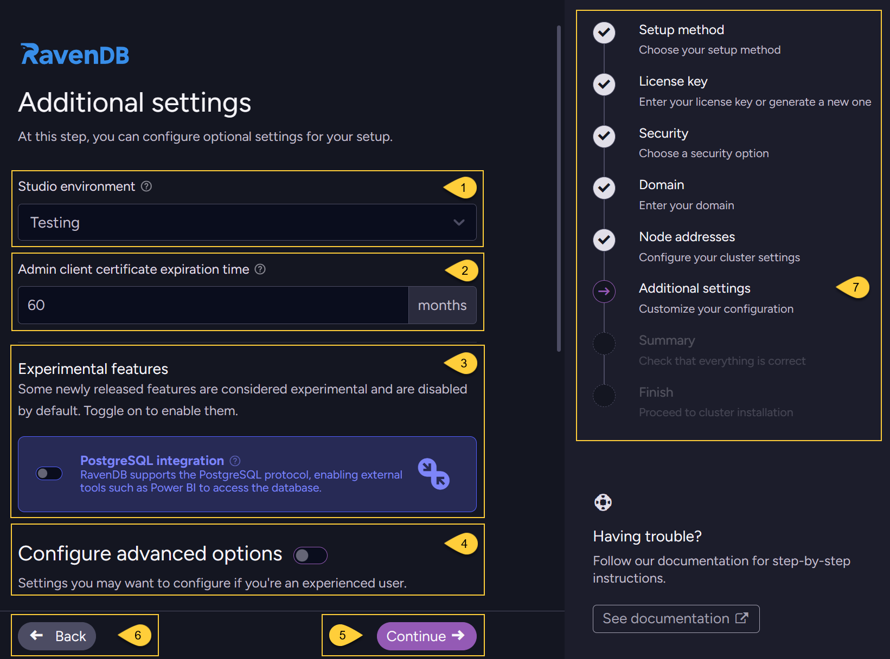
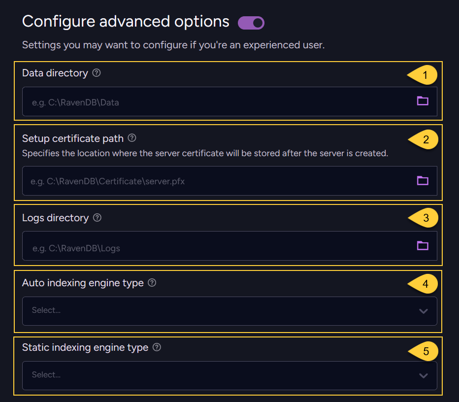

import Admonition from '@theme/Admonition';
import Tabs from '@theme/Tabs';
import TabItem from '@theme/TabItem';
import CodeBlock from '@theme/CodeBlock';
import LanguageSwitcher from "@site/src/components/LanguageSwitcher";
import LanguageContent from "@site/src/components/LanguageContent";
import ContentFrame from '@site/src/components/ContentFrame';
import Panel from '@site/src/components/Panel';

<Admonition type="note" title="">

* After configuring your cluster nodes, as described in [Node addresses](../../../start/installation/setup-wizard/configure-node-addresses.mdx),  
  the next step is to **customize optional settings**.
    
* In this article:
  * [Additional settings](../../../start/installation/setup-wizard/additional-settings.mdx#additional-settings)  
  * [Configure advanced options](../../../start/installation/setup-wizard/additional-settings.mdx#configure-advanced-options)

</Admonition>

<Panel heading= "Additional settings">
    

    
1. **Studio environment**:  
   You can select a text label that RavenDB Studio will display in the server UI.  
   This is only a visual identifier; it does not affect any settings or features.  
   It is meant to make it easier to distinguish between multiple environments when working with several servers.  
   You can choose from the following labels:  
   * _Production_ 
   * _Testing_ 
   * _Development_ 
   * _None_ 

   When your server is up and running,  
   you can change this label at any time in RavenDB Studio in the [Studio configuration view](../../../studio/database/settings/studio-configuration.mdx#studio-configuration---server-wide). 
    
   **In the wizard, this option is available only when you choose a [Secure setup](../../../start/installation/setup-wizard/choose-security-option.mdx#choose-a-security-method) flow**.  
   If you choose the [Unsecured setup](../../../start/installation/setup-wizard/choose-security-option.mdx#don-t-use-certificate), this option will not appear in the wizard,  
   but you can still configure it later via the _Studio configuration view_.
    
        

2. **Admin client certificate expiration time**:  
   This setting defines how long the admin client certificate will be valid.  
   By default, this is set to 60 months.  
   **This option is available only when you choose a [Secure setup](../../../start/installation/setup-wizard/choose-security-option.mdx#choose-a-security-method) flow** in the wizard.  
    
3. **Experimental features**:   
   Some newly released features are considered experimental and are disabled by default.  
   For example, the PostgreSQL Protocol integration is currently an experimental feature.  
   Enabling it allows PostgreSQL-compatible clients (such as Power BI) to query data from a RavenDB database using the PostgreSQL wire protocol.
   This feature requires a license that includes the PostgreSQL Protocol.  
   Learn more in [PostgreSQL Protocol](../../../integrations/postgresql-protocol/overview.mdx).
    
4. **Configure advanced options**:  
   Toggle this option on to expand the section.  
   Learn more below in [Configure advanced options](../../../start/installation/setup-wizard/additional-settings.mdx#configure-advanced-options).  
    
5. Click **"Continue"** to proceed to the next step: [Review setup](../../../start/installation/setup-wizard/review-setup.mdx).
    
6. Click **"Back"** to return to the previous step - [Node addresses](../../../start/installation/setup-wizard/configure-node-addresses.mdx).
    
7. The navigation panel indicates your current step (_"Additional settings"_) and the remaining steps in the wizard flow.     
    
</Panel>

<Panel heading= "Configure advanced options">
    

    
1. **Data directory**:   
   By default, RavenDB stores your data (databases, documents, and indexes) in the `RavenData` directory under the extracted `Server` folder.
    
     You can customize this location. 
     The value you enter will be written to the _settings.json_ file (created when setup is completed) 
     as the value of the [DataDir](../../../server/configuration/core-configuration.mdx#datadir) configuration key.    
    
     This directory must exist and be writable on all nodes in the cluster; otherwise, the setup will fail.    
     Learn more about the data directory structure in [Storage: Directory Structure](../../../server/storage/directory-structure.mdx).     
    
2. **Setup certificate path**:  
   By default, RavenDB stores your **server certificate** (the `.pfx` file) directly under the extracted `Server` folder.
   
     You can change this by entering a **full file path**, including a custom file name with the _.pfx_ extension.  
     For example: `/etc/ravendb/security/server.pfx` (linux), `C:\RavenDB\Certificate\server.pfx` (windows).  
    
     The value you enter will be written to the _settings.json_ file (created when setup is completed)  
     as the value of the [Security.Certificate.Path](../../../server/configuration/security-configuration.mdx#securitycertificatepath) configuration key.    
    
     The directory part of this path must exist and be writable on every node.    
     RavenDB must be able to save the certificate file to this location for the cluster setup to succeed.  
     Make sure the same certificate file is available at this path on every node; otherwise, cluster setup may fail.         
    
     This option is available only when you choose a [Secure setup](../../../start/installation/setup-wizard/choose-security-option.mdx#choose-a-security-method) flow in the wizard.  
    
3. **Logs directory**:    
   By default, RavenDB stores logs in the `Logs` directory under the extracted `Server` folder.
    
     You can customize this location.  
     The value you enter will be written to the _settings.json_ file as the value of the [Logs.Path](../../../server/configuration/logs-configuration.mdx#logspath) configuration key.
    
     This directory is used on all nodes in the cluster. Make sure it exists on each node; otherwise, the setup will fail.    
     Learn more about the RavenDB logging system in [Logging](../../../server/troubleshooting/logging).      
    
4. **Auto indexing engine type**:  
   Choose which search engine RavenDB will use for auto-indexes.  
   Select either `Corax` or `Lucene` as the search engine.  
    
     By default, _Corax_ is used when running under a **Community** or **Developer** license or without a license;  
     for all other license types, the default is _Lucene_.
    
     This value will be written to the _settings.json_ file as the value of the [Indexing.Auto.SearchEngineType](../../../server/configuration/indexing-configuration.mdx#indexingautosearchenginetype) configuration key.
     You can override this choice later in the server configuration or per database.
    
5. **Static indexing engine type**:  
   Choose which search engine RavenDB will use for static (user-defined) indexes.  
   Select either `Corax` or `Lucene` as the search engine.  
    
     By default, _Corax_ is used when running under a **Community** or **Developer** license or without a license;  
     for all other license types, the default is _Lucene_.
    
     This value will be written to the _settings.json_ file as the value of the [Indexing.Static.SearchEngineType](../../../server/configuration/indexing-configuration.mdx#indexingstaticsearchenginetype) configuration key.
     You can override this choice later for the whole server, per database, or per index.
    
</Panel>