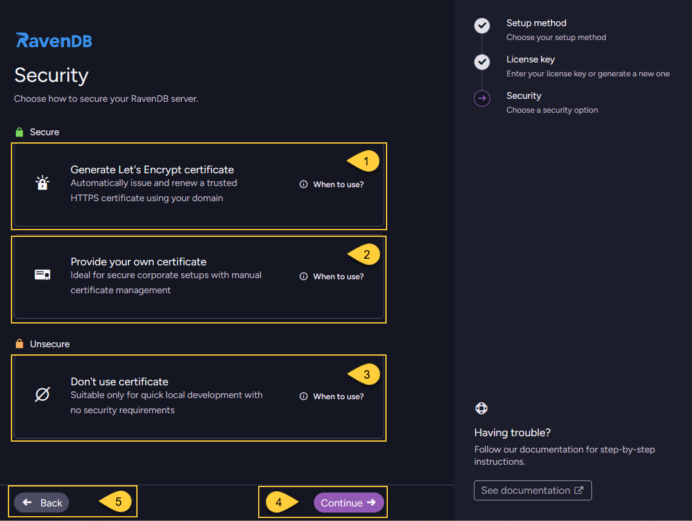
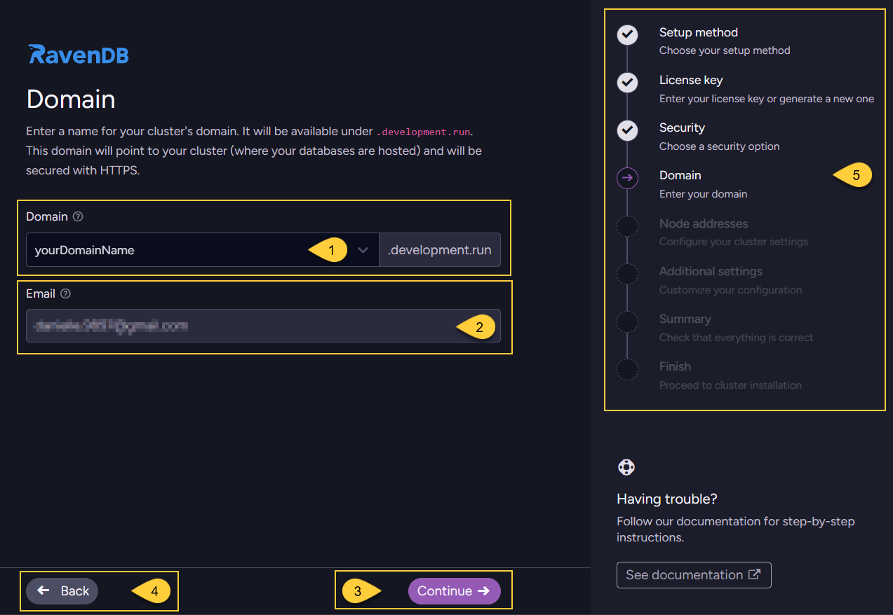
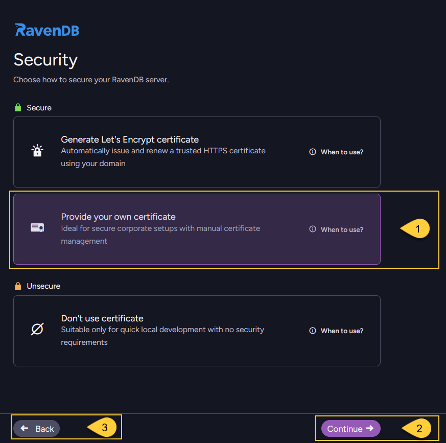
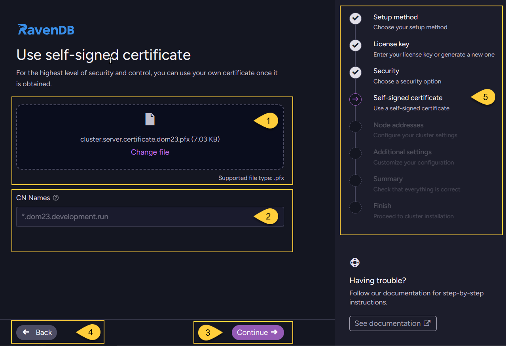
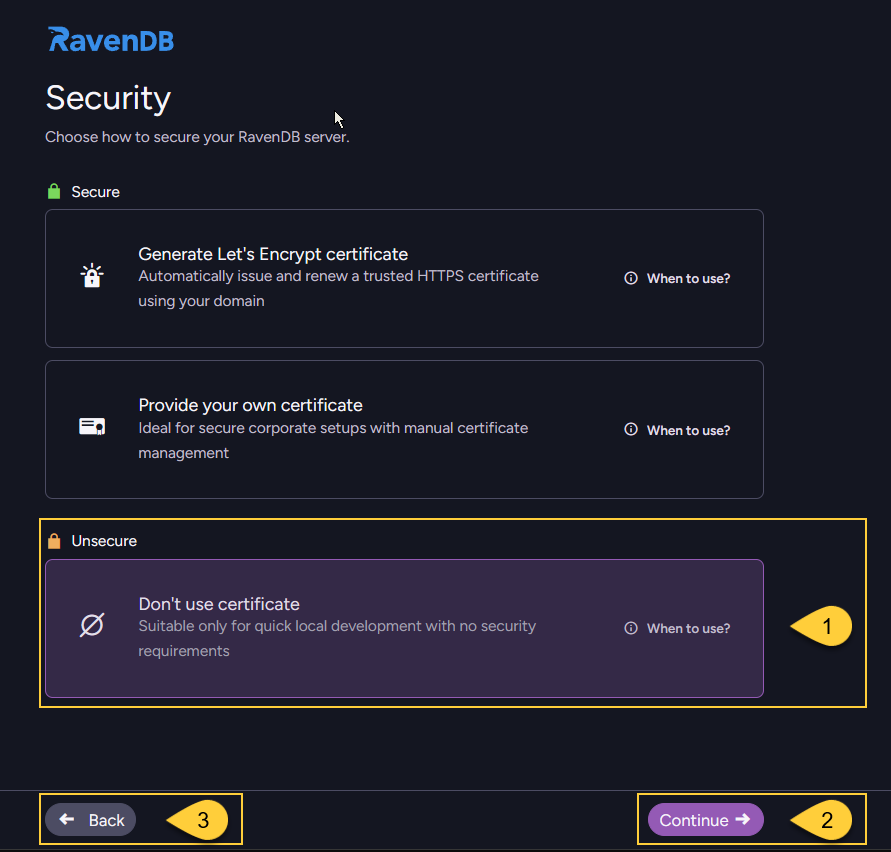

import Admonition from '@theme/Admonition';
import Tabs from '@theme/Tabs';
import TabItem from '@theme/TabItem';
import CodeBlock from '@theme/CodeBlock';
import LanguageSwitcher from "@site/src/components/LanguageSwitcher";
import LanguageContent from "@site/src/components/LanguageContent";
import ContentFrame from '@site/src/components/ContentFrame';
import Panel from '@site/src/components/Panel';

<Admonition type="note" title="">

* After entering your license as described in [Provide license key](../../../start/installation/setup-wizard/provide-license-key.mdx),  
  the next step is to choose **how to secure your RavenDB server**.    
    
* You can configure the server in either secure or unsecured mode:   
  * **Secure Server:**   
    Recommended when access to the server, its management, or its data must be restricted.
    This includes production environments and development setups that require encryption or client certificate authentication.  
    When installing a secure server, only clients with a valid, trusted certificate can connect to the server.  
  * **Unsecured Server:**  
    Intended for development or trusted environments where unauthorized access to the server and its data is not a concern.
    
* This article explains how to configure the security option using the Setup Wizard without going into security details.  
  To learn more about authentication, authorization, and security in RavenDB, see:
  * [Security Overview](../../../server/security/overview.mdx)
  * [Security Common Errors & FAQ](../../../server/security/common-errors-and-faq.mdx) 

---
    
* In this article:
  * [Choose a security method](../../../start/installation/setup-wizard/choose-security-option.mdx#choose-a-security-method)  
  * [Generate Let's Encrypt certificate](../../../start/installation/setup-wizard/choose-security-option.mdx#generate-let-s-encrypt-certificate)  
  * [Provide your own certificate](../../../start/installation/setup-wizard/choose-security-option.mdx#provide-your-own-certificate)  
  * [Don't use certificate](../../../start/installation/setup-wizard/choose-security-option.mdx#don-t-use-certificate)  

</Admonition>
    
<Panel heading="Choose a security method">
    
In this step, choose one of three security options:        
    

    
1. [Generate Let's Encrypt certificate](../../../start/installation/setup-wizard/choose-security-option.mdx#generate-let-s-encrypt-certificate)  
2. [Provide your own certificate](../../../start/installation/setup-wizard/choose-security-option.mdx#provide-your-own-certificate)    
3. [Don't use certificate](../../../start/installation/setup-wizard/choose-security-option.mdx#don-t-use-certificate)  
4. After selecting a security method, click **"Continue"** to proceed with its setup steps.
5. Click **"Back"** to return to the previous step - [Provide license key](../../../start/installation/setup-wizard/provide-license-key.mdx).

</Panel> 

<Panel heading="Generate Let's Encrypt certificate">
 
Use this option to secure your server with a [Let's Encrypt certificate](../../../server/security/authentication/lets-encrypt-certificates).
Let’s Encrypt is a free, automated certificate authority that provides trusted SSL/TLS certificates for HTTPS communication.  
RavenDB will manage the certificate lifecycle for you, including generation and automatic renewal.    

**When to use this option**:
    
* Default choice for most scenarios where you don't need a custom certificate and prefer RavenDB to handle encryption automatically.
* RavenDB will automatically issue and renew a trusted HTTPS certificate for the domain you define in the next step, 
  so you don't need to provide or maintain your own certificate.  
* Suitable when a public domain is available and you want a simple, secure default configuration.
  This is typically the preferred choice for production and development environments where the server is publicly reachable.

<Admonition type="note" title="">
    
**Security consideration and ownership of certificates and domains**
    
This automatic setup is designed to be as convenient as possible.  
It handles DNS record configuration, certificate generation, and certificate renewal for you.
    
Because of this, the ownership of the certificates and DNS records must remain within the RavenDB company.  
This allows RavenDB to generate valid certificates and modify DNS settings for your registered domains, 
and is something you should take into account when reviewing the security of your system.    

RavenDB will not misuse these capabilities and will not modify certificates or DNS records unless explicitly requested.    

The purpose of this feature is to help you get a secure setup running with minimal effort.  
However, for production deployments and for the highest level of security and control, 
we recommend using your own certificates and domains, avoiding reliance on a third party for this critical part of your security.

</Admonition>
    

1. Select "Generate Let's Encrypt certificate".
2. Review and accept the Let's Encrypt agreement.
3. Click **"Continue"** proceed to the domain name screen.
4. Click **"Back"** to return to the previous step - [Provide license key](../../../start/installation/setup-wizard/provide-license-key.mdx).

---

### Enter a domain name    
    
  

1. Enter the domain name that will be used for your cluster.
2. The email address shown is the one associated with the license you are using.  
3. Click **"Continue"** to proceed to the next step: [Configure node addresses](../../../start/installation/setup-wizard/configure-node-addresses.mdx).
4. Click **"Back"** to return to selecting a security method.  
5. The navigation panel indicates your current step (_"Domain"_) and the remaining steps in the wizard flow.     
    
---    

<Admonition type="note" title="">
    
* **Domain suffix and license**  
  The name you enter will be used to create your cluster’s domain under a RavenDB-owned suffix.   
  The exact suffix depends on the license type you entered in the previous step, for example:    
    * `.ravendb.run` (RavenDB AI license)
    * `.development.run` (Developer license)
    * `.ravendb.community` (Community license)

    In the screenshot above, `development.run` is the main domain,   
    and `yourDomainName.development.run` is the free subdomain that RavenDB gives you.  
    With other license types, the suffix will change accordingly, for example:  
    `yourDomainName.ravendb.run` or `yourDomainName.ravendb.community`.
    
* **Requirements**  
  RavenDB will use this domain to generate an HTTPS certificate for secure connections.    
  The domain must be reachable from the public internet to complete certificate generation.    
  The domain name can contain only the following characters: `A-Z`, `a-z`, `0-9`, and `-`.        
    
* **Wildcard certificate coverage**  
  The certificate is typically issued for a wildcard such as: `*.yourDomainName.development.run`.  
  The `*.` in `*.yourDomainName.development.run` means “all hosts under this subdomain”  
  (for example, `a.yourDomainName.development.run`, `b.yourDomainName.development.run`),  
  and that is what the wildcard certificate will cover.    
    
* **DNS configuration**  
  RavenDB provides this free subdomain and allows you to configure its DNS records with the IP addresses that your server will listen on,
  which you configure in the next step: [Configure node addresses](../../../start/installation/setup-wizard/configure-node-addresses.mdx).  
  The subdomain is owned by RavenDB, and you can manage it through the [Customer Portal](https://customers.ravendb.net).  
  Log in with your license key to add, remove, or update DNS records for your cluster.

* **Using your own domain**  
  The free subdomain is provided only for the purpose of proving ownership to Let's Encrypt.  
  If you prefer to use your own domain, you are welcome to acquire your own certificate and use it instead.    
  See [Provide your own certificate](../../../start/installation/setup-wizard/choose-security-option.mdx#provide-your-own-certificate).

</Admonition>
    
</Panel> 

<Panel heading="Provide your own certificate">

Use this option to secure the server with a certificate that you obtain and manage yourself.  
It gives you full control over certificate management, including creation and renewal.  
With this option, you are responsible for keeping the certificate valid and renewing it before it expires.   

**When to use this option**:
    
* When you need to use a custom SSL/TLS certificate to comply with corporate security policies or integrate with an internal certificate authority (CA).
* When certificates are created and renewed manually or by existing internal or external automation tools.
* Ideal for production environments that require strict control over certificate management and trust relationships. 

    
1. Select "Provide your own certificate".
2. Click **"Continue"** to proceed to the certificate upload screen.
3. Click **"Back"** to return to the previous step - [Provide license key](../../../start/installation/setup-wizard/provide-license-key.mdx).
    
---
    
### Upload your certificate  
    
  

1. Upload your server certificate (`.pfx` file that includes the private key).
2. Verify that the common names (CN) detected from the certificate match the hostnames you plan to use.
3. Click **"Continue"** to proceed to the next step: [Configure node addresses](../../../start/installation/setup-wizard/configure-node-addresses.mdx).
4. Click **"Back"** to return to selecting a security method.
5. The navigation panel indicates your current step (_"Self-signed certificate"_) and the remaining steps in the wizard flow.  
    
---
    
<Admonition type="note" title="">

* The certificate can be issued by a trusted SSL vendor or it can be a self-signed certificate.
  In the latter case, it's your responsibility to have the self-signed CA registered in the OS certificate stores on all relevant machines.

* RavenDB will accept PFX server certificates that contain the private key, are not expired, and have the following fields:
  * `KeyUsage`: DigitalSignature
  * `ExtendedKeyUsage`: Server Authentication

* If you use the Setup Wizard to construct a cluster, you must use the same certificate for all nodes.  
  If you want to use a different certificate for each node, this is only possible through [Manual setup](../../../start/installation/manual.mdx).

* A **wildcard certificate** is usually the easiest option. 
  A wildcard (for example, `*.yourcluster.development.run`) covers all subdomains under that domain, so a single certificate can be used for all nodes.
  Another option is to issue a certificate that includes the domains of all cluster nodes as "Subject Alternative Names" (SANs).    

</Admonition> 
    
</Panel> 

<Panel heading="Don't use certificate">
    
This option configures the server to run without HTTPS.  
All communication is sent over plain HTTP, without encryption, authentication, or certificate validation.  
All security features (authentication, authorization, and encryption) are disabled in unsecured mode.  
    
**When to use this option**:
    
* You intentionally run RavenDB in unsecured mode, without HTTPS.
* You are working locally or testing functionality in a fully trusted, isolated environment.
* All nodes run inside a secure private network that is not exposed to the public internet,  
  and you explicitly do not require encryption (for example, short-lived test setups or specific performance scenarios).
* Certificate provisioning is intentionally skipped. 

 

1. Select "Don't use certificate".
2. Click **"Continue"** to proceed to the next step: [Configure node addresses](../../../start/installation/setup-wizard/configure-node-addresses.mdx).
3. Click **"Back"** to return to selecting a security method.

---
    
<Admonition type="danger" title="">

* Unsecured mode should never be used for production environments, because all traffic is transmitted without encryption or authentication, 
  making it vulnerable to eavesdropping and man-in-the-middle attacks.   
    
* We strongly recommend setting up RavenDB securely from the start to prevent vulnerabilities.
  The secure setup takes only a few minutes and is free.    

* When running in unsecured mode and listening on an external network interface,  
  RavenDB does not provide any protection:
  * Anyone who can reach the configured IP/port can connect to the server.
  * Authentication is disabled, so all callers are effectively granted administrative access.
  * All traffic is unencrypted and vulnerable to interception and tampering.

</Admonition>
    
</Panel>