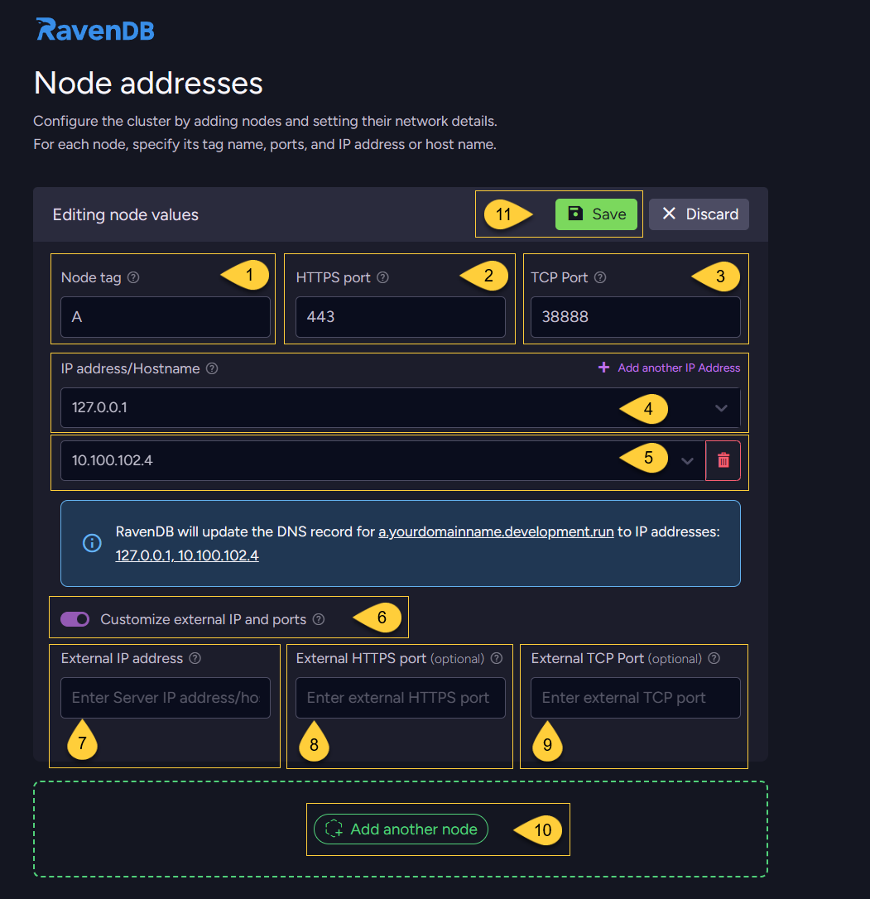
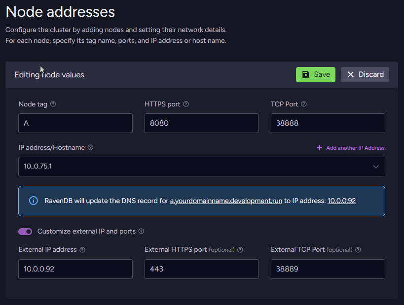

import Admonition from '@theme/Admonition';
import Tabs from '@theme/Tabs';
import TabItem from '@theme/TabItem';
import CodeBlock from '@theme/CodeBlock';
import LanguageSwitcher from "@site/src/components/LanguageSwitcher";
import LanguageContent from "@site/src/components/LanguageContent";
import ContentFrame from '@site/src/components/ContentFrame';
import Panel from '@site/src/components/Panel';

<Admonition type="note" title="">

* After choosing how to secure your server, as described in [Choose security option](../../../start/installation/setup-wizard/choose-security-option.mdx),  
  the next step is to **configure your cluster topology by adding nodes and defining their network addresses**.    

* For each node, specify:  
  * the node tag
  * the HTTPS (or HTTP in unsecured mode) port
  * the TCP port
  * the IP address or host name that the server will bind to
    
* Make sure that the IP address and ports you choose are available on each machine.     
  To check what is the list of IPs and ports already in use on a machine, you can run `netstat -a` from the command line.

---
    
* In this article:
  * [Set up node addresses for a SECURE cluster](../../../start/installation/setup-wizard/configure-node-addresses.mdx#set-up-node-addresses-for-a-secure-cluster)  
    * [Behind a firewall or load balancer](../../../start/installation/setup-wizard/configure-node-addresses#behind-a-firewall-or-load-balancer)
    * [In a Docker container](../../../start/installation/setup-wizard/configure-node-addresses#in-a-docker-container)
  * [Set up node addresses for an UNSECURED cluster](../../../start/installation/setup-wizard/configure-node-addresses.mdx#set-up-node-addresses-for-an-unsecured-cluster) 
  * [Cluster topology](../../../start/installation/setup-wizard/configure-node-addresses.mdx#cluster-topology)  
    * [Number of nodes](../../../start/installation/setup-wizard/configure-node-addresses.mdx#number-of-nodes)  
    * [Node layout](../../..//start/installation/setup-wizard/configure-node-addresses.mdx#node-layout)   

</Admonition>

<Panel heading= "Set up node addresses for a SECURE cluster">



1. **Node tag**:  
   Enter a unique identifier for the node in the cluster (for example, A, B, C).  
   A node tag can contain a maximum of 4 uppercase letters (`A-Z`).
2. **HTTPS port**:  
   Enter the private HTTPS port that the node will listen on (used by clients and browsers to connect to this server).  
   By default, this is set to `443`.    
   When using port 443, make sure it is not already used by other applications (such as IIS, Apache, Skype, etc.).  
   On Linux, you might need to allow non-root processes to listen on port 443.  
   If you choose a different port, remember to include it in the URL when accessing the server  
   (for example, `https://a.yourdomainname.development.run:8443`).     
3. **TCP port**:   
   Enter the private TCP port used for internal communication between cluster nodes.  
   By default, this is set to `38888`.  
4. **IP address/hostname**:    
   Enter the IP address or hostname of this node.  
   Clients and other cluster nodes will use this to access the server.  
5. **Additional IP address/hostname**:   
   You can assign multiple IP addresses or hostnames to the same node.  
   Click "Add another IP address" to add another address.  
   Each additional address will cause the node’s HTTPS and TCP ports to listen on that address as well.  
   This is useful when:  
   * the server has multiple network interfaces or subnets (for example, _10.0.0.x_ and _192.168.1.x_).
   * you want the node to be reachable from both local and remote networks (for example, _127.0.0.1_ and _10.x.x.x_).
   * the server has both IPv4 and IPv6 addresses. 
   * you are migrating between networks and the machine temporarily uses “old” and “new” IPs.
6. **Customize external IP and ports**   
   Toggle this option to configure external/public IP addresses and ports for this node.  
   Clients will use these instead of the node’s internal/private settings.  
   This is useful when the cluster is behind a firewall or load balancer and the internal network layout differs from the external one.    
7. **External IP address/hostname**:    
   Enter the external/public IP address or hostname that clients will use to access this node.
   This must be reachable from outside the cluster’s private network (for example, a public IP or a domain name that resolves to it).   
   If you use a load balancer or gateway, enter its public IP address or hostname here; it will forward requests to the node’s internal/private address.    
8. **External HTTPS port**:  
   Enter the external/public HTTPS port that clients and browsers will use to connect to this node.  
   This port is used in the public URL and can be different from the node’s internal HTTPS port.  
9. **External TCP port**:  
   Enter the external/public TCP port used for communication between cluster nodes and for TCP client connections.  
   This port is part of the public TCP URL and can be different from the node’s internal TCP port.  
10. **Add another node**:   
    Click this button to add another node to the cluster configuration.   
    Each node must have a unique tag.  
    Nodes can use the same HTTPS/TCP ports as long as they listen on different IP addresses or hostnames.  
    You can add nodes up to the limit allowed by your license.  
    For production, it is recommended to start with at least 3 nodes.
    Learn more in [Number of nodes](../../../start/installation/setup-wizard/configure-node-addresses.mdx#number-of-nodes).  
11. **Save**:  
    When you finish configuring this node, click this button to save its settings.
    
<Admonition type="note" title=""> 

The IP addresses and ports you configure in this view can be changed later by editing the `settings.json` file in the node’s server folder and updating the following configuration keys:
* [ServerUrl](../../../server/configuration/core-configuration.mdx#serverurl) - HTTPS URL (IP/host and port)
* [ServerUrl.Tcp](../../../server/configuration/core-configuration.mdx#serverurltcp) - TCP URL and port for internal cluster communication
* [PublicServerUrl](../../../server/configuration/core-configuration.mdx#publicserverurl) - External/public HTTPS URL (if configured)
* [PublicServerUrl.Tcp](../../../server/configuration/core-configuration.mdx#publicserverurltcp) - External/public TCP URL (if configured)
    
Changes to these values require restarting the server.

</Admonition>
    
---
    
The following example shows a configuration of a 3-node cluster:
    

    
1. The node list shows each configured node (A, B, C) with its tag, URL, HTTPS port, TCP port, and IP address/hostname.
   You can edit or remove nodes as needed before continuing to the next step.
2. The label “(current node)” marks the node that will be started on this machine when you finish the Setup Wizard  
   (when in the [Set up a new cluster](../../../start/installation/setup-wizard/choose-setup-method.mdx#set-up-a-new-cluster) flow).  
   The remaining nodes can be started and joined to the cluster later using the
   [Use setup package](../../../start/installation/setup-wizard/choose-setup-method.mdx#use-an-existing-setup-package) method on their machines.
3. The number of nodes you can add depends on your license; when you reach the limit, this button is disabled.  
4. Click **"Continue"** to proceed to the next step - [Additional settings](../../../start/installation/setup-wizard/additional-settings.mdx).    
5. Click **"Back"** to return to the previous step - [Enter domain](../../../start/installation/setup-wizard/choose-security-option.mdx#enter-a-domain-name).
6. The navigation panel indicates your current step (_"Node addresses"_) and the remaining steps in the wizard flow. 
    
---
    
<ContentFrame>
    
### Behind a firewall or load balancer

* In many environments, the RavenDB server runs on a **private** IP address that is not directly reachable from the internet.
  Instead, clients connect through a **public** IP exposed by a firewall, gateway, or load balancer.

* In **IP address/hostname**, enter the node’s **internal/private IP address** (for example, `172.31.16.273`).  
  RavenDB will bind to this address and listen on the configured internal HTTPS and TCP ports.

* In **External IP address/hostname**, enter the public IP address or hostname that clients use to reach the firewall or load balancer (for example, `34.216.113.20`).  
  If the external HTTPS/TCP ports differ from the internal ones, enter them in External HTTPS port and External TCP port.
  If they are the same, you can leave these fields empty.

       

* Clients will connect to this node using a URL such as https://a.yourdomainname.development.run, which resolves to the external IP and ports you configured; 
  the firewall or load balancer then forwards those requests to the node’s internal address and ports, where RavenDB is listening.    

</ContentFrame> 
    
<ContentFrame>    
    
### In a Docker container  
    
* When running RavenDB in Docker with port mapping, the container listens on internal ports, while the host exposes different external ports.
    
* For example, if the container is started with:
    
    <TabItem>
    ```plain    
    sudo docker run -t -p 38889:38888 -p 443:8080 ravendb/ravendb
    ```    
    </TabItem>

    then:
    * Inside the container, RavenDB listens on HTTPS `8080` and TCP `38888`.
    * On the host, clients connect to HTTPS `443` and TCP `38889`.

* Configure the node addresses like this:  
  In the HTTPS port field, enter the internal port RavenDB listens on inside the container (`8080`).  
  In the TCP port field, enter the internal TCP port (`38888`).  
  In IP address/hostname, use the container’s internal IP address,  
  or `0.0.0.0` if RavenDB should listen on all interfaces inside the container.  

* Enable "Customize external IP and ports" and set:  
  External IP address/hostname to the host machine’s IP address.  
  External HTTPS port to `443` (the external port mapped to `8080`).  
  External TCP port to `38889` (the external port mapped to `38888`).  
    
* RavenDB will use the external IP and ports in the node URL and DNS record, so clients connect to the host (not directly to the container), 
  while Docker forwards the traffic to the container’s internal ports.

           
    
</ContentFrame> 
    
</Panel>

<Panel heading= "Set up node addresses for an UNSECURED cluster">
    
  

1. **Save**:  
   When you finish configuring this node, click this button to save its settings.
2. **Start node as passive**:  
   When enabled, the node starts in [passive mode](../../../server/clustering/rachis/cluster-topology/#state) and does not join a cluster.  
   This is useful when the node is meant for monitoring, initialization, or handling setup tasks without participating in cluster operations.
   It can also be used to isolate the node for testing or debugging.
3. **Node tag**:  
   Enter a unique identifier for the node in the cluster (for example, A, B, C).  
   A node tag can contain a maximum of 4 uppercase letters (`A-Z`).
4. **HTTP port**:  
   Enter the private HTTP port that the node will listen on (used by clients and browsers to connect to this server).  
   By default, this is set to `8080`. 
5. **TCP port**:   
   Enter the private TCP port used for internal communication between cluster nodes.  
   By default, this is set to `38888`.  
6. **IP address/hostname**:    
   Enter the IP address or hostname of this node.  
   Clients and other cluster nodes will use this to access the server.  
7. **Add another node**:   
    Click this button to add another node to the cluster configuration.   
    Each node must have a unique tag.  
    Nodes can use the same HTTP/TCP ports as long as they listen on different IP addresses or hostnames.  
    You can add nodes up to the limit allowed by your license.  
    For production, it is recommended to start with at least 3 nodes.
    Learn more in [Number of nodes](../../../start/installation/setup-wizard/configure-node-addresses.mdx#number-of-nodes).  
8. Click **"Continue"** to proceed to the next step - [Additional settings](../../../start/installation/setup-wizard/additional-settings.mdx).  
   The "Continue" button is enabled after you click "Save".
9. Click **"Back"** to return to the previous step - [Choosing a security option](../../../start/installation/setup-wizard/choose-security-option.mdx).
10. The navigation panel indicates your current step (_"Node addresses"_) and the remaining steps in the wizard flow.  
    
</Panel>

<Panel heading= "Cluster topology">

A **cluster** is a group of RavenDB server instances (called **cluster nodes**) that work together to provide high availability through data replication and automatic failover.
Even a single node is technically a cluster of one, but this is not recommended for production.
Learn more in: [Cluster - Overview](../../../server/clustering/overview.mdx).     

---
    
### Number of nodes  
    
<ContentFrame>   
    
**Best practices:**  
* Use **at least 3 nodes**.  
* Prefer an **odd number of nodes** (for example: 3, 5, or 7).  

An odd number helps maintain stable quorum behavior and reduces the risk of split-brain scenarios.  
You can always scale the cluster later by adding more nodes as needed.
Learn more in: [Cluster - Best Practices](../../../server/clustering/cluster-best-practice-and-configuration.mdx).  

</ContentFrame>
    
---
    
### Node layout
    
<ContentFrame>    

**All nodes on the SAME machine**:  
    
This setup is suitable for local **development and testing**, but not for production.    
All nodes can run on the same local machine.  
Each node has its own server folder, with a separate data directory and its own _settings.json_ file.    
    
For example, you might configure the nodes as follows:  
Node **A** listens on `127.0.0.1:8080`  
Node **B** listens on `127.0.0.2:8080`  
Node **C** listens on `127.0.0.3:8080`  
    
All of these _127.x.x.x_ addresses are loopback addresses, so the cluster is only accessible from the local machine.  

</ContentFrame>
    
<ContentFrame>    
    
**Each node on a SEPARATE machine**:  
    
This setup is recommended for **production**.  
Each node runs on its own machine, with its own server folder, data directory, and settings.json file.    
    
For example:  
Node **A** (`https://a.yourDomainName.development.run`) listens on `10.0.0.84:443`  
Node **B** (`https://b.yourDomainName.development.run`) listens on `10.0.0.75:443`  
Node **C** (`https://c.yourDomainName.development.run`) listens on `10.0.0.91:443`  

In this scenario, each node uses its real network IP address, so the nodes can communicate across machines and provide high availability.    
    
For a cluster with nodes running on separate machines, do not use _127.x.x.x_ (loopback) as the node IP.  
Such an address is local-only and cannot be used for communication between different machines.
    
Use the machine’s actual network address (for example, an address in the _10.x.x.x_ or _192.168.x.x_ range),  
or a host name that resolves to the machine’s network address.    
    
Even if your cluster is only accessible inside a private network and not exposed to the internet,
you can still configure real HTTPS certificates so that traffic is encrypted and browsers and client applications see the connection as trusted (no security warnings).
    
</ContentFrame>
    
<ContentFrame>
    
**Deployment considerations**:

Deploying a RavenDB cluster requires some planning around the network layout, cluster topology,  
and how you will distribute your databases across nodes.    

For a deeper look at deployment options and their trade-offs, see: [Deployment considerations](../../../start/installation/deployment-considerations.mdx).   
    
</ContentFrame>    
    
</Panel>