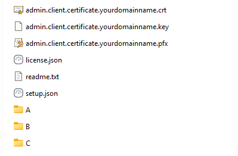
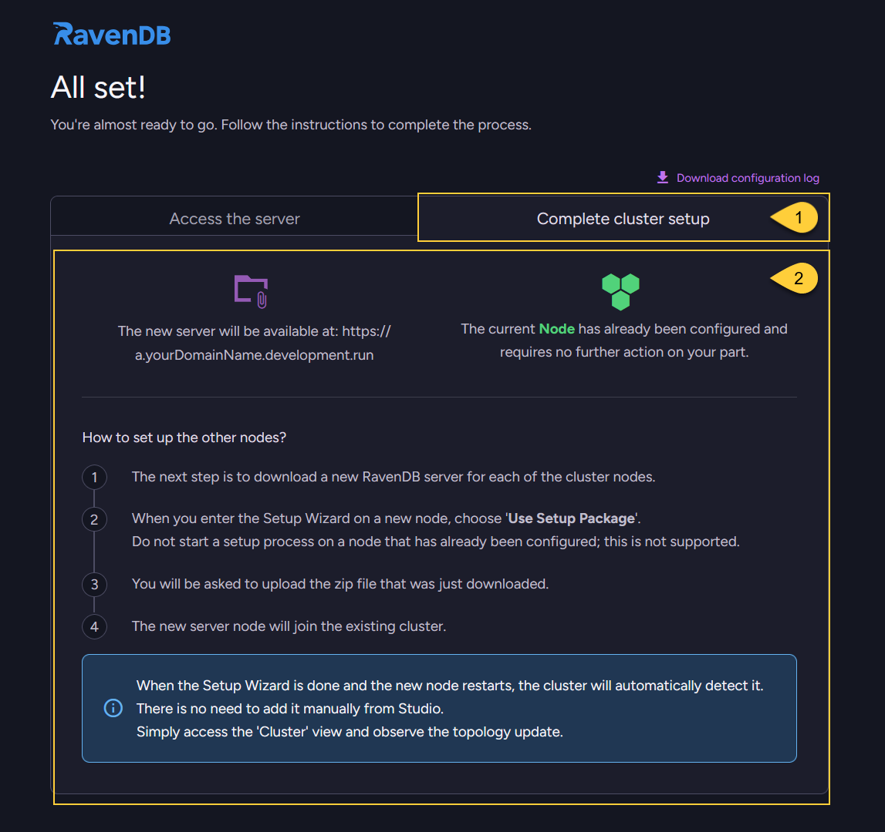
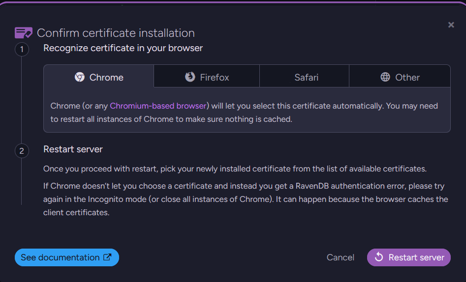
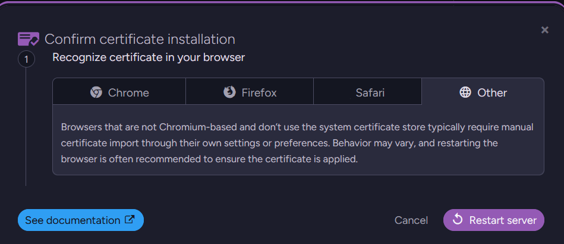
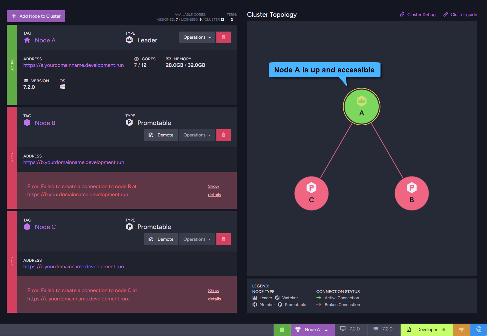

import Admonition from '@theme/Admonition';
import Tabs from '@theme/Tabs';
import TabItem from '@theme/TabItem';
import CodeBlock from '@theme/CodeBlock';
import LanguageSwitcher from "@site/src/components/LanguageSwitcher";
import LanguageContent from "@site/src/components/LanguageContent";
import ContentFrame from '@site/src/components/ContentFrame';
import Panel from '@site/src/components/Panel';

<Admonition type="note" title="">
  
* After clicking the _Finish_ button in the [Review setup](../../../start/installation/setup-wizard/review-setup.mdx) step,
  the wizard applies your configuration and either prepares the server for its first run or generates a setup package, depending on the flow you chose in earlier steps.
    
* In this article:
  * [Configuration in process](../../../start/installation/setup-wizard/finish-setup.mdx#configuration-in-process) 
  * [Configuration is done](../../../start/installation/setup-wizard/finish-setup.mdx#configuration-is-done) 
    * [The downloaded ZIP file](../../../start/installation/setup-wizard/finish-setup.mdx#the-downloaded-zip-file) 
    * [The "All Set!" screen](../../../start/installation/setup-wizard/finish-setup.mdx#the-all-set-screen) 
  * [Restarting the server](../../../start/installation/setup-wizard/finish-setup.mdx#restarting-the-server) 
    

</Admonition>

<Panel heading= "Configuration in process">
    
The wizard performs several background tasks and displays them in a real-time configuration log.   
While the process depends on your [Setup method](../../../start/installation/setup-wizard/choose-setup-method.mdx)
and [Chosen security method](../../../start/installation/setup-wizard/choose-security-method.mdx), it generally follows these stages:    
    
* **Validation**:  
  RavenDB verifies the configuration you provided in earlier steps, including file paths, network settings, and license validity.
    
* **Security setup**:  
    * **Let's Encrypt**:  
      RavenDB contacts Let’s Encrypt, completes the DNS challenge for your domain, and acquires the server certificate.
      It then generates an admin client certificate, registers it in your OS certificate store,  
      and prepares the setup ZIP package, which includes both the server and client certificates.
    
        **Caching of Let's Encrypt certificates**:  
        If you run the Setup Wizard again with the same cluster domain names,  
        the wizard will reuse the cached Let’s Encrypt certificate instead of requesting a new one.    
    
    * **Your Own Certificate**:  
      RavenDB validates your supplied certificate against the configured hostnames.  
      It then generates an admin client certificate, registers it in your OS certificate store,  
      and prepares the setup ZIP package, which includes both the server and client certificates.
    
    * **Unsecured**:    
      RavenDB skips certificate steps and only validates basic configuration settings.
    
* **File Generation**:  
  RavenDB creates the `settings.json` file for each configured node and adds it to the generated ZIP package.   
  The ZIP file is downloaded to your _Downloads_ folder when processing is done.
    
    Note:  
    For a **single-node unsecured** setup, no ZIP file is generated; the configuration is written locally for that node only.
    

---    
    

1. **Configuration log**:  
   Toggle this switch to view detailed, real-time log events.  
   This is useful for tracking the background process or troubleshooting if any issues arise during setup.

2. **Download configuration log**:  
   Click to save a local copy of the installation events.
    
3. **Progress made**:  
   View the status of the background setup tasks in real-time.  
   This updates automatically as the wizard processes your configuration.    
    
4. **Restart server**:  
    This button remains disabled while the configuration is in progress.  
    It will be enabled only after all operations complete successfully.    
    
5. **Navigation panel**:  
   Indicates that you are at the final _Finish_ step of the setup wizard.

---
    
**What happens next?**

If all operations complete successfully, the wizard will automatically update the screen.  
See the [Configuration is done](../../../start/installation/setup-wizard/finish-setup.mdx#configuration-is-done) section below.
    
If an error occurs, the process will halt.  
The detailed configuration log will help you identify what went wrong.
    
---
    
<Admonition type="note" title="">
    
**Configuration failure**
    
* If the setup process fails, the wizard will display a detailed error message in the configuration log.  
  You can click Back to adjust your settings and try again.

* If you are using Let's Encrypt, a frequent issue is that the newly created DNS records have not yet propagated to your local network.
  * Usually, the simplest solution is to wait a few minutes and try again.  
  * If you don't want to wait, you can temporarily configure your network adapter to use Google's public DNS server (`8.8.8.8`). 
    This bypasses your local ISP's Domain Name System (DNS) cache and forces a fresh lookup.
  * Tip: You can use the web tool at [dns.google](https://dns.google/) to manually look up the DNS records for your domain and verify if the updates have propagated globally.

</Admonition>
    
</Panel>

<Panel heading= "Configuration is done">

Once the configuration completes successfully:  
    * The setup ZIP package is downloaded.
    * The wizard shows the "All set!" screen.

---    
    
###  The downloaded ZIP file   
    
* This file is automatically saved to your local _Downloads_ folder.  
  It contains all the necessary cluster configuration files and certificates.   
    
* If you are setting up a multi-node cluster, copy this _.zip_ file to each of your remaining server machines.  
  You will use it to set up the other nodes. See [Use setup package](../../../todo).

* Here is an example of the extracted ZIP package contents for a **3-node secure** cluster:
    
    
    
    This package containes:
    * **Admin client certificates** (`.pfx`, `.crt`, `.key`):  
      The certificates required to securely access and manage your server instances.
    * **Cluster configuration** (`setup.json`, `license.json`):  
      Files containing your cluster settings and license details.
    * **Node folders** (`A`, `B`, `C`, etc.):  
      Each folder corresponds to a specific node in your cluster and contains the unique `settings.json` file generated for that machine.
    * **readme.txt**:  
      Contains basic information and instructions.    
    
---
    
### The "All set!" screen   
    
This final view displays information across two tabs: 
  * **"Access the server"** 
  * **"Complete cluster setup"**    

---
    
<ContentFrame>
    
### The "Access the server" tab    
    
For example, when configuring a **multi-node secure cluster**, you will see the following:    
    

1. **Access the server tab**:  
   This tab shows information about the status of your newly configured node.
    
2. **Node configuration details**:      
   * **Server address**:  
     The URL where your new server is available is displayed here  
     (e.g., `https://a.yourDomainName.development.run`).    
   * **Node status**:  
     Confirms that Node A has already been configured and requires no further action on your part.
   * **Client certificate**:  
     Confirms that an administrator client certificate has been successfully installed on this machine.
    
3. **Restart server**:  
    This button is now enabled. Click to apply the settings and restart the server on Node A.  
    Once restarted, your browser will automatically open RavenDB Studio for this node.    
    Learn more in [Restarting the server](../../../start/installation/setup-wizard/finish-setup.mdx#restarting-the-server) below. 

</ContentFrame>
    
<ContentFrame>
    
### The "Complete cluster setup" tab

When [Creating a new cluster](../../../start/installation/setup-wizard/choose-setup-method#set-up-a-new-cluster) with more than one node,  
the **All set!** screen reminds you how to complete the setup on the remaining machines.   

---
    

1. **Complete cluster setup tab**:  
   This tab is available when you configure a multi-node cluster.  
   It provides instructions on how to add the remaining nodes to your new cluster.
    
2. **Setup instructions**:  
   This text explains how to set up the other nodes in your cluster.  
   For detailed steps, see [Use setup package](../../../start/installation/setup-wizard/choose-setup-method.mdx#use-an-existing-setup-package).    

---
    
Similarly, this info is displayed when you follow the [Create package for external setup](../../../start/installation/setup-wizard/choose-setup-method.mdx#create-a-package-for-external-setup) flow.      
At this point, you have two options for your newly generated ZIP package:
    
* **Use it on remote machines**:  
  Copy the downloaded _.zip_ file to your other servers and run the Setup Wizard there.
    
* **Use it on this machine**:  
  The UI offers a handy shortcut to take you back to the [Choose setup method](../../../start/installation/setup-wizard/choose-setup-method.mdx) step,  
  where you can immediately apply the configuration using the [Use setup package](../../../start/installation/setup-wizard/choose-setup-method.mdx#use-an-existing-setup-package) flow.
    

    
</ContentFrame>    
    
</Panel>

<Panel heading="Restarting the server">  

### For a secure setup

If you configured a secure server, clicking the **Restart server** button will open the **Confirm certificate installation** dialog.  
Because different browsers handle certificates differently, this dialog provides specific instructions for your browser to ensure you can access Studio.

<Tabs>
  <TabItem value="Chrome" label="Chrome" default>
    
  </TabItem>
  <TabItem value="Firefox" label="Firefox">
      
  </TabItem>
  <TabItem value="Safari" label="Safari">
      
  </TabItem>
  <TabItem value="Other" label="Other">
            
  </TabItem>
</Tabs>

**Final steps**:  
    
* After reviewing the instructions for your browser, click the **Restart server** button inside the dialog.
* RavenDB will shut down the Setup Wizard and restart as a fully configured server instance. 
* When RavenDB Studio opens, your browser will prompt you to authenticate.  
  Select your newly installed admin certificate from the list to proceed.  
* The Studio will open on the current node (e.g., Node **A**).  
  In the [Cluster view](../../../studio/cluster/cluster-view.mdx), you can see that the other nodes (e.g., Node **B** and Node **C**) are not yet reachable.  
  This is expected at this stage because those nodes have not been started yet.
    
    To complete the cluster, continue with the [Use setup package](../../../start/installation/setup-wizard/use-setup-package.mdx) flow 
    on the machines for Node B and Node C to apply the configuration and automatically join them to the cluster.
    
     
    
---

### For an unsecured setup

If you chose an unsecured setup, the server will simply restart immediately and open RavenDB Studio over standard HTTP.
No certificate installation or confirmation dialog is required.
    
</Panel>