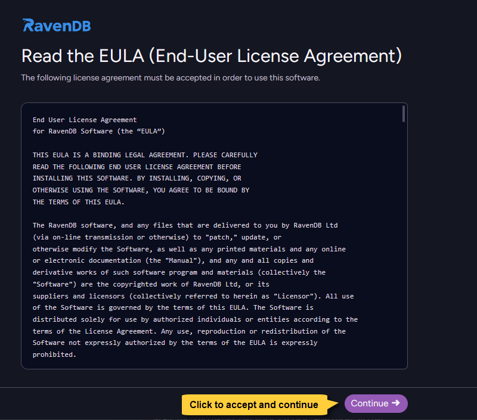

import Admonition from '@theme/Admonition';
import Tabs from '@theme/Tabs';
import TabItem from '@theme/TabItem';
import CodeBlock from '@theme/CodeBlock';
import LanguageSwitcher from "@site/src/components/LanguageSwitcher";
import LanguageContent from "@site/src/components/LanguageContent";
import ContentFrame from '@site/src/components/ContentFrame';
import Panel from '@site/src/components/Panel';

<Admonition type="note" title="">

* The Setup Wizard offers a fast, guided process to configure and initialize a RavenDB server or cluster,  
  including network, licensing, and security options.  
    
* If you prefer to configure RavenDB manually, see: [Manual setup](../../../start/installation/manual.mdx).  
    
* In this article:
  * [How to run the Setup Wizard](../../../start/installation/setup-wizard/overview.mdx#how-to-run-the-setup-wizard)
  * [License agreement (EULA)](../../../start/installation/setup-wizard/overview.mdx#license-agreement-eula)
  * [Guided setup flow](../../../start/installation/setup-wizard/overview.mdx#guided-setup-flow)
  * [RavenDB settings files](../../../start/installation/setup-wizard/overview.mdx#ravendb-settings-files)

</Admonition>

<Panel heading="How to run the Setup Wizard">

Download the RavenDB server package from the official [RavenDB downloads page](https://ravendb.net/download).  
Extract the downloaded archive into a permanent folder on each machine that will host a RavenDB server instance.  
Each extracted folder represents a potential cluster node.  
    
Then:  
1. Open a command prompt or terminal on the machine where you want to run the Setup Wizard.
2. Navigate to the extracted `Server` folder.
3. Run the appropriate script:
    
<Tabs groupId='languageSyntax'>
<TabItem value="Windows" label="Windows">
```plain
.\run.ps1
```    
</TabItem>
<TabItem value="Linux" label="Linux">
```plain
./run.sh
```    
</TabItem>
</Tabs>
    
When started for the first time, the server opens a browser window with the Setup Wizard.  
The first screen prompts you to accept the license agreement (EULA).  

</Panel>

<Panel heading="License agreement (EULA)">
     
You must review and accept the End-User License Agreement (EULA) to proceed with the installation.
    
  
    
</Panel>

<Panel heading="Guided Setup Flow">

After accepting the EULA, the wizard starts a guided configuration flow.    
    
The next screen is [Choose setup method](../../../start/installation/setup-wizard/choose-setup-method.mdx), where you select your setup path:  
set up a new cluster, create a package for external setup, or use an existing setup package.

Each step of the wizard is documented in its own article to help you through specific configuration choices.    
    
</Panel>

<Panel heading="RavenDB settings files">
    
### `settings.default.json`
    
When you extract the RavenDB server package, the extracted _Server_ folder includes a `settings.default.json` file.  
This file contains a minimal configuration that causes RavenDB to start the Setup Wizard on first run.    

<TabItem>
```js
{
    "ServerUrl": "http://127.0.0.1:0",
    "Setup.Mode": "Initial",
    "DataDir": "RavenData"
}
```
</TabItem>

* `"ServerUrl": "http://127.0.0.1:0"`  
  The Setup Wizard runs on _localhost_ and uses a random available port.
    
* `"Setup.Mode": "Initial"`  
  The _Initial_ value causes RavenDB to start the Setup Wizard instead of running as a regular server.
    
* `"DataDir": "RavenData"`  
  By default, your RavenDB data (databases, documents, and indexes) is stored in the `RavenData` directory under the extracted `Server` folder.
  You can customize this location later in the wizard flow in the [Additional settings](../../../start/installation/setup-wizard/additional-settings.mdx#configure-advanced-options) step.

---
    
### `settings.json`    
    
During setup, RavenDB creates a `settings.json` file in the same _Server_ folder.    
This file contains the configuration you selected during the wizard (including paths, security settings, and other options).    
    
After setup is complete, you can still add additional server configuration keys to this file as needed.  
For more details, see the [settings.json](../../../server/configuration/configuration-options.mdx#settingsjson) section
in the [Configuration overview](../../../server/configuration/configuration-options.mdx) article.    
    
On subsequent runs, the server reads this `settings.json` file and starts as a regular RavenDB server using that configuration, rather than starting the Setup Wizard again.    
   
    
---
    
### `settings.json.bak`    
        
During setup, if a `settings.json` file already exists, its content is first saved to `settings.json.bak` as a backup before being overwritten.
    
On a fresh install, this backup usually contains the same content as `settings.default.json`, because that template is used to create the initial `settings.json` file.
    
RavenDB does not read `settings.json.bak` at runtime; it is kept only so you can inspect or manually restore the previous configuration if needed.
    
    
</Panel>