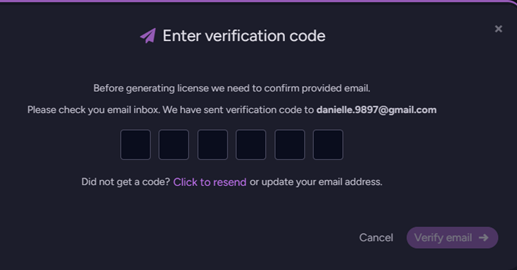

import Admonition from '@theme/Admonition';
import Tabs from '@theme/Tabs';
import TabItem from '@theme/TabItem';
import CodeBlock from '@theme/CodeBlock';
import LanguageSwitcher from "@site/src/components/LanguageSwitcher";
import LanguageContent from "@site/src/components/LanguageContent";
import ContentFrame from '@site/src/components/ContentFrame';
import Panel from '@site/src/components/Panel';

<Admonition type="note" title="">

* After selecting the setup method as described in [Choose setup method](../../../start/installation/setup-wizard/choose-setup-method.mdx),
  the next step is to enter your **license key**.
    
* Each RavenDB cluster must be registered with its own license.  
  The license key is sent to the email address you provided when obtaining it.   
    
* The license grants legal permission to use RavenDB in production,
  unlocks features based on license type (AGPL features only without a license),
  defines cluster and hardware limits, and enables support, updates, and SLA.  
  Learn more about licensing in [Licensing overview](../../../licensing/overview.mdx).  
    
* In this article:
  * [Enter license key](../../../start/installation/setup-wizard/provide-license-key.mdx#enter-license-key)  
  * [Get a free license](../../../start/installation/setup-wizard/provide-license-key.mdx#get-a-free-license)  
  * [Running RavenDB without a license](../../../start/installation/setup-wizard/provide-license-key#running-ravendb-without-a-license)  

</Admonition>

<Panel heading="Enter license key">
    

    
1. Enter your license key, which was sent to the email address you provided when obtaining it.   
    
2. If you do not have a license, select this option to obtain a free Developer or Community license.  
   Learn more below in [Get your free license](../../../start/installation/setup-wizard/provide-license-key.mdx#get-your-free-license).
    
3. Click **"Continue"** to proceed to the next step in the wizard - [Choosing a security option](../../../start/installation/setup-wizard/choose-security-option.mdx).
    
4. Click **"Back"** to return to the previous step - [Choosing a setup method](../../../start/installation/setup-wizard/choose-setup-method.mdx).
    
5. The wizard steps are displayed in the right-hand navigation panel to help you track your progress.
        
</Panel>

<Panel heading="Get a free license"> 
    

    
1. Use the toggle to choose whether to obtain a free [Developer](../../../licensing/overview.mdx#developer-license) or [Community](../../../licensing/overview.mdx#community-license) license.

2. Enter your details in the form.
    
3. Click **"Generate license"** to receive your free license key.  
   A **verification code** will be sent to your email address.  
   Enter the code to confirm your email and receive the license key.  
    
       
    
   The license key will then be automatically filled in the previous view,  
   and you can click **"Continue"** to proceed to the next step - [Choosing a security option](../../../start/installation/setup-wizard/choose-security-option.mdx).
    
4. If you already have a license, click **"I already have a license"** to return to the previous view.
    
</Panel>

<Panel heading="Running RavenDB without a license"> 
    
You can run RavenDB without entering a license key, but it will operate in AGPL / limited mode,  
and both features and resource usage will be restricted.  
The following limitations will apply:  
    
* AGPLv3 restrictions
* Limited feature set
* Unsecured mode only (no HTTPS or certificates)
* Maximum of 1 node in the cluster, 3 CPU cores, and 6 GB RAM
* Not permitted for production use, this mode is intended only for development, evaluation, and learning    
    
</Panel>