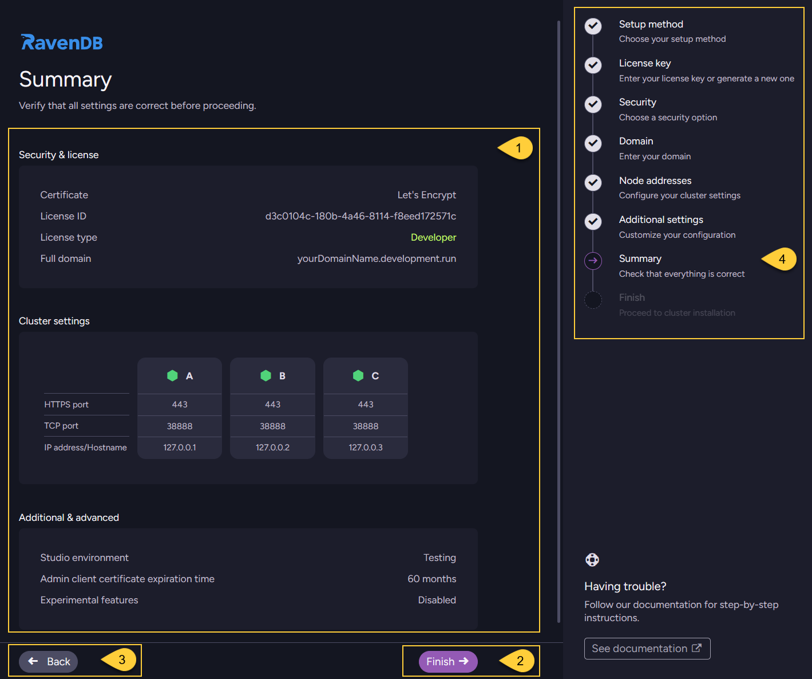

import Admonition from '@theme/Admonition';
import Tabs from '@theme/Tabs';
import TabItem from '@theme/TabItem';
import CodeBlock from '@theme/CodeBlock';
import LanguageSwitcher from "@site/src/components/LanguageSwitcher";
import LanguageContent from "@site/src/components/LanguageContent";
import ContentFrame from '@site/src/components/ContentFrame';
import Panel from '@site/src/components/Panel';

<Admonition type="note" title="">

* After configuring additional settings, as described in [Additional settings](../../../start/installation/setup-wizard/additional-settings.mdx),  
  the next step is to **review all your settings before proceeding**.
    
* In this article:
  * [Review setup](../../../start/installation/setup-wizard/review-setup.mdx#review-setup) 

</Admonition>

<Panel heading= "Review setup">
    

1. Review the summary of all settings you have configured so far before proceeding.

2. Click **"Finish"** to proceed to the next step - [Finish setup](../../../start/installation/setup-wizard/finish-setup.mdx) and complete the installation.
    
3. Click **"Back"** to return to the previous step - [Additional settings](../../../start/installation/setup-wizard/additional-settings.mdx).    
    
4. The navigation panel indicates your current step (_"Summary"_).    
    
</Panel>