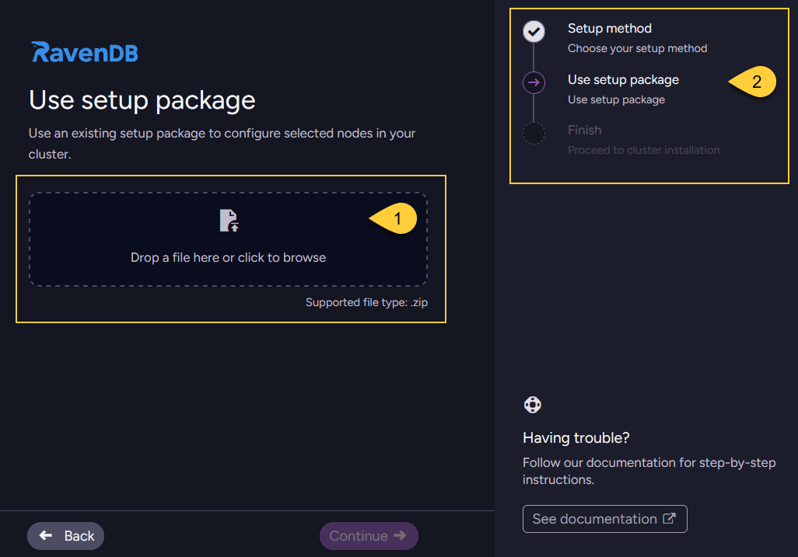
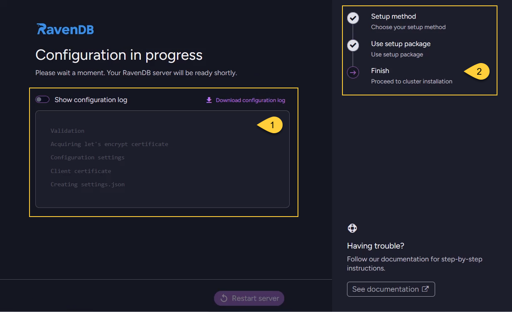

import Admonition from '@theme/Admonition';
import Tabs from '@theme/Tabs';
import TabItem from '@theme/TabItem';
import CodeBlock from '@theme/CodeBlock';
import LanguageSwitcher from "@site/src/components/LanguageSwitcher";
import LanguageContent from "@site/src/components/LanguageContent";
import ContentFrame from '@site/src/components/ContentFrame';
import Panel from '@site/src/components/Panel';

<Admonition type="note" title="">

* The **Use setup package** flow is the third option available in the [Choose setup method](../../../start/installation/setup-wizard/choose-setup-method.mdx) step.  
  It allows you to initialize a RavenDB instance using a configuration ZIP file generated in a previous session.
    
* In this article:
  * [When to use](../../../start/installation/setup-wizard/use-setup-package.mdx#when-to-use)  
  * [Using an existing setup package](../../../start/installation/setup-wizard/use-setup-package.mdx#using-an-existing-setup-package)

</Admonition>

<Panel heading="When to use">

Choose this setup method in the following scenarios:

* When you have already configured the first node (e.g., Node **A**) of a multi-node cluster  
  and need to set up the remaining machines (Node **B**, Node **C**, etc.) using the generated ZIP package.    
    
* When you are ready to apply a configuration package to your target server that was created using one of the following methods:
  * The [Create a package for external setup](../../../start/installation/setup-wizard/choose-setup-method.mdx#create-a-package-for-external-setup) flow
  * The `rvn create-setup-package` CLI command in the [rvn utility](../../../server/administration/cli.mdx#rvn)    

</Panel>

<Panel heading= "Using an existing setup package">

<ContentFrame>
    
**Run the Setup Wizard**:      
Extract the RavenDB server package into a new folder on the target machine where you wish to install the node.  
Run `run.ps1` (Windows) or `run.sh` (Linux) and accept the EULA, as explained in [How to run the Setup Wizard](../../../start/installation/setup-wizard/overview.mdx#how-to-run-the-setup-wizard).
    
</ContentFrame>
    
     
<ContentFrame> 
    
**Select "Use setup package"**:      
In the [Choose setup method](../../../start/installation/setup-wizard/choose-setup-method.mdx) step, select the "Use setup package" option. 
    

    
1. Select "Use setup package"
2. Click "Continue" to proceed.
    
</ContentFrame>

    
<ContentFrame> 
    
**Upload the ZIP package**:    
Upload the configuration `.zip` file that was generated and downloaded during the initial setup.
    

    
1. Drag and drop the `.zip` file or click to browse your local files.
2. The navigation panel indicates your current step (_"Use setup package"_).
    
</ContentFrame>  
    
    
<ContentFrame> 
    
**Select node**:  
Select the specific node tag (e.g., Node **B** or Node **C**) that you want to assign to this specific machine.  
Note: Do not start a setup process on a node that has already been configured.
    

    
1. Open the dropdown and select the node intended for this machine.
2. Click "Continue" to proceed. 
    
</ContentFrame> 
    
    
<ContentFrame> 
    
**Configuration in progress**:    
Wait while the wizard validates the package, applies the settings, creates the local `settings.json` file,  
and registers any necessary certificates.
    

    
1. View the real-time configuration log to track the installation progress.
2. The navigation panel shows you have reached the final _Finish_ step.
    
</ContentFrame>
    
    
<ContentFrame> 
    
**Restart the server**:    
Once the "All set!" screen appears, click **Restart server** to apply the configuration and start the node.
    

    
1. Review the configuration summary for the current node (Node **B** in this example).
2. Click Restart server. 

</ContentFrame>

    
<ContentFrame>    
    
**Node joins the cluster**:  
Once the node restarts, it will automatically join the existing cluster and begin communicating with the other nodes.
There is no need to add it manually through Studio.

</ContentFrame>
    
    
<ContentFrame>     

**Repeat for remaining nodes**:  
Repeat this process on each dedicated machine for all remaining nodes defined in your setup package.

</ContentFrame>
    
</Panel> 