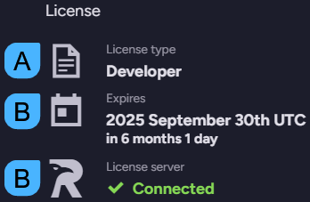
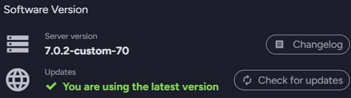

import Admonition from '@theme/Admonition';
import Tabs from '@theme/Tabs';
import TabItem from '@theme/TabItem';
import CodeBlock from '@theme/CodeBlock';
import LanguageSwitcher from "@site/src/components/LanguageSwitcher";
import LanguageContent from "@site/src/components/LanguageContent";

# Licensing Overview
<Admonition type="note" title="Note">

* The license key is in JSON format.  
  It is sent to the email address that was provided when the license was obtained.  

* A few **License Types** are available, learn more about them below.  
  <Admonition type="info" title="Info">
  Visit the [Pricing page](https://ravendb.net/buy) to see **which features are included with each license type**.
  </Admonition>

* Each license has a specific expiration date.  
  To renew your license see [renew license](../../start/licensing/renew-license.mdx).  

* In this page:
    * [License types](../../start/licensing/licensing-overview.mdx#license-types)
        * [Developer](../../start/licensing/licensing-overview.mdx#developer)
        * [Community](../../start/licensing/licensing-overview.mdx#community)
        * [Professional](../../start/licensing/licensing-overview.mdx#professional)
        * [Enterprise](../../start/licensing/licensing-overview.mdx#enterprise)
        * [ISV Licenses](../../start/licensing/licensing-overview.mdx#isv-licenses)
    * [Manage license view](../../start/licensing/licensing-overview.mdx#manage-license-view)

</Admonition>
## License types

<Admonition type="info" title="Info">
Visit the [pricing page](https://ravendb.net/buy) to see which features are included with each license type.
</Admonition>
### Developer

* The developer license is for development use only and isn't applicable for commercial use.  
  You must upgrade this license before going into production.   
* It is fully featured but temporary - license lasts 6 months and can be renewed.  
* Certificates exceeding 4 months expiration period are Not allowed to be used with this license.  
  Automatic renewal of Let’s Encrypt certificates is disabled.  
* When you are ready to go into production:  
  * Be sure to choose a license that has all features with which your client was developed.  
  * [Upgrade to a production license](https://ravendb.net/buy) and then [replace](../../start/licensing/replace-license.mdx) the developer license.  
  
* The developer license can be obtained [here](https://ravendb.net/buy#developer).
### Community

* A basic production-grade license.
* Community licenses last one year and can be renewed every year.  
* Servers using a Community license are **required to run the latest major version**.  
  E.g., if RavenDB `7.0` is released and your server runs RavenDB `6.2` with a Community license, 
  you will be required to upgrade RavenDB to version `7.0`.  
  Running a major version older than the latest with a Community license will **block your server's access to Studio**.
### Professional

* A standard production-grade license.  
* Extended automatically if the server has access to RavenDB's License Server.  
### Enterprise

* A high-performance, fully-featured production-grade license.  
* Extended automatically if the server has access to RavenDB's License Server.  
### ISV Licenses

* ISV licenses are commercial licenses that allow you to redistribute RavenDB with your software  
  for on-premise installation and use by your customers.  
* Available ISV license types are: Essential, Professional, and Enterprise.  
* [Contact RavenDB for more details](https://ravendb.net/contact).

## Manage license view

1. **About**  
   Click to open the About page and view RavenDB version, license, support info, and more.  

2. **License**  

      

      * A. Informs you of your current license type  
      * B. Informs you of your license expiration date  
      * C. Informs you whether your server is currently connected to RavenDB's license server.  
        When connected, you can:  
        
        * **Renew License** to extend its expiration date
        * **Replace** your license
        * **Force update** to sync with the license server
      
        <Admonition type="info" title="Info">
        Connectivity issues are often caused by a firewall blocking the connection, 
        or the server running offline.  

        * Make sure that RavenDB has access to `api.ravendb.net`.  
        * Click the refresh button to check the connection.  
        </Admonition>

3. **Software Version**  
   
      
   
      * **Server version**  
        Shows your current server version.  
        Click `Changelog` to see logged version changes. 
      * **Updates**  
        Informs you whether you are using the latest server version.  
        Click Check for updates to see if an update is available.  

4. **Support & Community**  

      

      * **Support type**  
        Informs you of the support type you are entitled to,  
        and allows you to join our community GitHub discussions.  
      * **Let's solve it together**  
        Allows you to join our developers Discord community.  

5. **License details tab**  
   Details the features that are enabled for your server with each license type.  
   Use the scrollbar to slide through the full features list.  

      

6. **Support plan tab**  
   Specifies your current support plan and allows you to upgrade it.  

      

