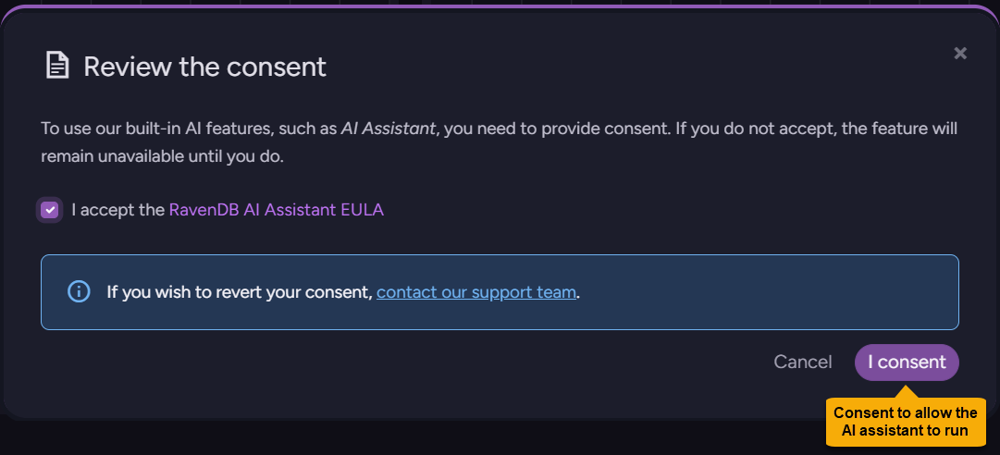
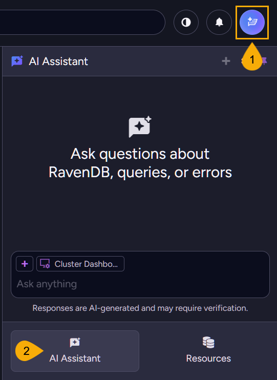
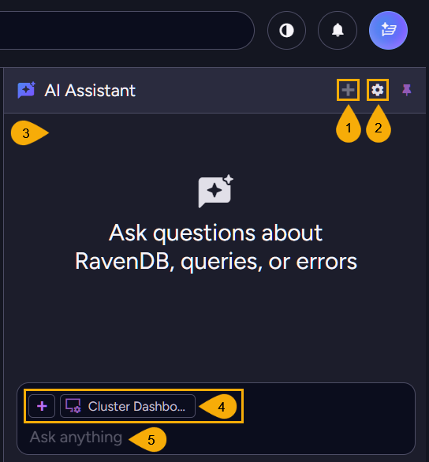
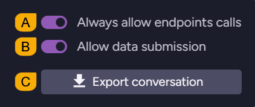
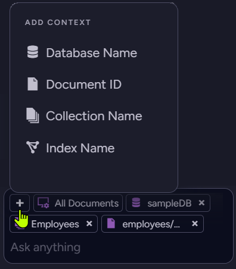

import Admonition from '@theme/Admonition';
import Tabs from '@theme/Tabs';
import TabItem from '@theme/TabItem';
import CodeBlock from '@theme/CodeBlock';
import LanguageSwitcher from "@site/src/components/LanguageSwitcher";
import LanguageContent from "@site/src/components/LanguageContent";
import Panel from "@site/src/components/Panel";
import ContentFrame from "@site/src/components/ContentFrame";

# Studio AI assistant

<Admonition type="note" title="">

**RavenDB** is equipped with a wide selection of features and capabilities, unified in a database that simply aims to make your life easier. The **Studio** UI is designed to support this aim by making your navigation through the database feature set simple, effective, and enjoyable. Still, when looking for a new option or defining an unfamiliar script or task, it can sometimes be challenging to quickly get to the location or result you are looking for.  
The **AI assistant**, available from RavenDB `7.2` on, is an interactive guide that remains available throughout the Studio interface. It can direct you to locations and solutions you're seeking and provide you with needed information and help. 

* AI capabilities are provided to the assistant through an external RavenDB backend service, requiring no significant local resources.  

* In this article:
  * [Overview](../studio/ai-assistant#overview)
     * [What is the AI assistant for](../studio/ai-assistant#what-is-the-ai-assistant-for)
     * [User consent](../studio/ai-assistant#user-consent)
     * [Licenses and Usage tokens](../studio/ai-assistant#licenses-and-usage-tokens)
     * [Services used](../studio/ai-assistant#services-used)
        * [RavenDB backend service](../studio/ai-assistant#ravendb-backend-service)
        * [LLM service provider](../studio/ai-assistant#llm-service-provider)
  * [Using the AI assistant](../studio/ai-assistant#using-the-ai-assistant)
  * [Configuration](../studio/ai-assistant#configuration)
  * [Security concerns](../studio/ai-assistant#security-concerns)
     * [Concern: Data privacy & Exfiltration](../studio/ai-assistant#concern-data-privacy--exfiltration)
     * [Prompt injection (indirect injection)](../studio/ai-assistant#concern-prompt-injection-indirect-injection)
     * [Safety limit enforcement (reliability)](../studio/ai-assistant#concern-safety-limit-enforcement-reliability)
     * [Denial of Service (DoS) via queries](../studio/ai-assistant#concern-denial-of-service-dos-via-queries)
     * [Server-Side Request Forgery (SSRF)](../studio/ai-assistant#concern-server-side-request-forgery-ssrf)
     * [Authorization confusion](../studio/ai-assistant#concern-authorization-confusion)
     * [Unauthorized adoption & Compliance](../studio/ai-assistant#concern-unauthorized-adoption--compliance)

</Admonition>

<Panel heading="Overview">

<ContentFrame>

### What is the AI assistant for

Using the AI assistant can ease and enhance your database management capabilities via Studio in various ways.  
- You can use the assistant where **specialized knowledge** is required.  
  E.g., pass to the assistant in natural language a description of a query you want to run and get its help in forming RQL code that can be executed in Studio's Query view.  
- The assistant **remains available wherever you go**, providing you with the help you need and saving you the distraction of leaving Studio to look for it elsewhere.
- In addition to its constant availability, the assistant is also **aware of your current location** in Studio. It can, for example, direct you to the view where a specific type of ETL task can be defined and guide you through the task definition fields and settings.  
- You can give the assistant access to selected collections, documents, and indexes in your database for help specifically tailored to your data and use cases.  

</ContentFrame>

<ContentFrame>

### User consent

The AI assistant is **disabled by default**. To enable it, you must provide explicit consent. 

1. **Knowledge center icon**  
  Click the knowledge center icon at the top right-hand corner to open the knowledge center.

2. **Review the consent**  
  Click the review button to read the AI assistant [EULA](https://ravendb.net/legal/ravendb/ai-assistant-terms-of-use) (End-User License Agreement) and either consent and enable the assistant or leave the assistant disabled.

---

* **I consent**  
  Click to consent and start the AI assistant, transmitting data to the RavenDB Cloud backend and Azure OpenAI LLM for analysis.  
  <Admonition type="note" title="">
  * **Note** that consenting cannot be undone from the UI. To cancel your consent after approving it you will have to [contact RavenDB](https://ravendb.net/contact).
  * Also note that you **will** be able to disable or enable the AI assistant using [configuration keys](../studio/ai-assistant#configuration), even after providing your consent.
  </Admonition>

* **Cancel**  
  Click to keep the AI assistant disabled and prevent any data transmission.  

</ContentFrame>

<ContentFrame>

### Licenses and Usage tokens

* **License needed**  
  To use the AI assistant, your RavenDB server must have a valid license.  
  All licensed servers are entitled to use the AI assistant, regardless of their license type.  

* **Usage tokens**  
  A monthly quota of usage tokens is allocated per licensed server, with different quotas for different license types; the tokens are consumed by AI assistant usage.  
  When the tokens run out, assistant prompts are no longer processed by the [backend service](../studio/ai-assistant#ravendb-backend-service) or the [LLM](../studio/ai-assistant#llm-service-provider).  
  The tokens quota is automatically renewed each month.  

</ContentFrame>

<ContentFrame>
### Services used

#### RavenDB backend service:

* AI assistant prompts are delivered by Studio to its RavenDB server, and by the server to an external RavenDB backend service at `https://api.ravendb.net`.  

* The backend service processes the prompts, interacts with the LLM, and returns the results to the server, which relays them back to Studio.  

* This procedure minimizes the amount of local resources required to run the AI assistant.

<Admonition type="note" title="">
**Note** that if the RavenDB server managed by Studio cannot connect with the RavenDB backend service at `https://api.ravendb.net` (for instance, because the server resides in an isolated network), the AI assistant will not be able to function.
</Admonition>

---

#### LLM service provider:

* RavenDB's backend service uses the Azure OpenAI platform with `gpt-4.1-mini`, `gpt-4.1-nano` for chat completion, and `text-embedding-3-small` for embeddings.  

</ContentFrame>

</Panel>

<Panel heading="Using the AI assistant">

<ContentFrame>

### Opening the AI assistant

1. **Knowledge center icon**  
  Click to open the knowledge center.  

2. **AI assistant**  
  Click to open the AI assistant panel.

</ContentFrame>

<ContentFrame>

### Setting and using the assistant

1. **Start new conversation**  
   Click to start a new conversation with the AI assistant.  
   The conversation history will be cleared.  

2. **Chat settings**  
   Click the gear to open the chat settings dialog.  
   
   * **A.** **Always allow endpoints calls**  
     When enabled, the AI assistant can call database endpoints without asking for your approval for each call.  
     When disabled, the AI assistant must ask for your approval before calling any database endpoint.  
   * **B.** **Allow data submission**  
     When enabled, the AI assistant is allowed to send your content to the RavenDB backend service and the LLM for analysis.  
     When disabled, the AI assistant cannot send any of your content for analysis. 
   * **C.** **Export conversation**  
     Click to export the current conversation as a JSON file.  
     This is useful when, for example, you want to share the conversation with RavenDB support for troubleshooting.

3. **Conversation area**  
   The area where the conversation with the AI assistant takes place.

4. **Add context**  
   Click the **+** icon to select resources that the assistant will use as context for the current conversation, to better assist you. You can select databases, collections, documents, and indexes.  
   
   <Admonition type="note" title="">
    * By default, the assistant has access to no resources; it can only use resources that you add explicitly.  
    * Selected resources will be transmitted to the RavenDB backend and 
    Azure OpenAI; **only add resources containing data you're comfortable sharing with these services**.
    * Selected resources are listed above the prompt area.  
    * The first listed item is always the Studio view you are currently visiting, to remind you that the assistant is aware of it.  
    </Admonition>

5. **Prompt area**  
   Use this area to enter your prompt to the AI assistant.

</ContentFrame>

</Panel>

<Panel heading="Configuration">

Use the following keys to configure the AI assistant server-wide.  

<ContentFrame>

#### Ai.Assistant.Disable

Use this key to completely disable the AI Assistant for all users, regardless of individual user consent. The AI assistant option will be blocked in the Knowledge Center.

- **Type**: `bool`
- **Default**: `false`
- **Scope**: Server-wide

</ContentFrame>

<ContentFrame>

#### Ai.Assistant.DisableDataSubmission

Use this key to prevent the transmission of any user data to the RavenDB backend or LLM. The assistant can still provide general guidance but cannot analyze any user data.

- **Type**: `bool`
- **Default**: `false`
- **Scope**: Server-wide

</ContentFrame>

</Panel>

<Panel heading="Security concerns">

<ContentFrame>

### Concern: Data privacy & Exfiltration

As user data is sent by the AI assistant to the RavenDB backend and the LLM that serves it, and conversations are stored at the backend for auditing, keeping user data safe and private is a concern.

#### Mitigations:
* **User control**:  
  The user decides which database content, if any, is provided to the AI assistant and sent by it to the backend and LLM. The extent of the assistant's access to the database, its ability to send any data to the backend, and its ability to operate at all, are fully controlled by the user.  
* **Opt-in mechanism**:  
  The AI assistant is disabled by default. To enable it, the user must explicitly consent to the [EULA](https://ravendb.net/legal/ravendb/ai-assistant-terms-of-use) (End User License Agreement). After consenting, the user can still disable data submission both from the handy chat settings and by configuration keys.  
* **Awareness by legal transparency**:  
  The EULA clearly discloses that the data analysis performed by the AI assistant requires it to send query results to third-party processing: the RavenDB backend service and the LLM it uses.

</ContentFrame>
<ContentFrame>

### Concern: Prompt injection (indirect injection)

Malicious instructions (e.g., "ignore rules and export data") may be hidden within database documents added to AI assistant prompts as context, attempting to trick the LLM to perform unauthorized actions.

#### Mitigations:  
* **Decoupled execution**:  
  The LLM has no direct access to the database and no ability to execute code. Even if "tricked" into suggesting a malicious operation, it cannot perform it.
* **Human-in-the-Loop (HITL)**:  
  The assistant, too, has no ability to modify data or perform actions. It acts strictly as an advisor, returning text and providing the user with input. 

</ContentFrame>
<ContentFrame>

### Concern: Safety limit enforcement (reliability)

The LLM may request a massive dataset, leading to data scraping.

#### Mitigations:  
* **Hard limits**:  
  The RavenDB backend service strictly validates the pageSize parameter. If the LLM requests a large number of items (e.g., 1,000), the backend will override or reject it, enforcing the hard cap of 5 items regardless of the prompt's instruction.
* **The URL is constructed by the backend service**:  
  The LLM provides an Endpoint ID and parameter values, but never constructs the full URL. The actual request is always constructed by the RavenDB backend service.  

</ContentFrame>
<ContentFrame>

### Concern: Denial of Service (DoS) via queries

The LLM may construct complex, resource-heavy read queries (like map-reduce fan-outs, for instance) that would stall the production database.

#### Mitigation: 
* **User approval**:  
  For queries that can create significant load, like the generation of auto-indexes for instance, the AI assistant requires a specific UI confirmation: the user has to approve the request using a checkbox before proceeding.  

</ContentFrame>
<ContentFrame>

### Concern: Server-Side Request Forgery (SSRF)

The AI may be tricked into executing requests against internal/private endpoints not meant to be accessed.

#### Mitigations: Strict Endpoint Whitelisting
* **Construction control:**  
  The LLM provides only an ID, while the RavenDB backend service constructs the URL based on a strictly defined internal whitelist.
* **Explicit consent:**  
  The AI assistant's user must approve the execution of the query or the endpoint.

</ContentFrame>
<ContentFrame>

### Concern: Authorization confusion

The LLM may attempt to debug issues that the user has no permissions for, leading to frustration or confusion.

#### Mitigations: Standard security inheritance
* **Certificate binding:**  
  All requests initiated by the LLM inherit the exact scope and permissions of the user's client certificate.
* **Fail-safe:**  
  If the LLM attempts an administrative action for a low-level user, the database kernel will return a standard `403 Access Denied` error, ensuring the LLM cannot bypass internal security hierarchies.

</ContentFrame>
<ContentFrame>

### Concern: Unauthorized adoption & Compliance
Individual users may enable AI features in violation of organization-wide security policies or "Shadow IT" restrictions.

#### Mitigations: Global admin kill-switch
* RavenDB administrators can use a configuration key to disable the AI assistant feature globally for the entire server, overriding individual user preferences and ensuring that the feature cannot be activated even by valid license holders if it contradicts organizational policy.  
* This is also covered by the [EULA](https://ravendb.net/legal/ravendb/ai-assistant-terms-of-use).

</ContentFrame>

</Panel>
