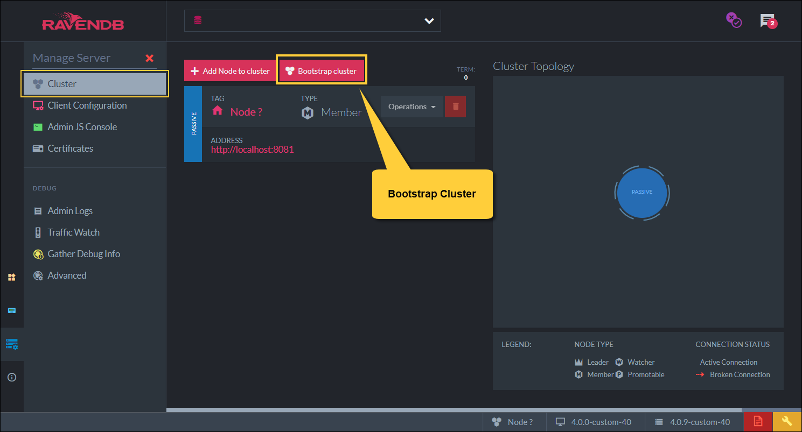

import Admonition from '@theme/Admonition';
import Tabs from '@theme/Tabs';
import TabItem from '@theme/TabItem';
import CodeBlock from '@theme/CodeBlock';
import LanguageSwitcher from "@site/src/components/LanguageSwitcher";
import LanguageContent from "@site/src/components/LanguageContent";

# Setting a Cluster
<Admonition type="note" title="Note">

* A server will be in a `Passive` state in either one of the following:  
  * When the server is started for the very first time  
  * When the server is removed from an existing cluster  

* To make a server become part of a cluster you can do _either_ of the following:  

  1. **Bootstrap Cluster**  
  2. **Adding another node** to this server cluster (will cause both to be part of the same cluster)  
  3. **Performing any RAFT command** on the `Passive` server will make the server become part of a cluster, e.g.:  
     * Adding a license  
     * Creating a database on this server  

* In this page:  
  * [Bootstrap Cluster](../../studio/cluster/setting-a-cluster#bootstrap-cluster)  
  * [Add Another Node to the Cluster](../../studio/cluster/setting-a-cluster#add-another-node-to-the-cluster)  
  * [A Cluster with 2 nodes](../../studio/cluster/setting-a-cluster#a-cluster-with-2-nodes)  

</Admonition>
## Bootstrap Cluster

Click _'Bootstrap Cluster'_ to make the current passive server a part of a cluster.  
Note: This option is only available when the server is in the `Passive` state.  

## Add Another Node to the Cluster

1. Enter the server URL of the new node.  
2. You can optionally specify a tag of your choice for the new node. Use UPPER CASE letters only.  
   If no tag is provided, the server will assign the new node the next available sequential letter.  
3. Decide whether to add the new node as a `Member` -or- a `Watcher` (difference explained [here](../../studio/cluster/cluster-view#cluster-nodes-types)).  
4. Toggle whether to use all available cores on the machine for this node.  
    * If you toggle _Use available cores_ **off**, set a maximum number of cores that can be used by this node.  
      
5. Click _Test connection_ to verify that your cluster can communicate with the server at the specified URL.  
6. When done, click *Add* to add this server as a node to the cluster.  

This operation can also be done programatically. Read more [here](../../server/clustering/cluster-api).  

## A Cluster with 2 nodes

**Now your cluster contains 2 nodes**:  

* The server running on _localhost:8081_ shows as Node A and is the `Leader` of the cluster.  
* The server running on _localhost:8082_ shows as Node B and is a `Member` of the cluster.  

<Admonition type="note" title="Note">
 More nodes can be added as needed.  
</Admonition>

