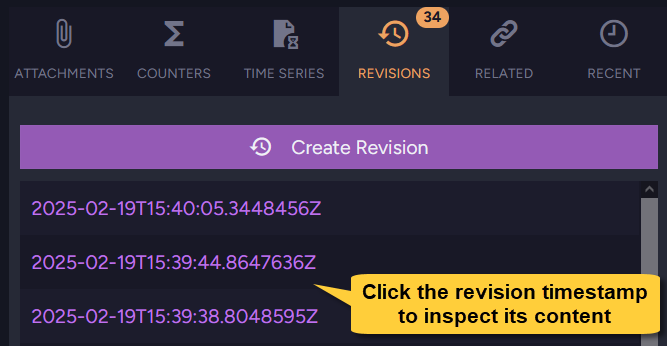

import Admonition from '@theme/Admonition';
import Tabs from '@theme/Tabs';
import TabItem from '@theme/TabItem';
import CodeBlock from '@theme/CodeBlock';
import LanguageSwitcher from "@site/src/components/LanguageSwitcher";
import LanguageContent from "@site/src/components/LanguageContent";

# Viewing Document Revisions
<Admonition type="note" title="Note">

* **Document Revisions** are snapshots of documents that can be created manually or automatically when a document is created, modified, or deleted.
  Revisions can be used for data auditing, instant restoration after document corruption, and other purposes.

* Learn more about document revisions in this [document revisions overview](../../../../document-extensions/revisions/overview.mdx):  
  * To define and enable revisions creation, see [revisions configuration](../../../../document-extensions/revisions/overview.mdx#revisions-configuration).  
  * A dynamic walkthrough demonstrating revisions management is available [here](../../../../document-extensions/revisions/overview.mdx#how-it-works).  

* This article provides an overview of how to view and compare revisions of a specific document.  
  * To see all revisions in the database, go to the [All Revisions](../../../../studio/database/document-extensions/revisions/all-revisions.mdx) view.  
  * To access revisions of deleted documents, go to the [Revisions Bin](../../../../studio/database/document-extensions/revisions/revisions-bin.mdx) view.    
* In this page:
  * [Revisions tab](../../../../studio/database/document-extensions/revisions/revisions.mdx#revisions-tab)  
  * [Revision inspection](../../../../studio/database/document-extensions/revisions/revisions.mdx#revision-inspection)  
  * [Revisions comparison](../../../../studio/database/document-extensions/revisions/revisions.mdx#revisions-comparison)  

</Admonition>
## Revisions tab

* Located within the Document View,  
  the Revisions Tab displays the full trail of all revisions created for the document.
* From this tab, you can inspect each revision, manually force the creation of a new revision,  
  and compare revisions to the live document version and to other revisions.

1. [Document View](../../../../studio/database/documents/document-view.mdx) &gt; **Revisions tab**  
   Click to display the document's revisions tab.  
   Revisions are listed in the revisions tab by their creation time signatures.  
   The current number of revisions is displayed in the tab header.  
2. **Create revision**  
   Click to manually create a new revision for this document from the Studio.  
   A new revision will be created if the document doesn't already have a revision for the latest content.  
   This option is available even if a [revisions configuration](../../../../studio/database/settings/document-revisions.mdx#revisions-configuration) is not defined or enabled.  
   [Learn here](../../../../document-extensions/revisions/overview.mdx#force-revision-creation-via-the-client-api) about forcing the creation of a new revision via the Client API.  
3. **Revision timestamp**  
   Click the timestamp to inspect this revision and view its content.
4. **Compare**  
   Click to compare the document's current version with its previous revision.

## Revision inspection

The revision will be visible in the Document View,  
but file editing will Not be available since revisions cannot be modified.

1. **Parent document ID**  
   This is the ID of the revision's parent document.
2. **Revision label**  
   The REVISION label indicates that you are viewing a revision, not the parent document.
3. **Revision content**  
   The revision’s content is displayed in read-only mode.
4. **Clone**  
   Click to create a document that copies the revision's content.  
   <Admonition type="info" title="Info">
   * Cloning the revision will open the 'new document view' with this revision's content.  
   * You can then save the clone under a new name to create a new document.  
   * Saving the clone with the exact same ID as the revision's parent document will revert the document to this revision.  
   </Admonition>
5. **Delete**  
   Click to delete this revision. **This action cannot be undone**.
6. **See the current document**  
   Click to return to the parent document view.
7. **Compare**  
   Click to compare this revision with other revisions.

## Revisions comparison

1. **See the current document**  
   Click to return to the parent document view.  
   **Exit**  
   Click to exit the comparison window and return to the revision view.  
2. **Previous commit**  
   When 'Previous commit' is selected, the older revision will automatically be set to the revision preceding the selected one.  
   **Manual**  
   When 'Manual' is selected, you can choose any two revisions to compare from the dropdown (#5).  
3. **Older revision**  
   The older of the two revisions. 
4. **Newer revision**  
   The newer of the two revisions.  
5. **Select revision**  
    Select another revision for comparison from this dropdown.  
6. **Summary line**   
   A summary of the differences between the two revisions.

