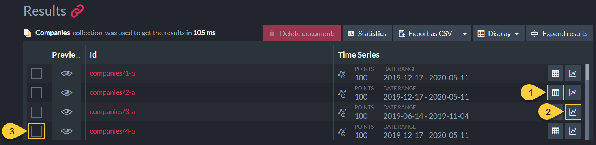

import Admonition from '@theme/Admonition';
import Tabs from '@theme/Tabs';
import TabItem from '@theme/TabItem';
import CodeBlock from '@theme/CodeBlock';
import LanguageSwitcher from "@site/src/components/LanguageSwitcher";
import LanguageContent from "@site/src/components/LanguageContent";

# Document Extensions: Time Series
<Admonition type="note" title="Note">

* **Time series** are sets of numeric data items, associated with timestamps and ordered 
  by time.  
* The studio interface allows you to edit, query and index time series data, as well as 
  view it as a list of entries or as a graph.  
* An **Incremental Time Series** is a special type of time series that allows you to 
  handle time series values as counters.  
  Read more about incremental time series [here](../../../document-extensions/timeseries/incremental-time-series/overview.mdx), 
  and learn how to define them through Studio [below](../../../studio/database/document-extensions/time-series.mdx#incremental-time-series).  

* In this page:
  * [Document View](../../../studio/database/document-extensions/time-series.mdx#document-view)
  * [Time Series View](../../../studio/database/document-extensions/time-series.mdx#time-series-view)
     * [Create new Time Series (by Creating the First Entry)](../../../studio/database/document-extensions/time-series.mdx#create-new-time-series-by-creating-its-first-entry)
     * [Editing an Entry](../../../studio/database/document-extensions/time-series.mdx#editing-an-entry)
     * [Deleting a Range of Entries](../../../studio/database/document-extensions/time-series.mdx#deleting-a-range-of-entries)
  * [Querying Time Series](../../../studio/database/document-extensions/time-series.mdx#querying-time-series)
     * [Results in Graph View](../../../studio/database/document-extensions/time-series.mdx#results-in-graph-view)
  * [Incremental Time Series](../../../studio/database/document-extensions/time-series.mdx#incremental-time-series)
     * [Creating a new Incremental Time Series (by Creating its First Entry)](../../../studio/database/document-extensions/time-series.mdx#creating-a-new-incremental-time-series-by-creating-its-first-entry)
     * [Editing an Incremental Time Series Entry](../../../studio/database/document-extensions/time-series.mdx#editing-an-incremental-time-series-entry)
  

</Admonition>
## Document View

<Admonition type="warning" title="Actions" id="actions" href="#actions">

1. To view a document's time series, open its [document view](../../../studio/database/documents/document-view.mdx) 
   and click the time series tab on the right.  
2. Click 'Add Time Series' to create a new time series [see more below](../../../studio/database/document-extensions/time-series.mdx#create-new-time-series-by-creating-its-first-entry).  
3. Click to view and modify time series data.  

</Admonition>

<Admonition type="info" title="Info" id="info" href="#info">

* A. Time series info:  
  * B. **Name**  
    <Admonition type="note" title="Note">
    [Incremental Time Series](../../../studio/database/document-extensions/time-series.mdx#incremental-time-series) 
    names always begin with `INC:`  
    E.g. **INC: Downloads** in the first time series listed above.  
    </Admonition>
  * C. **Number of entries**  
  * D. **Range of time** from first to last entry  

</Admonition>  

## Time Series View

<Admonition type="warning" title="Actions" id="actions" href="#actions">

1. Click to select another time series.  
2. Click to add a new entry to this time series (StockPrices), or click the dropdown to create a [new time series](../../../studio/database/document-extensions/time-series.mdx#create-new-time-series-by-creating-the-first-entry).  
3. Delete all entries from a specified time range.  
4. Edit entry.

</Admonition>

<Admonition type="info" title="Info" id="info" href="#info">

1. Time series entry info:  
    * Timestamp  
    * Numerical data (1-32 `double` values)  
    * Optional tag `string`

</Admonition>  
### Create new Time Series (by Creating its First Entry)

* A time series is created upon the creation of its first entry (and deleted 
  once all entries have been deleted).  

* Click the **Add Time Series** button from the 
  [Document View](../../../studio/database/document-extensions/time-series.mdx#document-view) 
  to create the time series' first entry.  

<Admonition type="warning" title="Warning">

1. **Time Series Type**  
    * **Diasble** to create a **non-incremental time series**.  
      (Learn now to create an incremental time series [here](../../../studio/database/document-extensions/time-series.mdx#incremental-time-series))  
2. **Time Series Name**  
    * Enter time series' name.  
    * Name cannot start with 'INC:' as this prefix is reserved for incremental time series.  
3. **Entry Timestamp**  
    * Select a [timestamp](../../../document-extensions/timeseries/overview.mdx#timestamps) for the new entry.  
4. **Tag** (Optional)  
    * Optionally give the entry a [tag](../../../document-extensions/timeseries/overview.mdx#tags).
5. **Values**  
    * Add one or more numerical [values](../../../document-extensions/timeseries/overview.mdx#values) (up to 32 values).  
      
    * Time series entry values can be given meaningful names rather than labels like Value #0 and Value #1.  
      To set entry values' names, use Studio's [Time Series Settings View](../../../studio/database/settings/time-series-settings.mdx#add-or-edit-time-series-configuration).  

</Admonition>
### Editing an Entry

* Click the **Edit Item** button from the 
  [Time Series View](../../../studio/database/document-extensions/time-series.mdx#time-series-view) 
  to edit a time series' entry.  

<Admonition type="warning" title="Warning">

1. Edit the optional tag.  
2. Edit a numerical value.  
3. Delete value.  
4. Add an additional value (up to 32 values).  

</Admonition>
### Deleting a Range of Entries

* Click the **Delete Range** button from the 
  [Time Series View](../../../studio/database/document-extensions/time-series.mdx#time-series-view) 
  to delete a range of time series entries.  

<Admonition type="warning" title="Warning">

To specify a range of time series entries:  

1. **Start Date**  
   Check **Use minimum** to use the first entry's timestamp as the start of the range,  
2. **End Date**  
   Check **Use maximum** to use the last entry's timestamp as the end of the range.  
* For either option, you can click the input bar and specify some other date in the 
  date & time dialog shown below.  

</Admonition>

## Querying Time Series

<Admonition type="warning" title="Actions" id="actions" href="#actions">

1. Enter your RQL query in the query box.  
   Depicted here is a query to get all the **StockPrices** time series values from documents in the Companies collection.  
   Learn more about time series queries [here](../../../document-extensions/timeseries/querying/overview-and-syntax.mdx).  

    <Admonition type="note" title="Note">
     Make sure that the time series Name is placed within double quotes (e.g. "StockPrices", 
     "INC:Downloads", etc.), so special characters like ":" would not interfere with the query.  
    </Admonition>
   

2. Click to run the query.  

</Admonition>

<Admonition type="info" title="Info" id="info" href="#info">

1. Query Results - A list of time series that satisfy the query, with:  
    * The ID of the associated document.  
    * Number of entries and time range.  

</Admonition>  

<Admonition type="warning" title="Warning">

1. Click to open a tab with the time series query results shown in a table.  
   
2. Click to open a tab with the time series query results shown in a graph (see below).  
3. Multiple documents selection  
   
    * A. Select multiple documents to plot their time series.  
    * B. Click to view the selected documents' time series results in a unified graph.  
      

</Admonition>
### Results in Graph View

<Admonition type="info" title="Info">

1. A graph of time series results in a selected time frame.  
2. A graph showing all the time series results over time.  
3. The selected time frame.  
4. A legend of time series entries' values.  
   The entry values names are set in Studio's **Settings &gt; Time Series** view.  

</Admonition>

<Admonition type="warning" title="Warning">

1. Click to go back to the query results tab.  
2. Display tabs with graph or table results.  
3. Drag or resize the selected time frame to view the corresponding results.  
4. Hover your mouse over the graph to view the data of one particular entry.  
5. Toggle viewing points or a continuous line.  
6. Check/Uncheck to plot or hide time series entries' values on the graph.  

</Admonition>  

## Incremental Time Series

* **Incremental Time Series** are time series whose values 
  behave as [counters](../../../document-extensions/counters/overview.mdx).  

* Similar to Counters, an incremental-time-series value can be increased/decreased by some 
  delta on any node.  
  Each node manages and stores its own accumulated local changes per value.  

* Simultaneous updates to the same value from multiple nodes do not create any conflict.  
  The value's total contents is simply the accumulation of that value's contents stored 
  per node in the cluster for the same timestamp.  

* This is opposed to non-incremental time series, where a value that is modified 
  is intended to replace the existing value's contents on all other nodes.  

* learn more in [Incremental Time Series -vs- Non-incremental Time Series](../../../document-extensions/timeseries/incremental-time-series/overview.mdx#incremental-time-series--vs--non-incremental-time-series).  
### Creating a new Incremental Time Series (by Creating its First Entry)

* An incremental time series is created upon the creation of its first entry (and deleted 
  once all entries have been deleted).  

* Click the **Add Time Series** button from the 
  [Document View](../../../studio/database/document-extensions/time-series.mdx#document-view) 
  to create the incremental time series' first entry.  

<Admonition type="warning" title="Warning">

1. **Time Series Type**  
    * Enable to create an Incremental time series.  
2. **Time Series Name**  
    * Enter time series' name.  
    * Incremental time series names **must** start with **INC:** (in either upper 
      or lower case characters).  
3. **Entry Timestamp**  
    * Select a [timestamp](../../../document-extensions/timeseries/overview.mdx#timestamps) for the new entry.  
4. **Values**  
    * Add one or more numerical [values](../../../document-extensions/timeseries/overview.mdx#values) (up to 32 values).  
      
    * Time series entry values can be given meaningful names rather than labels like Value #0 and Value #1.  
      To set entry values' names, use Studio's [Time Series Settings View](../../../studio/database/settings/time-series-settings.mdx#add-or-edit-time-series-configuration).  

</Admonition>
### Editing an Incremental Time Series Entry

* Click the **Edit Item** button from the 
  [Time Series View](../../../studio/database/document-extensions/time-series.mdx#time-series-view) 
  to edit a time series' entry.  

<Admonition type="warning" title="Warning">

1. **Show values per node**  
    * Enable to view the value's contents distribution per cluster node (see below).  
      When disabled, only the total value (the value's total contents) is visible.  
2. **Values**  
    * **Total Value**  
      This is the value's total contents, which is the accumulation of this value's contents from all cluster nodes.  
    * **Increment By**  
      The number you enter here is the **delta** that will be added to the value's 
      contents on the current node.  
      Enter a positive number to increase the value or a negative number to decrease it.  
      The change in the value's total contents will be visible after you click the Save button.  
3. **Add Value**  
   Add an additional value (up to 32 values).  
4. **Save**  
   Click to save your changes.  

</Admonition>

<Admonition type="warning" title="Warning">

1. **Show values per node**  
    * Enable to view the value's contents distribution per cluster node.  
2. **Values**  
    * **Total Value**  
      This is the value's total contents, which is the accumulation of this value's contents from all cluster nodes.  
    * **Increment By**  
      The number you enter here is the **delta** that will be added to the value's 
      contents on the current node.  
      Enter a positive number to increase the value or a negative number to decrease it.  
      After clicking **Save**, both the current node and the total value will be updated 
      with the new accumulated value.  
      The value will be modified only when you click the **Save** button.  
3. **Add Value**  
   Add an additional value (up to 32 values).  
4. **Save**  
   Click to save your changes.  

</Admonition>

