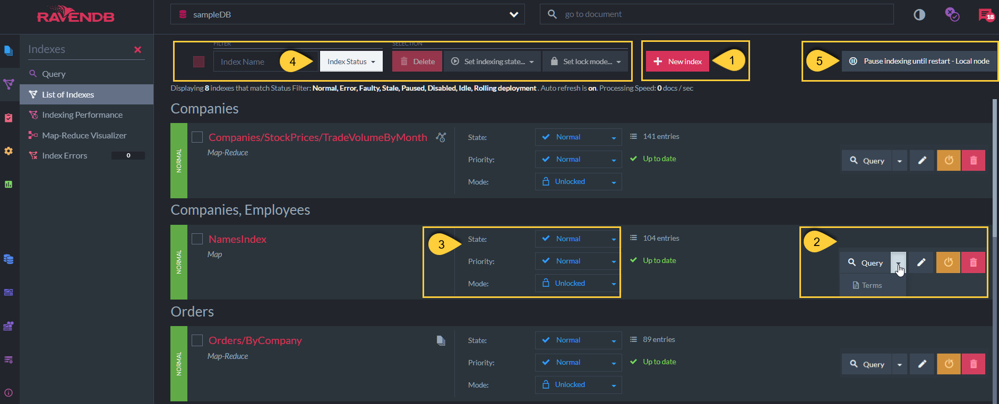

import Admonition from '@theme/Admonition';
import Tabs from '@theme/Tabs';
import TabItem from '@theme/TabItem';
import CodeBlock from '@theme/CodeBlock';
import LanguageSwitcher from "@site/src/components/LanguageSwitcher";
import LanguageContent from "@site/src/components/LanguageContent";

# Indexes List View
<Admonition type="note" title="Note">

* This view lists all the database indexes.

* You can perform actions such as creating a new index, modifying an existing one, setting its desired state,  
  and more.

* In this article:  
  * [Indexes list view](../../../studio/database/indexes/indexes-list-view#indexes-list-view)  
  * [Indexes list view - Actions](../../../studio/database/indexes/indexes-list-view#indexes-list-view---actions)  
  * [Indexes list view - Index errors](../../../studio/database/indexes/indexes-list-view#indexes-list-view---errors)  
  * [Indexes list view - Side by side indexing](../../../studio/database/indexes/indexes-list-view#indexes-list-view---side-by-side-indexing)
  * [Indexes list view - Rolling deployment](../../../studio/database/indexes/indexes-list-view#indexes-list-view---rolling-deployment)
</Admonition>
## Indexes list view

#### 1. Index name and type

* **Name** - The name of the index.  
  For example, in the above example, the index name is _NamesIndex_.
* **Type** - The [index Type](../../../studio/database/indexes/indexes-overview#index-types), which can be one of the following:  
    * Map  
    * Map-Reduce  
    * Auto Map  
    * Auto Map-Reduce  
    * JavaScript Map  
    * JavaScript Map-Reduce  

#### 2. Collections
 
* These are the collections defined in the Map section of the index definition.  
  Data from these collections is scanned and indexed.  
* A simple `Map-index` indexes data from a single collection,  
  while a `Multi-Map index` indexes data from multiple collections.
* In the above example, the index _'NamesIndex'_ is a Multi-Map index that indexes data from the _'Companies'_ and _'Employees'_ collections.  

#### 3. Index state

* An index can be in one of the following states:  
    * `Normal`
    * `Paused`
    * `Disabled`
    * `Idle` (auto-indexes only)  
    * `Error`
    * `Faulty`
     
* For a full description of each state, refer to [Index states](../../../indexes/index-administration#index-states).

#### 4. Index source

* Indicates the data source for the index: Documents, Counters, or Time Series.

#### 5. Index status

* **Entries** - The number of documents that are the result of a basic query on this index.  
  (e.g., _from index 'NamesIndex'_)  
* **Status** - Indicate whether the index is up-to-date or [stale](../../../indexes/stale-indexes).  

## Indexes list view - Actions

#### 1. Crate a new index

* Learn more in [Create new index](../../../studio/database/indexes/create-map-index).  

#### 2. &gt;

* **Query**  
  Click to query the index.  
* **Terms**  
  Click to view the index terms that were actually indexed.  
* **Edit/view index**  
  Click to edit/view the index definition.  
   * Static-index: View and edit the index definition.  
   * Auto-Index: View only.  
* **Reset index**  
  Click to reset the index.
  All documents matched by the index definition will be re-indexed.  
  Resetting the index will resume/enable the normal operation of a paused/disabled index on this node.  
* **Delete**  
  Click to delete the index.  

#### 3. &gt;

* **State**  
  _'Disable'_ index or set as _'Paused'_.  
  The index will stop indexing on the local node the browser is opened on.  
  For a full description of all possible index states, refer to [Index states](../../../indexes/index-administration#index-states).
* **Priority**  
  Set the indexing-process thread priority.  
  By default, RavenDB prioritizes request processing over indexing to ensure responsiveness.
* **Mode**  
  Set the modification behavior (for static-indexes only):  
   * Unlocked - Changes to the index definition will be applied. See [Side by side indexing](../../../studio/database/indexes/indexes-list-view#indexes-list-view---side-by-side-indexing).  
   * Locked - Changes to the index definition will not be applied. No error is raised.  
   * Locked(Error) - Changes to the index definition will not be applied,  
     and an error is raised when attempting to modify the index.  

#### 4. Selected indexes options

* Can apply the following for selected/checked indexes from the list:  
   * Delete indexes  
   * Set indexes state (disable/pause)  
   * Set lock mode  

#### 5. Pause indexing until restart

* Setting this will pause indexing for **all** indexes in the current database.  
* Indexing will be paused only on the **local node** the browser is opened on.  
* Indexing will resume with either of the following:  
  * Click this button again ("Resume indexing")  
  * Restart the server  
  * Reload the database (by disabling and then enabling the database state)  
  * Resume indexing from the client code. See [Resume indexing operation](../../../client-api/operations/maintenance/indexes/start-indexing).

## Indexes list view - Errors

#### 1. Errored index

* An indexing error can occur when the indexing-function is malformed (e.g., incorrectly written) or when the document data is corrupted/missing.
  Once the index error rate exceeds a certain threshold, the index state is marked as _'Error'_ and queries can no longer be made against it.

* Resetting the index will re-index all documents matching its definition and clear the previous errors.  

* In the above example, the index _'ByCompany'_ is in an _'Error'_ state after encountering 500 errors.  
  Learn more in [Debugging index errors](../../../indexes/troubleshooting/debugging-index-errors).  

#### 2. Faulty index

* When an index is successfully defined but the server fails to open its index data file from disk, or if this file is corrupted,
  the server marks the index as _'Faulty'_, indicating that something is wrong with its index data files.  

* If the issue with the index data file is resolved, you can click **'Open index'** (label **'3'** in the figure above)  
  to process the index again.  

* A possible solution is to **reset** the index - restart the indexing process from scratch,  
  so that new data files are created for the index, replacing the corrupted ones.

<Admonition type="note" title="Note">
**Note**: A detailed list of errors is available in the **Index Errors** view in the Studio.
</Admonition>

## Indexes list view - Side by side indexing

* All index updates in RavenDB are done using the **side-by-side strategy**.  

* When an index-definition is modified, RavenDB creates a 'new index' with the new definition.  
  This index will start processing all relevant documents.  

* The 'old index' (label **'1'** in above figure) will answer queries and index new documents until  
  the 'new index' (label **'2'** in above figure) is caught up and has indexed everything.  

* Once the 'new index' has completed its work, it will automatically replace the old one.  
  You can also force an immediate replacement if needed, by clicking **'Swap Now'** (label **'3'** in the figure above).  

* The 'old index' definition can still be referenced as RavenDB keeps a [history of index revisions](../../../studio/database/indexes/index-history),  
  allowing you to revert an index to any of its past revisions.  

## Indexes list view - Rolling deployment

#### 1. Rolling deployment

* When an index that is [defined](../../../studio/database/indexes/create-map-index#edit-index-view) with [Rolling deployment](../../../indexes/rolling-index-deployment) is created or modified,  
  the indexing process progress is displayed per node.  

#### 2. Force parallel

* Click to force parallel indexing deployment on the current node.  
  The other nodes will continue deployment with the rolling mode.  

#### 3. Indexing in progress

* Node `A` is currently running the _'TradeVolumeByMonth'_ index.  
  The indexing progress and the estimated time left are displayed.   
* For more information, see [The rolling procedure](../../../indexes/rolling-index-deployment#the-rolling-procedure).

#### 4. Indexing done

* Nodes `B` and `C` are waiting for their turn to run the _'TradeVolumeByMonth'_ index.  
* For more information, see [Deployment order](../../../indexes/rolling-index-deployment#deployment-concurrency-and-order).

