import Admonition from '@theme/Admonition';
import Tabs from '@theme/Tabs';
import TabItem from '@theme/TabItem';
import CodeBlock from '@theme/CodeBlock';
import LanguageSwitcher from "@site/src/components/LanguageSwitcher";
import LanguageContent from "@site/src/components/LanguageContent";
import Panel from "@site/src/components/Panel";
import ContentFrame from "@site/src/components/ContentFrame";

<Admonition type="note" title="">
 
* Revisions configuration settings can be managed from the **Document Revisions** view.  

* Learn more about revisions [here](../../../document-extensions/revisions/overview.mdx).

* In this article:
  * [Document revisions view](../../../studio/database/settings/document-revisions.mdx#document-revisions-view)  
  * [Revisions configuration](../../../studio/database/settings/document-revisions.mdx#revisions-configuration)  
  * [Define default configuration](../../../studio/database/settings/document-revisions.mdx#define-default-configuration)  
  * [Define collection-specific configuration](../../../studio/database/settings/document-revisions.mdx#define-collection-specific-configuration)  
  * [Edit conflicting document defaults](../../../studio/database/settings/document-revisions.mdx#edit-conflicting-document-defaults)  
     * [Conflicting documents example](../../../studio/database/settings/document-revisions.mdx#conflicting-documents-example)  
  * [Enforce configuration](../../../studio/database/settings/document-revisions.mdx#enforce-configuration)  

</Admonition>

<Panel heading="Document revisions view">

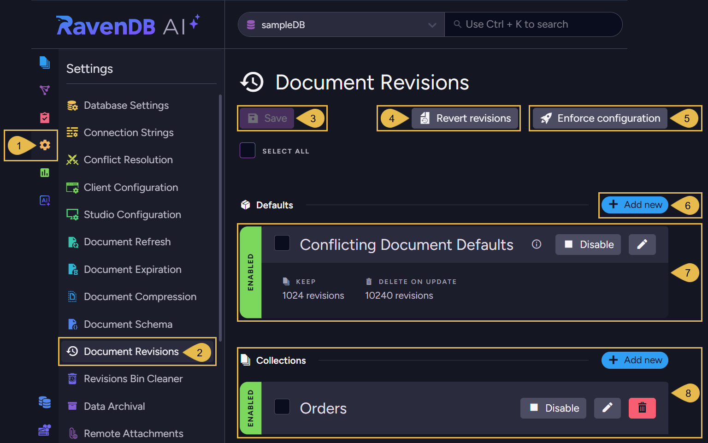

1. **Settings menu**  
   Open the **Settings** menu.  

2. **Document Revisions View**  
   Open the **Document Revisions** view.  

3. **Save**  
   Apply your changes after modifying the configuration.  

4. **Revert Revisions**  
   [Revert the database](../../../document-extensions/revisions/revert-documents-to-revisions/revert-documents-to-specific-time.mdx) 
   to its state at a specified point in time.  
   You can select whether to revert specific collections or revert all collections.  
   Only documents are reverted; other entities (such as ongoing tasks) will not be modified.  

5. **Enforce Configuration**  
   [Enforce the revisions configuration](../../../studio/database/settings/document-revisions.mdx#enforce-configuration).  
   <Admonition type="warning" title="">
   This operation may delete many revisions irrevocably and require substantial server resources.  
   Please read carefully the dedicated section.  
   </Admonition>  

6. **Add new: Define a default document revisions configuration**  
   Define a [default configuration](../../../studio/database/settings/document-revisions.mdx#define-default-configuration) 
   that will apply to the documents of collections that no collection-specific configuration was defined for.  
   <Admonition type="note" title="">
   There can be only one (or no) default configuration. After defining it, the "Add new" button is removed 
   and the configuration is displayed and can be modified or deleted.
   </Admonition>

7. **Conflicting document defaults**  
   This is a pre-defined configuration for conflicting documents.  
   You can [modify](../../../studio/database/settings/document-revisions.mdx#edit-conflicting-document-defaults) or disable it.  

8. **Collection-specific configurations**
   Define (Add new), edit, disable, or delete [configurations for specific collections](../../../studio/database/settings/document-revisions.mdx#define-collection-specific-configuration).  
   If a default configuration was defined, a collection-specific configuration will override it for this collection.  

</Panel>    

<Panel heading="Revisions configuration">    

* The Revisions configuration includes:  
  * A pre-defined **configuration for conflicting documents**.
  * An optional **default configuration** that applies to all document collections that no collection-specific configuration is defined for.
  * Optional **collection-specific configurations** that apply to documents of the collections they are defined for.

* When no default configuration or collection-specific configurations are defined and enabled,  
  no revisions will be created for any document.

* When a document is subject to an enabled configuration, the configuration's rules apply to 
  the document's revisions upon any modification of the document.

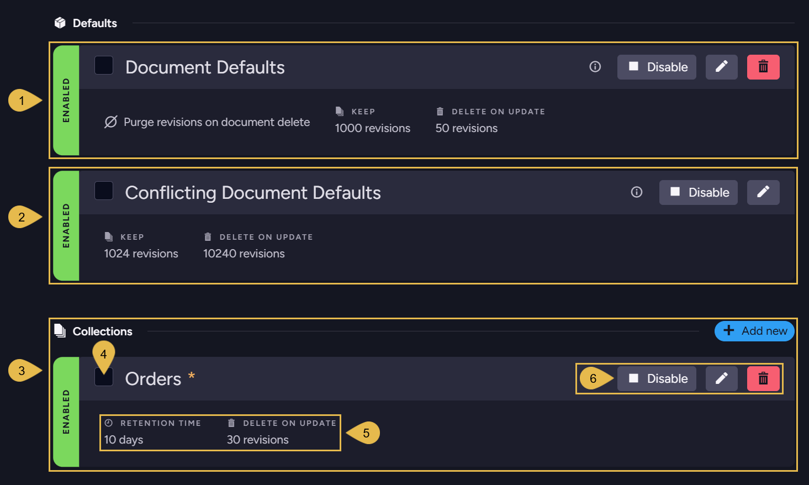

1. **Document Defaults**  
   This is the [default revisions configuration](../../../studio/database/settings/document-revisions.mdx#define-default-configuration) 
   that applies to all non-conflicting documents in all the collections that no collection-specific configuration is defined for.  
   The configuration is **optional** and can be removed.  

2. **Conflicting Document Defaults**  
   This pre-defined configuration applies to conflicting documents only.  
   When enabled, a revision is created for every conflicting item.  
   A revision is also created for the conflict resolution document.      
    * This configuration can be [modified](../../../studio/database/settings/document-revisions.mdx#edit-conflicting-document-defaults) but not removed.  
    * You can also **disable** the configuration if you are not interested in tracking document conflicts using revisions.  
    * When a **default configuration** is defined, it **overrides** the conflict defaults.  
    * **Collection-specific** configurations **also override** conflict defaults for the collections they apply to.  

3. **Collections**  
   These are **optional** collection-specific configurations, whose settings override the default configuration 
   and the conflicting document configuration for the collections they are defined for.  

4. **Selection Box**  
   Selecting a configuration evokes a state selector with which you can enable, disable, or delete the configuration.
   

5. **Configuration settings**  
   Displays the values set for configuration options. See more about available settings below.  

6. **Controls**  
    * **Disable/Enable** - Click to Enable or Disable the configuration.  
    * **Edit** - Modify the configuration.  
    * **Remove** - Delete the configuration.  

</Panel>    
<Panel heading="Define default configuration">     

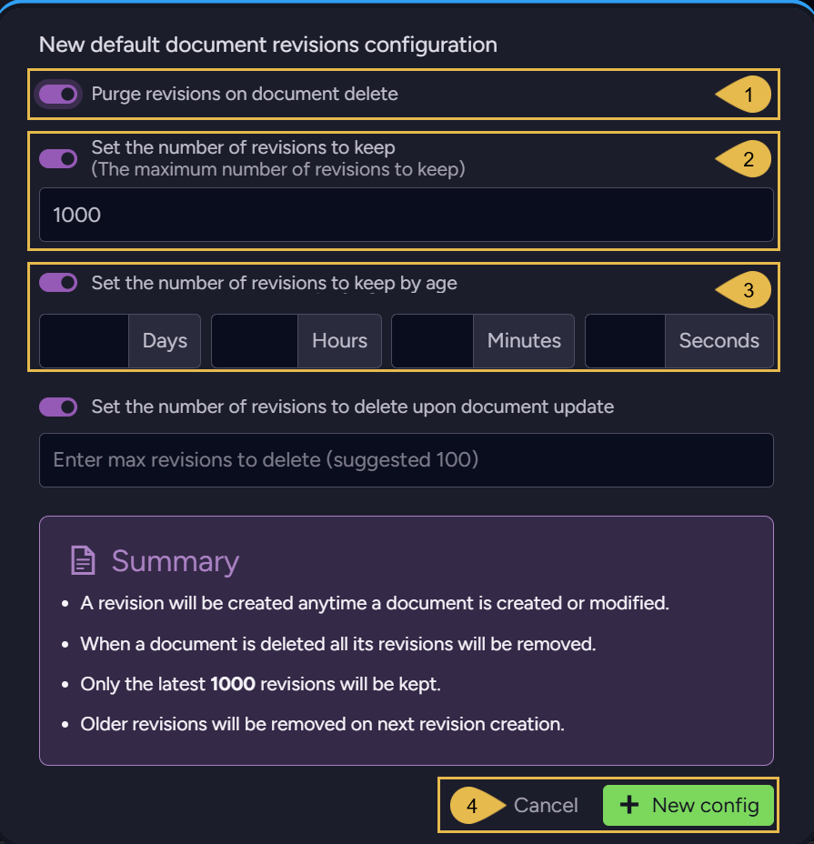

1. **Purge revisions on document delete**  
   Enable if you want document revisions to be deleted when their parent document is deleted.

2. **Set the number of revisions to keep** <a id="limit-revisions"/>  
   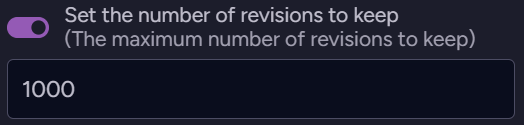  
   Enable to limit the number of revisions that will be kept in the revisions storage per document.  
   Upon revision creation (when the parent document is modified), if the number of revisions exceeds this limit, 
   older revisions will be purged (starting with the oldest revision).  

     * Enabling this option will display the following setting as well:  
       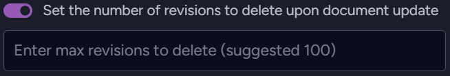   
       Enable to limit the number of revisions that RavenDB is allowed to purge per document modification.  

       <Admonition type="info" title="">
       This will be the highest number of revisions that RavenDB will purge per document modification,  
       even if the number of revisions that pend purging is higher.  
       Setting this limit can reserve server resources if many revisions pend purging,  
       by dividing the purging between multiple document modifications.  
       </Admonition>

3. **Set the number of revisions to keep by age**  
   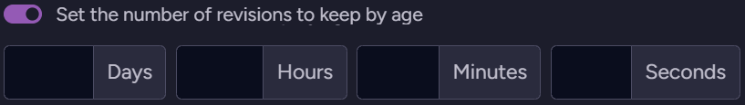  
   Enable to set a revisions age limit.  
   Revisions older than the defined retention time will be purged when their parent document is modified.  

   * Enabling the age limit setting will also display the **Set the number of revisions to delete upon document update** option 
     (see above).  
   
4. Confirm to keep the modified default configuration, or **Cancel**.  

<Admonition type="info" title="">       
Click **Save** when done.       
</Admonition>

</Panel>    

<Panel heading="Define collection-specific configuration">

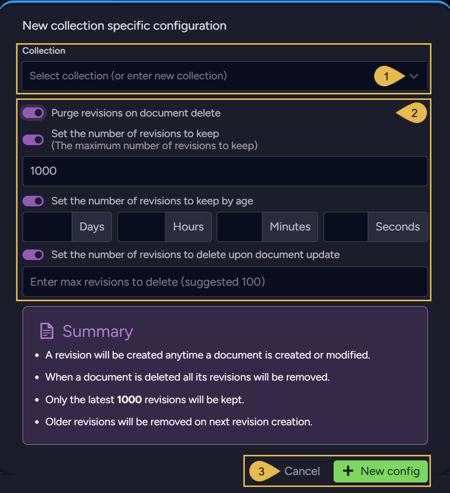

1. **Collection**  
   Select a collection or enter its name. The configuration will be defined for this collection.

2. **Configuration options**  
   These options are similar to those explained above for the [default configuration](../../../studio/database/settings/document-revisions.mdx#define-default-configuration),  
   the only difference is the configuration scope.  

3. Confirm to keep the modified collection-specific configuration, or **Cancel**.  

<Admonition type="info" title="">
Click **Save** when done.
</Admonition>

<a id="editing-the-conflicting-document-defaults"/>

</Panel>

<Panel heading="Edit conflicting document defaults">

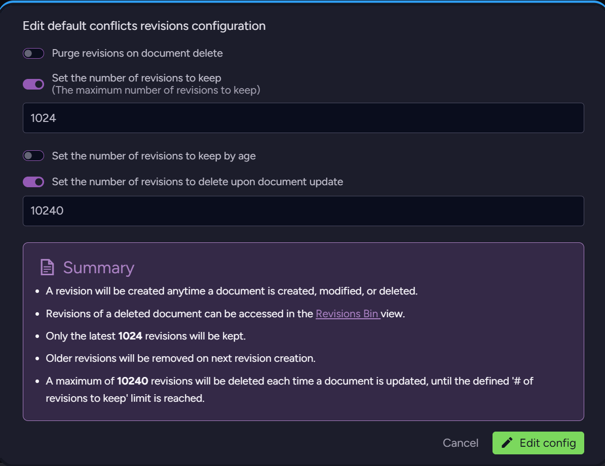

* The configuration settings are similar to those explained above for the 
  [default configuration](../../../studio/database/settings/document-revisions.mdx#define-default-configuration).

<ContentFrame>

<Admonition type="note" title="">

#### Conflicting documents example:

* For the example below, we created a conflict by replicating into the database a document with an ID similar to that of a local document.  

* Revisions will be created when the documents **enter a conflict** and when the conflict is **resolved**.  
  So in this case, **three** revisions were created:  
    1. when the replicated document arrived and entered a conflict state.   
    2. when the local document entered a conflict state on the arrival of the replicated document.  
    3. when the conflict was resolved by replacing the local document with the replicated one.  
       <Admonition type="info" title="">
       In this example, the conflict was resolved by placing the replicated version as the current document. 
       Learn more about conflict resolution [here](../../../studio/database/settings/conflict-resolution.mdx).  
       </Admonition>

* To see the revisions that were generated, open the document's [Revisions tab](../../../document-extensions/revisions/overview.mdx#how-it-works).  
  The revision state is indicated by:  
    * A red **title** at the top (i.e. "Conflict revision" or "Resolved revision").  
    * An **icon** next to the revision's creation time in the right Properties pane.  
    * A **flag** in the revision's `@flags` metadata property (i.e. "Conflicted" or "Resolved").  

</Admonition>

1. **Incoming Document in Conflict**  
   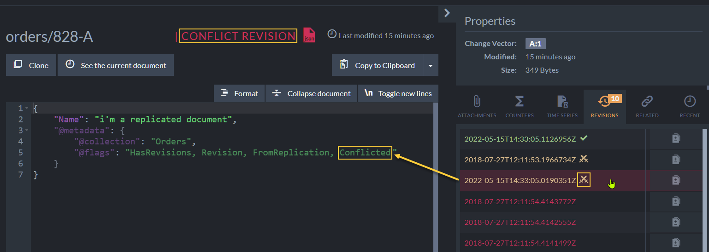
2. **Local Document in Conflict**
   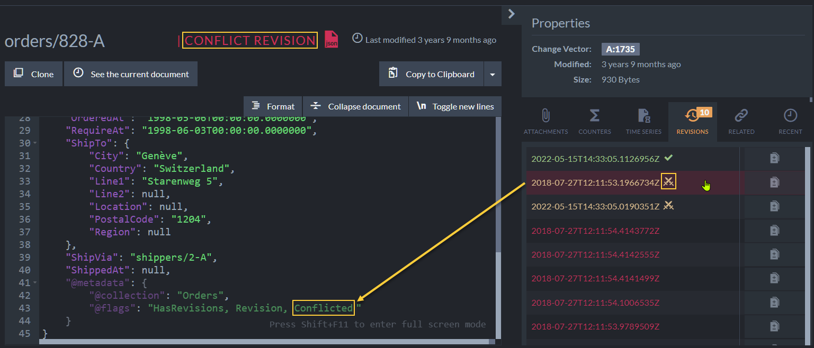
3. **Conflict Resolved**
   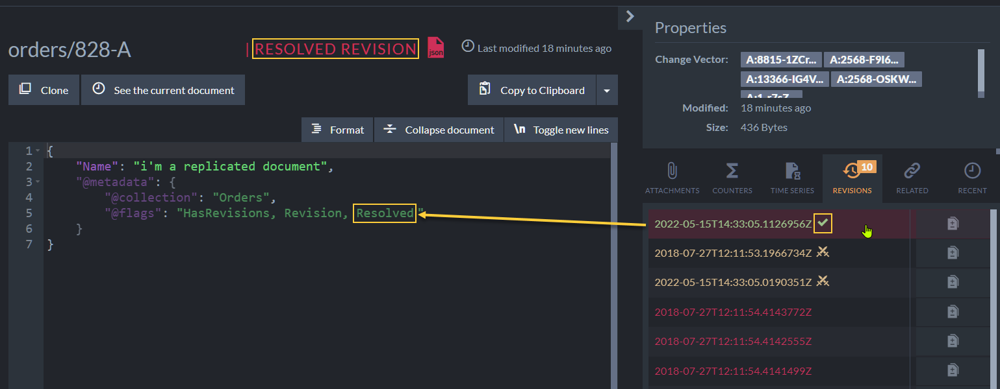

</ContentFrame>

</Panel>    

<Panel heading="Enforce configuration">   

The revision configuration rules are usually applied to a document's revisions only when the document is modified.   
Use **Enforce configuration** to apply the current revision configuration rules to existing revisions, without waiting for each document to be modified.  

---

### Opening the dialog:  
In the **Document Revisions** settings view, click **Enforce configuration** (top-right, next to **Revert revisions**).

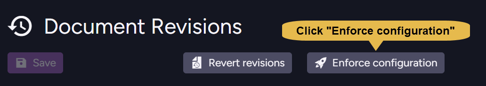

---

### The Enforce Configuration dialog:

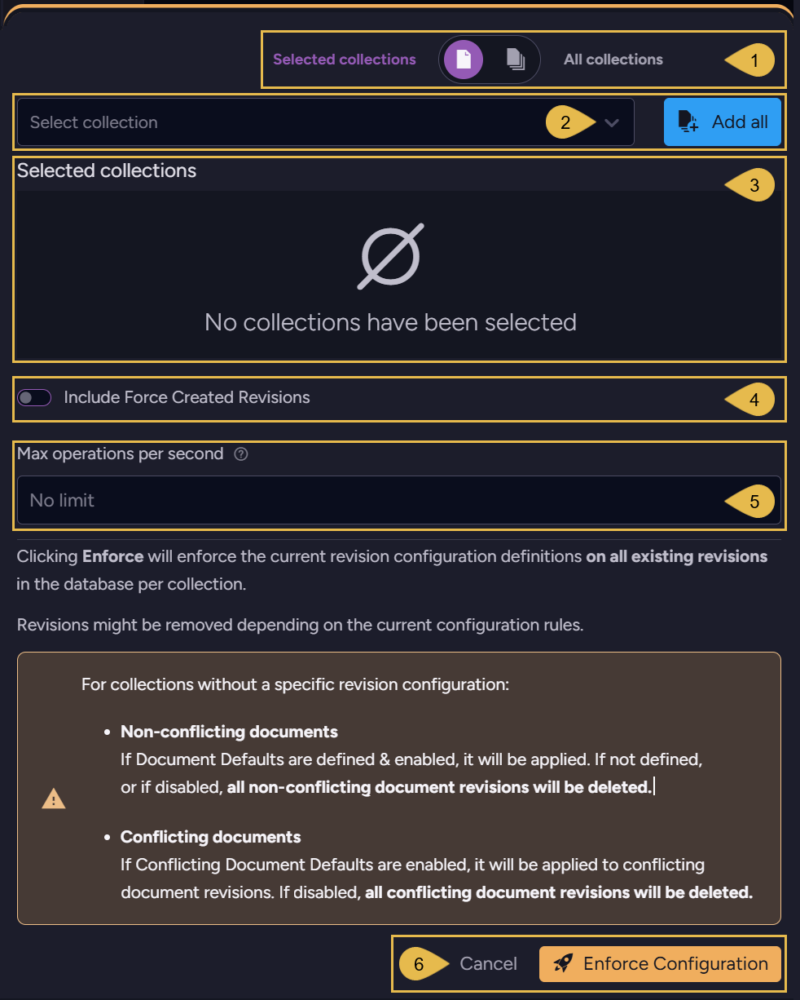

1. **Collections scope**  
   Toggle between **All collections** (enforce on the revisions of all collections)  
   and **Selected collections** (enforce only on the collections you choose).

2. **Select collection** / **Add all**  
   When **Selected collections** is active, choose collections from the **Select collection** dropdown,  
   or click **Add all** to include them all. 
    
3. **Selected collections**  
   The selected collections will be displayed here. 

4. **Include Force Created Revisions**  
     * ON - [Force-created revisions](../../../document-extensions/revisions/overview.mdx#force-revision-creation) may also be removed by the operation.
     * OFF (default) - force-created revisions are preserved.    

5. **Max operations per second**  
   Limit the number of documents processed per second to throttle the operation and reduce its resource consumption on large datasets.
   Leave the field empty (**No limit**, the default) to apply no throttling.

6. Click **Enforce Configuration** to run the operation, or **Cancel** to close the dialog without enforcing.

    Clicking **Enforce Configuration** applies the current revision configuration definitions to existing revisions in the database, per collection.
    Revisions might be removed depending on the current configuration rules.

    <Admonition type="note" title="">
    
    **For collections that HAVE a specific revision configuration**:
    
      * The collection-specific configuration is applied per collection.  
      * Revisions that should be purged according to the configuration are **deleted**.
    
    </Admonition>
    
    <Admonition type="note" title="">
    
    **For collections that DON'T have a specific revision configuration**:
    
      * Non-conflicting documents:  
          * If Document Defaults are defined & enabled, they are applied.  
          * If NOT defined, or if disabled, ALL non-conflicting document revisions are **deleted**.  
      * Conflicting documents:  
          * If Conflicting Document Defaults are enabled, they are applied to the conflicting document revisions.  
          * If disabled, ALL conflicting document revisions are **deleted**.
    
    </Admonition>
    
    <Admonition type="warning" title="">
        
    * Large databases may contain many revisions that will be deleted when the current configuration is enforced.  
      Running the operation can delete them all in a single enforcement run and may require substantial server resources.
      Schedule it accordingly.
        
    * On large datasets, use the **Max operations per second** field to throttle the operation and reduce its resource consumption.  
      The same throttling is available programmatically via the `MaxOpsPerSecond` parameter.   
      See [Enforce revisions configuration operation](../../../document-extensions/revisions/client-api/operations/enforce-revisions-configuration.mdx).
        
    * Revisions in collections that no current configuration applies to may be deleted.  
      Make sure your configuration includes the default settings and collection-specific configurations needed to keep the revisions you want to preserve.        
    
    </Admonition>
    
</Panel>